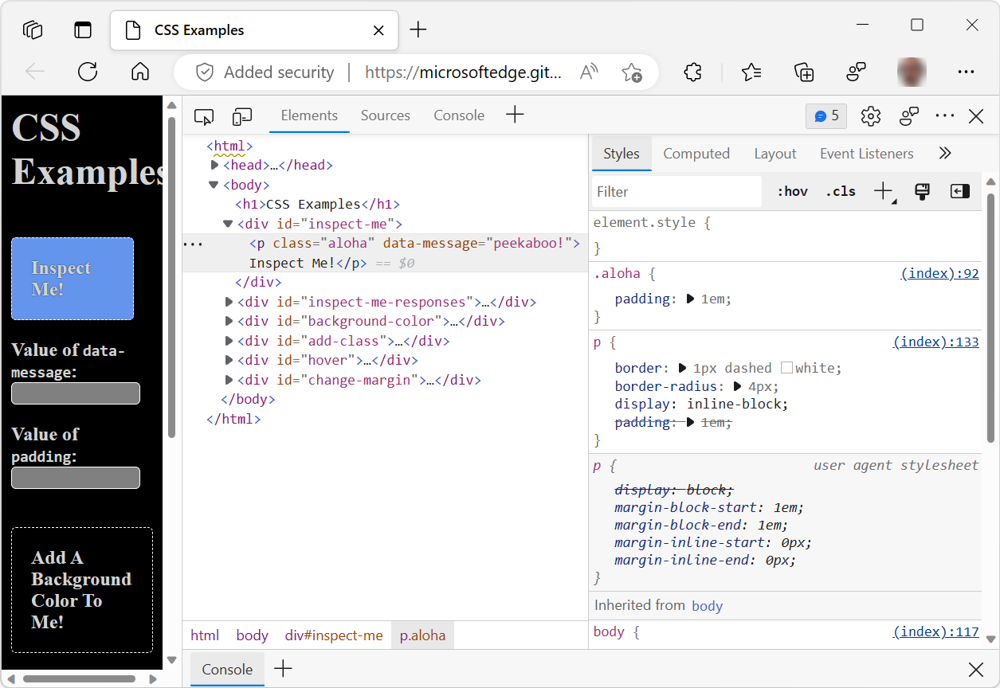
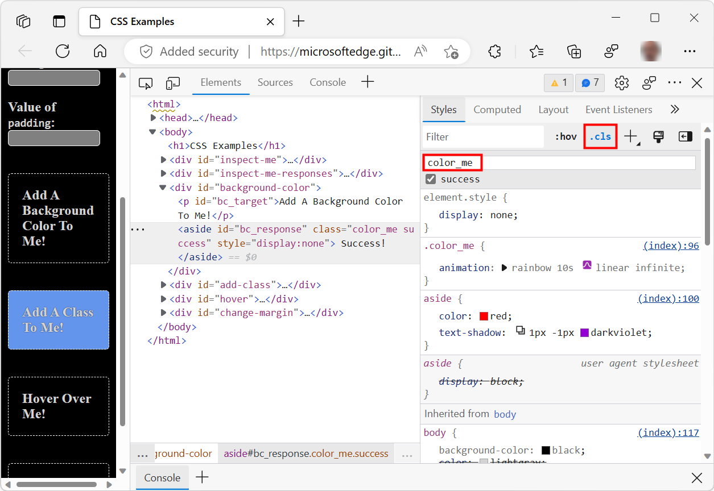
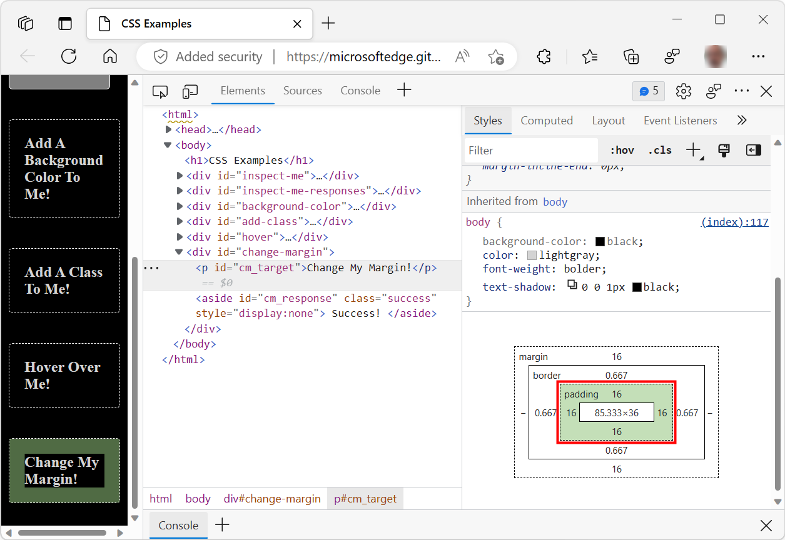
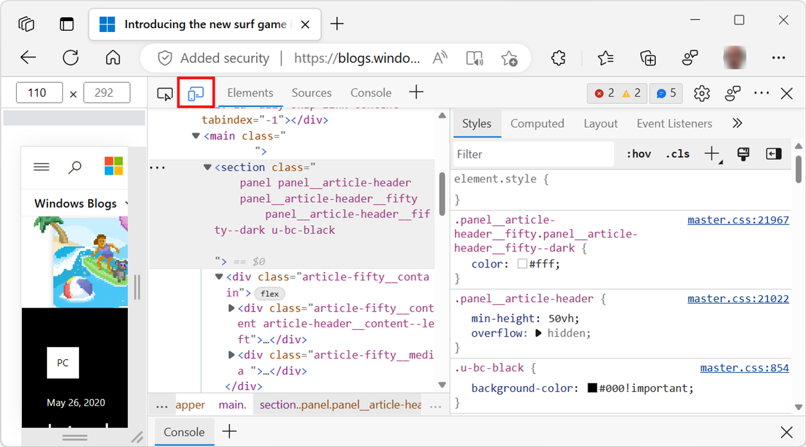
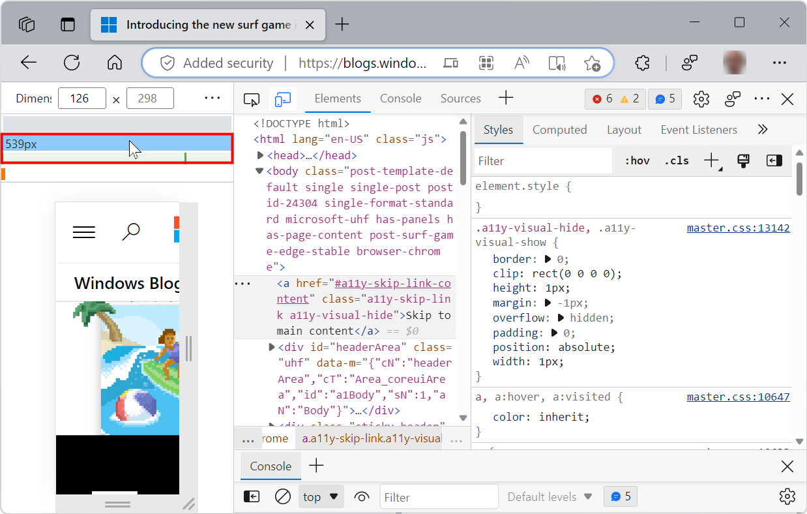

<!-- Copyright Kayce Basques

   Licensed under the Apache License, Version 2.0 (the "License");
   you may not use this file except in compliance with the License.
   You may obtain a copy of the License at

       https://www.apache.org/licenses/LICENSE-2.0

   Unless required by applicable law or agreed to in writing, software
   distributed under the License is distributed on an "AS IS" BASIS,
   WITHOUT WARRANTIES OR CONDITIONS OF ANY KIND, either express or implied.
   See the License for the specific language governing permissions and
   limitations under the License.  -->
# Get started viewing and changing CSS

Follow the interactive tutorial sections in this article to learn the basics of using DevTools to view and change the CSS for a page.

<!-- ====================================================================== -->
## View the CSS for an element

1. Open the [CSS Examples](https://microsoftedge.github.io/Demos/devtools-css-get-started/) demo page in a new window or tab.  To open the examples, right-click the link, or press and hold `Ctrl` (for Windows, Linux) or `Command` (for macOS) and then click the link.

   <!-- You can view the source files for the CSS Examples demo page at the [MicrosoftEdge/Demos > devtools-css-get-started](https://github.com/MicrosoftEdge/Demos/tree/main/devtools-css-get-started) repo folder. -->

1. Right-click the `Inspect Me!` text, and then select **Inspect**.

   In the **DOM Tree** panel under the **Elements tool**, the `Inspect Me!` element is highlighted.

   

1. In the `Inspect Me!` element, find the value of the `data-message` attribute and copy it.

1. On the page view, enter the `data-message` value that you copied in the **Value of data-message:** text box.

1. Right-click the `Inspect Me!` text, and then select **Inspect**.

1. In DevTools, on the **Elements** tool, select the **Styles** panel.  The `Inspect Me!` element is highlighted in the Styles panel.

1. In the `Inspect Me!` element, find the `aloha` class rule.  This rule is displayed, because it's being applied to the `Inspect Me!` element.

1. In the `aloha` class, find the value for the `padding` style and copy it.

   

1. On the page view, paste the `padding` value in the **Value of padding:** text box.

<!-- ====================================================================== -->
## Add a CSS declaration to an element

Use the **Styles** panel when you want to change or add CSS declarations to an element.

1. First, we recommend doing the preceding [View the CSS for an element](#view-the-css-for-an-element) tutorial.

1. Open the [CSS Examples](https://microsoftedge.github.io/Demos/devtools-css-get-started/) demo page in a new window or tab.

1. Right-click the `Add A Background Color To Me!` text, and then select **Inspect**.

1. Click `element.style` near the top of the **Styles** panel.

1. Type `background-color` or select it from the drop-down list and then press **Enter**.

1. Type `honeydew` or select it from the drop-down list of colors and then press **Enter**.  After you pick a color, an inline style declaration that's applied to the element is displayed In the **DOM Tree**, 

    The `background-color:honeydew` declaration is applied to the element using the `element.style` section of the **Styles** panel:

   

<!-- ====================================================================== -->
## Add a CSS class to an element

To display how an element looks when a CSS class is applied to or removed from an element, see the **Styles** panel.

1. First, we recommend doing the preceding [View the CSS for an element](#view-the-css-for-an-element) tutorial.

1. Open the [CSS Examples](https://microsoftedge.github.io/Demos/devtools-css-get-started/) demo page in a new window or tab.

1. Right-click the `Add A Class To Me!` text, and then select **Inspect**.

1. Click **.cls**.  DevTools shows a text box where you can add CSS classes to the page element that you're inspecting.

1. Type `color_me` in the **Add new class** text box and then press **Enter**.  A checkbox appears below the **Add new class** text box, where you can toggle the class on and off.  If the `Add A Class To Me!` element has any other classes applied to it, you can also  toggle each class from here.

   The `color_me` class is applied to the element using the **.cls** section of the **Styles** panel:

   

<!-- ====================================================================== -->
## Add a pseudostate to a class

Use the **Styles** panel to permanently apply a CSS pseudostate to an element.  DevTools supports `:active`, `:focus`, `:hover`, and `:visited`.

1. First, we recommend doing the preceding [View the CSS for an element](#view-the-css-for-an-element) tutorial.

1. Open the [CSS Examples](https://microsoftedge.github.io/Demos/devtools-css-get-started/) demo page in a new window or tab.

1. Hover on the `Hover Over Me!` text.  The background color changes.

1. Right-click the `Hover Over Me!` text, and then select **Inspect**.

1. In the **Styles** panel, click **:hov**.

1. Select the **:hover** checkbox.  The background color changes like it did in the first step, even though you aren't actually hovering over the element.

   The next screenshot shows the result of toggling the `:hover` pseudostate on an element.

   

<!-- ====================================================================== -->
## Change the dimensions of an element

Use the **Box Model** interactive diagram in the **Styles** panel to change the width, height, padding, margin, or border length of an element.

1. First, we recommend doing the preceding [View the CSS for an element](#view-the-css-for-an-element) tutorial.

1. Open the [CSS Examples](https://microsoftedge.github.io/Demos/devtools-css-get-started/) demo page in a new window or tab.

1. Right-click the `Change My Margin!` text, and then select **Inspect**.

1. In the **Box Model** diagram in the **Styles** panel, hover on **padding**.  The element's padding is highlighted in the viewport.

   Depending on the size of your DevTools window, you may need to scroll to the bottom of the **Styles** panel to display the **Box Model**.

1. Double-click the left margin in the **Box Model**, which currently has a value of `-`. The `-` means that the element doesn't have a value for `margin-left`.

1. Type `100px` and press **Enter**.  The **Box Model** defaults to pixels, but it also accepts other values, such as `25%`, or `10vw`.

   Hovering over the element's padding:

   

   Changing the element's left margin:

   

<!-- ====================================================================== -->
## Debugging Media Queries

[Media Queries](https://developer.mozilla.org/docs/Web/CSS/Media_Queries/Using_media_queries) are a way to make your website react to changes in the configuration settings for each user. The most common use case is to give your page a different CSS layout depending on the dimensions of the viewport.

Using separate layouts allows for a one-column layout for mobile devices and multi-column layouts when there's more screen real estate available.

Use the following steps to debug or test the Media Queries you defined in your CSS.

1. To open DevTools, you can right-click in a webpage and then select **Inspect**.

1. Click the **Toggle device emulation** () button.  Or, when DevTools has focus, press **Ctrl+Shift+M** (Windows, Linux) or `Cmd`+`Shift`+`M` (macOS).

   <!-- todo: update to show new tooltip: -->

   

1. With the device toolbar open, click the `...` menu on the top-right and then select **Show media queries**:

   

   The colored bars above the webpage represent the different media queries.
       
1. Hover on the boundaries in the bars to display the values of the different media queries.  Click each media query value to resize the web page to match.

   

1. To debug media queries and open the CSS file in the `Sources` editor, right-click a bar segment, and then select **Reveal in source code**:

   

<!-- ====================================================================== -->
> [!NOTE]
> Portions of this page are modifications based on work created and [shared by Google](https://developers.google.com/terms/site-policies) and used according to terms described in the [Creative Commons Attribution 4.0 International License](https://creativecommons.org/licenses/by/4.0).
> The original page is found [here](https://developer.chrome.com/docs/devtools/css/) and is authored by [Kayce Basques](https://developers.google.com/web/resources/contributors#kayce-basques) (Technical Writer, Chrome DevTools \& Lighthouse).

This work is licensed under a [Creative Commons Attribution 4.0 International License](https://creativecommons.org/licenses/by/4.0).
