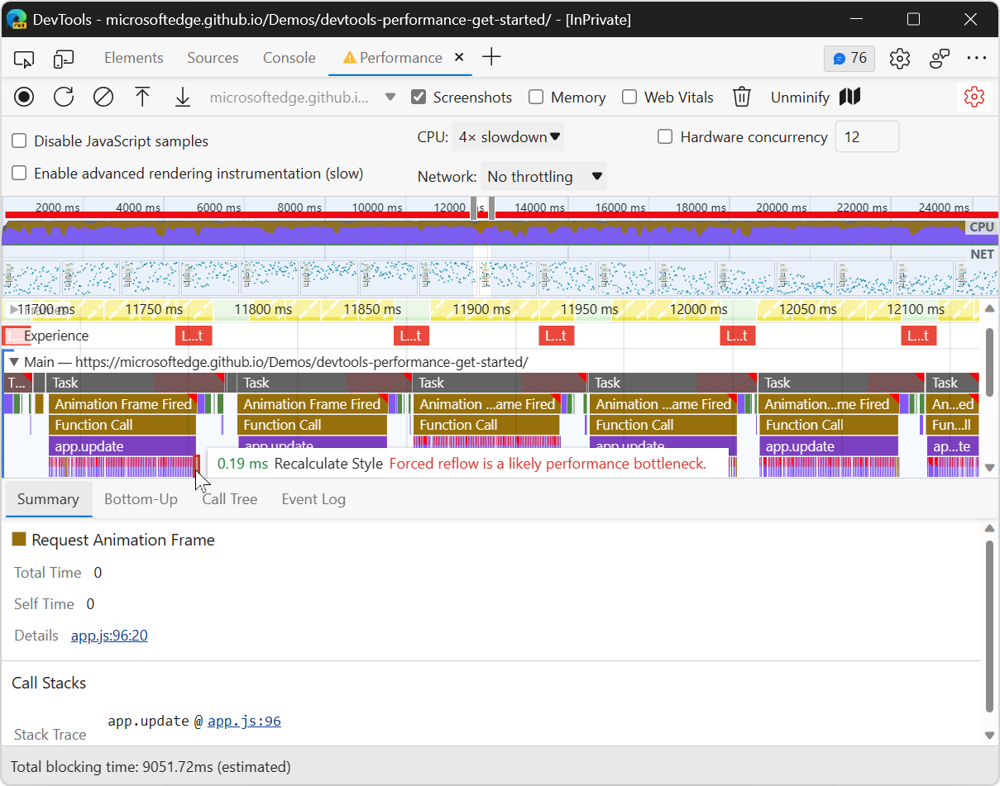

# Analyze selector performance during Recalculate Style events

The **Performance** tool highlights long tasks with red triangles to indicate work on the main thread that takes too long and has slow performance.  

In your performance recordings, some of these long-running tasks may be **Recalculate Style** events.  These events track the time it takes for the browser to iterate through DOM elements on a page, find all of the CSS style rules that match a given element, and then compute the element's actual style based on these rules.  These styles need to be recalculated whenever the applicabiliy of CSS rules may have changed, like when:

- Elements are added or removed from the DOM
- An element's attributes, like `class` or `id`, were changed
- User input, like mouse move or focus change, which can affect `:hover` rules

When you have long running **Recalculate Style** events, you can use the **Selector Stats** feature to understand which of your CSS selectors are taking up the most time and resulting in the slow performance.

## How to use Selector Stats

To see **Selector Stats** during **Recalculate Style** events:

1. In the **Performance** tool, click **Capture settings** ().

1. Click **Enable advanced rendering instrumentation (slow)** to turn the setting on. Note that this setting adds more overhead for performance recordings so you should only leave it turned on if you need to record **Selector Stats** and other rendering information.
 
1. Click **Record** and run the scenario you want to improve for your website or app.

1. Click **Stop**.

1. Now find a **Recalculate Style** event. In the bottom section of the **Performance** tool, select **Selector Stats**:

   
 
The **Selector Stats** section of the **Performance** tool shows you a table of selectors, the amount of time the browser spent calculating the style rules, and the number of elements the selector matched.

## Analyze Selector Stats

You can sort the data in the **Selector Stats** table in ascending or descending order for any of the columns by clicking the column header.  For example, sort the **Elapsed (µs)** column in descending order to see which selectors take up the most time in the **Recalculate Style** event you have selected.

As a general rule, if you find a selector that took the browser a long time to calculate and was matched many times, that would be a good candidate to try and improve.  Try simplifying the selector or making it more specific so that fewer elements match to it.  As a result of making these improvements, repeat the steps from the previous section, and you should observe the time the browser spends in the **Recalculate Style** event decrease.

<!-- ====================================================================== -->
## See also

* [Get started analyzing runtime performance](index.md) - An introduction to analyzing runtime performance in DevTools.
* [Performance features reference](reference.md), - A reference for many of the features offered in the Performance tool.
<!-- TO-DO, add link to Patrick's blog post -->