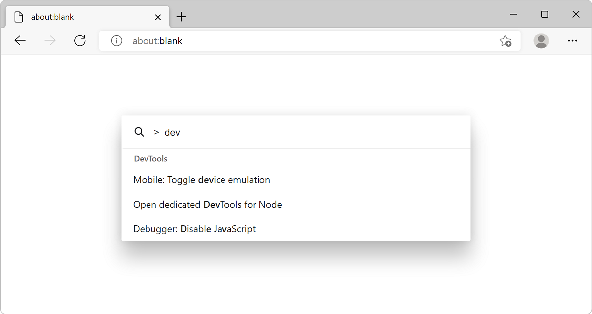

# Streamline your workflows with Edge Command Palette

Edge Command Palette is a Microsoft Edge experiment that makes it possible to access helpful browser and developer tools commands from the keyboard.

Using Edge Command Palette, it is easy to access productivity and developer features that normally require clicking through several menus or learning multiple keyboard shortcuts.

<!-- ====================================================================== -->
## Enable Edge Command Palette

Edge Command Palette is not enabled in Microsoft Edge by default. To enable it:

1. Make sure your are using Microsoft Edge 105 or later.

1. In Microsoft Edge, go to `edge://flags`.

<!-- DevTools Toaster is in the process or being changed in Edge to match the feature's name -->
1. Type "DevTools Toaster" in the **Search flags** text field.

1. Click the **Default** button and select **Enabled**.

1. Click **Restart**.

<!-- ====================================================================== -->
## Open Edge Command Palette

To open Edge Command Palette:

1. Press `Ctrl+Shift+Space`.

1. Start typing in the input box. For example, type "tabs" to display commands about tabs management, or type "bookmark" to display commands about bookmarks.

1. Choose the command you want to execute by navigating to it with the `Up` or `Down` arrows and pressing `Enter`.

Edge Command Palette also provides access to several DevTools commands. This means you can use DevTools features without having to open DevTools first.

To list all DevTools commands available in Edge Command Palette press `>`.

<!-- ====================================================================== -->
## Examples of useful commands

* Enable the **Device Emulation** tool.

  1. Press `Ctrl+Shift+Space`
  1. Press `>`
  1. Type "device"

  The [**Device Emulation**](../device-mode/index.md) tool is a DevTools feature useful to approximate how your page looks and responds on a mobile device. 

* Create and access snippets.

  1. Press `Ctrl+Shift+Space`
  1. Press `>`
  1. Type "snippets"
  
  The [**Snippets**](../javascript/snippets.md) panel allows you to save JavaScript code and execute it on any webpage. If you run code repeatedly on webpages, create a snippet for it and use Edge Command Palette to access it quickly.

* Manage browser tabs.

  1. Press `Ctrl+Shift+Space`
  1. Type "tab"
  
  The available commands include **Open recently closed tab**, **Bookmark all tabs**, **Search tabs**, and more, which are useful when using many tabs in Microsoft Edge.

<!-- ====================================================================== -->
## Provide feedback

<!-- TODO: change the issue number when we have it. -->
The Microsoft Edge DevTools team welcomes your feedback about this feature. If you noticed a bug with Edge Command Palette or have an idea for improving it, please add a comment at: [Feedback for the Edge Command Palette experiment](https://github.com/MicrosoftEdge/DevTools/issues/73).
