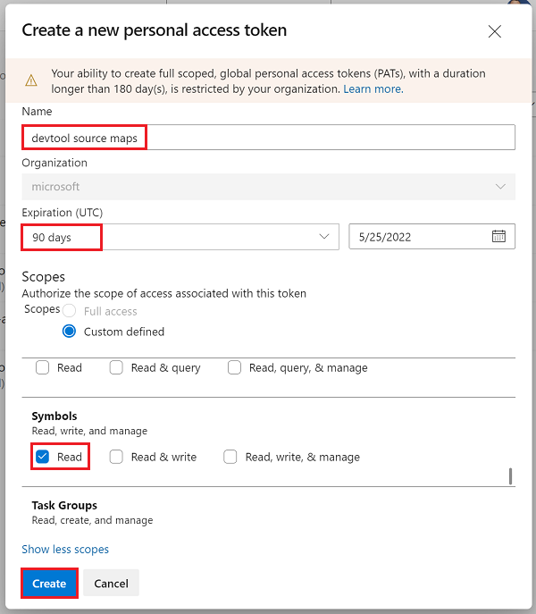

# Debug original code using the Azure Artifacts symbol server

To see and debug your original source code in DevTools rather than the compiled, minified, and bundled production code that's returned by the web server, use source maps served by the Azure Artifacts symbol server.

In production, the JavaScript code of your website may be different from the original source code you work with during development. It may have been compiled, minified, and bundled during your website's build step. Source maps are used to map your compiled code to your original source code. Using source maps makes it possible to view and debug your original source code in DevTools instead of your compiled code.

<!-- ====================================================================== -->
## Publish symbols for debugging

With Azure Pipelines, you can publish your debugging symbols to the Azure Artifacts symbol server using the **Index sources and publish symbols** task. These debugging symbols can include the source maps for your compiled JavaScript code.

To learn publishing symbols, see [Publish symbols for debugging](/azure/devops/pipelines/artifacts/symbols) and [Index Sources & Publish Symbols task](/azure/devops/pipelines/tasks/build/index-sources-publish-symbols).

<!-- ====================================================================== -->
## Get source maps from Azure Artifacts symbol server in DevTools

Microsoft Edge DevTools can use the published debugging symbols from the Azure Artifacts symbol server to display and debug original source code via source maps.

### Step 1: Get a Symbols PAT from Azure DevOps

To obtain symbols DevTools uses the fetch protocol to talk to Azure DevOps, which requires a valid Personal Access Token (PAT).

To generate a PAT in Azure DevOps:

1. In Azure DevOps go to **User settings** > **Personal access tokens**.
    
   

1. Click **New Token** and enter a name and expiration date for the PAT.

1. Click **Show all scopes**, scroll down to **Symbols**, and select **Read**.

   

1. Click **Create**.

1. Copy the PAT displayed on the next screen.

### Step 2: Configure DevTools

Microsoft Edge DevTools now needs to be configured with the PAT to successfully retrieve the debugging symbols.

To configure DevTools:

1. In DevTools, click **Settings** () > **Symbol Server**.

1. Type the Azure DevOps organization where you created the PAT in the **Azure DevOps organization** field.

1. Paste your PAT in the **Azure DevOps personal access token** field.

   

1. Close the Settings panel and click **Reload DevTools**.

### Step 3: Retrieve original code in DevTools

As you are using DevTools on an official build of your web site for which symbols have been published, you should be able to see your original code in DevTools.

In the **Console** tool, links in logged messages should go to original files in the **Sources** tool. 

In the **Sources** tool, the **Navigator** pane should show your original files.

You can also check the status of your source maps by opening the **Source Maps Monitor** tool. To learn more about the **Source Maps Monitor** tool and how it can help monitor which source files requested source maps, and whether those source maps were loaded, see [Source Maps Monitor tool](../source-maps-monitor/source-maps-monitor-tool.md).

<!-- ====================================================================== -->
## See also

* [Map the processed code to your original source code, for debugging](source-maps.md)
