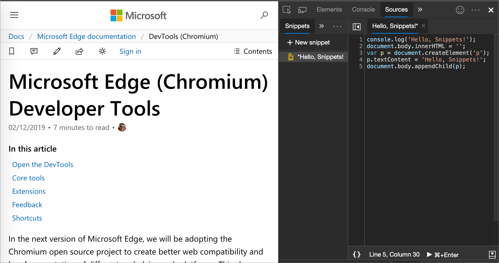
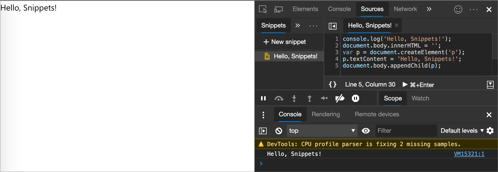
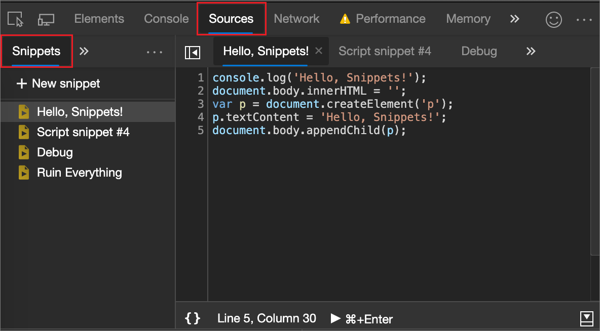
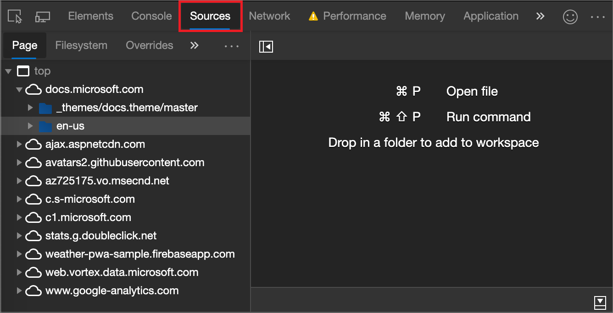
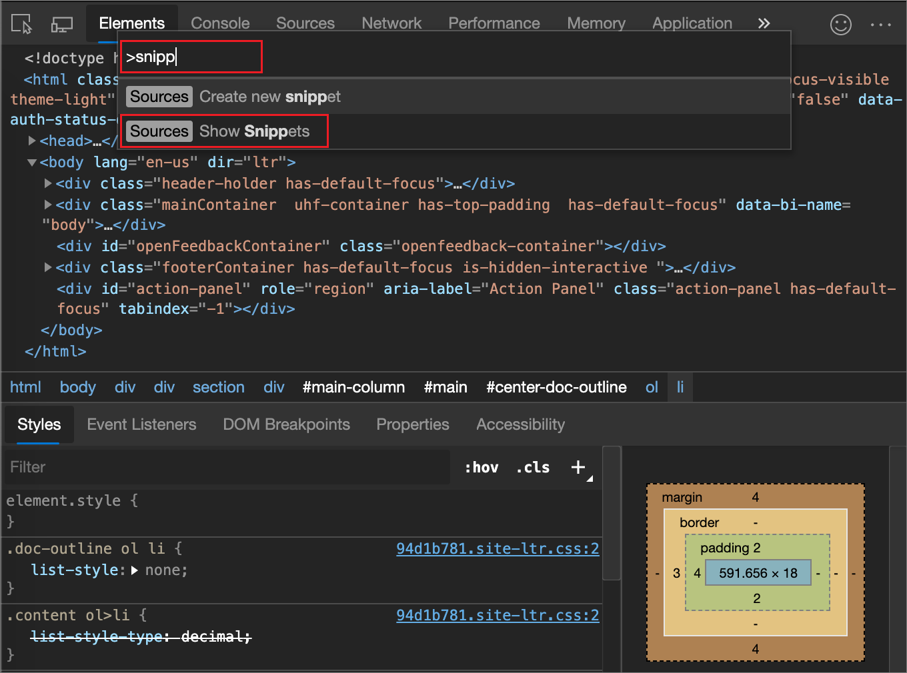
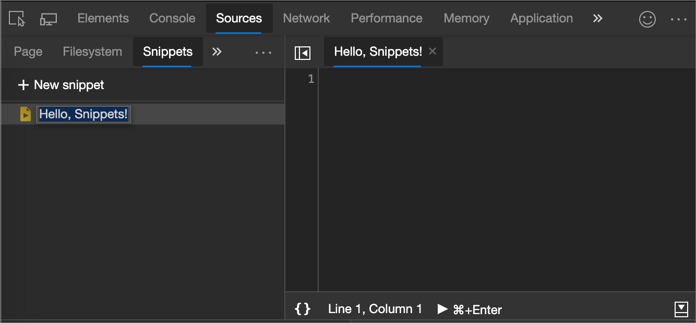
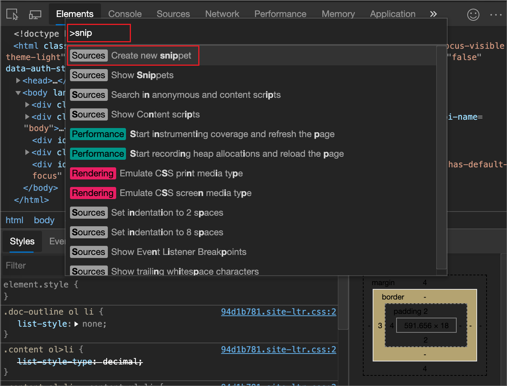
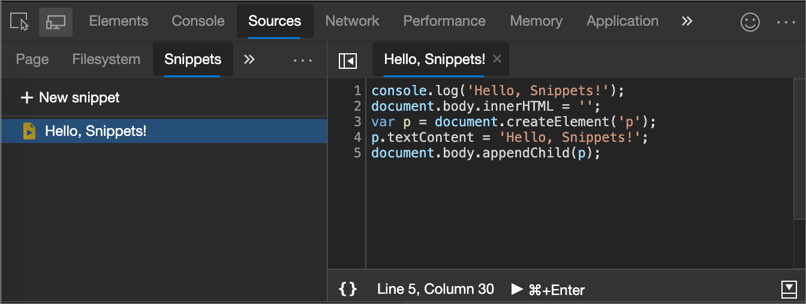
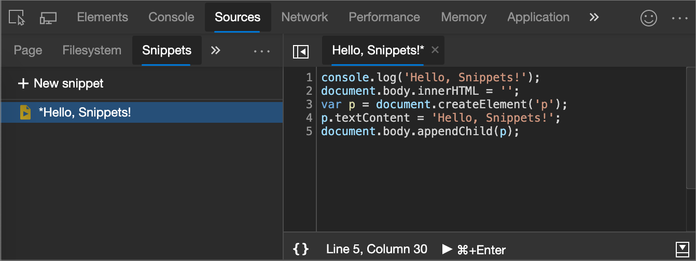
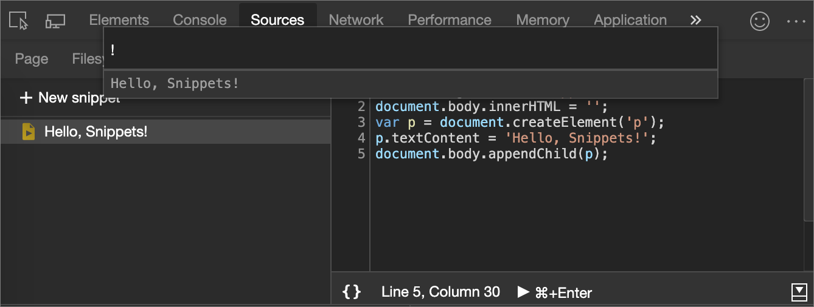

<!-- Copyright Kayce Basques

   Licensed under the Apache License, Version 2.0 (the "License");
   you may not use this file except in compliance with the License.
   You may obtain a copy of the License at

       https://www.apache.org/licenses/LICENSE-2.0

   Unless required by applicable law or agreed to in writing, software
   distributed under the License is distributed on an "AS IS" BASIS,
   WITHOUT WARRANTIES OR CONDITIONS OF ANY KIND, either express or implied.
   See the License for the specific language governing permissions and
   limitations under the License.  -->
# Run snippets of JavaScript on any webpage

If you are running the same code in the [Console](../console/index.md) repeatedly, consider saving the code as a Snippet instead.  Snippets are scripts that you author in the [Sources](../sources/index.md) tool.  Snippets have access to the JavaScript context of the webpage, and you can run Snippets on any webpage.  The security settings of most webpages block from loading other scripts in Snippets.  For that reason, you must include all your code in one file.

Snippets are an alternative to [bookmarklets](https://en.wikipedia.org/wiki/Bookmarklet) with the difference that Snippets only run in DevTools and aren't limited to the allowed length of a URL.

Using Snippets is an excellent way to change a few things in a third-party webpage.  Code changes in Snippets are added to the current webpage and run in the same context.  For more information about changing the existing code of a webpage, see [Overrides](overrides.md).

The following figure shows the DevTools homepage on the left and some Snippet source code on the right.

The webpage before running the Snippet:



The Snippet source code from the webpage before running the Snippet:

```javascript
console.log('Hello, Snippets!');
document.body.innerHTML = '';
var p = document.createElement('p');
p.textContent = 'Hello, Snippets!';
document.body.appendChild(p);
```

In the following figure, the webpage appears after running the Snippet.  The **Console Drawer** pops up to display the `Hello, Snippets!` message that the Snippet logs, and the content of the webpage changes completely:




<!-- ====================================================================== -->
## Open the Snippets tab

The **Snippets** tab, in the **Navigator** pane on the left, lists your Snippets.  When you want to edit a Snippet, you need to open it from the **Snippets** tab:



### Open the Snippets tab with a mouse

1. Select the **Sources** tab.  The **Sources** tool appears:

   

1. In the **Navigator** pane (on the left), select the **Snippets** tab.  To access the **Snippets** option, you might need to click the **More tabs** () button.

### Open the Snippets tab with the Command Menu

1. Select anything in DevTools, so that DevTools has focus.

1. Press **Ctrl+Shift+P** (Windows, Linux) or **Command+Shift+P** (macOS) to open the Command Menu.

1. Type `Snippets`, select **Show Snippets**, and then press **Enter** to run the command:

   


<!-- ====================================================================== -->
## Create Snippets

### Create a Snippet through the Sources tool

1. [Open the Snippets tab](#open-the-snippets-tab).

1. Click **New snippet**.

1. Enter a name for your Snippet, and then press **Enter**:

   

### Create a Snippet through the Command Menu

1. Focus your cursor somewhere in DevTools.

1. Press **Ctrl+Shift+P** (Windows, Linux) or **Command+Shift+P** (macOS) to open the Command Menu.

1. Start typing `snippet`, select **Create new snippet**, and then press **Enter**:

   

To rename your new Snippet with a custom name, see [Rename Snippets](#rename-snippets).


<!-- ====================================================================== -->
## Edit Snippets

1. [Open the Snippets tab](#open-the-snippets-tab).

1. In the **Snippets** tab, select the name of the Snippet that you want to edit.  The Snippet opens in the **Code Editor**:

   

1. Use the **Code Editor** to add JavaScript to your Snippet.

1. When an asterisk appears next to the name of your Snippet, it means you have unsaved code.  Press **Ctrl+S** (Windows, Linux) or `Command`+`S` (macOS) to save:

   


<!-- ====================================================================== -->
## Run Snippets

### Run a Snippet from the Sources tool

1. [Open the Snippets tab](#open-the-snippets-tab).

1. Click the name of the Snippet that you want to run.  The Snippet opens in the **Code Editor**:

1. Click **Run snippet** ().

### Run a Snippet with the Command Menu

1. Focus your cursor somewhere in DevTools.

1. Press **Ctrl+Shift+P** (Windows, Linux) or **Command+Shift+P** (macOS) to open the Command Menu.

1. Delete the `>` character and type the `!` character followed by the name of the Snippet that you want to run:

   

1. Press **Enter** to run the Snippet.


<!-- ====================================================================== -->
## Rename Snippets

1. [Open the Snippets tab](#open-the-snippets-tab).

1. Right-click the Snippet name, and then select **Rename**.


<!-- ====================================================================== -->
## Delete Snippets

1. [Open the Snippets tab](#open-the-snippets-tab).

1. Right-click the Snippet name, and then select **Remove**.


<!-- ====================================================================== -->
## Save Snippets

By default, Snippets are only available within DevTools, but you can also save them to disk.

1. [Open the Snippets tab](#open-the-snippets-tab).

1. Right-click the Snippet name, and then select **Save as**.

1. Enter a file name and location when prompted.


<!-- ====================================================================== -->
> [!NOTE]
> Portions of this page are modifications based on work created and [shared by Google](https://developers.google.com/terms/site-policies) and used according to terms described in the [Creative Commons Attribution 4.0 International License](https://creativecommons.org/licenses/by/4.0).
> The original page is found [here](https://developer.chrome.com/docs/devtools/javascript/snippets/) and is authored by [Kayce Basques](https://developers.google.com/web/resources/contributors#kayce-basques) (Technical Writer, Chrome DevTools \& Lighthouse).

[](https://creativecommons.org/licenses/by/4.0)
This work is licensed under a [Creative Commons Attribution 4.0 International License](https://creativecommons.org/licenses/by/4.0).
