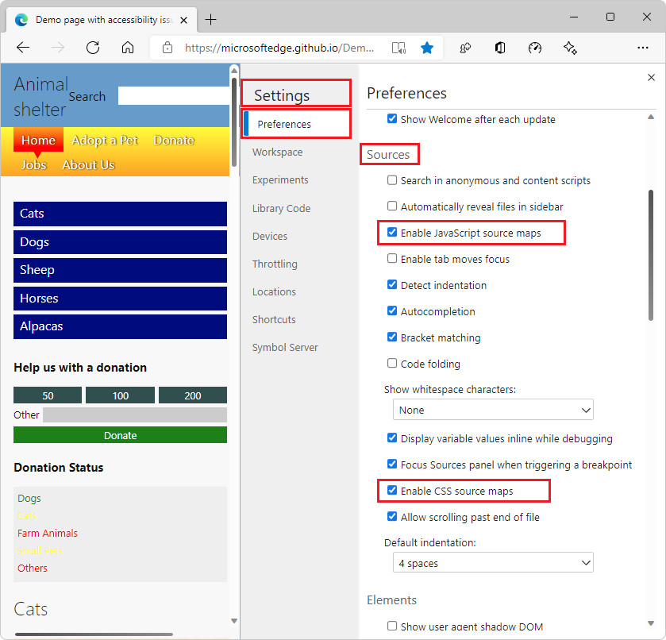

<!-- Copyright Meggin Kearney and Paul Bakaus

   Licensed under the Apache License, Version 2.0 (the "License");
   you may not use this file except in compliance with the License.
   You may obtain a copy of the License at

       https://www.apache.org/licenses/LICENSE-2.0

   Unless required by applicable law or agreed to in writing, software
   distributed under the License is distributed on an "AS IS" BASIS,
   WITHOUT WARRANTIES OR CONDITIONS OF ANY KIND, either express or implied.
   See the License for the specific language governing permissions and
   limitations under the License.  -->
# Map preprocessed code to source code

Keep your client-side code readable and debuggable even after you combine, minify, or compile it.  Use source maps to map your compiled code to your source code.

### Summary

*  Use Source Maps to map minified code to source code.  You are then able to read and debug compiled code in the original source.
*  Only use pre-processors capable of producing Source Maps.
*  Verify that your web server is able to serve Source Maps.

<!--
no longer in original file:
todo: add link to preprocessors capable of producing Source Maps when section is available
/web/tools/setup/setup-preprocessors?#supported_preprocessors
-->


<!-- ====================================================================== -->
## Get started with preprocessors

This article explains how to interact with JavaScript Source Maps in the DevTools Sources tool.  <!--For a first overview of what preprocessors are, how each may help, and how Source Maps work; see Set Up CSS & JS Preprocessors.  -->

<!--
no longer in original file:
todo: add link to Set Up CSS & JS Preprocessors when section is available
/web/tools/setup/setup-preprocessors#debugging-and-editing-preprocessed-content
-->


<!-- ====================================================================== -->
## Use a supported preprocessor

Use a minifier that is capable of creating source maps.  <!--For the most popular options, see the preprocessor support section.  -->  For an extended view, see the [Source maps: languages, tools and other info](https://github.com/ryanseddon/source-map/wiki/Source-maps:-languages,-tools-and-other-info) wiki page.

<!--
no longer in original file:
todo: add link to display the preprocessor support section when section is available
/web/tools/setup/setup-preprocessors?#supported_preprocessors
-->

The following types of preprocessors are commonly used in combination with Source Maps:

*  Transpilers ([Babel](https://babeljs.io), [Traceur](https://github.com/google/traceur-compiler/wiki/Getting-Started)).
*  Compilers ([Closure Compiler](https://github.com/google/closure-compiler), [TypeScript](https://www.typescriptlang.org), [CoffeeScript](https://coffeescript.org), [Dart](https://www.dartlang.org)).
*  Minifiers ([UglifyJS](https://github.com/mishoo/UglifyJS)).


<!-- ====================================================================== -->
## Source Maps in DevTools Sources tool

Source Maps from preprocessors cause DevTools to load your original files in addition to your minified ones.  You then use the originals to set breakpoints and step through code.  Meanwhile, Microsoft Edge is actually running your minified code.  The running of the code gives you the illusion of running a development site in production.

When running Source Maps in DevTools, you should notice that the JavaScript isn't compiled, and all of the individual JavaScript files that it references are displayed.  Source Maps in DevTools is using source mapping, but the underlying functionality actually runs the compiled code.

Any errors, logs, and breakpoints map to the dev code, for awesome debugging.  So in effect, it gives you the illusion that you are running a dev site in production.

### Enable Source Maps in settings

Source Maps are enabled by default.<!-- (as of Microsoft Edge 39)-->

To make sure that Source Maps are enabled:

1. Open DevTools (**F12**).

1. Click **Settings** () > **Preferences**.

1. Under **Sources**, select **Enable JavaScript Source Maps**.  You can also select **Enable CSS Source Maps**.



### Debugging with Source Maps

When [debugging your code](index.md#step-4-step-through-the-code) and Source Maps are enabled, Source Maps are used in two places:

*  In the **Console** tool, links from log messages to source files are for the original files, not the compiled files.

*  When stepping through code in the **Sources** tool, the original files are displayed in the **Navigator** pane and links to source files in the **Call Stack** of the **Debugger** pane open the original source files.


<!-- ====================================================================== -->
## @sourceURL and displayName

Although it's not part of the Source Map spec, the `@sourceURL` allows you to make development much easier when working with evals.  The helper is displayed similar to the `//# sourceMappingURL` property and is mentioned in the Source Map V3 specifications.

By including the following special comment in your code, which is evaled, you can name evals and inline scripts and styles so each appears as more logical names in your DevTools.

```javascript
//# sourceURL=source.coffee
```

1. Open the [Name those evals](https://www.thecssninja.com/demo/source_mapping/compile.html) demo page in a new browser window or tab.

1. Open DevTools and go to the **Sources** tool.

1. In the **Name your code:** input field, enter a filename.

1. Click the **compile** button.

   An alert appears, showing the evaluated sum from the CoffeeScript source.

1. Expand the **Sources** sub-panel.  The new file appears, with the custom filename you entered earlier.

1. Double-click the file to open it.

   The file contains the compiled JavaScript for the original source.  On the last line, however, is a `// @sourceURL` comment indicating the original source file.  This may help you with debugging while working with language abstractions.

:::image type="content" source="../media/javascript-sources-page-coffeeeeeeee.msft.png" alt-text="Working with sourceURL." lightbox="../media/javascript-sources-page-coffeeeeeeee.msft.png":::


<!-- ====================================================================== -->
## See also

* [Debug original code using the Azure Artifacts symbol server](ado-symbol-server.md)
* [Source Maps Monitor tool](../source-maps-monitor/source-maps-monitor-tool.md)


<!-- ====================================================================== -->
> [!NOTE]
> Portions of this page are modifications based on work created and [shared by Google](https://developers.google.com/terms/site-policies) and used according to terms described in the [Creative Commons Attribution 4.0 International License](https://creativecommons.org/licenses/by/4.0).
> The original page is found [here](https://developers.google.com/web/tools/chrome-devtools/javascript/source-maps) and is authored by [Meggin Kearney](https://developers.google.com/web/resources/contributors#meggin-kearney) (Technical Writer) and [Paul Bakaus](https://developers.google.com/web/resources/contributors#paul-bakaus) (Open Web Developer Advocate, Google: Tools, Performance, Animation, and UX).

[](https://creativecommons.org/licenses/by/4.0)
This work is licensed under a [Creative Commons Attribution 4.0 International License](https://creativecommons.org/licenses/by/4.0).
