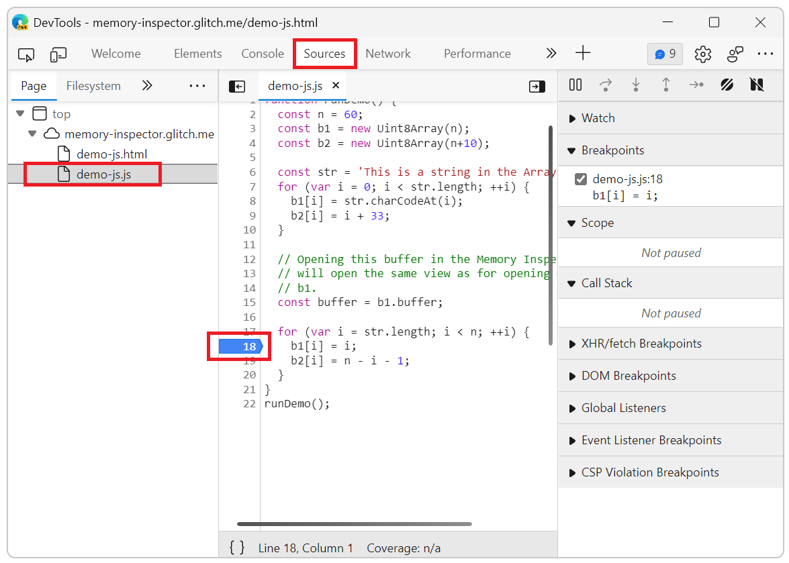
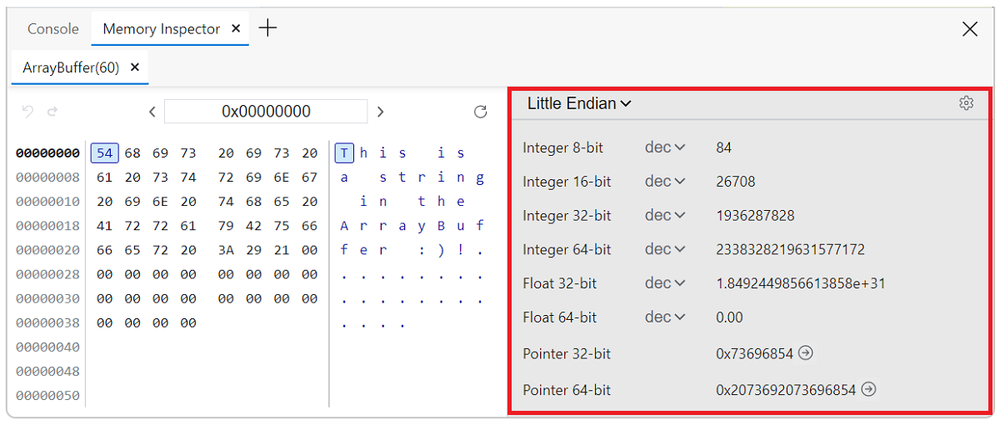
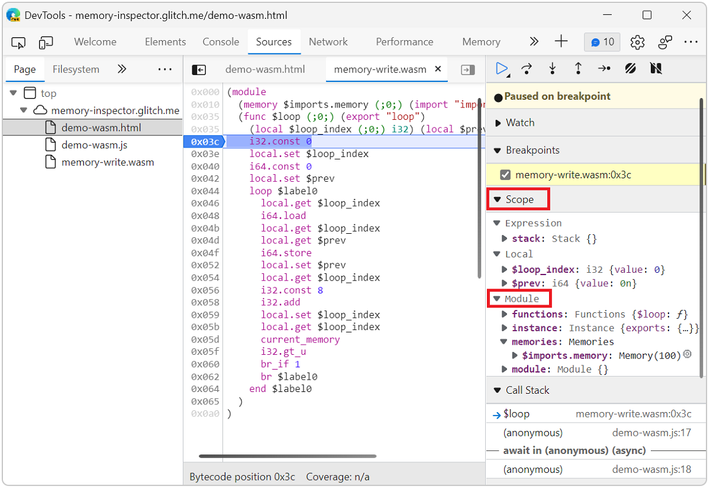

<!-- Copyright Kim-Anh Tran

   Licensed under the Apache License, Version 2.0 (the "License");
   you may not use this file except in compliance with the License.
   You may obtain a copy of the License at

       https://www.apache.org/licenses/LICENSE-2.0

   Unless required by applicable law or agreed to in writing, software
   distributed under the License is distributed on an "AS IS" BASIS,
   WITHOUT WARRANTIES OR CONDITIONS OF ANY KIND, either express or implied.
   See the License for the specific language governing permissions and
   limitations under the License.  -->

# Inspect a JavaScript ArrayBuffer using Memory Inspector

Use Memory Inspector to view a JavaScript ArrayBuffers in and the WebAssembly (WASM) resizable ArrayBuffer `WebAssembly.Memory`. You can open Memory Inspector from the [DevTools menu](#open-memory-inspector-from-the-devtools-menu) or [while debugging](#open-memory-inspector-while-debugging).

<!-- add more scenario type info, ask Zoher -->

<!-- ====================================================================== -->
## Open the test site in Microsoft Edge

1. Start Microsoft Edge.

1. Open the test site [http://memory-inspector.glitch.me/demo-js.html](http://memory-inspector.glitch.me/demo-js.html). <!-- To do item: copy to Microsoft Repo and reference there-->

<!-- ====================================================================== -->
## Open Memory Inspector from the DevTools menu

1. Open DevTools by pressing `F12` or `Ctrl`+`Shift`+`I` (Windows, Linux) or `Command`+`Option`+`I` (macOS).

1. To open Memory Inspector select **More Tools** (**+**) > Memory Inspector

    

<!-- ====================================================================== -->
## Open Memory Inspector while debugging

1. Open the demo webpage [Inspect ArrayBuffers in JS (Memory in JS)](https://memory-inspector.glitch.me/demo-js.html). <!-- We need a microsoftedge.github.io with a JavaScript ArrayBuffer comparable to memory-inspector.glitch.me/demo-js.html -->

1. Open DevTools by pressing `F12` or `Ctrl`+`Shift`+`I` (Windows, Linux) or `Command`+`Option`+`I` (macOS).

1. Click **Sources** and open the `demo-js.js` file.

1. Set a breakpoint at line **18** as shown in the following image.

    

1. Refresh the webpage. It fails to display because the JavaScript stops processing at the breakpoint.

1. In the right Debugger pane under **Scope**, find the `buffer` line.

1. From the `buffer` line you can open Memory Inspector using one of the following methods:

    * Click on the **Reveal in Memory Inspector panel** icon at the end of the `buffer` property line (), or
 
    * From the context menu. Right click on the `buffer` property and select **Reveal in Memory Inspector panel**.

    

    The ArrayBuffer opens in Memory Inspector.

    

### Inspect multiple objects

You can inspect multiple objects at the same time such as DataView and TypedArray.

In the demo webpage line `b2` is a TypedArray. Right click on the `b2` property and select **Reveal in Memory Inspector panel**.

A new tab opens next to the first tab in Memory Inspector.

<!-- ====================================================================== -->
## Navigating in Memory Inspector

The Memory Inspector panel includes 3 types of content:

* [Navigation bar](#navigation-bar)
* [Memory buffer](#memory-buffer)
* [Value inspector](#value-inspector)

### Navigation bar

 
* The address input shows the current byte address in hex format. You can change the value to jump to a new location in the memory buffer. Click in the text box and change the value to `0x00000008`. The Memory buffer immediately jumps to that byte address.

* Memory buffers may be longer than one page. Use the left and right arrow buttons to navigate Previous page and Next page, respectively. If there is only one page of memory buffer data, the arrows take you to the beginning and ending of the page.

* Use the far-left history arrows to **Go back in address history** and **Go forward in address history**.

* If the Memory buffer does not automatically update when stepping through values, click **Refresh**.

### Memory buffer

 
* Reading from the left side of the panel, the address is displayed in hex format.

* The memory is also shown in hex format, each byte separated by a space. The currently selected byte is highlighted. You can click on any byte or navigate using the arrow keys (left, right, up, and down).

* An ASCII representation of the memory is shown on the right side of the panel. The highlighted character corresponds to the selected byte. You can click on any character or navigate using the arrow keys (left, right, up, and down).

### Value inspector

 
* Click the current Endian to switch between **Big endian** and **Little endian**.

* The main area shows each value and interpretation based on the settings. By default, all are shown.

* Click **Toggle value type settings** () to select which value types to see by default in the inspector.

    

* You can change the encoding view using the drop-down list. For integers you can choose from decimal `dec`, hexadecimal `hex`, and octal `oct`. For floats you can choose between decimal notation `dec` and scientific notation `sci`.

<!-- ====================================================================== -->
## Inspecting memory

Complete the following steps to debug a webpage in Memory Inspector.

1. In the **Navigation bar** change the address to `0x00000027`.

1. View the ASCII representation and the value interpretations. All values should be zero or empty.

1. Click the **Jump to address** button () for **Pointer 32-bit** or **Pointer 64-bit** to jump to the next active memory address. If next memory address is not available, the button is turned off () with the tooltip **Address out of memory range**.

1. Click on the **Sources** tab.

1. Click **Resume script execution** () or press **F8** or **Ctrl +\\** to step through the code.

    The ASCII representation and the value interpretations are updated.  

1. Customize the **Value inspector** to show only floating point values. Click **Toggle value type settings** () and clear all checkboxes except the two **Floating-point** values.  

1. Change the encoding from `dec` to `sci`. The value representations are updated.  

1. Explore the memory buffer using the keyboard or navigation bar.

1. Repeat step **3** to observe values changes.

<!-- ====================================================================== -->
## WebAssembly memory inspection

For WebAssembly (Wasm) memory inspection, the process is similar to inspecting JavaScript memory.

1. Open the Wasm test site [http://memory-inspector.glitch.me/demo-wasm.html](http://memory-inspector.glitch.me/demo-wasm.html). 

1. Open DevTools by pressing `F12` or `Ctrl`+`Shift`+`I` (Windows, Linux) or `Command`+`Option`+`I` (macOS).

1. Click **Sources** and open the `memory-write.wasm` file.

1. Set a breakpoint at the first line in the loop, hexadecimal value **0x03c**.

1. Refresh the page.

1. In the debugger pane under **Scope**, expand the **Module**.

    

1. Click on the **Reveal in Memory Inspector panel** icon at the end of the `$imports.memory` property line (). 

    

<!-- ====================================================================== -->
> [!NOTE]
> Portions of this page are modifications based on work created and [shared by Google](https://developers.google.com/terms/site-policies) and used according to terms described in the [Creative Commons Attribution 4.0 International License](https://creativecommons.org/licenses/by/4.0).
> The original page is found [here](https://developer.chrome.com/blog/memory-inspector/) and is authored by [Kim-Anh Tran](https://developer.chrome.com/authors/kimanh/) (Chrome DevTools).

This work is licensed under a [Creative Commons Attribution 4.0 International License](https://creativecommons.org/licenses/by/4.0).
