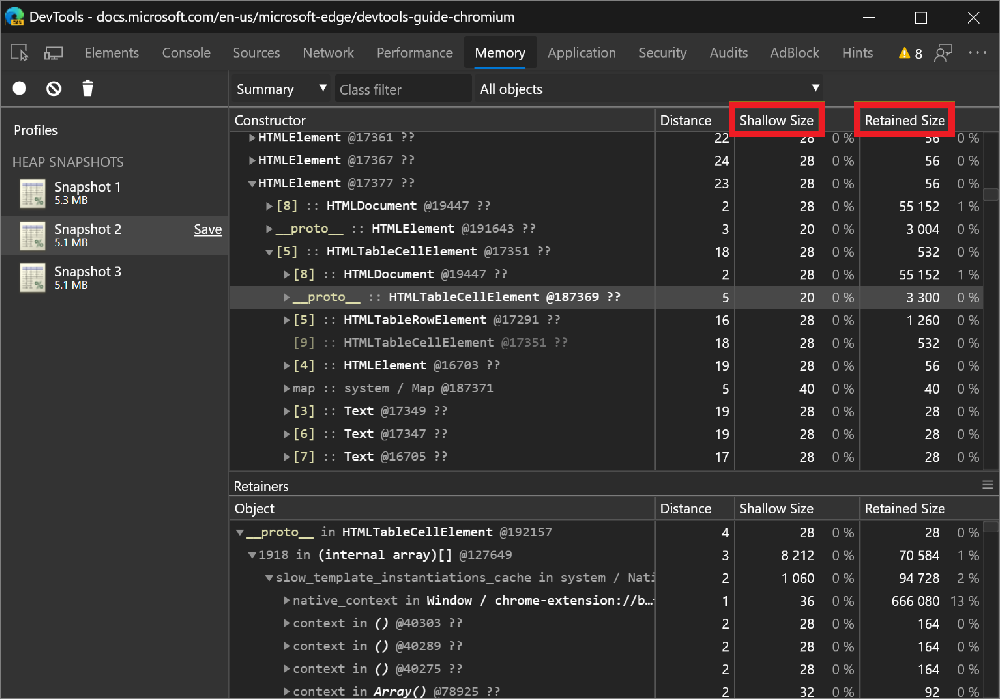
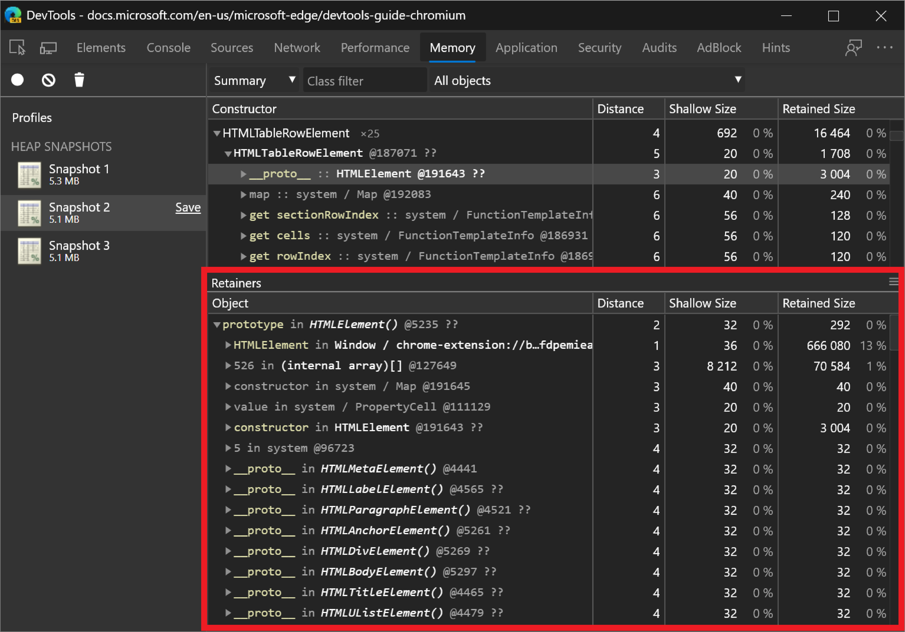
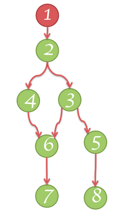
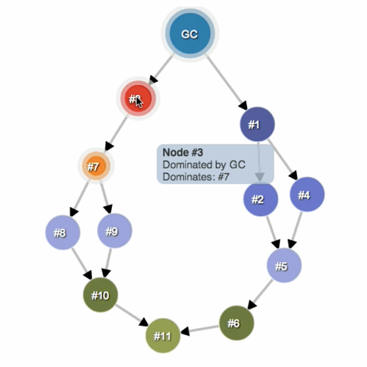
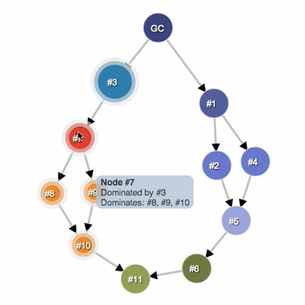
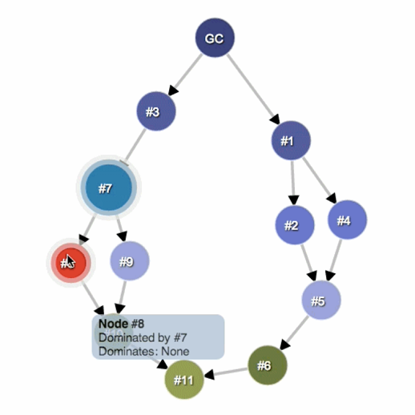
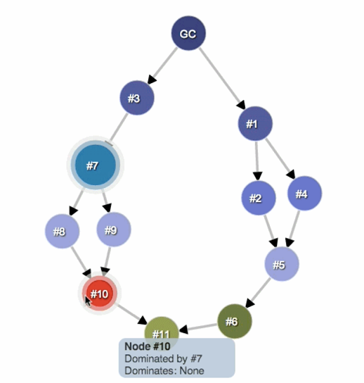

<!-- Copyright Meggin Kearney

   Licensed under the Apache License, Version 2.0 (the "License");
   you may not use this file except in compliance with the License.
   You may obtain a copy of the License at

       https://www.apache.org/licenses/LICENSE-2.0

   Unless required by applicable law or agreed to in writing, software
   distributed under the License is distributed on an "AS IS" BASIS,
   WITHOUT WARRANTIES OR CONDITIONS OF ANY KIND, either express or implied.
   See the License for the specific language governing permissions and
   limitations under the License. -->
# Memory terminology

This article describes common terms used in memory analysis, and is applicable to various memory profiling tools for different languages.

The terms and notions described here refer to the [Memory panel](heap-snapshots.md).  If you've ever worked with either the Java, .NET, or some other memory profiler, then this article may be a refresher.

<!-- ====================================================================== -->
## Object sizes

Think of memory as a graph with primitive types (like numbers and strings) and objects (associative arrays).  Memory can be visually represented as a graph with a number of interconnected points, as follows:

An object can hold memory in two ways:

*  Directly; the memory is held by the object itself.

*  Implicitly, by holding references to other objects.  An object holding references to other objects prevents those objects from being automatically disposed by a garbage collector (GC).

The [Memory](heap-snapshots.md) panel in DevTools is a tool for investigating memory issues.

When working with the Memory panel, you will likely find yourself looking at a few different columns of information.  Two columns that stand out are **Shallow Size** and **Retained Size**:

### Shallow size

The _shallow size_ is the size of memory that is held by the object.

Typical JavaScript objects have some memory reserved for their description and for storing immediate values.  Usually, only arrays and strings can have a significant shallow size.  However, strings and external arrays often have their main storage in renderer memory, exposing only a small wrapper object on the JavaScript heap.

_Renderer memory_ is all memory of the process where an inspected page is rendered:

_renderer memory_ = _native memory_ + _JS heap memory of the page_ + _JS heap memory of all dedicated workers started by the page_

Nevertheless, even a small object can hold a large amount of memory indirectly, by preventing other objects from being disposed of by the automatic garbage collection process.

### Retained size

The _retained size_ is the size of memory that is freed once the object is deleted along with the dependent objects that were made unreachable from garbage-collection roots (GC roots).

_Garbage-collection roots_ are made up of _handles_ that are created (as either local or global) when making a reference from native code to a JavaScript object outside of the V8 VM.  All such handles can be found within a heap snapshot under **GC roots** > **Handle scope** and **GC roots** > **Global handles**.  Describing the handles in this documentation without diving into details of the browser implementation may be confusing.  Both garbage-collection roots and the handles aren't something you need to worry about.

There are many internal GC roots, most of which aren't interesting for the users.  From the applications standpoint, there are the following kinds of roots:

*  Window global object (in each iframe).  In the heap snapshots, the `distance` field indicates the number of property references on the shortest retaining path from the window.

*  The document DOM tree, consisting of all native DOM nodes that are reachable by traversing the document.  Not all of the nodes have JavaScript wrappers, but if a node has a wrapper, the node is alive while the document is alive.

*  Sometimes objects are retained by the debug context in the **Sources** tool and the **Console**, such as after Console evaluation.  Create heap snapshots with a cleared **Console** tool and no active breakpoints in the debugger in the **Sources** tool.

>[!TIP]
> Before taking a heap snapshot in the [Memory](heap-snapshots.md) tool, clear the **Console** tool and deactivate breakpoints in the **Sources** tool.  To clear the **Console** tool, run the `clear()` method.

The memory graph starts with a root, which may be the `window` object of the browser or the `Global` object of a Node.js module.  You don't control how the root object is garbage-collected.

Whatever isn't reachable from the root gets garbage-collected.

> [!NOTE]
> The number that's shown in the [Shallow size](#shallow-size) and [Retained size](#retained-size) columns is the number of bytes.

<!-- ====================================================================== -->
## Objects retaining tree

The heap is a network of interconnected objects.  In the mathematical world, this structure is called a _graph_ or _memory graph_.  A graph is constructed from _nodes_ that are connected by _edges_.

Nodes and edges in a graph are given labels as follows:

*  _Nodes_ (or _objects_) are labelled using the name of the _constructor_ function that was used to build them.

*  _Edges_ are labelled using the names of _properties_.

Learn [how to record a profile using the Heap Profiler](heap-snapshots.md).  In the following figure, some of the notable things in the Heap Snapshot recording in the [Memory](heap-snapshots.md) tool include **Distance**, which is the distance from the garbage-collection root.  If almost all the objects of the same type are at the same distance, and a few are at a bigger distance, that's something worth investigating.

Distance from root:

<!-- ====================================================================== -->
## Dominators

Dominator objects are comprised of a tree structure, because each object has exactly one dominator.  A dominator of an object might lack direct references to an object that it dominates.  That is, dominator's tree is not a spanning tree of the graph.

In the following figure:

*  Node 1 dominates node 2.
*  Node 2 dominates nodes 3, 4 and 6.
*  Node 3 dominates node 5.
*  Node 5 dominates node 8.
*  Node 6 dominates node 7.

In the following figure, node `#3` is the dominator of node `#10`.  But node `#7` also exists in every simple path from the garbage collection root **GC** to node `#10`. Therefore, an object `B` is a dominator of an object `A` if object `B` exists in every simple path from the root to the object `A`.

Node `GC` dominates nodes `#1`, `#3`, and `#11`:

 
Node `#3` is dominated by node `GC` and dominates node `#7`:

 
Node `#7` is dominated by node `#3` and dominates nodes `#8`, `#9`, and `#10`:

 
Node `#8` is dominated by node `#7` and doesn't dominate any nodes:

 
Node `#10` is dominated by node `#7` and doesn't dominate any nodes:

 
Node `#11` is dominated by node `#1` and doesn't dominate any nodes:

<!-- ====================================================================== -->
## V8 specifics

When profiling memory, it is helpful to understand why heap snapshots look a certain way.  This section describes some memory-related topics specifically corresponding to the _V8 JavaScript virtual machine_ (abbreviated here as _V8 VM_, or just _VM_).

### JavaScript object representation

In JavaScript, there are three primitive types:

*  Numbers (such as `3.14159...`).
*  Booleans (`true` or `false`).
*  Strings (such as `"Werner Heisenberg"`).

Primitives cannot reference other values, and are always leaf nodes (also called _terminating nodes_).

**Numbers** can be stored as either:

*  Immediate 31-bit integer values that are called **small integers** (_SMIs_).

*  Heap objects, referred to as **heap numbers**.  Heap numbers are used for storing values that don't fit into the SMI form, such as **doubles**, or when a value needs to be **boxed**, such as setting properties on it.

**Strings** can be stored in either:

*  The **VM heap**.

*  Externally in the **renderer's memory**.  A _wrapper object_ is created and used for accessing external storage where, for example, script sources and other content that is received from the Web is stored, rather than copied onto the VM heap.

Memory for new JavaScript objects is allocated from a dedicated JavaScript heap (or _VM heap_).  These objects are managed by VM V8's garbage collector, and therefore, these objects stay alive as long as there is at least one strong reference<!-- undefined term --> to them.

**Native objects** - Anything not in the JavaScript heap is called a _native object_.  A native object, in contrast to a heap object, isn't managed by the V8 garbage collector throughout its lifetime, and can only be accessed from JavaScript by using its JavaScript wrapper object.

A **cons string** (concatenation string) is an object that consists of pairs of strings that are stored and then joined, and is a result of concatenation.  The joining of the **cons string** contents occurs only as needed.  For example, when a substring of a joined string needs to be constructed.

For example, if you concatenate `a` and `b`, you get a string `(a, b)` which represents the result of concatenation, and is a cons string.  If you later concatenated `d` with that result, you get another cons string: `((a, b, d)`.

**Arrays** - An _array_ is an object that has numeric keys.  Arrays are used extensively in the V8 VM for storing large amounts of data.  Sets of key-value pairs that are used like dictionaries are implemented as **arrays**.

A typical JavaScript object is stored as only one of two **array** types:

A typical JavaScript object can be one of two array types:

* An array for storing named properties.
* An array for storing numeric elements.

When there are a small number of properties, the properties are stored internally in the JavaScript object.

**Map** is an object that describes both the kind of object it is and the layout.  For example, maps are used to describe implicit object hierarchies for [fast property access](https://v8.dev/blog/fast-properties).

### Object groups

Each _native objects group_ is made up of objects that hold mutual references to each other.  Consider, for example, a DOM subtree where every node has a link to the relative parent and links to the next child and next sibling, thus forming a connected graph.

Note that native objects aren't represented in the JavaScript heap.  The lack of representation is why native objects have zero size.  Instead, wrapper objects are created.

Each wrapper object holds a reference to the corresponding native object, for redirecting commands to it.  In turn, an object group holds wrapper objects.  This doesn't create an uncollectable cycle, because garbage collection is smart enough to release object groups whose wrappers are no longer referenced.  But forgetting to release a single wrapper will hold references to the whole group and to any associated wrappers.

<!-- ====================================================================== -->
> [!NOTE]
> Portions of this page are modifications based on work created and [shared by Google](https://developers.google.com/terms/site-policies) and used according to terms described in the [Creative Commons Attribution 4.0 International License](https://creativecommons.org/licenses/by/4.0).
> The original page is found [here](https://developers.google.com/web/tools/chrome-devtools/memory-problems/memory-101) and is authored by [Meggin Kearney](https://developers.google.com/web/resources/contributors#meggin-kearney) (Technical Writer).

This work is licensed under a [Creative Commons Attribution 4.0 International License](https://creativecommons.org/licenses/by/4.0).
