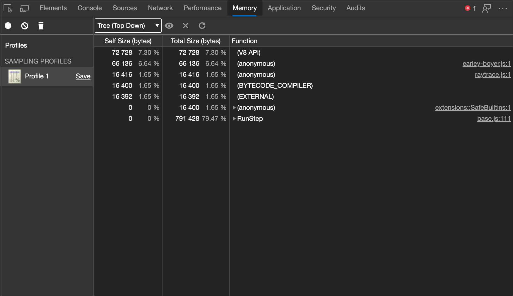
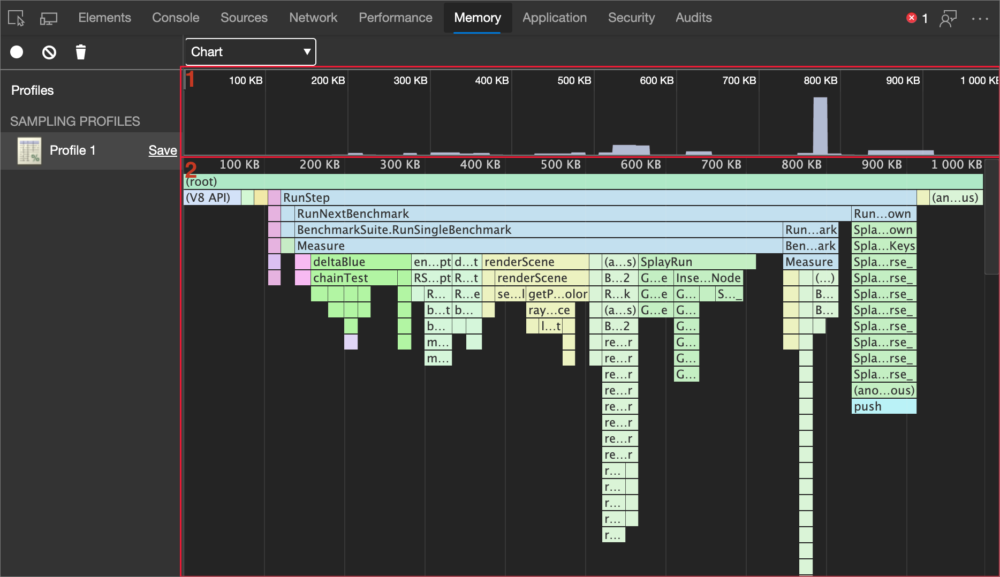
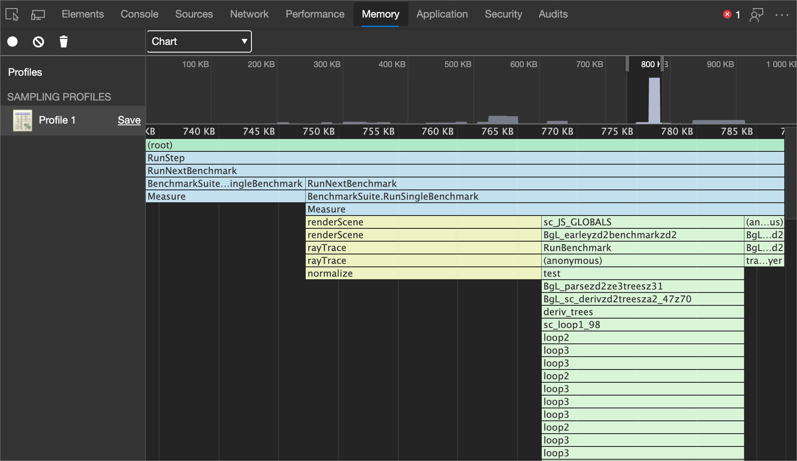
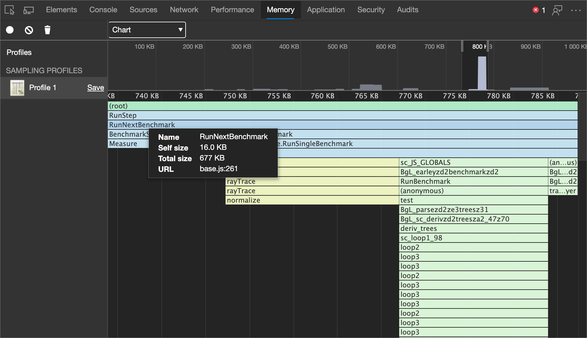

<!-- Copyright Kayce Basques and Meggin Kearney

   Licensed under the Apache License, Version 2.0 (the "License");
   you may not use this file except in compliance with the License.
   You may obtain a copy of the License at

       https://www.apache.org/licenses/LICENSE-2.0

   Unless required by applicable law or agreed to in writing, software
   distributed under the License is distributed on an "AS IS" BASIS,
   WITHOUT WARRANTIES OR CONDITIONS OF ANY KIND, either express or implied.
   See the License for the specific language governing permissions and
   limitations under the License. -->
# Speed up JavaScript runtime

To identify expensive functions, use the **Memory** tool.

### Summary

*  Record exactly which functions were called and how much memory each requires with Allocation Sampling in the **Memory** tool.

*  Visualize your profiles as a flame chart.

<!-- ====================================================================== -->
## Record a Sampling Profile

If you notice jank (interruptions of rendering) in your JavaScript, collect a Sampling Profile.  Sampling Profiles show where running time is spent on functions in your page.

1. In DevTools, go to the **Memory** tool.

1. Click the **Allocation sampling** radio button.

1. Click **Start**.

1. Depending on what you are trying to analyze, you can either refresh the page, interact with the page, or just let the page run.

1. When you're finished, click the **Stop** button.

You can also use the [Console Utilities API](../console/utilities.md) to record and group profiles from the command line.

<!-- ====================================================================== -->
## View Sampling Profile

When you finish recording, DevTools automatically populates the **Memory** panel under **SAMPLING PROFILES** with the data from your recording.

The default view is **Heavy (Bottom Up)**.  This view allows you to review which functions had the most impact on performance and examine the requesting path for each function.

### Change sort order

To change the sorting order, select the dropdown menu next to the **focus selected function** () icon and then select one of the following options:

**Chart**.  Displays a chronological chart of the recording.

**Heavy (Bottom Up)**.  Lists functions by impact on performance and enables you to examine the calling paths to the functions.  This is the default view.

**Tree (Top Down)**.  Shows an overall picture of the calling structure, starting at the top of the call stack.

### Exclude functions

To exclude a function from your Sampling Profile, select it and then click the **exclude selected function** () button.  The requesting function (parent) of the excluded function (child) is charged with the allocated memory assigned to the excluded function (child).

Click the **restore all functions** () button to restore all excluded functions back into the recording.

<!-- ====================================================================== -->
## View Sampling Profile as Chart

The **Chart** view provides a visual representation of the Sampling Profile over time.

After you [record a Sampling Profile](#record-a-sampling-profile), view the recording as a flame chart by [changing the sort order](#change-sort-order) to **Chart**.

The flame chart is split into two parts:

| index | Part | Description |
| --- |:--- |:--- |
| 1 | Overview | A birds-eye view of the entire recording.  The height of the bars correspond to the depth of the call stack.  So, the higher the bar, the deeper the call stack.  |
| 2 | Call Stacks | This is an in-depth view of the functions that were called during the recording.  The horizontal axis is time and vertical axis is the call stack.  The stacks are organized top-down.  So, the function on top called the one below it, and so on.  |

Functions are colored randomly.  There is no correlation to the colors used in the other panels.  However, functions are always colored the same across invocations, so that you can observe patterns in each runtime.

A tall call stack isn't necessarily significant; it might just mean that a lot of functions were called.  But a wide bar means that a function took a long time to complete, so these are candidates for optimization.

### Zoom in on specific parts of recording

To zoom in on particular parts of the call stack, click and drag left and right across the overview.  After you zoom, the call stack automatically displays the portion of the recording that you selected.

### View function details

Click a function, to view it in the **Sources** tool.

Hover on a function to display the name and timing data:

| Detail | Description |
|:--- |:--- |
| **Name** | The name of the function.  |
| **Self size** | The size of the current invocation of the function, including only the statements in the function.  |
| **Total size** | The size of the current invocation of this function and any functions that it called.  |
| **URL** | The location of the function definition in the form of `base.js:261` where `base.js` is the name of the file where the function is defined and `261` is the line number of the definition.  |
<!--*  **Aggregated self time**.  Aggregate time for all invocations of the function across the recording, not including functions called by this function.  -->
<!--*  **Aggregated total time**.  Aggregate total time for all invocations of the function, including functions called by this function.  -->
<!--*  **Not optimized**.  If the profiler has detected a potential optimization for the function it lists it here.  -->

<!-- ====================================================================== -->
> [!NOTE]
> Portions of this page are modifications based on work created and [shared by Google](https://developers.google.com/terms/site-policies) and used according to terms described in the [Creative Commons Attribution 4.0 International License](https://creativecommons.org/licenses/by/4.0).
> The original page is found [here](https://developer.chrome.com/docs/devtools/evaluate-performance/) and is authored by [Kayce Basques](https://developers.google.com/web/resources/contributors#kayce-basques) (Technical Writer, Chrome DevTools \& Lighthouse) and [Meggin Kearney](https://developers.google.com/web/resources/contributors#meggin-kearney) (Technical Writer).

This work is licensed under a [Creative Commons Attribution 4.0 International License](https://creativecommons.org/licenses/by/4.0).
