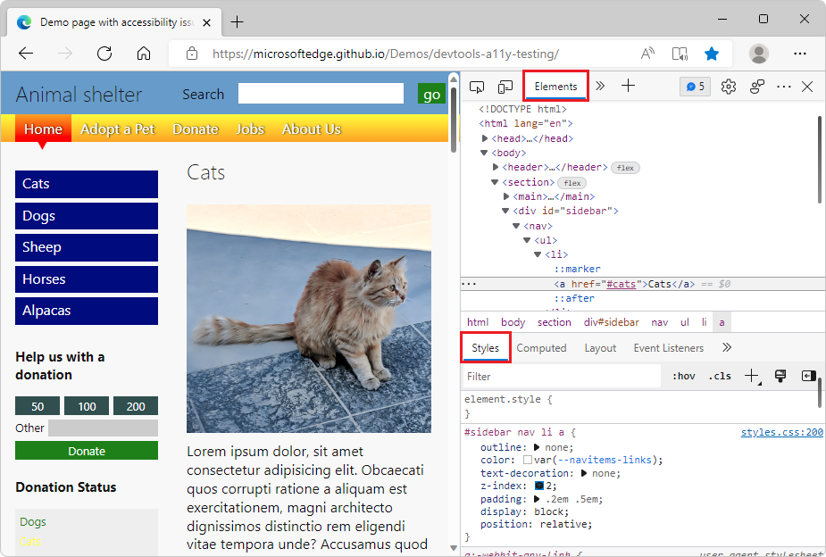
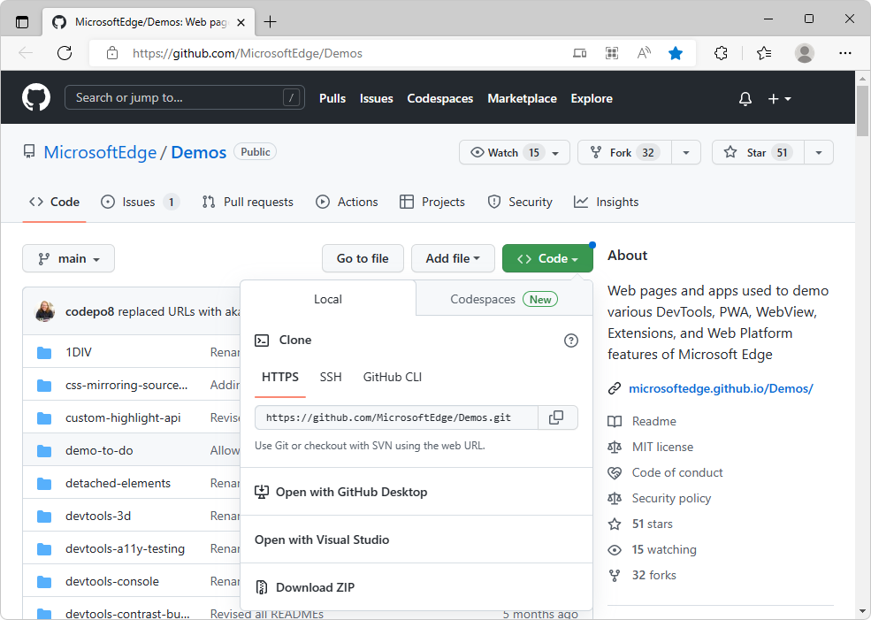
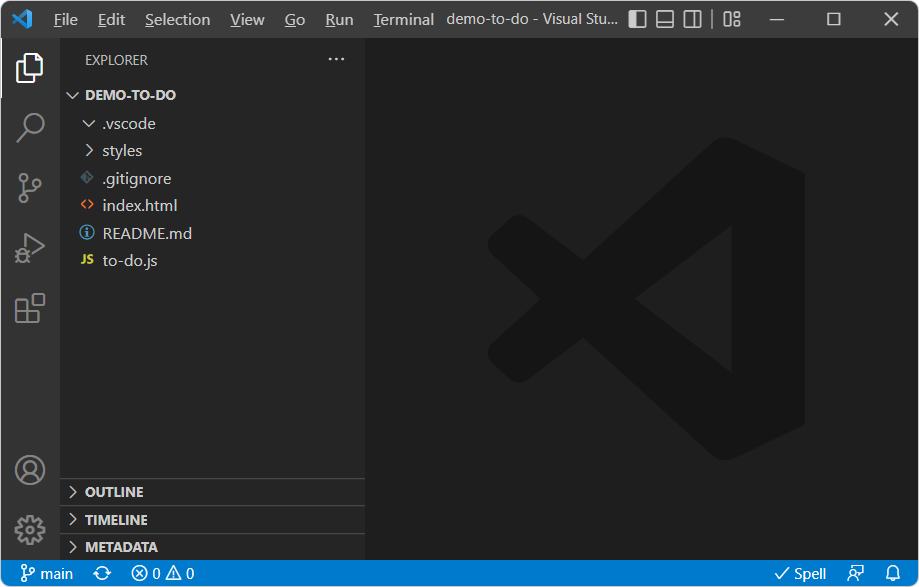

# Sample code for DevTools

The sample code that's used by the DevTools documentation is in the [MicrosoftEdge/Demos](https://github.com/MicrosoftEdge/Demos) repo at GitHub.

<!-- A few demos are or were at other locations, such as Glitch. -->

<!-- ====================================================================== -->
## To Do Demo

Programming instructions often present a basic To Do list app, as one degree more complex than a Hello World program.  This To Do demo has a `.html`, `.css`, and `.js` file, and is useful for learning how to use DevTools to develop webpages and web apps.

* Rendered page: [TODO app](https://microsoftedge.github.io/Demos/demo-to-do/)

* Source code: [Demos > /demo-to-do/ (Basic To Do App)](https://github.com/MicrosoftEdge/Demos/tree/main/demo-to-do)

<!-- ====================================================================== -->
## Demo webpage with accessibility issues

This demo webpage is useful for exploring various DevTools features.

1. Open the [Demo webpage with accessibility issues](https://MicrosoftEdge.github.io/Demos/devtools-a11y-testing/) in a new window or tab.

1. Right-click anywhere in the rendered webpage and then select **Inspect**.  DevTools opens next to the demo webpage.

   <!-- Or, press `F12`, `Ctrl`+`Shift`+`I` (on Windows/Linux), or `Command`+`Option`+`I` (on macOS). -->

#### Articles

These articles walk you through using this demo webpage:

* [Overview of accessibility testing using DevTools](../accessibility/accessibility-testing-in-devtools.md) - Long article with sections that demonstrate using various DevTools features to do accessibility testing, by using the "Demo webpage with accessibility issues".

* [Use the Inspect tool to detect accessibility issues by hovering over the webpage](../accessibility/test-inspect-tool.md) - One of several short articles that are derived from sections of the above article.

* [Accessibility-testing features](../accessibility/reference.md) - A list of accessibility testing features of DevTools, with links to several articles that use the "Demo webpage with accessibility issues".

#### Source code repo

This is the source code repo and its directory which stores the files for this demo webpage:

* [MicrosoftEdge/Demos > devtools-a11y-testing](https://github.com/MicrosoftEdge/Demos/tree/main/devtools-a11y-testing) - Contains files including:

   * `index.html` - The demo webpage, including page sections and input forms that send data to the `buttons.js` JavaScript file.  To view the rendered webpage, use the demo webpage link above.

   * `buttons.js` - Contains the JavaScript code that's used by the demo webpage.

   * `styles.css`, `light-theme.css`, and `dark-theme.css` - CSS files that control the presentation of the demo webpage.

   * Image files that are used in the demo webpage.

<!-- ====================================================================== -->
## Demo webpage: Debugging JavaScript with DevTools

This demo webpage is useful for exploring the **Sources** tool, especially the JavaScript debugger.

1. Open the demo webpage [Get started Debugging JavaScript with DevTools](https://MicrosoftEdge.github.io/Demos/devtools-js-get-started/) in a new window or tab.

1. Right-click anywhere in the rendered webpage and then select **Inspect**.  DevTools opens next to the demo webpage.

   <!-- Or, press `F12`, `Ctrl`+`Shift`+`I` (on Windows/Linux), or `Command`+`Option`+`I` (on macOS). -->

#### Articles

These articles or article sections walk you through using this demo webpage:

* [The basic approach to using a debugger](../sources/index.md#the-basic-approach-to-using-a-debugger) in _Sources tool overview_.  This article section briefly walks you through the steps to use the JavaScript debugger in the **Sources** tool, to find the bug in the demo webpage.  To fix the bug, you convert the input strings to numbers before adding them.

* [Get started debugging JavaScript](../javascript/index.md) - A more in-depth walkthrough of using the demo webpage along with the debugger, demonstrating various features of the debugger, and setting different kinds of breakpoints.

#### Source code repo

This is the source code repo and its directory which stores the files for this demo webpage:

* [MicrosoftEdge/Demos > devtools-js-get-started](https://github.com/MicrosoftEdge/Demos/tree/main/devtools-js-get-started) - Contains the files:

   *  `README.md` - Contains links to the rendered demo webpage and the in-depth tutorial article about using the demo webpage.

   *  `index.html` - The webpage with an input form that sends data to the JavaScript file, and that displays the result of the JavaScript.

   *  `get-started.js` - The JavaScript file that's used by the form in the demo webpage.

<!-- ====================================================================== -->
## Downloading or cloning the Demos repo

The Demos repo is useful for following the various DevTools documentation.  If you want, instead of cloning the repo, you can open an existing project directory if you have one.

You can do any of the following:
* Download the repo -- you get a static snapshot.
   * Click the **Code** dropdown button, and then click **Download ZIP**.
* Clone the repo -- enables updating your local copy when the repo is updated.
   * Click the **Code** dropdown button, and then click the **Copy** button next to the URL **https://github.com/MicrosoftEdge/Demos.git**.  You can then paste the URL into git bash or a Visual Studio Code dialog, for example.
   * Click the **Code** dropdown button, and then click **Open with Visual Studio** if it appears.  A list of **Handler Selector** items is offered, one per Visual Studio instance installed.  This option appears only if you're logged in.

If you clone the repo, the GitHub UI and various tools support this cloning.  We'll show cloning by using Visual Studio Code, but you can use many other coding tools, such as GitHub Desktop, Visual Studio, or git bash shell.

As another alternative, instead of cloning the entire directory, you can download only a single demo's directory.  For example, go to [https://download-directory.github.io/](https://download-directory.github.io/) and then paste the URL [https://github.com/MicrosoftEdge/Demos/tree/main/demo-to-do](https://github.com/MicrosoftEdge/Demos/tree/main/demo-to-do).  The `.zip` file is placed in your download directory.  Unzip these webpage source files into a suitable location.  The tutorial [Get started using the DevTools extension for Visual Studio Code](./get-started.md) uses the example location:

`C:\Users\username\Documents\GitHub\Demos\demo-to-do\`

To clone the **Demos** repo:

1. Go to [MicrosoftEdge/Demos repo](https://github.com/MicrosoftEdge/Demos/).

1. If the green **Code** button isn't shown, click **Demos** in the path **Microsoft Edge** / **Demos** in the upper left to go to the main page of the repo.

1. Click the green **Code** button, and then select the **Copy** button.  This article assumes you're using the **Source Control** features within Visual Studio Code.  Or, you can use one of the other methods that are provided, if you know that you want to use that approach instead:
   *  **Open with GitHub Desktop**
   *  **Open with Visual Studio**
   *  **Download ZIP**

   

1. In Visual Studio Code, in the Activity Bar, click the **Source Control** () button, and then click the **Clone Repository** button.

1. In the **Provide repository URL** text box, paste the copied URL: **https://github.com/MicrosoftEdge/Demos.git** and then press `Enter`.  A folder selection dialog opens.

   

1. Navigate to your desired path, such as `C:\Users\username\Documents\GitHub` or `Users/username/GitHub`, and then click the **Select Repository Location** button.

1. The message **Cloning git repository** appears, then you're prompted to open the cloned repository.  Click the **Open** button:

   

1. If prompted **Do you trust...**, click the **Yes** button.  Or, click the **No** button and continue with most parts of this walkthrough.

   The **Explorer** tree lists many demos, including **demo-to-do**.

1. In Visual Studio Code, select **File** > **Close Folder**.

1. In the Activity Bar, click the **Microsoft Edge Tools** () button.  The **Microsoft Edge Tools** pane opens.

1. In the **Microsoft Edge Tools** > **Targets** pane, click the **Open Folder** button.  The **Open Folder** dialog box opens.  Navigate to the `demo-to-do` folder in the Demo repo that you cloned, select the folder or go into it, and then click the **Select Folder** button:

   

   An example of a repo location where the **Demos** repo has been cloned is shown above.  The `demo-to-do` folder of the cloned **Demos** repo opens in the Explorer of Visual Studio Code, and no `launch.json` file exists yet:

   

See also:
* [Cloning a repository](https://docs.github.com/en/repositories/creating-and-managing-repositories/cloning-a-repository) - GitHub docs.
* [Download the WebView2Samples repo](../../webview2/how-to/machine-setup.md#download-the-webview2samples-repo) in _Set up your Dev environment for WebView2_.
* [Clone the WebView2Samples repo](../../webview2/how-to/machine-setup.md#clone-the-webview2samples-repo) in _Set up your Dev environment for WebView2_.

<!-- ====================================================================== -->
## URL patterns for rendered demo webpages and source code

To convert between the URL for a rendered demo webpage and the URL for the source code at GitHub, the patterns are as follows.

#### Pattern

*  URL for the rendered demo webpage: `https://[org].github.io/[repo]/[path]`

*  URL for the webpage's source code: `https://github.com/[org]/[repo]/tree/main/[path]`

Not case-sensitive.

#### Example

*  URL for the rendered demo webpage: `https://MicrosoftEdge.github.io/Demos/devtools-a11y-testing/`

*  URL for the webpage's source code: `https://github.com/MicrosoftEdge/Demos/tree/main/devtools-a11y-testing/`

*  Org = `MicrosoftEdge`
*  Repo = `Demos`
*  Path = `/devtools-a11y-testing/`

<!-- ====================================================================== -->
## See also

* [Download the WebView2Samples repo](../../webview2/how-to/machine-setup.md#download-the-webview2samples-repo) in _Set up your Dev environment for WebView2_.
* [Clone the WebView2Samples repo](../../webview2/how-to/machine-setup.md#clone-the-webview2samples-repo) in _Set up your Dev environment for WebView2_.
* [Step 6: Set up a localhost server](../../visual-studio-code/microsoft-edge-devtools-extension/install.md#step-6-set-up-a-localhost-server) in _Installing the DevTools extension for Visual Studio Code_.
* [Cloning a repository](https://docs.github.com/en/repositories/creating-and-managing-repositories/cloning-a-repository) - GitHub docs.
