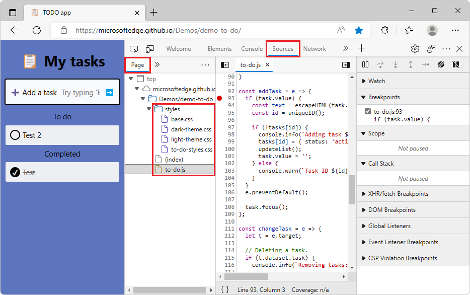
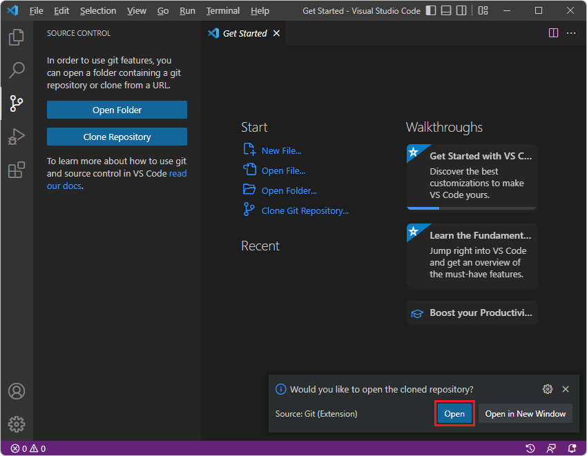
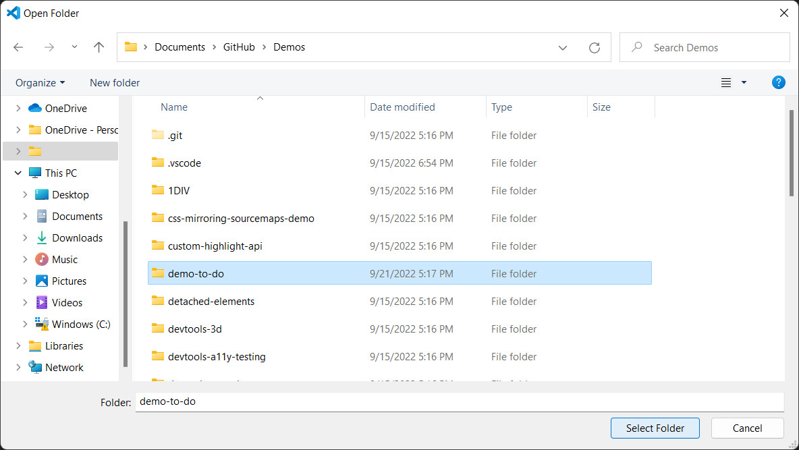

# Sample code for DevTools

Use the demos in the [MicrosoftEdge / Demos](https://github.com/MicrosoftEdge/Demos#readme) repo to learn how to use Microsoft Edge to develop webpages and web apps.
<!-- A few demos are or were at other locations, such as Glitch. -->

The Readme pages at the repo have links to the **Code**, **Demo**, and documentation.

In the repo's Readme pages, click a **Demo** link, right-click the webpage, and then select **Inspect** to open DevTools.

<!-- ====================================================================== -->
## List of samples

<!-- Jan 27, 2023 snapshot -->
The Demos repo includes the following samples.

<!-- ------------------------------ -->
#### Microsoft Edge DevTools

* **Edge DevTools VS Code extension sourcemap support** -- Simple app to test the sourcemap support for CSS mirroring in the Microsoft Edge DevTools extension for Visual studio code.

* **TODO app** -- A simple To Do app used in the Microsoft DevTools documentation.

* **Detached Elements** -- A chat-like demo application with DOM memory leaks to demonstrate how to use the **Detached Elements** tool in DevTools.

* **3D View** -- A sample web page used to demonstrate how to use the **3D View** tool in DevTools.

* **Animal Shelter** -- A sample website with accessibility issues, used to demonstrate how to use the accessibility issues detection features of DevTools.

* **DevTools Console demos** -- Multiple web pages to demonstrate various DevTools **Console** features.

* **Contrast bug fix** -- Demo page used in a Microsoft Edge blog post about improving contrast in DevTools.

* **DevTools CSS getting started docs** -- Source code for a demo page used in the DevTools CSS getting started docs.

* **DevTools DOM getting started docs** -- Source code for a demo page used in the DevTools DOM getting started docs.

* **DevTools Inspect tool docs** -- Source code for a demo page used in the DevTools **Inspect** tool docs.

* **DevTools JS getting started docs** -- Source code for a demo page used in the DevTools JavaScript getting started docs.

* **DevTools recording heap snapshots docs** -- Source code for a demo page used in the DevTools heap snapshot recording docs.

* **DevTools perf activities tabs docs** -- Source code for a demo page used in the DevTools performance activities tabs docs.

* **DevTools perf getting started docs** -- Source code for a demo page used in the DevTools performance getting started docs.

* **DevTools `:target` pseudo docs** -- Source code for a demo page used in the DevTools `:target` pseudo-class feature docs.

* **DevTools network inspection docs** -- Source code for a demo page used in the DevTools network inspection docs.

* **DevTools workspaces docs** -- Source code for a demo page used in the DevTools workspaces docs.

* **Heap snapshot visualizer** -- Source code for the Heap snapshot visualizer extension.

* **JSON Dummy Data** -- JSON data files to use with the native JSON viewer in Microsoft Edge 110+.

The Demos repo also contains other samples for development with Microsoft Edge:
* [Samples for Microsoft Edge extensions](../../extensions-chromium/samples.md)
* [Progressive Web App demos](../../progressive-web-apps-chromium/demo-pwas.md)
* [Samples for development tips for Microsoft Edge](../../web-platform/samples.md)

<!-- ====================================================================== -->
## To Do Demo

This demo To Do webpage has an `.html` file, a `.js` file, and `.css` files.

* Rendered page: [TODO app](https://microsoftedge.github.io/Demos/demo-to-do/)

* Source code: [Demos > /demo-to-do/ (Basic To Do App)](https://github.com/MicrosoftEdge/Demos/tree/main/demo-to-do)

<!-- ====================================================================== -->
## Demo webpage with accessibility issues

This demo webpage is useful for exploring various DevTools features.

1. Open the [Demo webpage with accessibility issues](https://MicrosoftEdge.github.io/Demos/devtools-a11y-testing/) in a new window or tab.

1. Right-click anywhere in the rendered webpage and then select **Inspect**.  DevTools opens next to the demo webpage.

   <!-- Or, press `F12`, `Ctrl`+`Shift`+`I` (on Windows/Linux), or `Command`+`Option`+`I` (on macOS). -->

#### Articles

These articles walk you through using this demo webpage:

* [Overview of accessibility testing using DevTools](../accessibility/accessibility-testing-in-devtools.md) - Long article with sections that demonstrate using various DevTools features to do accessibility testing, by using the "Demo webpage with accessibility issues".

* [Use the Inspect tool to detect accessibility issues by hovering over the webpage](../accessibility/test-inspect-tool.md) - One of several short articles that are derived from sections of the above article.

* [Accessibility-testing features](../accessibility/reference.md) - A list of accessibility testing features of DevTools, with links to several articles that use the "Demo webpage with accessibility issues".

#### Source code repo

This is the source code repo and its directory which stores the files for this demo webpage:

* [MicrosoftEdge/Demos > devtools-a11y-testing](https://github.com/MicrosoftEdge/Demos/tree/main/devtools-a11y-testing) - Contains files including:

   * `index.html` - The demo webpage, including page sections and input forms that send data to the `buttons.js` JavaScript file.  To view the rendered webpage, use the demo webpage link above.

   * `buttons.js` - Contains the JavaScript code that's used by the demo webpage.

   * `styles.css`, `light-theme.css`, and `dark-theme.css` - CSS files that control the presentation of the demo webpage.

   * Image files that are used in the demo webpage.

<!-- ====================================================================== -->
## Demo webpage: Debugging JavaScript with DevTools

This demo webpage is useful for exploring the **Sources** tool, especially the JavaScript debugger.

1. Open the demo webpage [Get started Debugging JavaScript with DevTools](https://MicrosoftEdge.github.io/Demos/devtools-js-get-started/) in a new window or tab.

1. Right-click anywhere in the rendered webpage and then select **Inspect**.  DevTools opens next to the demo webpage.

   <!-- Or, press `F12`, `Ctrl`+`Shift`+`I` (on Windows/Linux), or `Command`+`Option`+`I` (on macOS). -->

#### Articles

These articles or article sections walk you through using this demo webpage:

* [The basic approach to using a debugger](../sources/index.md#the-basic-approach-to-using-a-debugger) in _Sources tool overview_.  This article section briefly walks you through the steps to use the JavaScript debugger in the **Sources** tool, to find the bug in the demo webpage.  To fix the bug, you convert the input strings to numbers before adding them.

* [Get started debugging JavaScript](../javascript/index.md) - A more in-depth walkthrough of using the demo webpage along with the debugger, demonstrating various features of the debugger, and setting different kinds of breakpoints.

#### Source code repo

This is the source code repo and its directory which stores the files for this demo webpage:

* [MicrosoftEdge/Demos > devtools-js-get-started](https://github.com/MicrosoftEdge/Demos/tree/main/devtools-js-get-started) - Contains the files:

   *  `README.md` - Contains links to the rendered demo webpage and the in-depth tutorial article about using the demo webpage.

   *  `index.html` - The webpage with an input form that sends data to the JavaScript file, and that displays the result of the JavaScript.

   *  `get-started.js` - The JavaScript file that's used by the form in the demo webpage.

<!-- ====================================================================== -->
## Download or clone the Demos repo

The Demos repo is useful for following the various DevTools documentation.

#### Download the Demos repo

To download the Demos repo:

1. In a new window or tab, go to the [MicrosoftEdge / Demos](https://github.com/MicrosoftEdge/Demos#readme) repo.

1. Click the **Code** dropdown button, and then click **Download ZIP**.

   The `.zip` file is placed in your download directory.  Unzip these webpage source files into a suitable location.

To download a single directory of the Demos repo:

1. Go to [https://download-directory.github.io/](https://download-directory.github.io/) and then paste the URL [https://github.com/MicrosoftEdge/Demos/tree/main/demo-to-do](https://github.com/MicrosoftEdge/Demos/tree/main/demo-to-do).  

   The `.zip` file is placed in your download directory.  Unzip these webpage source files into a suitable location.

#### Clone the Demos repo

Cloning a repo enables updating your local copy when the repo is updated.  The GitHub UI and various tools support cloning.  We'll show cloning by using Visual Studio Code, but you can use many other coding tools, such as GitHub Desktop, Visual Studio, or git bash shell.

To clone the repo:

1. In a new window or tab, go to the [MicrosoftEdge / Demos](https://github.com/MicrosoftEdge/Demos#readme) repo.

1. If the green **Code** button isn't shown, click **Demos** in the path **Microsoft Edge** / **Demos** in the upper left to go to the main page of the repo.

1. Click the **Code** dropdown button, and then click the **Copy** button next to the URL **https://github.com/MicrosoftEdge/Demos.git**.  You can then paste the URL into git bash or a Visual Studio Code dialog, for example.

   Or, click the **Code** dropdown button, and then click **Open with Visual Studio** if it appears.  A list of **Handler Selector** items is offered, one per Visual Studio instance installed.  This option appears only if you're logged in.

   

1. In Visual Studio Code, in the Activity Bar, click the **Source Control** () button, and then click the **Clone Repository** button.

1. In the **Provide repository URL** text box, paste the copied URL: **https://github.com/MicrosoftEdge/Demos.git** and then press `Enter`.  A folder selection dialog opens.

   

1. Navigate to your desired path, such as `C:\Users\username\Documents\GitHub` or `Users/username/GitHub`, and then click the **Select Repository Location** button.

1. The message **Cloning git repository** appears, then you're prompted to open the cloned repository.  Click the **Open** button:

   

1. If prompted **Do you trust...**, click the **Yes** button.  Or, click the **No** button and continue with most parts of this walkthrough.

   The **Explorer** tree lists many demos, including **demo-to-do**.

1. In Visual Studio Code, select **File** > **Close Folder**.

1. In the Activity Bar, click the **Microsoft Edge Tools** () button.  The **Microsoft Edge Tools** pane opens.

1. In the **Microsoft Edge Tools** > **Targets** pane, click the **Open Folder** button.  The **Open Folder** dialog box opens.  Navigate to the `demo-to-do` folder in the Demo repo that you cloned, select the folder or go into it, and then click the **Select Folder** button:

   

   An example of a repo location where the **Demos** repo has been cloned is shown above.  The `demo-to-do` folder of the cloned **Demos** repo opens in the Explorer of Visual Studio Code, and no `launch.json` file exists yet:

   

See also:
* [Cloning a repository](https://docs.github.com/en/repositories/creating-and-managing-repositories/cloning-a-repository) - GitHub docs.
* [Download the WebView2Samples repo](../../webview2/how-to/machine-setup.md#download-the-webview2samples-repo) in _Set up your Dev environment for WebView2_.
* [Clone the WebView2Samples repo](../../webview2/how-to/machine-setup.md#clone-the-webview2samples-repo) in _Set up your Dev environment for WebView2_.

<!-- ====================================================================== -->
## URL patterns for rendered demo webpages and source code

To convert between the URL for a rendered demo webpage and the URL for the source code at GitHub, the patterns are as follows.

#### Pattern

*  URL for the rendered demo webpage: `https://[org].github.io/[repo]/[path]`

*  URL for the webpage's source code: `https://github.com/[org]/[repo]/tree/main/[path]`

Not case-sensitive.

#### Example

*  URL for the rendered demo webpage: `https://MicrosoftEdge.github.io/Demos/devtools-a11y-testing/`

*  URL for the webpage's source code: `https://github.com/MicrosoftEdge/Demos/tree/main/devtools-a11y-testing/`

*  Org = `MicrosoftEdge`
*  Repo = `Demos`
*  Path = `/devtools-a11y-testing/`

<!-- ====================================================================== -->
## See also

* [Download the WebView2Samples repo](../../webview2/how-to/machine-setup.md#download-the-webview2samples-repo) in _Set up your Dev environment for WebView2_.
* [Clone the WebView2Samples repo](../../webview2/how-to/machine-setup.md#clone-the-webview2samples-repo) in _Set up your Dev environment for WebView2_.
* [Step 5: Clone the Demos repo](../../visual-studio-code/microsoft-edge-devtools-extension/install.md#step-5-clone-the-demos-repo) in _Installing the DevTools extension for Visual Studio Code_.
* [Step 6: Set up a localhost server](../../visual-studio-code/microsoft-edge-devtools-extension/install.md#step-6-set-up-a-localhost-server) in _Installing the DevTools extension for Visual Studio Code_.
* [Cloning a repository](https://docs.github.com/en/repositories/creating-and-managing-repositories/cloning-a-repository) - GitHub docs.
