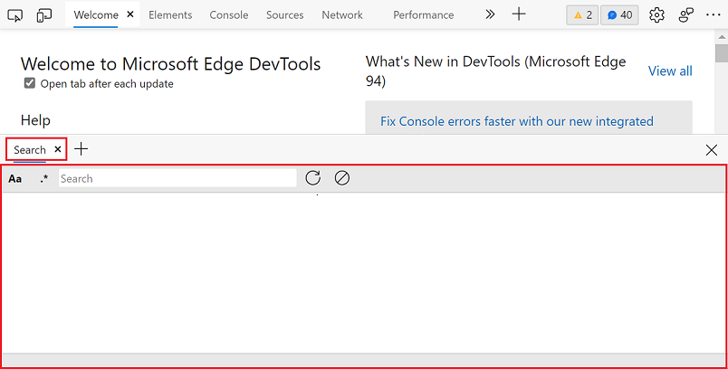
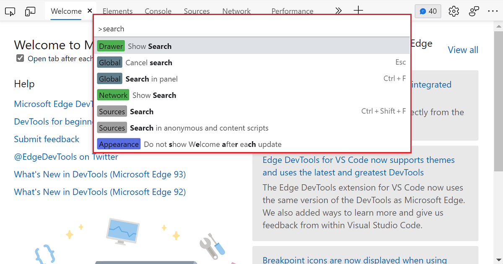
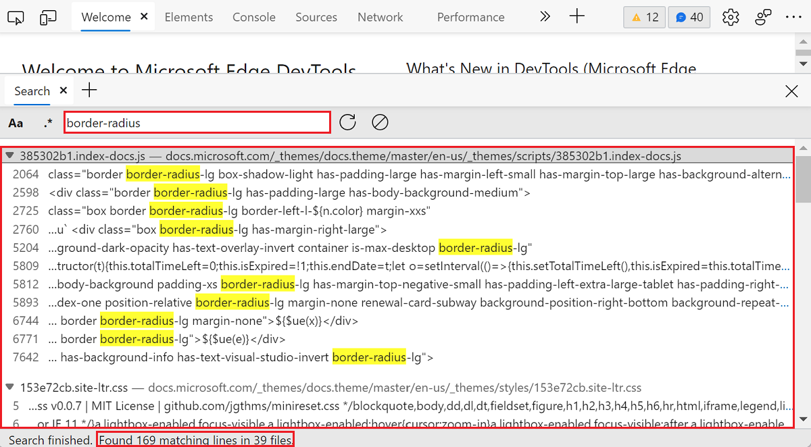
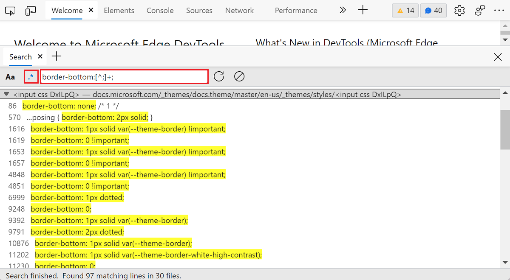
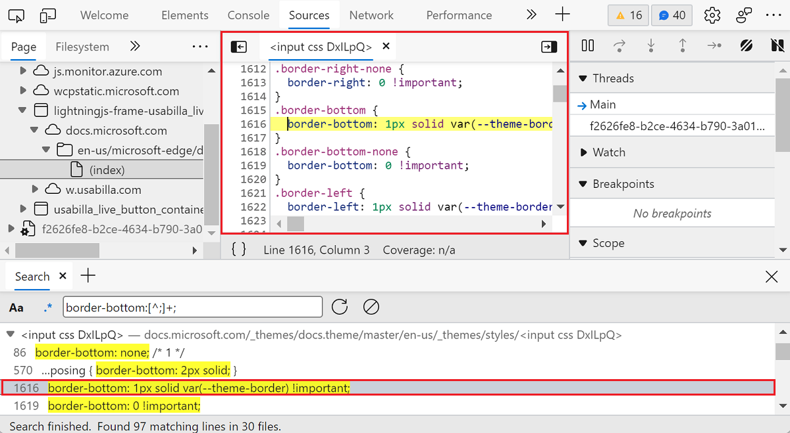

# Find source files for a page using the Search tool

Use the **Search** tool to find specific source files for a webpage, including HTML, CSS, JavaScript, and image files.

A webpage is mainly an HTML file that's used by the browser to display content.  But webpages commonly require other resources in addition to the HTML file, such as CSS, JavaScript, or image files, to provide richer content.

In the **Sources** tool, the **Page** tab of the [Navigator pane](../sources/index.md#using-the-navigator-pane-to-select-files) shows all the resources that are downloaded by a webpage.  But when there are many resources, it can become useful to _search_ through them.  To do text and regular expression searches across all the resources of a webpage, use the **Search** tool.

<!-- ====================================================================== -->
## Open the Search tool by using a keyboard shortcut

To quickly open the **Search** tool:

1. To open DevTools, right-click the webpage, and then select **Inspect**.  Or, press `Ctrl`+`Shift`+`I` (Windows, Linux) or `Command`+`Option`+`I` (macOS).  DevTools opens.

1. In DevTools, press **Esc** to open the Drawer, and then on the Drawer toolbar, select the **Search** tab.  If that tab isn't visible, click the **More tabs** () button, or else the **More Tools** () button.

   Or, press `Ctrl`+`Shift`+`F` (Windows, Linux) or `Command`+`Option`+`F` (macOS).

The **Search** tool appears in the **Drawer**, with a search toolbar:

See also [Global keyboard shortcuts](../shortcuts/index.md#global-keyboard-shortcuts).

<!-- ====================================================================== -->
## Open the Search tool by using the Command Menu

To open the **Search** tool from the **Command Menu**:

1. To open DevTools, right-click the webpage, and then select **Inspect**.  Or, press `Ctrl`+`Shift`+`I` (Windows, Linux) or `Command`+`Option`+`I` (macOS).  DevTools opens.

1. Open the [Command Menu](../command-menu/index.md), by pressing `Ctrl`+`Shift`+`P` (Windows, Linux) or `Command`+`Shift`+`P` (macOS).

1. Type `search`, and then press **Enter**.

<!-- ====================================================================== -->
## Search for text

To search for text in the current webpage and its resource files:

1. Put focus the search input field.
1. Enter the text that you want to search for, and then press **Enter**.

The **Search** tool shows the list of matching resources, and highlights the corresponding lines of text.  The number of matching files and lines is also indicated at the bottom of the tool.

<!-- The search results are pretty-printed. -->

<!-- ====================================================================== -->
## Match case (lowercase or uppercase characters)

By default, the **Search** tool isn't case-sensitive.  A search for a term matches occurrences of that term, regardless of lowercase or uppercase characters.

To only find results that match a particular case (lowercase or uppercase characters), click the **Match Case** (`Aa`) button in the search toolbar.

<!-- ====================================================================== -->
## Search for regular expressions

You can use regular expressions to find matching results.  To use a regular expression, click the **Use Regular Expression** (`.*`) button in the toolbar and enter a valid [JavaScript regular expression](https://developer.mozilla.org/docs/Web/JavaScript/Guide/Regular_Expressions) in the search input field.

The forward slash (`/`) characters that normally delimit regular expressions patterns in JavaScript aren't needed.

Similarly, flags that optionally appear after the closing forward slash (`/`) in JavaScript regular expressions can't be used here. The **Search** tool matches results as if the `g`, `i`, and `m` regular expression flags had been provided:

| Flag | Name | Description |
|---|---|---|
| `g` | Global | The search is global: the tool will continue searching files even after a first match has been found, as if the regular expression `g` flag had been provided. |
| `i` | Ignore case | The search ignores casing by default, as if the `i` flag had been provided. To disable this flag and only find results that match a particular case, click the **Match Case** (**Aa**) button in the search toolbar. |
| `m` | Multiline | The search is multiline: the tool treats each line in the source files independently and the `^` and `$` symbols match the start and end of any line, respectively, as if the `m` flag had been provided. |

See also:
* [Regular expressions](https://developer.mozilla.org/docs/Web/JavaScript/Guide/Regular_Expressions) at MDN.

<!-- ====================================================================== -->
## Open a found file in the Sources tool

After doing a search, click a result line to open the corresponding file.  The **Sources** tool opens in the main panel and loads the resource file, scrolled to the matching line.

<!-- ====================================================================== -->
## Update search results

A webpage can continue to request resources after it has finished loading, so the results displayed in the **Search** panel may become stale after a while.

To update the search results, do either of the following:
*  Search again by typing a term in the search input field.
*  Click the **Refresh** () button in the toolbar.

<!-- ====================================================================== -->
## Clear a search

To clear the search results, click the **Clear** () button in the toolbar.
