<!-- Copyright Jecelyn Yeen

   Licensed under the Apache License, Version 2.0 (the "License");
   you may not use this file except in compliance with the License.
   You may obtain a copy of the License at

       https://www.apache.org/licenses/LICENSE-2.0

   Unless required by applicable law or agreed to in writing, software
   distributed under the License is distributed on an "AS IS" BASIS,
   WITHOUT WARRANTIES OR CONDITIONS OF ANY KIND, either express or implied.
   See the License for the specific language governing permissions and
   limitations under the License.  -->
# What's New in DevTools (Microsoft Edge 91)

[!INCLUDE [contact DevTools team note](../../includes/edge-whats-new-note.md)]


<!-- ====================================================================== -->
## Wavy underlines highlight code issues and improvements in Elements tool

<!--  Title: Get code hints in Elements tool  -->
<!--  Subtitle: Wavy underlines like the ones you see in Visual Studio Code now display in the Elements tool.  Underlines alert you to code issues related to accessibility, compatibility, security, performance, and  so on.  -->

In most modern IDEs, wavy underlines under text indicate syntax errors.   In Microsoft Edge version 91 or later, wavy underlines display under HTML in the **DOM** view of the **Elements** tool.  The wavy underlines indicate code issues and suggestions related to accessibility, compatibility, performance, and so on.  For more information about how to view and edit issues, see [Find and fix problems using the Issues tool](../../../issues/index.md).

To open the **Issues** tool and learn more about the issue and how to fix it:

* Press and hold `Shift`, and then click a wavy underline.

* Or, right-click a wavy underline, and then select **Show in Issues**.

Selecting the underlined error in the **Elements** tool:

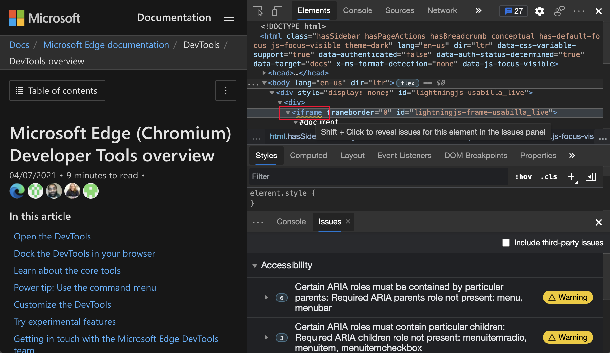

Displaying error details in the **Issues** tool:

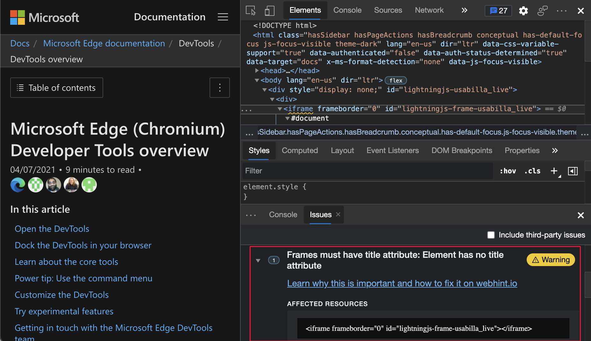

<!--
See also:
* []()
* []()
-->


<!-- ====================================================================== -->
## Learn about DevTools with informative tooltips


<!--  Title: Learn more about DevTools with DevTools Tooltips  -->
<!--  Subtitle: Informative overlays are now available in the default DevTools interface.  -->

The DevTools Tooltips feature helps you learn about all the different tools and panes in DevTools.  To turn off Tooltips, press `Esc`.  To turn on Tooltips, do one of the following: 

*  Press `Ctrl`+`Shift`+`H` (Windows/Linux) or `Cmd`+`Shift`+`H` (macOS).
*  [Open the Command Menu](../../../command-menu/index.md#open-the-command-menu) and then type `tooltips`.
*  Select **Customize and control DevTools** (`...`) > **Help** > **Toggle the DevTools Tooltips**.

Also, if you turn on the [Focus Mode and DevTools Tooltips](../02/devtools.md#group-tools-together-in-focus-mode) experiment, you can also click the **Toggle the DevTools Tooltips** (`?`) button at the bottom of the **Activity Bar**.

To display more information about how to use the DevTools, turn on Tooltips, and then hover on each outlined region of the DevTools.

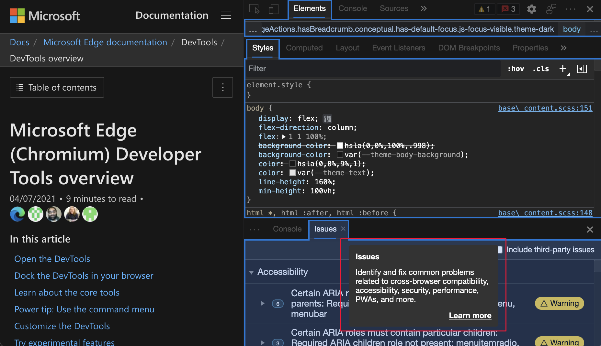

<!--
See also:
* []()
* []()
-->


<!-- ====================================================================== -->
## Service worker update timeline

<!--todo:  Update the linked [Service Worker improvements](../../../service-workers/index.md) article.  -->

<!--  Title: The tasks associated with your Service Worker  -->
<!--  Subtitle: Debug with Service Worker Update Cycle  -->

In Microsoft Edge version 91 or later, if you're a Progressive Web App or Service Worker developer, display the update lifecycle of your Service Workers as a timeline in the **Application** tool.  This feature helps you understand the time your Service Worker spends in each of the following stages.

*  **Install**
*  **Wait**
*  **Activate**

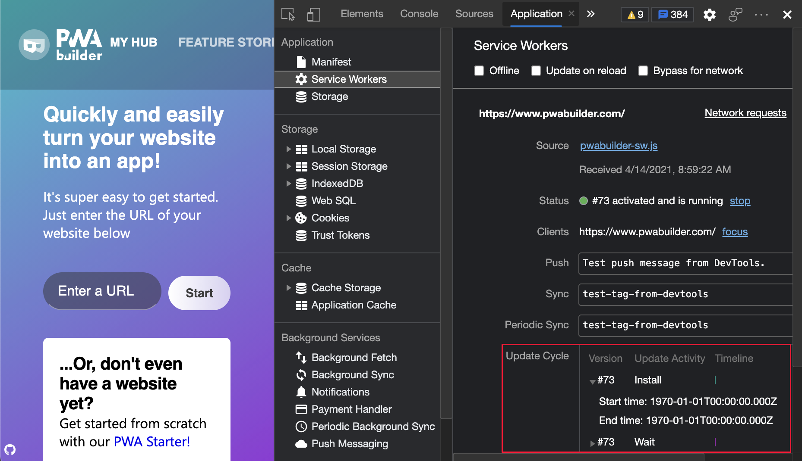

For more information about the lifecycle of your Service Workers, see [The Service Worker lifecycle](../../../../progressive-web-apps-chromium/how-to/service-workers.md#the-service-worker-lifecycle).  For more information about debugging tools for Progressive Web Apps and Service Workers in the DevTools, see [Service Worker improvements](../../../service-workers/index.md).  For real-time updates on this feature in the Chromium open-source project, see Issue [1066604](https://crbug.com/1066604).

<!--
See also:
* []()
* []()
-->


<!-- ====================================================================== -->
## Progressive Web Apps no longer display warnings for non-square icons

<!--  Title: Non-square icons in app manifest no longer produce warnings  -->
<!--  Subtitle: As long as square icons are included in the app manifest, non-square icons no longer produce warnings  -->

In [Microsoft Edge version 90](../02/devtools.md) or earlier, if the Web App Manifest of your PWA included a non-square icon, a warning was displayed in the **Errors and Warnings**  section for each non-square icon.  In Microsoft Edge version 91 or later, the **Manifest** section in the **Application** tool displays no warnings if you provide at least one square icon.  If you don't provide any square icons, the following warning message appears:

```output
Most operating systems require square icons.  Please include at least one square icon in the array.
```

In Microsoft Edge version 90 or earlier, an error is displayed for each icon that is non-square:

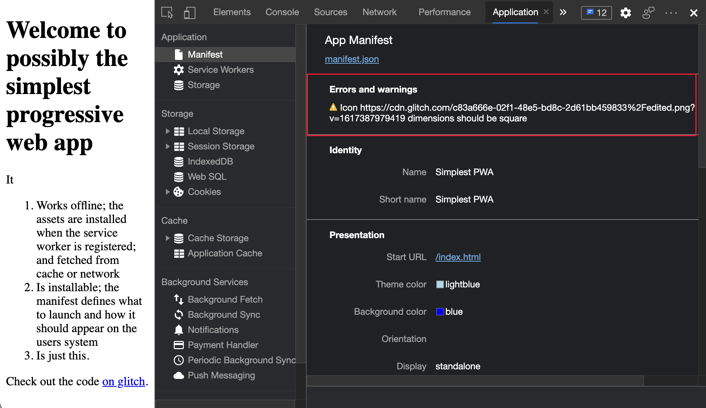

In Microsoft Edge version 91 or later, no error is displayed when you provide at least one square icon:

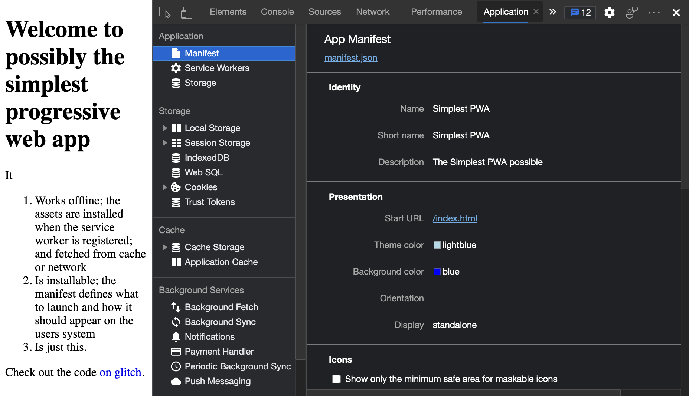

To view errors and warnings in your Web App Manifest, select **Application** tool > **Application** section > **Manifest**.  Errors and warnings are listed under the **Errors and Warnings** heading.  For more information about the Web App Manifest, see [Use the Web App Manifest to integrate your Progressive Web App into the Operating System](../../../../progressive-web-apps-chromium/how-to/web-app-manifests.md).  To create icons to include in your Web App Manifest, go to the [PWABuilder Image Generator](https://www.pwabuilder.com/imageGenerator).  For real-time updates on this feature in the Chromium open-source project, see Issue [1185945](https://crbug.com/1185945).

<!--
See also:
* []()
* []()
-->


<!-- ====================================================================== -->
## Localized DevTools now supported in Chromium-based browsers

<!--  Title: Localization for all  -->
<!--  Subtitle: Match browser language enabled to all Chromium-based browsers  -->

Starting in [Microsoft Edge version 81](../../2020/01/devtools.md#using-the-devtools-in-other-languages), the Microsoft Edge DevTools UI is displayed in your own language.  Many developers use other developer tools like StackOverflow and Visual Studio Code in their native language, not just in English.  The Microsoft Edge DevTools team, Chrome DevTools team, and the Google Lighthouse team collaborated to provide the same experience in all Chromium-based browsers.  For more information about how to use DevTools in your language, see [Change DevTools language settings](../../../customize/localization.md).  For more information about the collaboration on this feature in the Chromium open-source project, see Issue [1136655](https://crbug.com/1136655).

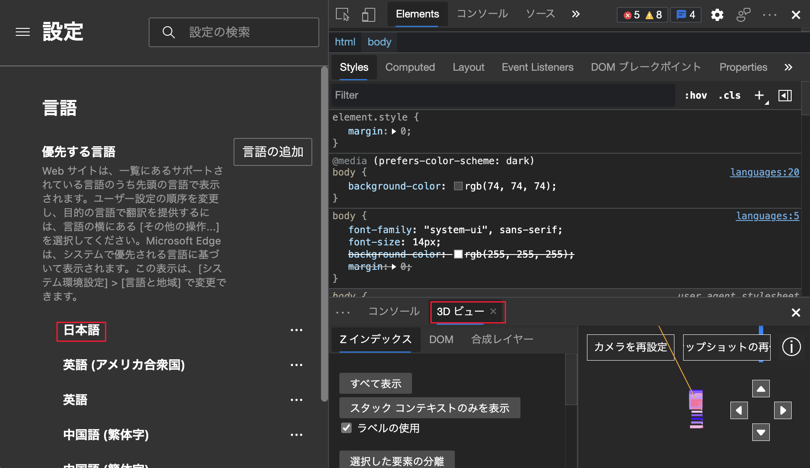

<!--
See also:
* []()
* []()
-->


<!-- ====================================================================== -->
## Use the keyboard to navigate to CSS variables

<!--  Title: Navigate to CSS variables with the arrow keys  -->
<!--  Subtitle: In the Styles pane, use the arrow keys to select CSS variables.  Press `Enter` to see the variable definition.  -->

Starting in [Microsoft Edge version 88](../../2020/11/devtools.md#css-variable-definitions-in-styles-pane), the **Styles** pane displays CSS variables and provides a link directly to the definition of each variable.  In Microsoft Edge version 91 or later, you can use the arrow keys to easily navigate to CSS variables.  To open the definition in the **Styles** pane, hover on a variable, and then press `Enter`.  For more information about CSS variables, see [Using CSS custom properties (variables)](https://developer.mozilla.org/docs/Web/CSS/Using_CSS_custom_properties).  For real-time updates on this feature in the Chromium open-source project, see Issue [1187735](https://crbug.com/1187735).

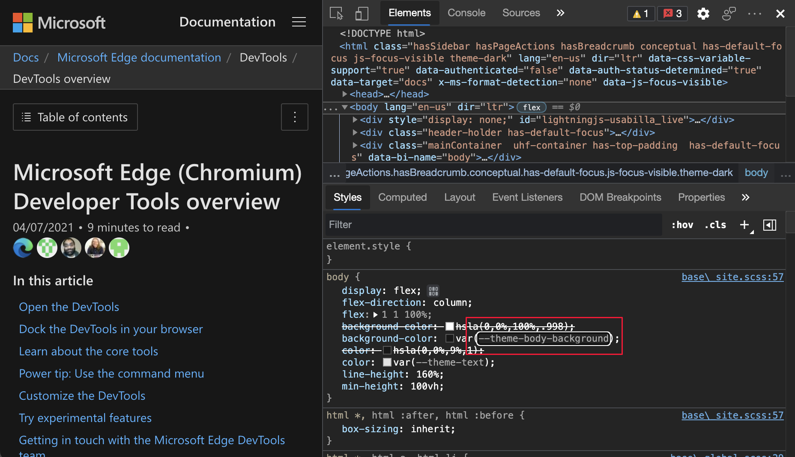

<!--
See also:
* []()
* []()
-->


<!-- ====================================================================== -->
## Issues are automatically sorted by severity

<!-- Title: Display Issues in severity order  -->
<!-- Subtitle: Entries in the Issues tool now display in severity order and allow you to focus your updates on the most important issues. -->

The **Issues** tool displays recommendations to improve your website, including accessibility, performance, security, and so on. Based on your feedback, issues are now automatically sorted by severity.  In each feedback category, each issue marked as an **Error** appears first, followed each issue marked as a **Warning**, then each issue marked as a **Tip**.  To help you refine your issues, extra filter options are planned for a future update.

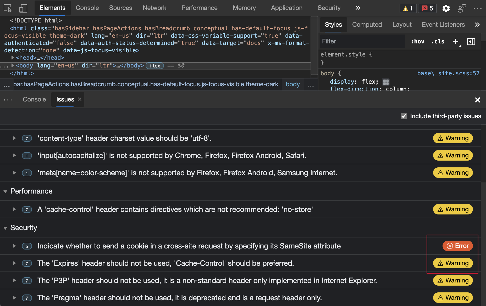

For more information, see [Find and fix problems using the Issues tool](../../../issues/index.md).

<!--
See also:
* []()
* []()
-->


<!-- ====================================================================== -->
## Microsoft Edge Developer Tools for Visual Studio Code version 1.1.7

<!-- Title: Microsoft Edge DevTools for Visual Studio version 1.1.7  -->
<!-- Subtitle: Increased target closure reliability, automatically update the side panel, new right-click menu for settings and Changelog, and more. -->

The [Microsoft Edge Tools for Visual Studio Code extension](https://marketplace.visualstudio.com/items?itemName=ms-edgedevtools.vscode-edge-devtools) version 1.1.7 provides the DevTools from [Microsoft Edge version 88](../../2020/11/devtools.md).  This extension now supports ARM devices and no longer depends on the [Debugger for Microsoft Edge](https://marketplace.visualstudio.com/items?itemName=msjsdiag.debugger-for-edge) extension.  Version 1.1.7 includes the following bug fixes and improvements.

*  Updated the reliability of target closure.

*  Updated the side panel to automatically refreshes when you debug targets that are created or destroyed.

*  Added a new right-click menu that gives you faster access to the extension settings and the latest Changelog.

*  Updated and simplified the release of extension documentation including the newest features.

To manually update to version 1.1.7, see [Update an extension manually](https://code.visualstudio.com/docs/editor/extension-gallery#_update-an-extension-manually).  You can file issues and contribute to the extension on the [vscode-edge-devtools GitHub repo](https://github.com/microsoft/vscode-edge-devtools).

<!--
See also:
* []()
* []()
-->


<!-- ====================================================================== -->
## Announcements from the Chromium project

[!INCLUDE [contact DevTools team note](../../includes/chromium-whats-new-note.md)]


<!-- ====================================================================== -->
### Visualize CSS scroll-snap

You can now toggle the `scroll-snap` badge in the **Elements** tool to inspect the CSS scroll-snap alignment.  When an HTML element on your webpage has `scroll-snap-type` applied to it, a `scroll-snap` badge is displayed next to it in the **Elements** tool.  Click the badge to turn on (or off) the display of a scroll-snap overlay on the webpage.

For an example webpage, see [Scroll Snap Demo](https://mathiasbynens.github.io/css-dbg-stories/css-scroll-snap.html).  In the example, dots appear on snap edges.  The scroll port has a solid outline, while the snap items have dashed outlines.  The scroll padding is filled-in green, while the scroll margin is filled-in orange.

<!-- You can view the source files for the Scroll Snap demo at the [mathiasbynens/css-dbg-stories](https://github.com/mathiasbynens/css-dbg-stories) repo. -->

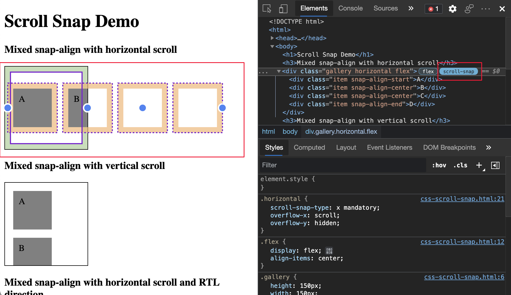

For the history of this feature in the Chromium open-source project, see Issue [862450](https://crbug.com/862450).

<!--
See also:
* []()
* []()
-->


<!-- ====================================================================== -->
### New Memory Inspector tool

Use the new **Memory Inspector** tool to inspect an `ArrayBuffer` in JavaScript and Wasm memory.  Open the [Memory in JS](https://memory-inspector.glitch.me/demo-js.html) demo webpage. That webpage presents instructions similar to the following.  In the **Sources** tool, open the `memory-write-wasm` file, and set a breakpoint at line 18 (`0x03c`).  Refresh the webpage.  Expand the **Scope** section in the debugger pane.  The new icon is displayed next to the **buffer** value.  Click it to open the new **Memory Inspector** tool.  See [Inspect a JavaScript ArrayBuffer with the Memory Inspector tool](../../../memory-inspector/memory-inspector-tool.md).

To learn more about debugging in the **Sources** tool, see [Using the Debugger pane to debug JavaScript code](../../../sources/index.md#using-the-debugger-pane-to-debug-javascript-code).

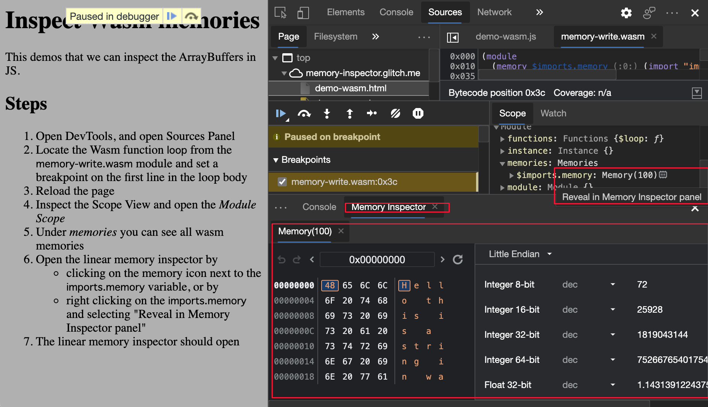

For the history of this feature in the Chromium open-source project, see Issue [1166577](https://crbug.com/1166577).

See also:
* [Inspect a JavaScript ArrayBuffer with the Memory Inspector tool](https://docs.microsoft.com/en-us/microsoft-edge/devtools-guide-chromium/memory-inspector/memory-inspector-tool)


<!-- ====================================================================== -->
### New Badge settings pane in the Elements tool

Now, use the **Badge settings** in the **Elements** tool to turn on (or off) individual badges.  Use this feature to customize and stay focused on important badges while you inspect webpages.  To display the badge settings pane at the top of the **Elements** tool:

1. Right-click an element and then click **Badge settings**.

1. To display (or hide) the badges, select (or clear) the checkbox next to the badge name.

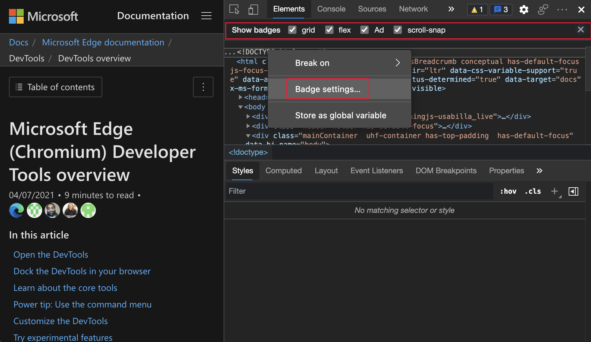

<!--
For the history of this feature in the Chromium open-source project, see Issue [1066772](https://crbug.com/1066772).
-->

<!--
See also:
* []()
* []()
-->


<!-- ====================================================================== -->
### Enhanced image preview with aspect ratio information

Image previews in the DevTools have been enhanced to display more information, including the following details:

*  Rendered size
*  Rendered aspect ratio
*  Intrinsic size
*  Intrinsic aspect ratio
*  File size

The  information helps you better understand your images and apply optimization.  The image aspect ratio information is also available in the **Network** tool, when you click an image preview.

In the **Elements** tool, image preview now displays more information about the image, including aspect ratio:

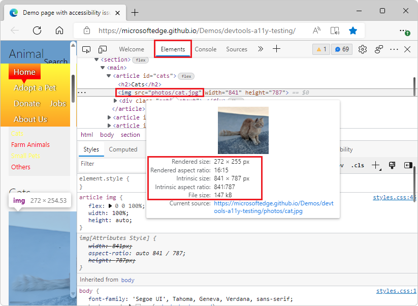

Also, the image aspect ratio information is available in the **Network** tool, when you click an image preview:

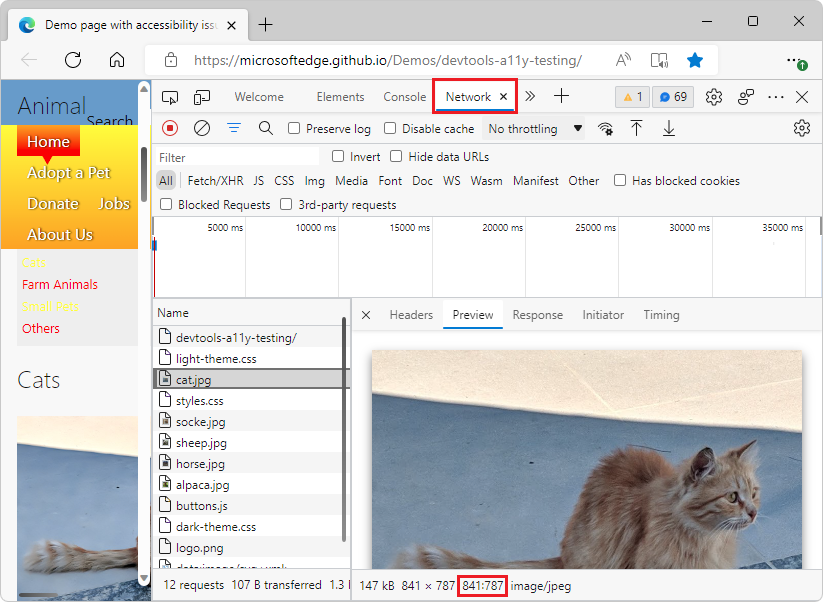

For the history of this feature in the Chromium open-source project, see Issues [1149832](https://crbug.com/1149832) and [1170656](https://crbug.com/1170656).

<!--
See also:
* []()
* []()
-->


<!-- ====================================================================== -->
### New options to configure Content-Encodings in the Network conditions tool

In the **Network** tool, click the new **More network conditions...** button next to the **Throttling** dropdown menu to open the **Network conditions** tool.  To test if server responses are correctly encoded for browsers that don't support [gzip](https://www.gnu.org/software/gzip/manual), [brotli](https://www.brotli.org), or another future `Content-Encoding`:

1. Open the **Network conditions** tool

1. Go to **Accepted Content-Encodings**.

1. Clear the checkbox next to the `Content-Encoding` you want to test.

For the history of this feature in the Chromium open-source project, see Issue [1162042](https://crbug.com/1162042).

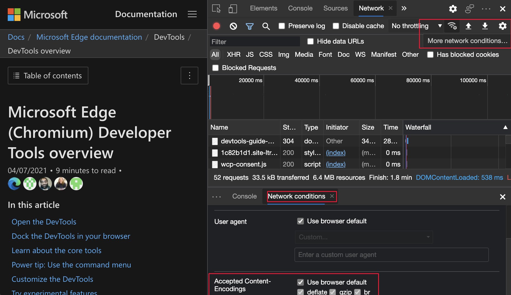

<!--
See also:
* []()
* []()
-->


<!-- ====================================================================== -->
### Styles pane enhancements

<!--
See also:
* []()
* []()
-->


<!-- ====================================================================== -->
#### New shortcut to display computed value in the Styles pane

Now, to display the computed CSS value in the **Styles** pane:

1. Right-click a CSS property and then select **View computed value**.

To view the history of this feature in the Chromium open-source project, see Issue [1076198](https://crbug.com/1076198).

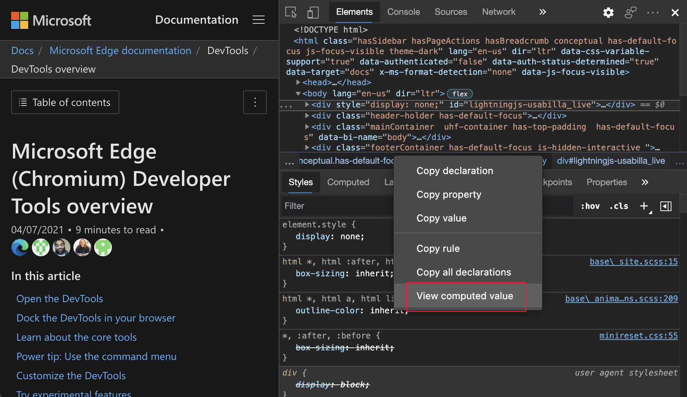

<!--
See also:
* []()
* []()
-->


<!-- ====================================================================== -->
#### Support for the accent-color keyword

The autocomplete UI of the **Styles** pane now detects the `accent-color` CSS keyword, which allows you to specify the accent color for UI controls generated by the element.  Examples of UI controls that are generated by an element include checkboxes or radio buttons. For more information about the status of the Chromium implementation, see [Feature: accent-color CSS property](https://chromestatus.com/feature/4752739957473280).  To turn on this feature, go to `edge://flags#enable-experimental-web-platform-features` and set the checkbox to **Enabled**.

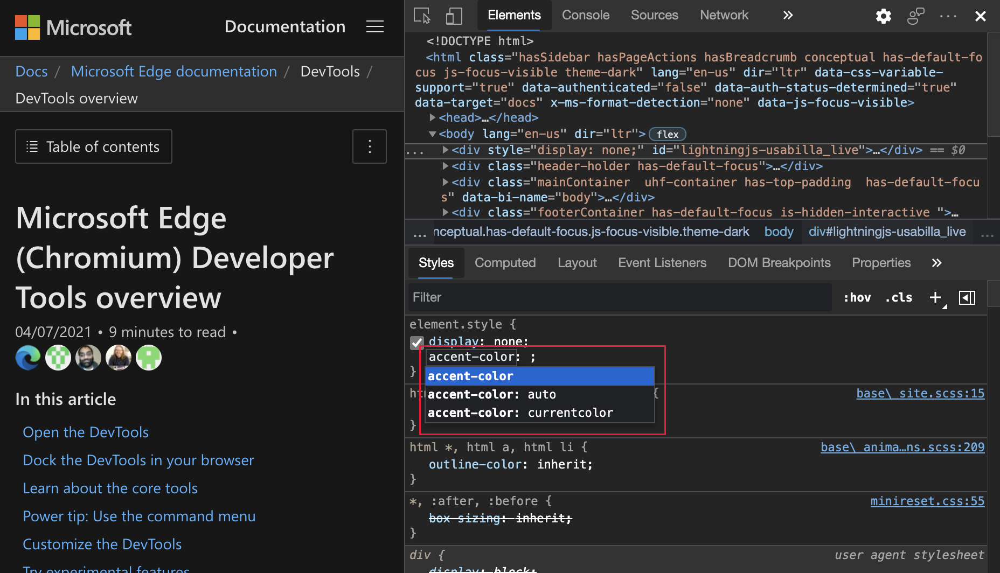

For the history of this feature in the Chromium open-source project, see Issue [1092093](https://crbug.com/1092093).

<!--
See also:
* []()
* []()
-->


<!-- ====================================================================== -->
### Display details about blocked features in the Frame details view

Permissions Policy is a web platform API that gives a website the ability to allow or block the use of browser features in an individual frame or in an `iframe` that it embeds.
 See [Permissions Policy Explainer](https://github.com/w3c/webappsec-permissions-policy/blob/main/permissions-policy-explainer.md).  To display the details on why a feature is blocked:

1. Go to [OOPIF Permissions Policy](http://permission-policy-demo.glitch.me).
1. Open the **Application** tool.
1. Click a frame.
1. Go to the **Permissions Policy** section.
1. Locate the **Disabled Features** property.
1. Click **Show details**.
1. Click the icon next to each policy to go to the `iframe` or network request that blocked the feature.

To view the history of this feature in the Chromium open-source project, see Issue [1158827](https://crbug.com/1158827).

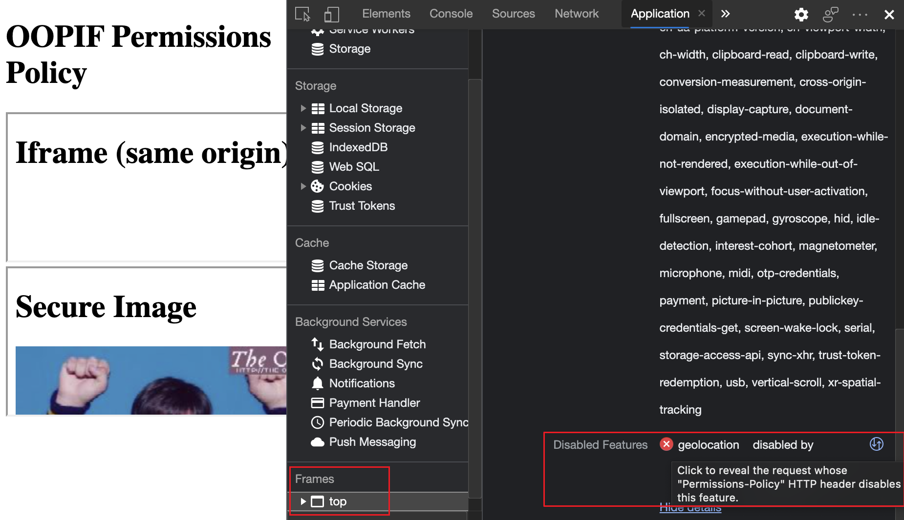

<!--
See also:
* []()
* []()
-->


<!-- ====================================================================== -->
### Filter experiments in the Experiments setting

Find experiments quicker with the new experiment filter.  For example, to turn on new experiments for code issues:
``

1. Select **Settings** > **Experiments**.
1. In the **Filter** text box, type `issues`.

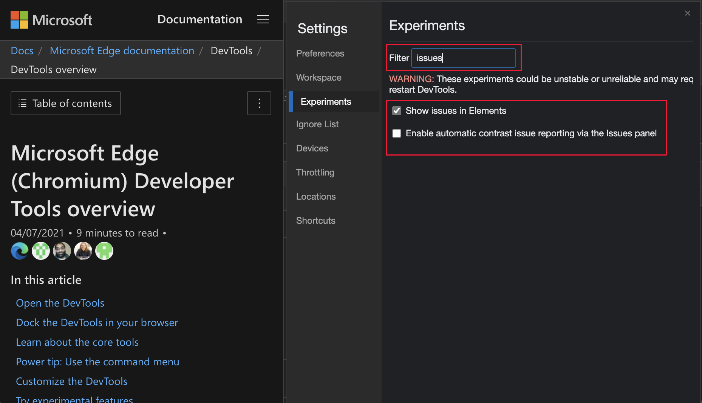

<!--
See also:
* []()
* []()
-->


<!-- ====================================================================== -->
### New Vary Header column in the Cache storage pane

Use the new `Vary Header` column in the **Cache Storage** pane to display the [Vary](https://httpwg.org/specs/rfc7231.html#header.vary) HTTP response header values:

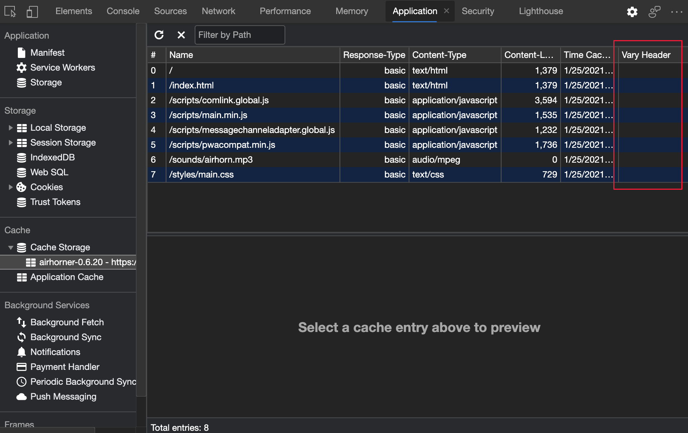

For the history of this feature in the Chromium open-source project, see Issue [1186049](https://crbug.com/1186049).

<!--
See also:
* []()
* []()
-->


<!-- ====================================================================== -->
### Sources tool improvements

<!--
See also:
* []()
* []()
-->


<!-- ====================================================================== -->
#### Support for new JavaScript features

DevTools now support the new [Private brand checks a.k.a. #foo in obj](https://v8.dev/features/private-brand-checks) JavaScript language feature.  The private brand checks feature extends the [in operator](https://developer.mozilla.org/docs/Web/JavaScript/Reference/Operators/in) to support [Private class fields](https://v8.dev/features/class-fields#private-class-fields) on a specific object.  Try it in the **Console** and **Sources** tools.  Also, to inspect the private fields:

1. Go to the **debugger** pane.
1. Locate the **Scope** section.

For the history of this feature in the Chromium open-source project, see Issue [11374](https://crbug.com/v8/11374).

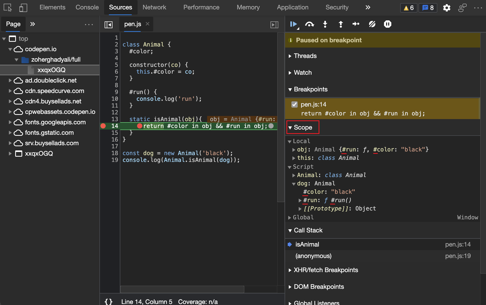

<!--
See also:
* []()
* []()
-->


<!-- ====================================================================== -->
#### Enhanced support for breakpoints debugging

In Microsoft Edge version 90 or earlier, DevTools only set breakpoints in a single bundle.  In Microsoft Edge version 91 or later, DevTools properly sets breakpoints in multiple bundles when you debug a shared component.

Modern JavaScript bundlers like [Webpack](https://webpack.js.org), and [Rollup](https://rollupjs.org) support code splitting.  To learn more about code splitting, see [Code splitting](https://webpack.js.org/guides/code-splitting/#:~:text=There%20are%20three%20general%20approaches%20to%20code%20splitting,Split%20code%20via%20inline%20function%20calls%20within%20modules.).  

For the history of this feature in the Chromium open-source project, see Issues [1142705](https://crbug.com/1142705), [979000](https://crbug.com/979000), and [1180794](https://crbug.com/1180794).

<!--
See also:
* []()
* []()
-->


<!-- ====================================================================== -->
#### Support hover preview with bracket notation

DevTools now support hover preview on JavaScript member expressions that use the `[]` notation in the **Sources** tool:

![Support hover preview with [] notation.](../../media/2021/04/sources-page-pen.js-breakpoint-arr-i-a.msft.png)

For the history of this feature in the Chromium open-source project, see Issue [1178305](https://crbug.com/1178305).

<!--
See also:
* []()
* []()
-->


<!-- ====================================================================== -->
#### Improved outline of HTML files

DevTools now has better outline support for `.html` files.  In the **Sources** tool, open the `.html` file.  To turn on (or off) the code outline, press `Ctrl`+`Shift`+`O` on Windows/Linux or `Cmd`+`Shift`+`O` on macOS.  Previously, DevTools only displayed some of the functions.  In the following figure, DevTools now correctly list all functions in the outline:

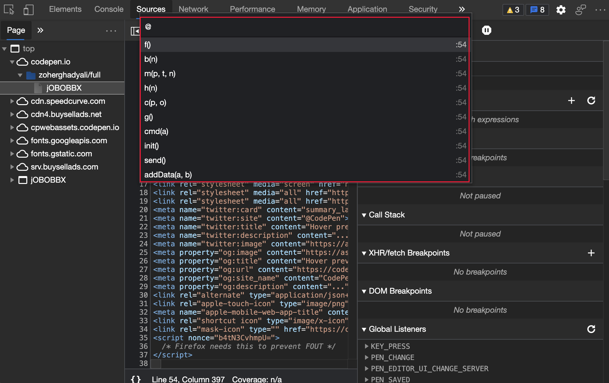

For the history of this feature in the Chromium open-source project, see Issues [761019](https://crbug.com/761019) and [1191465](https://crbug.com/1191465).

<!--
See also:
* []()
* []()
-->


<!-- ====================================================================== -->
#### Proper error stack traces for Wasm debugging

In Microsoft Edge version 90 or earlier, DevTools only displayed generic Wasm references in Error stack traces.  In Microsoft Edge version 91 or later, DevTools resolves inline function requests and displays the source location in Error stack traces for Wasm debugging.  To learn more about Error stack traces in the **Console**, see [error](../../../console/api.md#error).

In Microsoft Edge version 91 or later, DevTools resolves inline function requests and displays proper error stack traces for Wasm debugging.

In Microsoft Edge version 90 and earlier, the source location isn't displayed in the Error stack traces.  Source locations include `dsquare`.  Previous error stack traces for Wasm debugging:

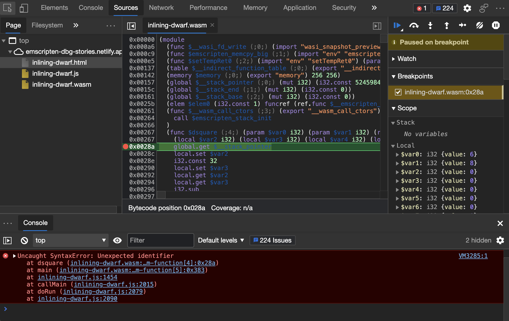

In Microsoft Edge version 91 and later, the source location is displayed in the Error stack traces.  Proper error stack traces for Wasm debugging:

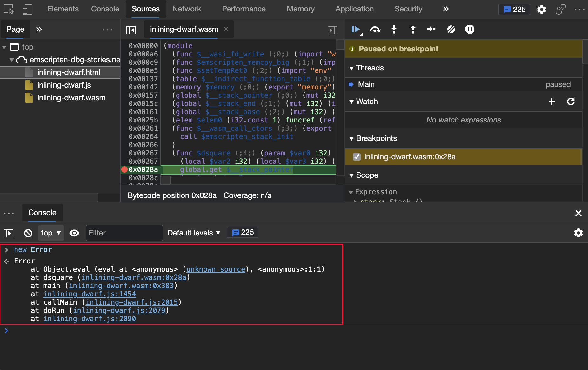

For the history of this feature in the Chromium open-source project, see Issue [1189161](https://crbug.com/1189161).

<!--
See also:
* []()
* []()
-->


<!-- ====================================================================== -->
## Download the Microsoft Edge preview channels

If you are on Windows, Linux, or macOS, consider using the [Microsoft Edge preview channels](https://www.microsoftedgeinsider.com/download) as your default development browser.  The preview channels give you access to the latest DevTools features.


<!-- ====================================================================== -->
> [!NOTE]
> Portions of this page are modifications based on work created and [shared by Google](https://developers.google.com/terms/site-policies) and used according to terms described in the [Creative Commons Attribution 4.0 International License](https://creativecommons.org/licenses/by/4.0).
> The original page is found [here](https://developer.chrome.com/blog/new-in-devtools-91) and is authored by [Jecelyn Yeen](https://developers.google.com/web/resources/contributors#jecelyn-yeen) (Developer advocate, Chrome DevTools).

[](https://creativecommons.org/licenses/by/4.0)
This work is licensed under a [Creative Commons Attribution 4.0 International License](https://creativecommons.org/licenses/by/4.0).
