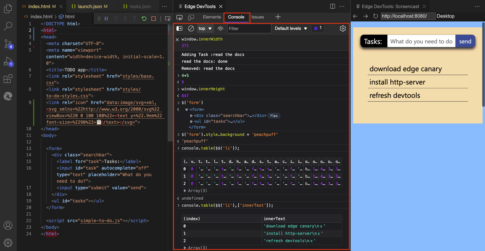
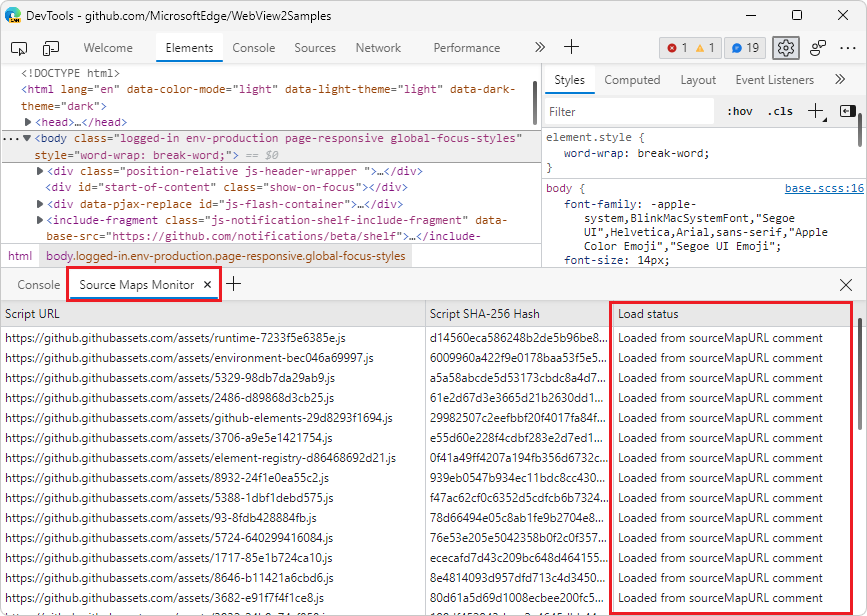
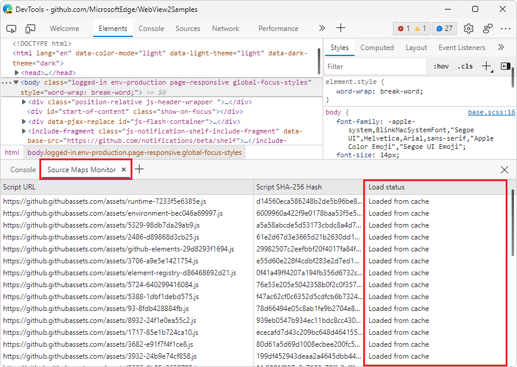
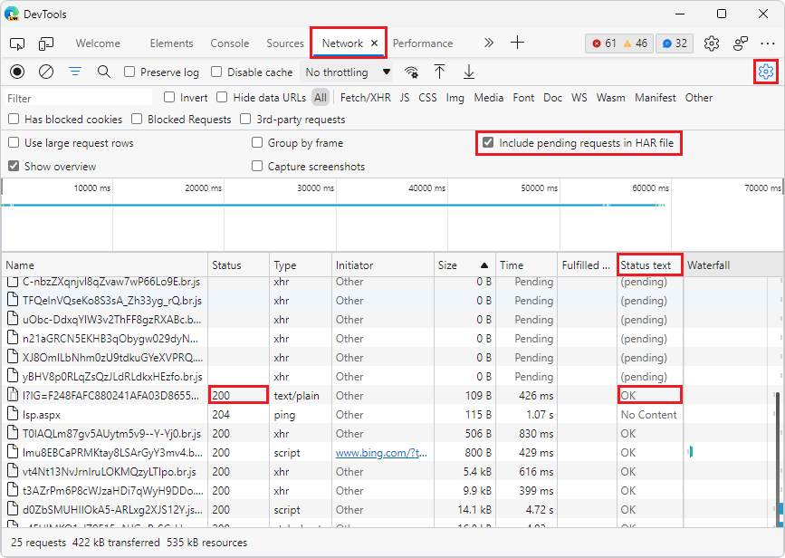
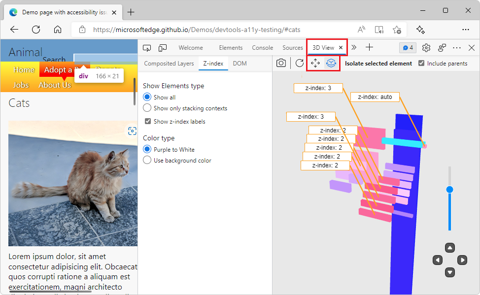

# What's New in DevTools (Microsoft Edge 101)

The following sections list the announcements from the Microsoft Edge DevTools team.  To try the latest features of Microsoft Edge DevTools and of the Edge DevTools extension for Microsoft Visual Studio and Visual Studio Code, see these announcements.  To stay up to date with the latest and greatest features in your developer tools, download the [Microsoft Edge preview channels](https://www.microsoftedgeinsider.com/download) and [follow the Microsoft Edge DevTools team on Twitter](https://twitter.com/EdgeDevTools).

If you're on Windows, Linux, or macOS, consider using the Canary preview channel of Microsoft Edge as your default development browser.  The preview channels of Microsoft Edge (Beta, Dev, and Canary) give you access to the latest features of Microsoft Edge DevTools.

To report a problem with DevTools or ask for a new feature, check out the new [MicrosoftEdge > DevTools](https://github.com/MicrosoftEdge/DevTools) repo.

<!-- ====================================================================== -->
## The Console tool is now available in Visual Studio Code

<!-- Title: Visual Studio Code extension now with Console tool -->
<!-- Subtitle: See log messages, run JavaScript, and use Console APIs right next to your code in Visual Studio Code. -->

Using the Console is one of the biggest use-cases of DevTools.  That's why we made it easier for you to access the Console tool by turning it on in the Microsoft Edge Developer Tools extension for Visual Studio Code.  This allows you to see your log messages right next to your code.  You can also try out some JavaScript,<!--enter JavaScript code,--> access the window object, and use the Console API to access the DOM.  You can use the Console as the main tool, or use it together with the **Elements** and **Network** tools.

The Console tool in the main toolbar of the Edge DevTools extension for Visual Studio Code:

The Console tool in the Drawer of the Edge DevTools extension for Visual Studio Code:

For more information, see [Console integration](../../../../visual-studio-code/microsoft-edge-devtools-extension.md#console-integration) in _Microsoft Edge DevTools extension for Visual Studio Code_.

<!-- ====================================================================== -->
## Source maps are now cached with IndexedDB

<!-- Title: Speed up debugging with cached sourcemaps -->
<!-- Subtitle: DevTools now caches sourcemaps with IndexedDB, reducing the need to fetch sourcemaps on refresh. -->

In previous versions of Microsoft Edge, if you were hosting large sourcemap files on your server or in [Azure Artifacts symbol server](../../../javascript/publish-source-maps-to-azure.md), DevTools would fetch these sourcemaps every time the page refreshed.  Fetching these sourcemaps repeatedly created additional network requests for DevTools and slowed down debugging time.

In Microsoft Edge 101, DevTools caches sourcemaps by using IndexedDB.  Upon refreshing the page, sourcemaps are now served from the IndexedDB cache instead of being requested again from your server or Azure Artifacts symbol server.  Use the **Load status** column in the [Source Maps Monitor tool](../../../source-maps-monitor/source-maps-monitor-tool.md) to verify that sourcemaps are being loaded from the cache.  To clear the IndexedDB cache and force DevTools to reload sourcemaps, run the **Clear source maps cache** command in the [Command Menu](../../../command-menu/index.md).

When you first load the webpage, the **Source Maps Monitor** tool shows that the sourcemaps aren't cached yet:

When you reload the webpage, the **Source Maps Monitor** tool shows that the cached sourcemaps are used:

<!-- ====================================================================== -->
## Tracking pending network requests when exporting HAR files

<!-- Title: Exporting HAR files from the Network tool now includes pending requests -->
<!-- Subtitle: Use the new "Status text" column and "Include pending requests in HAR files" option in the Network tool. -->

In Microsoft Edge 101, the new **Status text** column has been added to the **Network** tool.  The **Status text** column provides human-readable equivalent messages for the [HTTP status codes](https://developer.mozilla.org/docs/Web/HTTP/Status) that are reported in the **Status** column.

In addition, a new setting has been added to the Network tool: **Include pending requests in HAR file**.  If you need to record **Pending** network requests when exporting a HAR file in the Network tool, turn on the **Include pending requests in HAR file** setting.  The **Status text** column will now include the **(pending)** state for any pending network requests.

To learn more about the available columns in the request log in the **Network** tool, see [Add or remove columns](../../../network/reference.md#add-or-remove-columns) in _Network features reference_.

<!-- ====================================================================== -->
## Updated UI and camera controls in 3D View

<!-- Title: Improvements to the 3D View tool -->
<!-- Subtitle: Check out 3D View for updates to the UI and smoother camera controls. -->

You asked and we answered!  For ease of use, there are now two buttons, **Pan view** () and **Rotate view** (), that you can use to switch between panning around the canvas or rotating the canvas.  Just select a mode, and you can drag in the desired direction with your mouse or arrow keys.

We also cleaned up the UI for a more uniform and intuitive experience by organizing the panes more clearly and fixing accessibility issues.

See [Navigate z-index, DOM, and layers using the 3D View tool](../../../3d-view/index.md).

<!-- ====================================================================== -->
## Switching themes no longer requires reloading DevTools

<!-- Title: Switching themes in DevTools no longer requires reloading -->
<!-- Subtitle: Quickly try out themes from Visual Studio Code in DevTools. -->

In previous versions of Microsoft Edge, switching themes in DevTools required reloading DevTools to apply the new theme.  In Microsoft Edge 101, you can quickly try different themes without having to reload DevTools.

For more information about using themes from Visual Studio Code in DevTools, see [Apply a color theme to DevTools](../../../customize/theme.md).

<!-- ====================================================================== -->
## Announcements from the Chromium project

Microsoft Edge 101 also includes the following updates from the Chromium project:

* [View cascade layers in the Styles pane](https://developer.chrome.com/blog/new-in-devtools-101/#layer)<!-- checking -->
* [Support for the hwb() color function](https://developer.chrome.com/blog/new-in-devtools-101/#hwb)
* [Improved the display of private properties](https://developer.chrome.com/blog/new-in-devtools-101/#private-props)

<!-- ====================================================================== -->
<!-- uncomment if content is copied from developer.chrome.com to this page -->

<!-- > [!NOTE]
> Portions of this page are modifications based on work created and [shared by Google](https://developers.google.com/terms/site-policies) and used according to terms described in the [Creative Commons Attribution 4.0 International License](https://creativecommons.org/licenses/by/4.0).
> The original page for announcements from the Chromium project is [What's New in DevTools (Chrome 101)](https://developer.chrome.com/blog/new-in-devtools-101) and is authored by [Jecelyn Yeen](https://developers.google.com/web/resources/contributors#jecelynyeen) (Developer advocate working on Chrome DevTools at Google). -->

<!-- ====================================================================== -->
<!-- uncomment if content is copied from developer.chrome.com to this page -->

<!-- 
This work is licensed under a [Creative Commons Attribution 4.0 International License](https://creativecommons.org/licenses/by/4.0). -->
