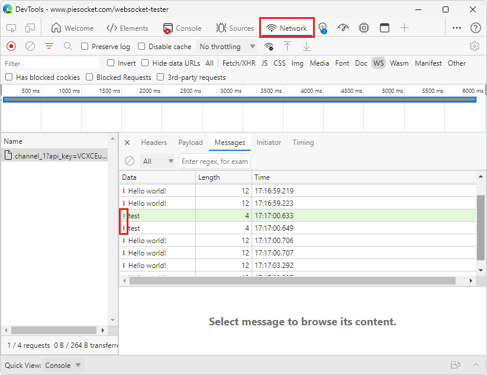

# What's New in DevTools (Microsoft Edge 104)

[!INCLUDE [Microsoft Edge team note for top of What's New](../../includes/edge-whats-new-note.md)]

<!-- ====================================================================== -->
## Use Layers in 3D View
<!-- rank: 1 -->

<!-- todo: check work item -->

<!-- Title: Where did Layers go? -->
<!-- Subtitle: Layers isn't a stand-alone tool anymore, it's wrapped up in the comprehensive 3D View; a tool for all your visual debugging needs. -->

The standalone **Layers** tool has now been completely removed.  During the phase-out period, the **Layers** tool remained, as an empty panel containing a link that opened the **3D View** tool.

In the **3D View** tool, the **Composited Layers** view has all the features you love from the **Layers** tool, along with some updates.  The **Composited Layers** view now sits alongside even more visual debugging tools.  Try out the **DOM** and **Z-index** views for debugging while you're in the **3D View** tool, and you'll see how these three views work together.

See also:
* [Navigate webpage layers, z-index, and DOM using the 3D View tool](../../../3d-view/index.md)

<!-- ====================================================================== -->
## Improved display of request URLs in Issues tool
<!-- rank: 2 -->

<!-- Title: Improved display of request URLs in Issues tool -->
<!-- Subtitle: Long request URLs have been truncated, making issues easier to read. -->

In the **Issues** tool, long request URLs have been truncated or wrapped, making issues easier to read.

See also:
* [Find and fix problems using the Issues tool](../../../issues/index.md)

<!-- ====================================================================== -->
## Improving accessibility for the Detached Elements tool
<!-- rank: 3 -->

<!-- Title: The Detached Elements tool now works better with assistive technology -->
<!-- Subtitle: In Microsoft Edge 104, Screen readers announce the name of the table of detached elements in the tool. -->

In previous versions of Microsoft Edge, when selecting the table of detached elements in the **Detached Elements** tool, assistive technology only announced "Table" and the number of rows and columns.  In Microsoft Edge version 104, this issue has been fixed.  When selecting the table of detached elements in the **Detached Elements** tool, assistive technology now announces "Detached Elements List, Table" and the number of rows and columns.

<!-- Instructions for screenshot
todo: see/use screenshot in work item attachment
1. Navigate to: https://microsoftedge.github.io/Demos/detached-elements/
2. Open DevTools > Detached Elements
3. Send 5 messages in Room 1 by selecting the "Send 1 message" button 5 times
4. Switch to Room 2
5. In the Detached Elements tool, press the refresh arrow icon to get detached elements
6. Take the screenshot and draw a red highlight box over the table (5 rows, 3 columns) in the Detached Elements tool -->

<!-- Video recording of feature in action
todo: see work item -->

See also:
* [Debug DOM memory leaks with the Detached Elements tool](../../../memory-problems/dom-leaks.md)
* [Navigate DevTools with assistive technology](../../../accessibility/navigation.md)

<!-- ====================================================================== -->
## Fix: Arrows representing web socket traffic now render correctly in the Network tool
<!-- rank: 4 -->

<!-- todo: check work item eg video -->

<!-- Title: Use the Network tool to understand web socket traffic -->
<!-- Subtitle: Arrows representing messages from the server or client now display correctly in the Network tool. -->

In previous versions of Microsoft Edge, when inspecting web socket traffic in the Network tool, the arrows representing whether a message was sent from the client or server were not rendering correctly.  In Microsoft Edge 104, this issue has been fixed.  Green up-arrows represent messages sent by the client, and red down-arrows represent messages sent by the server.  Thank you for sending us your feedback about this issue!

<!-- Start by using the work item attached png

1. Navigate to: Online WebSocket & Socket.io Tester - PieSocket Realtime
2. Open DevTools > Network and undock the tools
3. On the website, select Connect and send a test message
4. In the Network tool, select WS to filter to only WebSocket network requests
5. Select the one network request that should appear
6. Take a screenshot and draw a red highlight box over the red and green arrows -->

See also:
* [Network features reference](../../../network/reference.md)

<!-- ====================================================================== -->
## Announcements from the Chromium project

Microsoft Edge 104 also includes the following updates from the Chromium project:

* [Restart frame during debugging](https://developer.chrome.com/blog/new-in-devtools-104/#restart-frame)
* [Slow replay options in the Recorder panel](https://developer.chrome.com/blog/new-in-devtools-104/#recorder)
* [Build an extension for the Recorder panel](https://developer.chrome.com/blog/new-in-devtools-104/#recorder-extension)
* [Group files by Authored / Deployed in the Sources panel](https://developer.chrome.com/blog/new-in-devtools-104/#authored-deployed)
* [New User Timings track in the Performance insights panel](https://developer.chrome.com/blog/new-in-devtools-104/#performance)
* [Reveal assigned slot of an element](https://developer.chrome.com/blog/new-in-devtools-104/#slot)
* [Simulate hardware concurrency for Performance recordings](https://developer.chrome.com/blog/new-in-devtools-104/#simulate)
* [Preview non-color value when autocompleting CSS variables](https://developer.chrome.com/blog/new-in-devtools-104/#css-var)
* [Identify blocking frames in the Back/forward cache pane](https://developer.chrome.com/blog/new-in-devtools-104/#bfcache)
* [Improved autocomplete suggestions for JavaScript objects](https://developer.chrome.com/blog/new-in-devtools-104/#autocomplete)
* [Sourcemaps improvements](https://developer.chrome.com/blog/new-in-devtools-104/#sourcemaps)
* [Miscellaneous highlights](https://developer.chrome.com/blog/new-in-devtools-104/#misc)

<!-- ====================================================================== -->
<!-- uncomment if content is copied from developer.chrome.com to this page -->

<!-- > [!NOTE]
> Portions of this page are modifications based on work created and [shared by Google](https://developers.google.com/terms/site-policies) and used according to terms described in the [Creative Commons Attribution 4.0 International License](https://creativecommons.org/licenses/by/4.0).
> The original page for announcements from the Chromium project is [What's New in DevTools (Chrome 104)](https://developer.chrome.com/blog/new-in-devtools-104) and is authored by [Jecelyn Yeen](https://developers.google.com/web/resources/contributors#jecelynyeen) (Developer advocate working on Chrome DevTools at Google). -->

<!-- ====================================================================== -->
<!-- uncomment if content is copied from developer.chrome.com to this page -->

<!-- 
This work is licensed under a [Creative Commons Attribution 4.0 International License](https://creativecommons.org/licenses/by/4.0). -->
