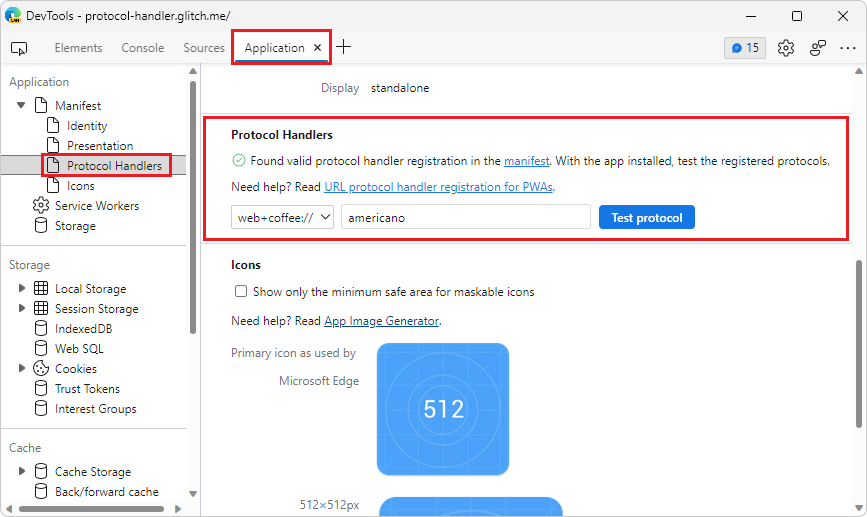
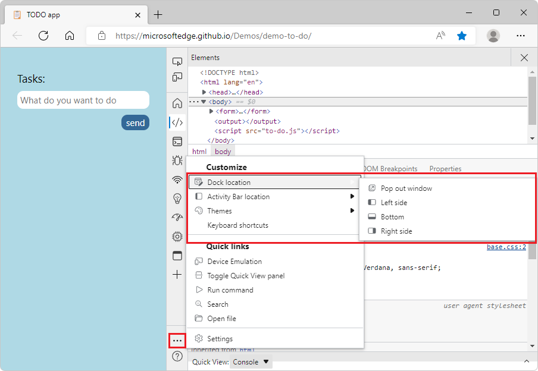
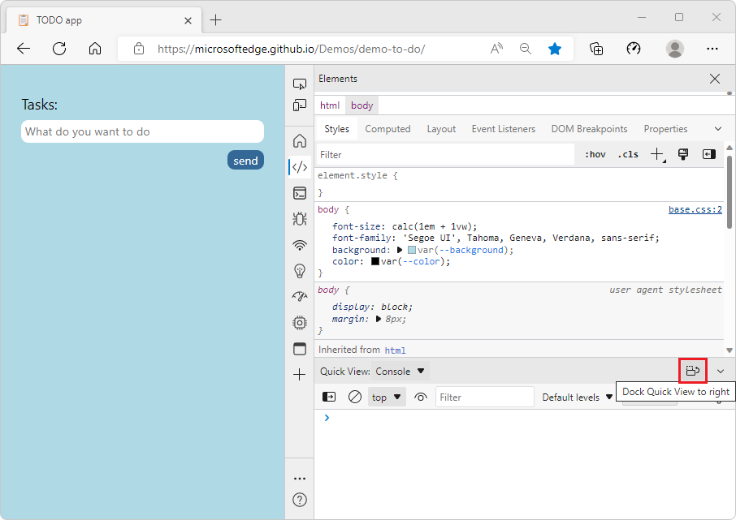
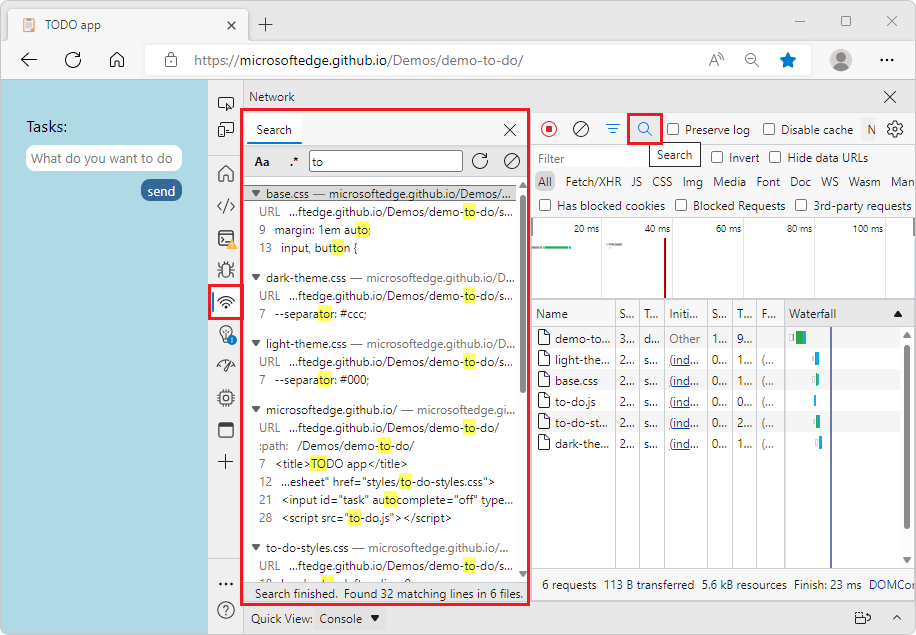

# What's New in DevTools (Microsoft Edge 105)

[!INCLUDE [Microsoft Edge team note for top of What's New](../../includes/edge-whats-new-note.md)]

<!-- ====================================================================== -->
## Test your PWA's protocol handlers from the Application tool  

<!-- Rank: 1 -->
<!-- Title: Test your PWA's protocol handlers from the Application tool  -->
<!-- Subtitle: From the Manifest section of the Application tool, you can now provide custom protocols to launch your PWA. -->

In Microsoft Edge 105, the **Application** tool now supports testing protocol handlers. Since Microsoft Edge 96, you've been able to define protocol handlers in the application manifest of your Progressive Web App (PWA). Now you can  test those protocols from the **Application** tool itself in DevTools if you have your PWA installed. 

With DevTools open against your PWA:
1. Open the **Application** tool.
2. Expand the Manifest dropdown.
3. Select the 'Protocol Handlers' entry in the dropdown.
4. Select the protocol you want to test from the dropdown.
5. Enter in the URL or endpoint that you would like to test.
6. Select **Test Protocol**.

The **Application** tool will attempt to launch your PWA with the protocol and URL you specified. The browser asks for permission to open the application, and then prompts you to confirm that you want to handle the protocol and the app you'd like to launch. If you give permission, your app will open with the specified content.

See also:

* [Test Progressive Web App (PWA) protocol handling](/microsoft-edge/devtools-guide-chromium/progressive-web-apps/protocol-handlers)

<!-- ====================================================================== -->

## Edit and resend network requests more reliably in the Network Console tool

<!-- RANK 3 -->
<!-- Title: Edit and resend network requests more reliably in the Network Console tool  -->
<!-- Subtitle: Modify and resend network requests that have been logged in the Network tool with the Network Console tool. -->

Previously in Microsoft Edge, selecting **Edit and resend** for a network request from the Network tool may not have reliably opened the Network Console tool and prepopulated it with the values from the request. 

In Microsoft Edge 105, this issue has been fixed. The **Edit and resend** now prepopulates the **Network Console** tool with the values for the network request that you are looking to resend. You can continue to modify these values before sending the request from the **Network Console** tool. Thank you for sending us your feedback about this issue!

Right-click the network request that you want to change and resend, and then select **Edit and Resend**.

<!-- ====================================================================== -->
## Focus Mode: Improved location controls for DevTools, Activity Bar, and Quick View

<!-- Title: Focus Mode: Improved location controls for DevTools, Activity Bar, and Quick View -->
<!-- Subtitle: Focus Mode: Improved location controls for DevTools, Activity Bar, and Quick View. -->

Several improvements to [Focus Mode](/devtools-guide-chromium/experimental-features/focus-mode) in existing location controls for DevTools have been made, including a new control for changing the orientation of **Quick View**.

The Settings menu now provides options for changing DevTools between docked locations and a separate window. This menu also contains settings for how the **Activity Bar** is displayed. Starting in Edge 105, these options can be navigated and changed more quickly. The previous submenus have been replaced with toggle buttons. Additionally, improved contrast means the option you have selected is more easily visible at a glance.

Before:

 

After:

You can now change the orientation of the **Quick View** panel as well. To change Quick View to a vertical split, select the location toggle (**Dock Quick View to the right**). Selecting this toggle a second time will return **Quick View** to a horizontal split.

 

To minimize **Quick View**, use the **Collapse** toggle or press `Esc`:

See also:
* [Simplify DevTools using Focus Mode](../../../experimental-features/focus-mode.md)

<!-- ====================================================================== -->

## Fix: Search in the Sources and Network tools now works as expected in Focus Mode

<!-- Rank 4 -->
<!-- Title: Fix: Search in the Sources and Network tools now works as expected in Focus Mode  -->
<!-- Subtitle: Try Focus Mode, a new, more simplified, and streamlined UI for DevTools!-->

[Focus Mode experiment](/microsoft-edge/devtools-guide-chromium/experimental-features/focus-mode#enable-focus-mode) in previous versions of Microsoft Edge didn't properly showcase the Search feature in the Network tool nor the *Search in all files* feature in the Sources tool. In Microsoft Edge version 105, these issues have been fixed.

You can now search in the **Network** tool via the **Search** icon.  

You can leverage the *Search in all files* feature in the Sources tool by opening the context menu on files in the Page section.  This will display the Search tool in the **Quick View**.

See also:
* [Inspect network activity](/microsoft-edge/devtools-guide-chromium/network/#search-network-headers-and-responses)
* [Find source files for a page using the Search tool](/microsoft-edge/devtools-guide-chromium/search/search-tool)

<!-- ====================================================================== -->
## Improved reliability in the Issues tool
<!-- Rank 6 -->
<!-- Title: Improved reliability in Issues tool -->
<!-- Subtitle: A bug that sometimes resulted in issues not appearing has been fixed.. -->

In previous versions of Microsoft Edge, there was a bug that that caused issues not appearing in the **Issues** tool.  This bug has been fixed resulting in improved reliability.  

See also:

* [Find and fix problems using the Issues tool](../../../issues/index.md)

<!-- ====================================================================== -->
## Announcements from the Chromium project

Microsoft Edge 105 also includes the following updates from the Chromium project:  

* [Attach Wasm debugging information at runtime](https://developer.chrome.com/blog/new-in-devtools-105/#wasm)
* [Support live edit during debugging](https://developer.chrome.com/blog/new-in-devtools-105/#live-edit)
* [View and edit @scope at rules in the Styles pane](https://developer.chrome.com/blog/new-in-devtools-105/#scope)
* [Sourcemap improvements](https://developer.chrome.com/blog/new-in-devtools-105/#sourcemaps)

<!-- ====================================================================== -->
<!-- uncomment if content is copied from developer.chrome.com to this page -->

<!-- > [!NOTE]
> Portions of this page are modifications based on work created and [shared by Google](https://developers.google.com/terms/site-policies) and used according to terms described in the [Creative Commons Attribution 4.0 International License](https://creativecommons.org/licenses/by/4.0).
> The original page for announcements from the Chromium project is [What's New in DevTools (Chrome 105)](https://developer.chrome.com/blog/new-in-devtools-105) and is authored by [Jecelyn Yeen](https://developers.google.com/web/resources/contributors#jecelynyeen) (Developer advocate working on Chrome DevTools at Google). -->

<!-- ====================================================================== -->
<!-- uncomment if content is copied from developer.chrome.com to this page -->

<!-- 
This work is licensed under a [Creative Commons Attribution 4.0 International License](https://creativecommons.org/licenses/by/4.0). -->
