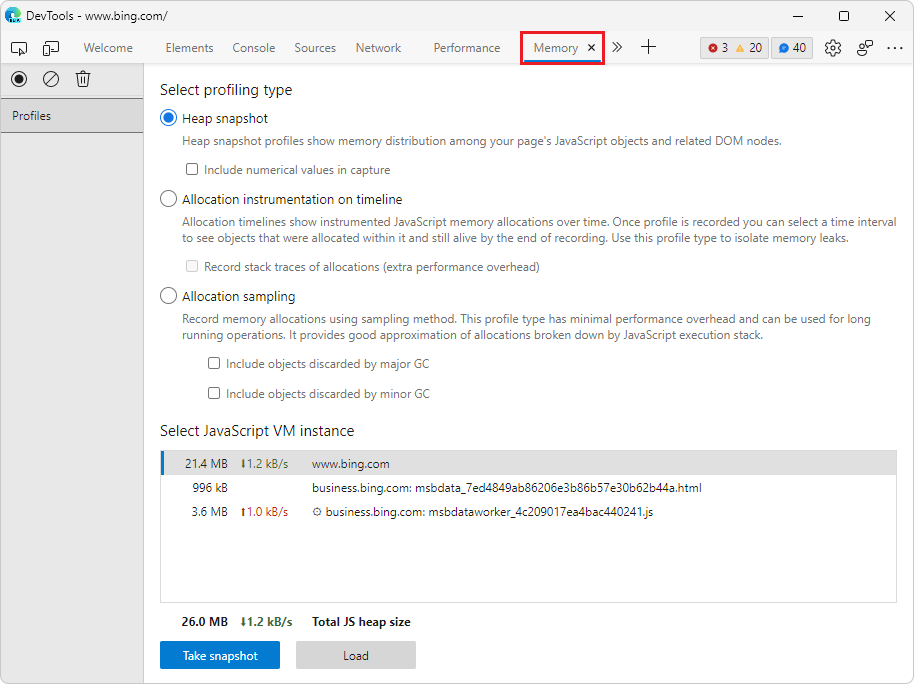
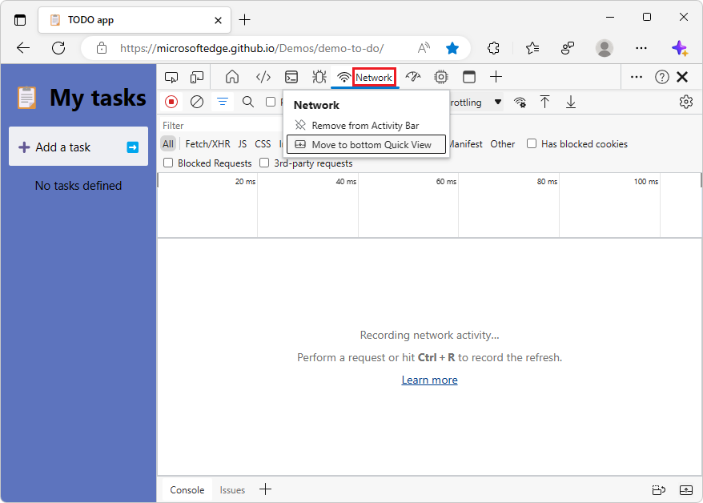
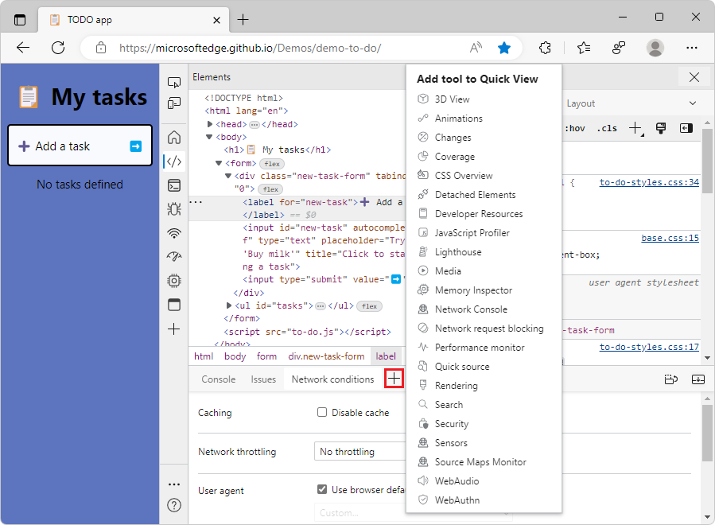
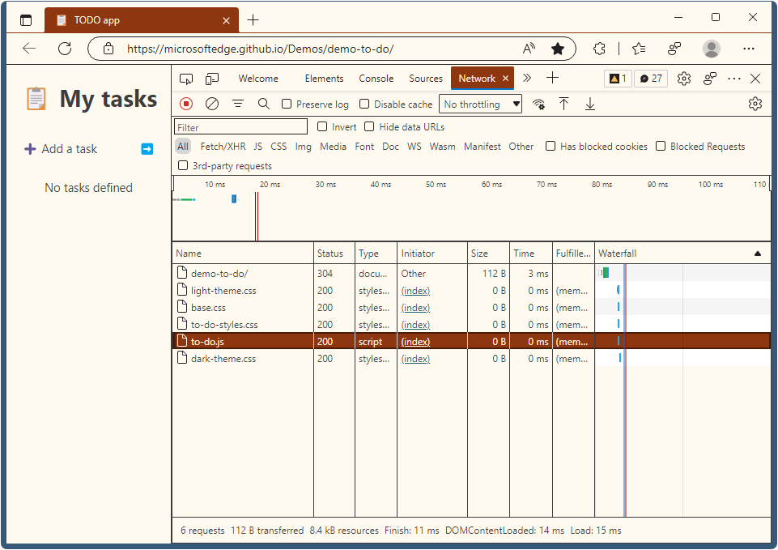

# What's New in DevTools (Microsoft Edge 110)

[!INCLUDE [Microsoft Edge team note for top of What's New](../../includes/edge-whats-new-note.md)]

<!-- ====================================================================== -->
## Taking heap snapshots in the Memory tool is now faster

<!-- Subtitle: When taking a heap snapshot greater than 1 GB in size, the time spent generating the snapshot in the Memory tool is at least 70% faster. -->

In previous versions of Microsoft Edge, generating large heap snapshots (over 1 GB) in the **Memory** tool could take anywhere from 2 to 15 minutes, depending on the size of your website or app, and how many elements were stored in memory.

In Microsoft Edge 110, the **Memory** tool is now much faster at taking heap snapshots.  Taking a heap snapshot is now around 70% to 86% faster.  For larger heap snapshots, we're seeing the greatest improvement in speed.  If you have noticed that taking heap snapshots is much faster, please leave us feedback in [[Feedback] Taking heap snapshots in the Memory tool is now faster #131](https://github.com/MicrosoftEdge/DevTools/issues/131).

See also:
* [Record heap snapshots using the Memory tool](../../../memory-problems/heap-snapshots.md#take-a-snapshot)

<!-- ====================================================================== -->
## Move tools between the Activity Bar and Quick View more easily in Focus Mode

<!-- Subtitle: Customize both the Activity Bar and Quick View in Focus Mode to see only the tools you care about. -->

Microsoft Edge 110 contains various improvements to **Focus Mode** in DevTools.  The following changes make it easier to customize the Activity Bar and Quick View, to show only the tools that you're currently interested in.

<!-- ------------------------------ -->
#### Right-click menu shows the current location of the other toolbar to move a tool to

The right-click menu for moving an optional tool between Quick View and the Activity Bar now includes the position of the Activity Bar, such as:
* **Move to bottom Quick View**
* **Move to side Quick View**
* **Move to left Activity Bar**
* **Move to top Activity Bar**

See also:
* [Simplify DevTools using Focus Mode](../../../experimental-features/focus-mode.md)

<!-- ------------------------------ -->
#### Tool name remains visible when you right-click the tool icon

The context menu for moving a tool between the Activity Bar and Quick View no longer obscures the tool's title in the toolbar:

For example, the **Network Conditions** tool name remains visible when you right-click the tool's tab in Quick View:

As another example, the **Network** tool name remains visible when you right-click the tool's tab in the Activity Bar:

See also:
* [Simplify DevTools using Focus Mode](../../../experimental-features/focus-mode.md)

<!-- ------------------------------ -->
#### Focus is preserved in Activity Bar or Quick View when moving a tool between them

For keyboard shortcut and assistive technology users, focus is preserved in the Activity Bar or Quick View when moving the currently selected tool from one to the other or removing it.
<!-- todo: is focus preserved within the tool, or within the toolbar? -->

<!-- todo: screenshot?

-->

See also:
* [Simplify DevTools using Focus Mode](../../../experimental-features/focus-mode.md)

<!-- ====================================================================== -->
## Accessibility improvements for themes, customizing locations, and the More Tools button

<!-- Subtitle: Using assistive technology such as screen readers and keyboard shortcuts with DevTools is now easier. -->

The following accessibility issues have been fixed, and using assistive technology such as screen readers and keyboard shortcuts with DevTools is now easier.

<!-- ------------------------------ -->
#### Screen readers correctly report when the More Tools menu is expanded

In previous versions of Microsoft Edge, screen readers reported that the **More tools** () button was collapsed, when the **More tools** menu was actually expanded.  In Microsoft Edge 110, this issue has been fixed.

Screen readers now correctly report when the **More tools** () menu is expanded:

See also:
* [Navigate DevTools with assistive technology](../../../accessibility/navigation.md)

<!-- ------------------------------ -->
#### Change Dock location and Activity Bar location by using the keyboard

In previous versions of Microsoft Edge, in Focus Mode, it wasn't possible to change the **Dock location** or the **Activity Bar location** via the keyboard.  In Microsoft Edge 110, this issue has been fixed.

In Focus Mode, you can now change the Dock location and the Activity Bar location from the **Customize and control DevTools** () menu by using the arrow keys:

See also:
* [Navigate DevTools with assistive technology](../../../accessibility/navigation.md)

<!-- ------------------------------ -->
#### Screen readers announce which theme is currently selected when scrolling through themes

In previous versions of Microsoft Edge, when scrolling through the list of themes for DevTools, screen readers didn't report whether a theme was selected.  In Microsoft Edge 110, this issue has been fixed.

Screen readers now announce which theme is currently selected when scrolling through themes from the **Customize and control DevTools** () menu:

See also:
* [Navigate DevTools with assistive technology](../../../accessibility/navigation.md)

<!-- ====================================================================== -->
## The Network, Console, Issues, and Sources tools have improved support for contrast themes

<!-- Subtitle: When a Windows contrast theme is applied, using DevTools is now easier. -->

DevTools in Microsoft Edge 110 now has better support for Windows contrast themes.  The **Network**, **Console**, **Issues**, and **Sources** tools have all been improved so that the tools render correctly with contrast themes.

In the **Issues** tool, with the **Desert** contrast theme applied in Windows, focus on a particular issue was displayed with a solid background, which made the text hard to see.  In Microsoft Edge 110, this has been fixed, by using an outline instead of a solid background:

In the **Network** tool, with the **Desert** contrast theme applied in Windows, selecting a particular request made the text and icon for the request hard to see.  In Microsoft Edge 110, this has been fixed:

See also:
* [Apply a color theme to DevTools](../../../customize/theme.md)
* [Check for contrast issues with dark theme and light theme](../../../accessibility/test-dark-mode.md)
* [Change color contrast in Windows](https://support.microsoft.com/windows/change-color-contrast-in-windows-fedc744c-90ac-69df-aed5-c8a90125e696)

<!-- ====================================================================== -->
## Announcements from the Chromium project

Microsoft Edge 110 also includes the following updates from the Chromium project:

* [Clearing Performance Panel on reload](https://developer.chrome.com/blog/new-in-devtools-110/#perf)
* [Automatic in-place pretty print](https://developer.chrome.com/blog/new-in-devtools-110/#pretty-print)
* [Better syntax highlight and inline preview for Vue, SCSS and more](https://developer.chrome.com/blog/new-in-devtools-110/#syntax)
* [Ergonomic and consistent Autocomplete in the Console](https://developer.chrome.com/blog/new-in-devtools-110/#console)

<!-- ====================================================================== -->
<!-- uncomment if content is copied from developer.chrome.com to this page -->

<!-- > [!NOTE]
> Portions of this page are modifications based on work created and [shared by Google](https://developers.google.com/terms/site-policies) and used according to terms described in the [Creative Commons Attribution 4.0 International License](https://creativecommons.org/licenses/by/4.0).
> The original page for announcements from the Chromium project is [What's New in DevTools (Chrome 110)](https://developer.chrome.com/blog/new-in-devtools-110) and is authored by [Jecelyn Yeen](https://developers.google.com/web/resources/contributors#jecelynyeen) (Developer advocate working on Chrome DevTools at Google). -->

<!-- ====================================================================== -->
<!-- uncomment if content is copied from developer.chrome.com to this page -->

<!-- 
This work is licensed under a [Creative Commons Attribution 4.0 International License](https://creativecommons.org/licenses/by/4.0). -->
