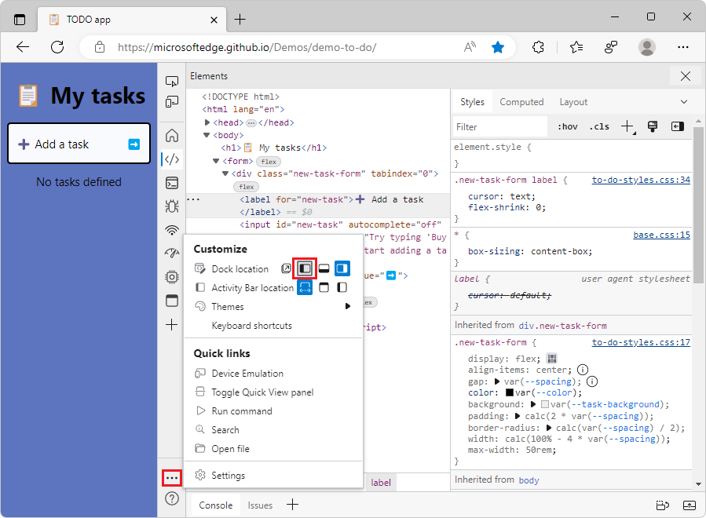
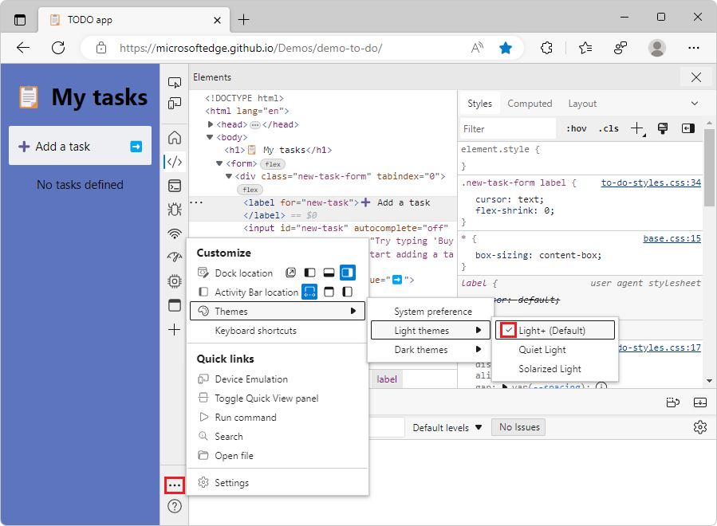

# What's New in DevTools (Microsoft Edge 110)

[!INCLUDE [Microsoft Edge team note for top of What's New](../../includes/edge-whats-new-note.md)]

<!-- ====================================================================== -->
## Taking heap snapshots in the Memory tool is now faster

<!-- Subtitle: When taking a heap snapshot greater than 1 GB in size, the time spent generating the snapshot in the Memory tool is at least 70% faster. -->

In previous versions of Microsoft Edge, generating large heap snapshots (greater than 1 GB in size) in the Memory tool could take anywhere from 2 minutes to 15, depending on the size of your website or app and how many elements were stored in memory.  In Microsoft Edge 110, the Memory tool is now much faster at taking heap snapshots.  Our own testing has shown that taking a heap snapshot is now 70% to 86% faster and for larger heap snapshots, we're seeing the greatest difference in speed.  If you have noticed that taking heap snapshots is much faster, please leave us feedback in .

See also:
* [Record heap snapshots using the Memory tool](../../../memory-problems/heap-snapshots.md#take-a-snapshot)

## Move tools between the Activity Bar and Quick View more easily in Focus Mode

<!-- Subtitle: Customize both the Activity Bar and Quick View in Focus Mode to see only the tools you care about. -->
Microsoft Edge 110 contains several improvements to **Focus Mode** in the DevTools, making it easier to customize the Activity Bar and Quick View to only show the tools you care about.  These improvements include:
- The context menu for moving tools from Quick View to the Activity Bar now includes the position of the Activity Bar
- The position of the context menu itself for moving tools no longer displays over the tool title in the toolbar
- For keyboard shortcut and assistive technology users, focus is preserved in the Activity Bar or Quick View when moving the currently selected tool from one to the other or removing it

See also:
* [Simplify DevTools using Focus Mode](../../../experimental-features/focus-mode.md)

## Accessibility improvements for themes, customizing locations, and the More Tools button

<!-- Subtitle: Using assistive technology like screen readers and keyboard shortcuts with the DevTools is now easier. -->

In previous versions of Microsoft Edge, the following accessibility issues impacted users of assistive technology:
- Screen readers would report that the **More Tools** button was collapsed when the **More Tools** menu was actually expanded
- In Focus Mode, changing the **Dock location** or the **Activity Bar location** was not possible to do via the keyboard
- When setting themes for DevTools, screen readers were not reporting whether a theme was selected or not as you navigated through the list of themes

In Microsoft Edge 110, all of these issues have been fixed.

Screen readers will now correctly report when the **More Tools** menu is expanded.

You can now change dock location and activity bar location from the `...` menu in Focus Mode with the arrow keys.

Finally, screen readers will now announce which theme is currently selected when navigating through themes from the `...` menu.

See also:
* [Navigate DevTools with assistive technology](../../../accessibility/navigation.md)

## The Network, Console, Issues, and Sources tools better support high contrast

<!-- Subtitle: When a Windows contrast theme is applied, using the DevTools is now easier. -->

The DevTools in Microsoft Edge 110 now better support Windows contrast themes.  The Network, Console, Issues, and Sources tools have all been improved so that the tools render correctly with contrast themes.

In the Issues tool, with the **Desert** contrast theme applied in Windows, focus on a particular issue was displayed with a solid background, which made the text too hard to see.  In Microsoft Edge 110, this has been fixed by using an outline instead.

In the Network tool, with the **Desert** contrast theme applied in Windows, selecting a particular request made the text and icon for the request difficult to see.  In Microsoft Edge 110, this has been fixed.

See also:
* [Apply a color theme to DevTools](../../../customize/theme.md)
* [Check for contrast issues with dark theme and light theme](../../../accessibility/test-dark-mode.md)
* [Change color contrast in Windows](https://support.microsoft.com/windows/change-color-contrast-in-windows-fedc744c-90ac-69df-aed5-c8a90125e696)

<!-- ====================================================================== -->
## Announcements from the Chromium project

Microsoft Edge 110 also includes the following updates from the Chromium project:

* [pending](https://developer.chrome.com/tags/new-in-devtools/)

<!-- ====================================================================== -->
<!-- uncomment if content is copied from developer.chrome.com to this page -->

<!-- > [!NOTE]
> Portions of this page are modifications based on work created and [shared by Google](https://developers.google.com/terms/site-policies) and used according to terms described in the [Creative Commons Attribution 4.0 International License](https://creativecommons.org/licenses/by/4.0).
> The original page for announcements from the Chromium project is [What's New in DevTools (Chrome 110)](https://developer.chrome.com/blog/new-in-devtools-110) and is authored by [Jecelyn Yeen](https://developers.google.com/web/resources/contributors#jecelynyeen) (Developer advocate working on Chrome DevTools at Google). -->

<!-- ====================================================================== -->
<!-- uncomment if content is copied from developer.chrome.com to this page -->

<!-- 
This work is licensed under a [Creative Commons Attribution 4.0 International License](https://creativecommons.org/licenses/by/4.0). -->
