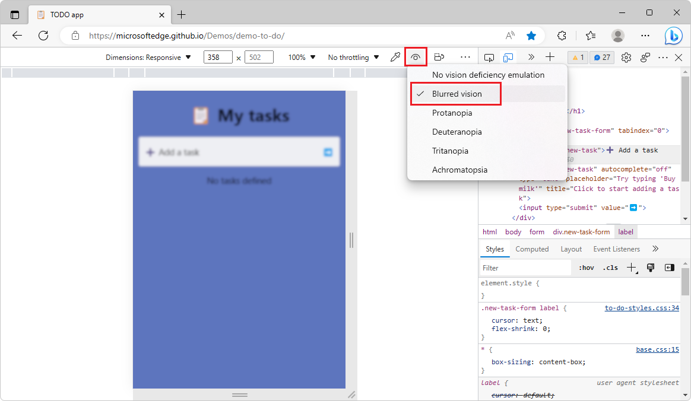

# What's New in DevTools (Microsoft Edge 111)

[!INCLUDE [Microsoft Edge team note for top of What's New](../../includes/edge-whats-new-note.md)]

<!-- ====================================================================== -->
## Remote debugging Microsoft Edge, PWAs, and WebView2 controls is now supported on Xbox and HoloLens devices

<!-- Subtitle: Get the Remote Tools for Microsoft Edge app from the Microsoft Store to set up remote debugging today! -->

The **Remote Tools for Microsoft Edge** app is a plug-in for the **Windows Device Portal for Desktop** that enables remote debugging for tabs in Microsoft Edge, PWAs, and WebView2 controls.  With remote debugging, you can run web content on a remote device and debug it right from your development machine.  In Microsoft Edge 111, the **Remote Tools for Microsoft Edge** app is now available on Xbox and HoloLens devices.

With remote debugging enabled, you won't need to open DevTools on either HoloLens or Xbox devices any more.  Instead, you can connect to the remote Xbox or HoloLens device via Device portal and the `edge://inspect` page and select the target: tab, PWA, or WebView2 control that you want to launch DevTools against.  To give us feedback on the remote debugging flow for Microsoft Edge, leave a comment in [Issue 136: Remote debugging Xbox and HoloLens devices is now available with the latest version of the Remote Tools for Microsoft Edge app](https://github.com/MicrosoftEdge/DevTools/issues/136).

See also:
* [Remotely debug Windows devices](../../../remote-debugging/windows.md)
* [Windows Device Portal for Desktop](https://learn.microsoft.com/windows/uwp/debug-test-perf/device-portal-desktop)

<!-- ====================================================================== -->
## New emulation options in Device Mode for themes and vision deficiencies

<!-- Subtitle: Use the new Eyedropper and Eye icons from the Device Mode toolbar to test how your web content responds to light, dark, and high contrast themes and vision deficiencies like color blindness. -->

In previous versions of Microsoft Edge, you had to use the **Rendering** tool in order to emulate different themes or vision deficiencies like Achromatopsia which is when the user is unable to perceive any color, which reduces all color to a shade of grey.  In Microsoft Edge 112, you can still use the **Rendering** tool for this purpose if you so wish but you can now access these emulation controls directly from the **Device Mode** toolbar.  

For example, to emulate high contrast mode and test how your web content responds, you can now select the Eyedropper icon next to the **No throttling** dropdown in the **Device Mode** toolbar and select `forced-colors: active`.

You can also emulate vision deficiencies with the Eye icon next to the Eyedropper icon. For example, to emulate blurred vision, select the Eye icon and then select the `Blurred vision` entry.

See also:
* [Emulate mobile devices (Device Emulation)](../../../device-mode/index.md)
* [Check for contrast issues with dark theme and light theme](../../../accessibility/test-dark-mode.md)
* [Emulate vision deficiencies](../../../accessibility/emulate-vision-deficiencies.md)

<!-- ====================================================================== -->
## The Performance tool now automatically unminifies file and function names while profiling production code

<!-- Subtitle: As long as the Performance tool can find sourcemaps from Symbol Server, the Performance tool automatically presents the original file and function names in the flame chart. -->

In [Microsoft Edge 109](../../2022/03/devtools.md#use-your-source-maps-to-display-original-function-names-in-performance-profiles), we added a new feature to the **Performance** tool called **Unminify** that applied sourcemaps to a profile recorded with the tool and downloaded it to your machine.  In Microsoft Edge 111, this feature has been removed because the **Performance** tool now automatically provides original file and function names while profiling production code as long as sourcemaps are hosted on Azure Artifacts Symbol Server.

<!-- @Zoher, to-do find image that shows value prop -->

See also:
* [Securely debug original code by publishing source maps to the Azure Artifacts symbol server](../../../javascript/publish-source-maps-to-azure.md)
* [Securely debug original code by using Azure Artifacts symbol server source maps](../../../javascript/consume-source-maps-from-azure.md)
* [Record performance | Performance features reference](../../../evaluate-performance/reference.md#record-performance)

<!-- ====================================================================== -->
## Item 4

<!-- Subtitle: . -->

<!-- See also:
*  -->

<!-- ====================================================================== -->
## Announcements from the Chromium project

Microsoft Edge 111 also includes the following updates from the Chromium project:

* [Debugging HD color with the Styles pane](https://developer.chrome.com/blog/new-in-devtools-111/#color)
* [Enhanced breakpoint UX](https://developer.chrome.com/blog/new-in-devtools-111/#breakpoint-redesign)
* [Customizable Recorder shortcuts](https://developer.chrome.com/blog/new-in-devtools-111/#recorder)
* [Better syntax highlight for Angular](https://developer.chrome.com/blog/new-in-devtools-111/#syntax)
* [Reorganize caches in the Application panel](https://developer.chrome.com/blog/new-in-devtools-111/#cache)
* [Miscellaneous highlights](https://developer.chrome.com/blog/new-in-devtools-111/#misc)

<!-- ====================================================================== -->
<!-- uncomment if content is copied from developer.chrome.com to this page -->

<!-- > [!NOTE]
> Portions of this page are modifications based on work created and [shared by Google](https://developers.google.com/terms/site-policies) and used according to terms described in the [Creative Commons Attribution 4.0 International License](https://creativecommons.org/licenses/by/4.0).
> The original page for announcements from the Chromium project is [What's New in DevTools (Chrome 111)](https://developer.chrome.com/blog/new-in-devtools-111) and is authored by [Jecelyn Yeen](https://developers.google.com/web/resources/contributors#jecelynyeen) (Developer advocate working on Chrome DevTools at Google). -->

<!-- ====================================================================== -->
<!-- uncomment if content is copied from developer.chrome.com to this page -->

<!-- 
This work is licensed under a [Creative Commons Attribution 4.0 International License](https://creativecommons.org/licenses/by/4.0). -->
