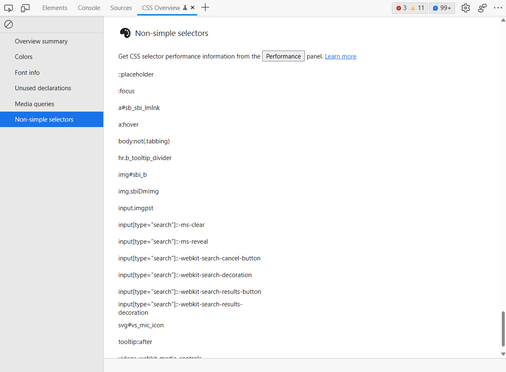
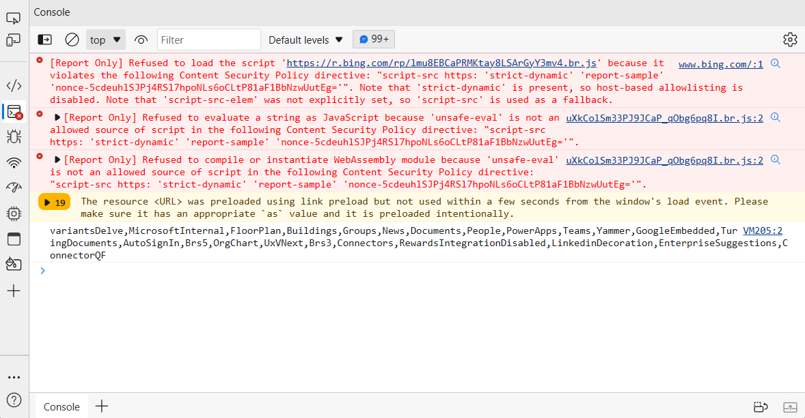
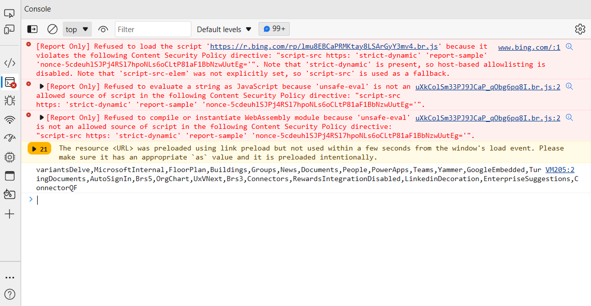
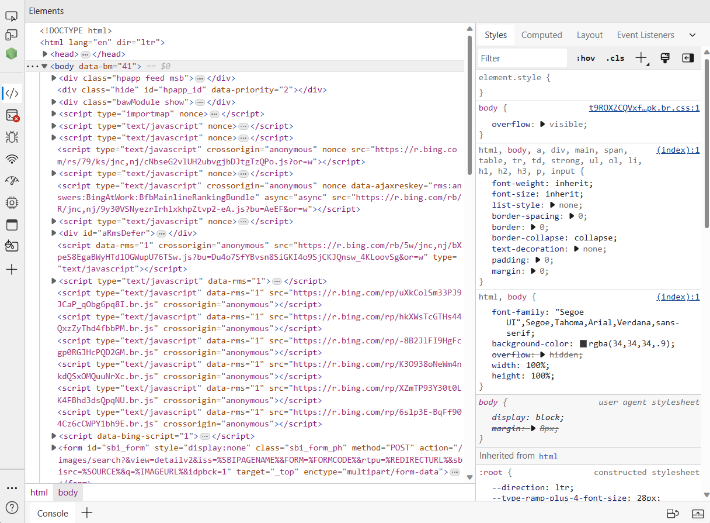
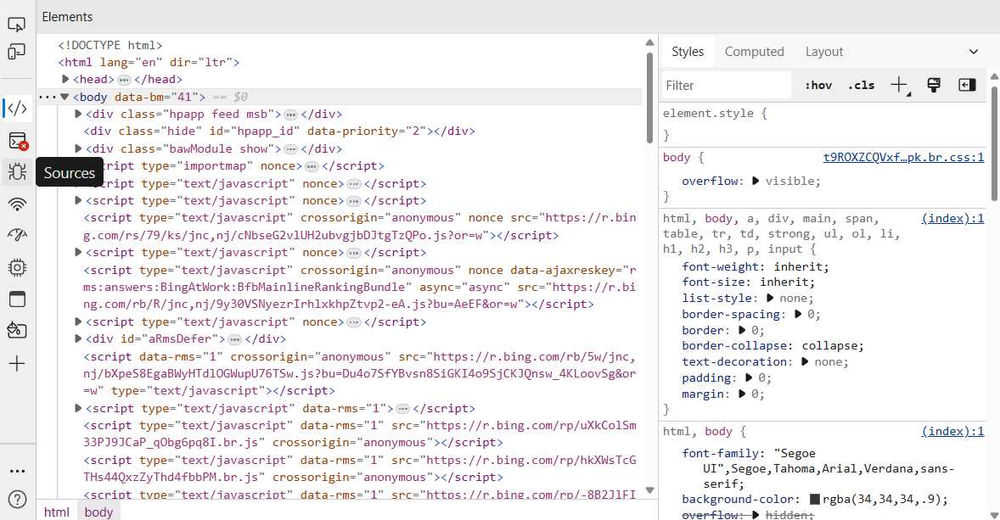

# What's New in DevTools (Microsoft Edge 112)

[!INCLUDE [Microsoft Edge team note for top of What's New](../../includes/edge-whats-new-note.md)]

<!-- ====================================================================== -->
## The Performance tool can now unminify JavaScript running in out-of-process iframes

<!-- Subtitle: As long as DevTools can load your sourcemaps, you now have unparalleled insight into JavaScript execution within an iframe. -->

In previous versions of Microsoft Edge, JavaScript execution in an out-of-process iframe (OOPIF) was isolated from the DevTools.  As a result, the Performance tool was not able to apply sourcemaps to performance events from the OOPIF.  When recording a profile in the Performance tool, the tool can only display the unminified file and function names in the flame chart.

In Microsoft Edge 112, the Performance tool now loads and applies sourcemaps to the performance events tracked in OOPIFs.  As a result, you can now see unminified file and function names for the JavaScript execution within an OOPIF when recording a profile in the Performance tool.

See also:
* [Performance tool unminifies file and function names when profiling production code
](./devtools-111.md#performance-tool-unminifies-file-and-function-names-when-profiling-production-code) in *What's new in DevTools (Microsoft Edge 111)*
* [Securely debug original code by publishing source maps to the Azure Artifacts symbol server](../../../javascript/publish-source-maps-to-azure.md)
* [Securely debug original code by using Azure Artifacts symbol server source maps](../../../javascript/consume-source-maps-from-azure.md)
* [Record performance](../../../evaluate-performance/reference.md#record-performance) in _Performance features reference_.

<!-- For our reference
- https://dev.azure.com/microsoft/Edge/_git/chromium.devtools-frontend/pullrequest/8414709
- https://dev.azure.com/microsoft/Edge/_workitems/edit/43100332/
- https://microsoft.visualstudio.com/Edge/_workitems/edit/43100279
 -->

<!-- ====================================================================== -->
## The CSS Overview tool displays a list of non-simple selectors for quick performance wins

<!-- Subtitle: Non-simple selectors can be common culprits for long-running Recalculate Styles events in the Performance tool. Take a quick snapshot in the CSS Overview tool to see your non-simple selectors. -->

The **CSS Overview** tool has a new section, called **Non-simple selectors** which displays a list of non-simple CSS selectors when you take an overview of your web page's CSS.  This list of non-simple selectors provides a quick way to identify common culprits for long-running **Recalculate Styles** events in the **Performance** tool.  You can try to change these selectors so that they are more specific and match fewer elements, reducing the amount of time the browser takes to calculate styles when:

- Elements are added to or removed from the DOM.
- An element's attributes are changed, such as `class` or `id`.
- User input occurs, such as a mouse move or focus change, which can affect `:hover` rules.

You can analyze the impact of your changes and individual selector performance with the **Selector Stats** feature in the **Performance** tool.  Quickly jump to the **Performance** tool by selecting the **Performance** button from the **Non-simple selectors** section of the **CSS Overview** tool and ensure the **Enable advanced rendering instrumentation (slow)** setting is turned on before beginning profiling.

See also:
* [Optimize CSS styles with the CSS Overview tool](../../../css/css-overview-tool.md)
* [Analyze selector performance during Recalculate Style events](../../../evaluate-performance/selector-stats.md)

<!-- ====================================================================== -->
## The JSON Viewer in Microsoft Edge supports code folding

<!-- Subtitle: Use code folding when looking at JSON to collapse and expand objects and arrays. -->
Starting with Microsoft Edge 110, you have access to an experimental feature for viewing JSON directly in the browser: the **JSON Viewer**.  Previously, you may have used browser extensions or text editors for viewing JSON but now you can inspect JSON payloads from the network or from disk directly in Microsoft Edge.

Starting in Microsoft Edge 112, the **JSON Viewer** now support code folding.  To access code folding, select the gear icon in the top right corner and turn on the **Code folding** setting.  With code folding turned on, you can now expand and collapse objects and arrays within the JSON you are inspecting.

**JSON Viewer** is an experimental feature so enable it by completing the following steps:

1. Go to `edge://flags`.

1. In the **Search flags** text field, type **JSON viewer**.

1. In the **JSON Viewer** dropdown menu, select **Enabled**.

1. Click the **Restart** button 

and please send us your [feedback](../../../contact.md)!

See also:
* [View formatted JSON](../../../json-viewer/json-viewer.md)

<!-- ====================================================================== -->
## Focus Mode improvements

<!-- Subtitle: Pressing Esc now hides or shows the Quick View, the Node icon for dedicated DevTools no longer overlaps with the first icon in the Activity Bar, and more. -->

**Focus Mode** is a new, experimental user interface for DevTools.  Focus Mode is designed to simplify and streamline the DevTools UI, providing you maximum customizability without compromising on the robust set of features in the tools.  In Microsoft Edge 112, Focus Mode received the following improvements.

### Pressing Esc now hides or shows Quick View

In previous versions of Microsoft Edge, in **Focus Mode**, **Quick View** was always displayed. Pressing `Esc` maximized **Quick View** if it was minimized and vice versa.  However, when the **Console** tool was selected in the **Activity Bar**, pressing `Esc` when the **Quick View** was minimized would display a blank view.  In Microsoft Edge 112, this issue has been fixed.

Pressing `Esc` now hides or shows **Quick View**.  If **Quick View** is hidden, then pressing `Esc` shows **Quick View**.

If **Quick View** is shown, then pressing `Esc` hides **Quick View**.

### The Node icon for dedicated DevTools no longer overlaps with the first icon in the Activity Bar

When DevTools detects that a Node server is running, the Node icon is displayed in Focus Mode.  Clicking this icon will open the dedicated DevTools for Node.  Before Microsoft Edge 112, the Node icon would overlap with the first tool icon when the **Activity Bar** is in the vertical orientation, making it harder to select the first tool.  This issue has now been fixed and there is no overlap between the Node icon and the first tool icon when the **Activity Bar** is in the vertical orientation.

### With the vertical Activity Bar, only one label is shown for each tool icon when hovering with the mouse or selecting with the keyboard

In **Focus Mode**, when the **Activity Bar** is in the vertical orientation, a label is displayed when you hover over an icon or select an icon with the keyboard of the tool name.  These labels help you learn the icon for each tool in the **Activity Bar**.  Previously, selecting an icon with the keyboard and hovering over an icon with the mouse would display two labels simultaneously.  This issue has now been fixed and only one label will be displayed, depending on which tool you are hovering over with the mouse or selecting with the keyboard.

See also:
* [Simplify DevTools using Focus Mode](../../../experimental-features/focus-mode.md)

<!-- ====================================================================== -->
## Announcements from the Chromium project

Microsoft Edge 112 also includes the following updates from the Chromium project:

* [Elements > Styles updates](https://developer.chrome.com/blog/new-in-devtools-112/#elements-styles)
* [Marking logpoints and conditional breakpoints in the Console](https://developer.chrome.com/blog/new-in-devtools-112/#logpoint)
* [Ignore irrelevant scripts during debugging](https://developer.chrome.com/blog/new-in-devtools-112/#ignore-list)
* [JavaScript Profiler deprecation started](https://developer.chrome.com/blog/new-in-devtools-112/#js-profiler-deprecation)
* [Emulate reduced contrast](https://developer.chrome.com/blog/new-in-devtools-112/#reduced-contrast)
* [Lighthouse 10](https://developer.chrome.com/blog/new-in-devtools-112/#lighthouse)

<!-- ====================================================================== -->
<!-- uncomment if content is copied from developer.chrome.com to this page -->

<!-- > [!NOTE]
> Portions of this page are modifications based on work created and [shared by Google](https://developers.google.com/terms/site-policies) and used according to terms described in the [Creative Commons Attribution 4.0 International License](https://creativecommons.org/licenses/by/4.0).
> The original page for announcements from the Chromium project is [What's New in DevTools (Chrome 112)](https://developer.chrome.com/blog/new-in-devtools-112) and is authored by [Jecelyn Yeen](https://developers.google.com/web/resources/contributors#jecelynyeen) (Developer advocate working on Chrome DevTools at Google). -->

<!-- ====================================================================== -->
<!-- uncomment if content is copied from developer.chrome.com to this page -->

<!-- 
This work is licensed under a [Creative Commons Attribution 4.0 International License](https://creativecommons.org/licenses/by/4.0). -->
