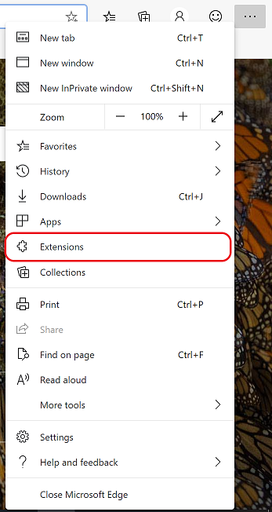

# Sideload an extension

During development, you can use the Microsoft Edge browser to run and debug your extension safely.  By sideloading your extension locally in your browser, you can run and test your extension.

To sideload an extension into Microsoft Edge:

1. In Microsoft Edge, select **Settings and more** (...) > **Extensions**.

   

   The **Extensions** pop-up box opens.

1. Click **Manage extensions**.  The **Extensions** page (`edge://extensions`) opens in a new tab:

   

1. Turn on **Developer mode** by using the toggle at the bottom left of the page.

1. When installing your extension for the first time, click the **Load Unpacked** button.  You'll be prompted for the directory with your extension source files.  Your extension is installed in your browser, similar to extensions installed from the store.

   

During development, you may also need to update or remove an extension.

<!-- ====================================================================== -->
## Updating an extension

To update the extension:

1. Go to `edge://extensions`.

1. Select **Reload** on the extension.

<!-- ====================================================================== -->
## Removing an extension

To remove the extension from your browser:

1. Go to `edge://extensions`.

1. Click **Remove** on the extension.
