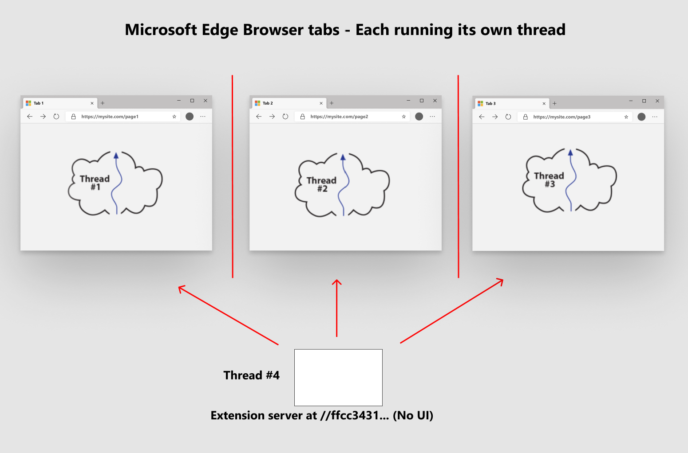

# Extension concepts and architecture

This article provides a brief introduction to understand extension concepts and architecture which will help you while building an extension. To understand what a Microsoft Edge \(Chromium\) extension is, we first need to fully understand how a multi-tab browser, like Microsoft Edge works.

### How a browser works?

1.  Each browser tab is isolated from every other tab  

    To start, each browser tab runs in an individual thread that effectively isolates it from other browser tabs \(or threads\).

      

2.  Each tab handles one GET request  

    Each tab essentially uses the URL \(also known as the uniform resource locator\) to get a single stream of data which is typically an HTML document.  That single stream \(or page\), often includes instructions \(like JavaScript include tags, image references, CSS references, and more\).  Ultimately, all the resources needed are downloaded to that one tab page and typically a visualization appears which we see in the browser tab completely rendered.  

3.  All communication happens from each tab to remote servers

    Understanding that each tab runs in an isolated environment means that these tabs are isolated from each other, but not the greater internet.  Typically, these tabs, running JavaScript as the defined programming language, communicate back to the server, that should be thought of as the originating server for that first GET request that was entered into the URL bar at the top of the browser tab.  

4.  The extension model turns everything upside down  

    An extension, just like tab pages, runs in a individual thread which is completely isolated from all tab page threads that are discussed.  Unlike the tabs whose job is to typically issue a single GET request to a remote server, then display a visualization of that data in the browser, the extension, on the other hand is the server, that previously resided on the other end of the internet connection made from a browser tab.

      

    This is really important to understand. Once you create an extension, and install it in your browser, you've created a standalone web server that is living and breathing inside your browser but is still isolated from every tab page running on that browser.  

### Extension architecture

1.  The Extension web server bundle  

    An extension is a bundle \(or referred to as a zip file\) of web resources that are no different than what a web developer publishes to a web server.

    That zip file includes HTML, CSS, JavaScript, images and all the necessary assets to make a web page.  There is however, one extra file that is required in the root of this zip file, and that file is named `manifest.json`.  It is the blueprint for your extension that includes things like what is the version of your extension, what is the title, what privileges does it need to run and lots more.

      

2.  Launching the extension server  

    When you deploy to a web server, that web server, whether it is Apache, IIS, NGINX or any other, contains your web bundle.  When a browser navigates to a URL on a server, the `index.html` file on the web server is downloaded.  The browser navigated using certificates, configuration files, and more.  The `index.html` file is stored at some special location on the web server.   How does your extension do the same thing?  Particularly, how is the tab page of your browser able to get to this zip file \(your extension\)?  That is what the extension runtime does for you.  

    The extension serves the files all from the URL \(uniform resource locator\) at the name `extension://{some-long-unique-identifier}/index.html`.  The name I put in brackets, `{some-long-unique-identifier}` is a unique identifier assigned to the extension that you installed.  That means, if you have 10 unique Extensions installed on your browser, each extension has a unique identifier that points at the zip file \(or extension bundle\) installed inside your browser.  

    <!--  -->  
 

3.  Extensions manage and communicate with tabs and the browser toolbar  

    Extensions interact with the toolbar of the browser, each is able to manage all the other running tab pages in a safe way, as well as manipulating the DOM of all those tab pages. Built into the Chromium browser is a message API that allows for communications between the extensions and the tab pages to allow this to happen gracefully.  This API, also known as the extensions API gives a lots of capabilities including notification management, storage management, and much more.  

    Just like web servers, extensions are able to continually run \(or sleep waiting for notifications\) all the time that the browser is running.  You may think of an extension as an orchestrator for the browser.  Again, the extension runs completely isolated from the tab pages, but through the extensions API, and opt-in permissions granted to the extension, each extension is able to virtually control any and all tab pages running in the browser.  

4. Extensions provide an opt-in at install time security model  

    Each extension, through a declaration in the `manifest.json` file allows the person installing the extension to give it different levels of authority.  This authority allows extensions, when installed by a user, to opt-in so that the extension is able to extract any information, and process that data through the extension.

## Next steps

 For information on getting started with extensions, see [Getting started with Microsoft Edge (Chromium) extensions][ExtensionsChromiumGettingStartedIndex]. 

<!-- image links -->  

<!-- links -->  

[ExtensionsChromiumGettingStartedIndex]: ../getting-started/index.md "Getting started with Microsoft Edge (Chromium) extensions | Microsoft Docs"  