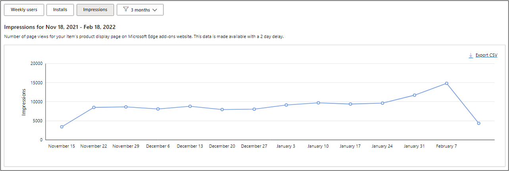

# View Microsoft Edge extensions analytics dashboard

Microsoft announced the launch of Extensions Analytics Dashboard on September 8, 2021. For more information see the blog [Track your add-on's performance: extension analytics now available on Partner center](https://techcommunity.microsoft.com/t5/articles/track-your-add-on-s-performance-extension-analytics-now/m-p/2733351).

You can view extension metrics from your [Partner Center dashboard](https://partner.microsoft.com/dashboard/microsoftedge/overview) and evaluate an extension’s performance from [Microsoft Edge Add-ons](https://microsoftedge.microsoft.com/addons/Microsoft-Edge-Extensions-Home).

For instance, you can identify regions in which the number of installations for your extension has increased in the past 3 months. You can also export this report as a CSV file.

Follow these steps to view your extension’s analytics dashboard:  

1. Navigate to your Partner Center account and select an extension.

1. From the left panel, click **Extension overview** > **Analytics** to view your extension metrics.

<!-- ====================================================================== -->
## Analytics dashboard metrics

From the analytics dashboard you can view metrics for the **Last month**, **3 months**, **6 months**, or **All time** (the period since your extension has been published to the Microsoft Edge Add-ons store).

### Weekly users

The **Weekly users** metric tracks the number of users that have your extension turned on, turned off and status unknown on Microsoft Edge over the past seven days.

The following image shows the **Weekly users** from the date the extension was published until today.

### Enabled vs Disable

The **Enabled vs Disabled** report shows the number of instances of the extension which are enabled or disabled per user.

The following image shows the **Weekly users** who have enabled and disabled the extension over the same time period. You can choose from **Select all** / **Unselect all**, **Disabled**, and **Enabled** views.

<!-- ====================================================================== -->
## Filter Weekly users

Use the filters to view Weekly users by Installs or Impressions over different time periods.

### Installs

The **Installs** metric displays the total number of successful installs of your extensions per day from the Microsoft Edge Add-ons store.

The following image shows daily successful installations for the last month.

### Impressions

The **Impressions** metric captures the total number of page views and user visits to your extension product page on Microsoft Edge Add-ons store. The data points are based on weekly or daily totals depending on the selected time range.

The following image shows **Impressions** for your extension page over the past 3 months.

<!-- ====================================================================== -->
## Refine by Region, OS, and Language

You can further refine views of your extension's Weekly users, Installs, and Impressions by Region, OS, and Language.

### Region

The Region filter covers the geographical distribution of users for your extension, indicating the user base in each region.

The following image shows total user visits.

### OS

The OS (operating system) filter highlights the OS usage distribution of all the install requests for your extension.

The following image shows Impressions by Operating System over the past 90 days.

### Language

The Language filter shows the language distribution for users of your extension.

The following image shows Impressions per Language over the past 90 days.

The Analytics Dashboard helps you better understand and engage with your extension users. For information about other 
features launched on Partner Center, see [Microsoft Edge Add-ons released features - Microsoft Edge Development | Microsoft Docs](/microsoft-edge/extensions-chromium/whats-new/released-features).

Share your feedback, concerns, and suggestions on Twitter [@MSEdgeDev](https://twitter.com/msedgedev/) or with [Microsoft Edge extensions support](/microsoft-edge/extensions-chromium/publish/contact-extensions-team) directly by emailing [ext_dev_support@microsoft.com](mailto:ext_dev_support@microsoft.com).

Share your questions, comments, and concerns with the team on Twitter  or via the [Microsoft Edge Insider forums on TechCommunity](https://techcommunity.microsoft.com/t5/articles/manifest-v3-changes-are-now-available-in-microsoft-edge/m-p/1780254).
