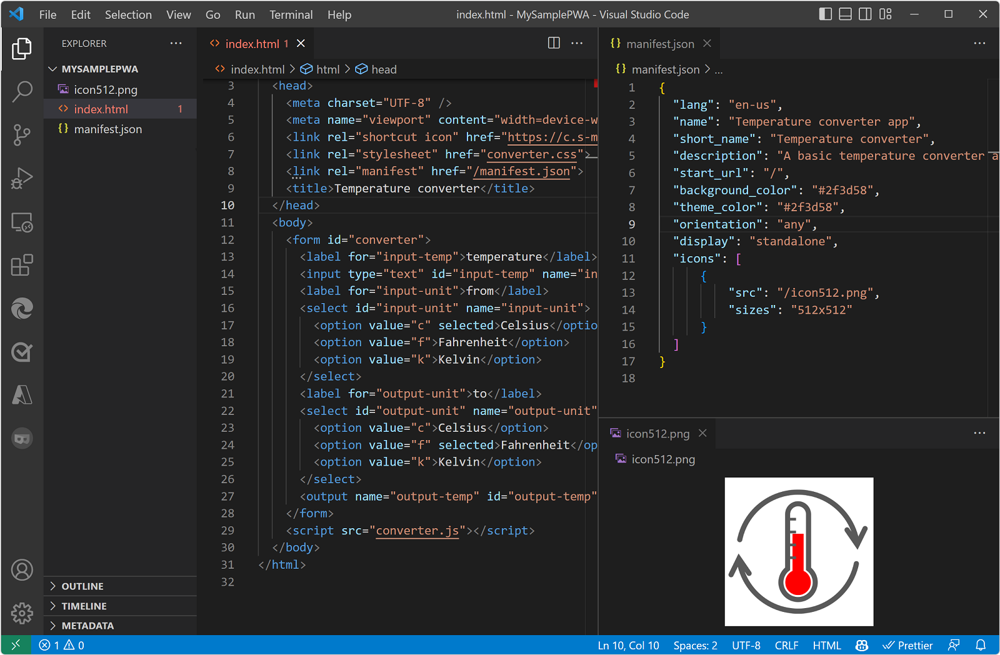
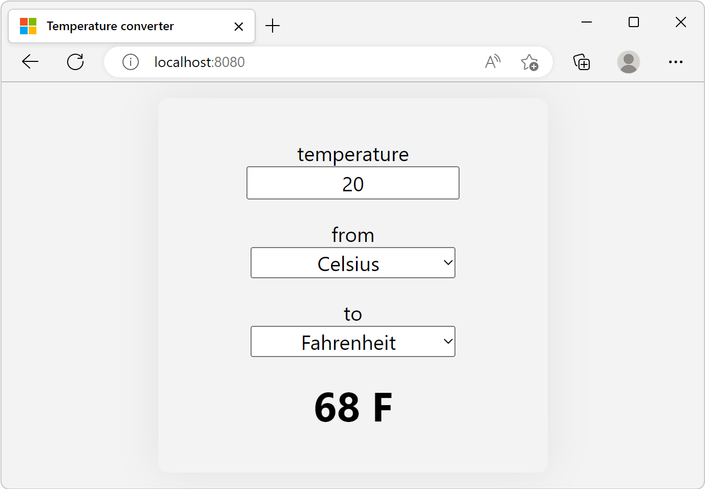
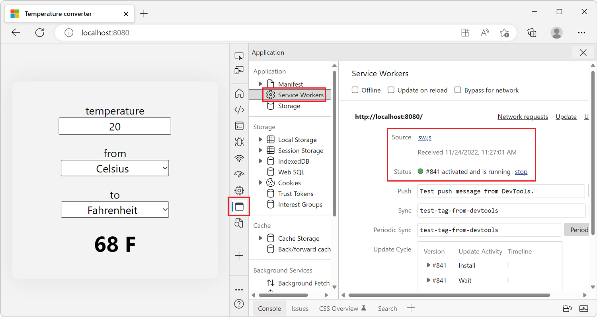
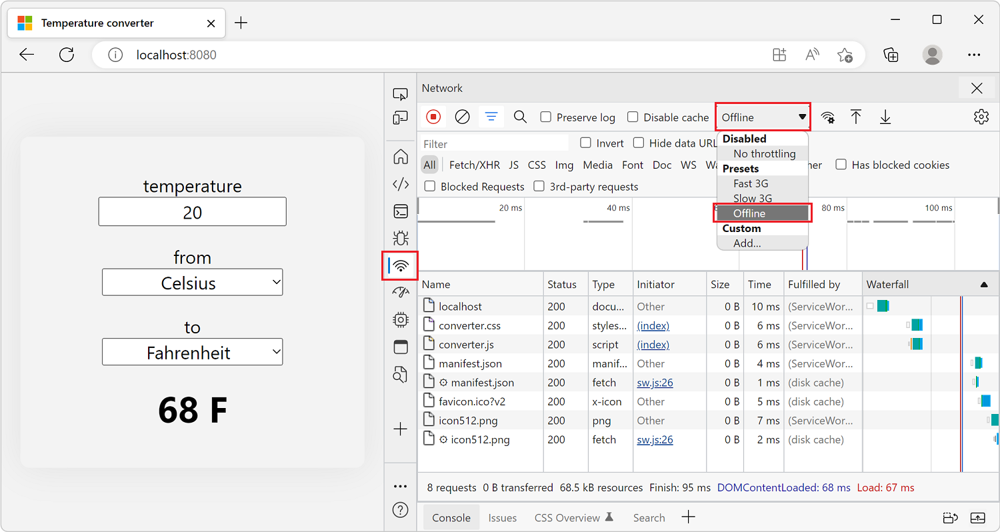
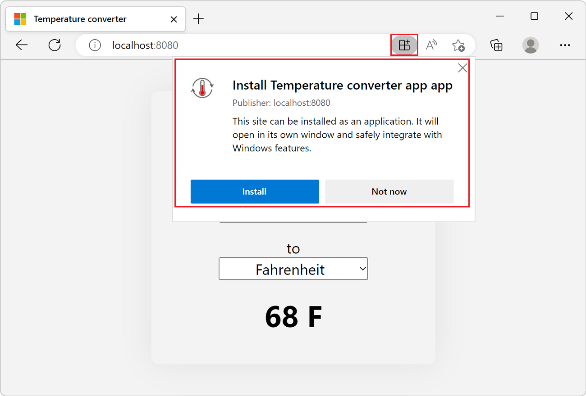

# Get started with Progressive Web Apps

Progressive Web Apps (PWAs) are applications that you build by using web technologies, and that can be installed and can run on all devices, from one codebase.

To learn more about what PWAs are and their benefits, see [Overview of Progressive Web Apps (PWAs)](../index.md).

<!-- link is placed here per https://github.com/MicrosoftDocs/edge-developer/issues/1974 -->
This guide is targeted at web developers who want to learn to build PWAs. To learn more about installing and running PWAs, see [Installing a PWA](../ux.md#installing-a-pwa) in _Use Progressive Web Apps in Microsoft Edge_.

In this guide, you first learn how PWAs work, then create your first simple PWA, which will be a temperature converter app, and then learn more about how to make great PWAs.


<!-- ====================================================================== -->
## Prerequisites

*   Install [Visual Studio Code](https://code.visualstudio.com) to edit your PWA source code.
*   Install [Node.js](https://nodejs.org) to use it as your local web server.
*   Working knowledge of HTML, CSS, and JavaScript is also a plus.


<!-- ====================================================================== -->
## The architecture of a PWA

Progressive Web Apps are written using the programming languages of the web: HTML, CSS, and JavaScript, and are distributed to your users by using web servers.

To make your app available to users, you deploy it on a web server that's accessible via HTTPS. Your server contains:

* **Back-end code**: the endpoints needed by your app, when connected to the internet, to retrieve dynamic content that may be stored in a database on your server.
* **Front-end code**: the resources needed for the app to be installed on the user's device, such as HTML, CSS, and JavaScript code.

Your back-end code can use the server-side languages of your choice such as ASP.NET, Java, Node.js, or PHP. Note, however, that server-side endpoints may not even be required depending on the app your are building. The PWA you create in this tutorial does not have any server-side code because it exclusively runs on the device it's installed on and doesn't need any server-side data.

Your front-end code uses HTML, CSS, JavaScript, and JSON only.

You use HTML to describe the content in your app, such as the text, images, text fields, or buttons that appear in the user interface. You then use CSS to organize the HTML content in a layout, and provide styles to elements. And finally you use JavaScript to add user interactions to your user interface.

On top of the user interface code, you also use JavaScript to make your application faster, more reliable, and network-independent by using a service worker file. Finally, your front-end code also contains a JSON manifest file that describes your application to the host operating system.

Below is a diagram of the high-level architecture of a PWA:


<!-- ====================================================================== -->
## Step 1 - Start a web server

PWAs are distributed to users by using web servers. Once your app is ready, deploy it to the web by using a web hosting provider. You can then update your app simply by deploying the new version to your web server again.

To start developing your PWA, you can use a local web server instead. To start a local server:

1. Create a new folder on your computer where the web server will run.

    You can do this by opening a command prompt and typing:
    
    ```shell
    cd path\to\your\dev\folder
    mkdir MySamplePWA
    cd MySamplePWA
    ```

1. Start the server by using the `http-server` Node.js library:

   ```shell
   npx http-server
   ```

You now have a simple local web server running at `http://localhost:8080`.

Key parts of the Progressive Web Apps platform, such as Service Workers, require using HTTPS.  When your PWA goes live, you must publish it to an HTTPS URL.  Many hosts now offer HTTPS by default, but if your host doesn't, [Let's Encrypt](https://letsencrypt.org/) offers a free alternative for creating the necessary certificates.

For example, you can create an [Azure free account](https://azure.microsoft.com/free).  If you host your website on the [Microsoft Azure App Service](https://azure.microsoft.com/services/app-service/web), it's served over HTTPS by default.

You can also host your website on [GitHub Pages](https://pages.github.com/) which supports HTTPS too.

For debugging purposes, Microsoft Edge also permits a `localhost` web server to use the PWA APIs without HTTPS.


<!-- ====================================================================== -->
## Step 2 - Create your app start page

So far, there is no content available on your web server. Start by creating the first page users will see when they access your temperature converter app.

1. Open Visual Studio Code, select **File** > **Open Folder** and then select the `MySamplePWA` directory you created in the previous step.

1. Create a new file in the project by pressing `Ctrl+N`, add the following content, and save the file as `index.html`:

   ```html
   <!DOCTYPE html>
   <html lang="en-US" dir="ltr">
     <head>
       <meta charset="UTF-8" />
       <meta name="viewport" content="width=device-width,initial-scale=1" />
       <link rel="shortcut icon" href="https://c.s-microsoft.com/favicon.ico?v2" />
       <title>Temperature converter</title>
     </head>
     <body>
       <h1>Temperature converter</h1>
     </body>
   </html>
   ```

Now browse to `http://localhost:8080` to view your app.


The app runs in the browser for now, and can't be installed. To make it installed, the app needs a web app manifest.


<!-- ====================================================================== -->
## Step 3 - Create a web app manifest

A [Web App Manifest](https://developer.mozilla.org/docs/Web/Manifest) is a JSON file containing metadata about your app, such as its name, description, icons, and the various operating system features it uses.

To add an app manifest to your app:

1.  In Visual Studio Code, press `Ctrl`+`N` to create a new file with the following content, and save the file as `manifest.json`.

    ```json
    {
        "lang": "en-us",
        "name": "Temperature converter app",
        "short_name": "Temperature converter",
        "description": "A basic temperature converter application that can convert to and from Celsius, Kelvin, and Fahrenheit",
        "start_url": "/",
        "background_color": "#2f3d58",
        "theme_color": "#2f3d58",
        "orientation": "any",
        "display": "standalone",
        "icons": [
            {
                "src": "/icon512.png",
                "sizes": "512x512"
            }
        ]
    }
    ```

1.  Add a 512x512 pixel app icon image named `icon512.png` to your project. You can use the [sample image](../media/icon512.png) for testing purposes.

1.  In Visual Studio Code, open `index.html`, and add the following code inside the `<head>` tag.

    ```html
    <link rel="manifest" href="/manifest.json">
    ```

   The above code snippet links the new web app manifest file to your website.

Your VS Code project should now look somewhat like this:




<!-- ====================================================================== -->
## Step 4 - Continue building the user interface of your app

Now that your app has a web app manifest file, and a start page, it is time to build out the main app functionality.

In this step of the tutorial, we will create a basic temperature unit conversion app.

1. To create the main user interface content, copy the following HTML code and paste it into the `index.html` file, replacing the `<h1>` HTML tag:

    ```html
    <form id="converter">
      <label for="input-temp">temperature</label>
      <input type="text" id="input-temp" name="input-temp" value="20" />
      <label for="input-unit">from</label>
      <select id="input-unit" name="input-unit">
        <option value="c" selected>Celsius</option>
        <option value="f">Fahrenheit</option>
        <option value="k">Kelvin</option>
      </select>
      <label for="output-unit">to</label>
      <select id="output-unit" name="output-unit">
        <option value="c">Celsius</option>
        <option value="f" selected>Fahrenheit</option>
        <option value="k">Kelvin</option>
      </select>
      <output name="output-temp" id="output-temp" for="input-temp input-unit output-unit">68 F</output>
    </form>
    ```

    The above HTML code contains a form with multiple input elements your app will use to convert a temperature value from one unit to another unit.

1. To make the converter work, you use JavaScript code. Create a new file named `converter.js` in your project and add the following code to it:

    ```javascript
    const inputField = document.getElementById('input-temp');
    const fromUnitField = document.getElementById('input-unit');
    const toUnitField = document.getElementById('output-unit');
    const outputField = document.getElementById('output-temp');
    const form = document.getElementById('converter');
    
    function convertTemp(value, fromUnit, toUnit) {
      if (fromUnit === 'c') {
        if (toUnit === 'f') {
          return value * 9 / 5 + 32;
        } else if (toUnit === 'k') {
          return value + 273.15;
        }
        return value;
      }
      if (fromUnit === 'f') {
        if (toUnit === 'c') {
          return (value - 32) * 5 / 9;
        } else if (toUnit === 'k') {
          return (value + 459.67) * 5 / 9;
        }
        return value;
      }
      if (fromUnit === 'k') {
        if (toUnit === 'c') {
          return value - 273.15;
        } else if (toUnit === 'f') {
          return value * 9 / 5 - 459.67;
        }
        return value;
      }
      throw new Error('Invalid unit');
    }
    
    form.addEventListener('input', () => {
      const inputTemp = parseFloat(inputField.value);
      const fromUnit = fromUnitField.value;
      const toUnit = toUnitField.value;
    
      const outputTemp = convertTemp(inputTemp, fromUnit, toUnit);
      outputField.value = (Math.round(outputTemp * 100) / 100) + ' ' + toUnit.toUpperCase();
    });
    ```

1. Open the `index.html` file again and add the following code after the closing `</form>` tag to load the JavaScript file:

    ```html
    <script src="converter.js"></script>
    ```

1. Now add some CSS style to the app, to make it more visually interesting. Create a new file called `converter.css` in your project and add the following code to it:

    ```css
    html {
      background: rgb(243, 243, 243);
      font-family: system-ui, -apple-system, BlinkMacSystemFont, 'Segoe UI', Roboto, Oxygen, Ubuntu, Cantarell, 'Open Sans', 'Helvetica Neue', sans-serif;
      font-size: 15pt;
    }
    
    html, body {
      height: 100%;
      margin: 0;
    }
    
    body {
      display: grid;
      place-items: center;
    }
    
    #converter {
      width: 15rem;
      padding: 2rem;
      border-radius: .5rem;
      box-shadow: 0 0 2rem 0 #0001;
      display: flex;
      flex-direction: column;
      align-items: center;
    }
    
    #converter input, #converter select {
      font-family: inherit;
      font-size: inherit;
      margin-block-end: 1rem;
      text-align: center;
      width: 10rem;
    }
    
    #converter #output-temp {
      font-size: 2rem;
      font-weight: bold;
    }
    ```

1. Open `index.html` again and reference the new CSS file in it by adding the following code inside the `<head>` tag:

    ```html
    <link rel="stylesheet" href="converter.css">
    ```

Your VS Code project should now look something like this


Now browse to `http://localhost:8080` to view your app.



Your app does something useful now but can't be installed yet. You will make your app installable in the next step by creating a service worker.


<!-- ====================================================================== -->
## Step 5 - Add a service worker

Service workers are a key technology that help make PWAs faster and independent of network conditions.

Service workers are specialized [Web Workers](https://developer.mozilla.org/docs/Web/API/Web_Workers_API) that intercept network requests from your PWA and enable scenarios that were previously limited to native apps, including:

*  Offline support.
*  Advanced caching.
*  Running background tasks such as receiving PUSH messages, adding badges to the app icon, or fetching data from a server.

Your app must have a service worker file for Microsoft Edge to install the app.

A service worker is defined in a JavaScript file loaded by your app. To add a service worker to your project:

1. In VS Code, create a new file (`Ctrl`+`N`), add the following content, and save the file as `sw.js`:

    ```javascript
    const CACHE_NAME = `temperature-converter-v1`;
    
    // Use the install event to pre-cache all initial resources.
    self.addEventListener('install', event => {
      event.waitUntil((async () => {
        const cache = await caches.open(CACHE_NAME);
        cache.addAll([
          '/',
          '/converter.js',
          '/converter.css'
        ]);
      })());
    });
    
    self.addEventListener('fetch', event => {
      event.respondWith((async () => {
        const cache = await caches.open(CACHE_NAME);
    
        // Get the resource from the cache.
        const cachedResponse = await cache.match(event.request);
        if (cachedResponse) {
          return cachedResponse;
        } else {
            try {
              // If the resource was not in the cache, try the network.
              const fetchResponse = await fetch(event.request);
        
              // Save the resource in the cache and return it.
              cache.put(event.request, fetchResponse.clone());
              return fetchResponse;
            } catch (e) {
              // The network failed
            }
        }
      })());
    });
    ```

    The `sw.js` file will act as your PWA's service worker. The code above listens to the `install` event and uses it to cache all resources the app needs to function: the start HTML page, the converter JavaScript file, and the converter CSS file.
    
    The code also intercepts `fetch` events, which happen every time your app sends a request to the server, and applies a cache-first strategy. The service worker returns cached resources so your app can work offline, and if that fails attempts to download from the server.

1.  Open `index.html` and add the following code at the end of the `<body>` tag to register your servier worker:

    ```html
    <script>
    if('serviceWorker' in navigator) {
      navigator.serviceWorker.register('/sw.js', { scope: '/' });
    }
    </script>
    ```

To confirm that your service worker is running:

1.  Browse to `http://localhost:8080` in Microsoft Edge and press `F12` to open DevTools.

1. Open the **Application** tool, then **Service Workers**.  If the service worker isn't displayed, refresh the page.

    

1.  View the service worker cache by expanding **Cache Storage** and selecting **temperature-converter-v1**.  All of the resources cached by the service worker should be displayed.  The resources cached by the service worker include the app icon, app manifest, and the initial page.

    

1.  Try your PWA as an offline app. In DevTools, open the **Network** tool, and change the **Throttling** value to **Offline**.

1.  Refresh your app. It should still appear correctly in the browser, using cached resources served by the service worker.

    


<!-- ====================================================================== -->
## Step 6 - Install the app

Now that your app has a web app manifest and a service worker, supporting browsers can install it as a PWA.

In Microsoft Edge, once you refresh your app, the **App available** button appears in the address bar. Clicking the **App available** button prompts you to install the app locally.



Click **Install** to install the app locally. After the installation completes, your app is displayed in its own window, and its own application icon in the Taskbar.


To learn more about installing PWAs, see [Use Progressive Web Apps in Microsoft Edge](../ux.md).


<!-- ====================================================================== -->
## Next steps

The simple temperature converter PWA you built so far only scratches the surface of what PWAs can do. The previous steps are important prerequisites for any PWA, but there are important best practices that will make your PWA feel like a real app when installed.

When users install applications, they have certain expectations of what these applications can do, for example:

* Users expect apps to work offline.
* Users expect apps to integrate within the operating system by, for example, handling files.
* Users expect apps to perform non-trivial computing tasks.
* Users expect to find apps in app stores.

To build a great PWA, see [Best practices for Progressive Web Apps](./best-practices.md).
