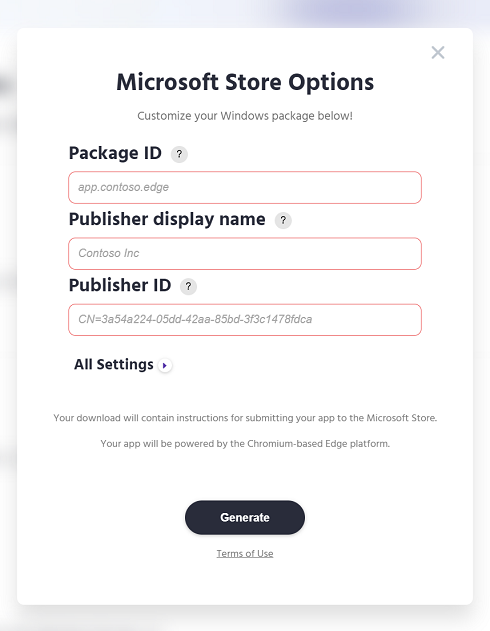
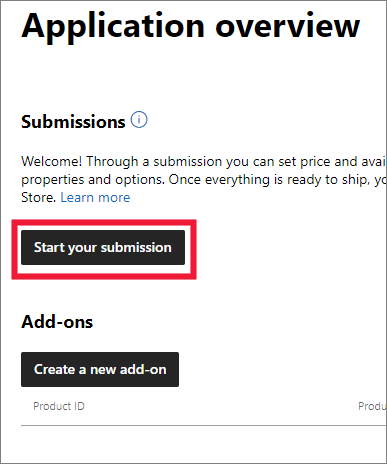

# Publish a Progressive Web App to the Microsoft Store

Publishing your Progressive Web App (PWA) to the [Microsoft Store](/windows/uwp/publish/index) brings the following advantages:

| Advantage | Description |
|---|---|
| **Discoverability** | Users naturally look for apps in the app store.  When you publish to the Microsoft Store, millions of Windows users can discover your PWA alongside other Windows apps.  The Store showcases apps through categories, curated collections, and more.  App discovery portals provide an easy browsing and shopping experience for potential users of your app.  You can even enhance your Store listing with screenshots, a hero image, and video trailers - see [App screenshots, images, and trailers](/windows/apps/publish/publish-your-app/screenshots-and-images). |
| **Trustworthiness** | Windows customers know they can trust their Microsoft Store purchases and downloads, because they adhere to the rigorous Microsoft [quality and safety standards](/legal/windows/agreements/store-policies). |
| **Easy install** | The Microsoft Store provides a consistent and user-friendly install experience across [all Windows 10 or later apps](https://www.microsoft.com/store/apps/windows). |
| **App analytics** | The [Microsoft Partner Center dashboard](/windows/uwp/publish/index) provides you with [detailed analytics](/windows/uwp/publish/analytics) about your app health, usage, and more. |

To publish your PWA to the Microsoft Store, no code changes are required.  Instead, you create an app reservation, package your PWA, and submit your package to the Store.  The following sections explain the steps.


<!-- ====================================================================== -->
## Create an app reservation

[Microsoft Partner Center](https://partner.microsoft.com/dashboard/windows/overview) is the hub for you to submit your app to the Microsoft Store. 

To create an app reservation:

1.  Before you can create an app reservation, you must have a **personal** Microsoft account that is enrolled in the Windows Developer Program.
    1.  If you don't already have one, create a personal Microsoft account at [account.microsoft.com](https://account.microsoft.com/).
    1.  Enroll in the Windows Developer program, by following the steps in [Open a developer account in Partner Center](/windows/apps/publish/partner-center/open-a-developer-account).

1.  Once your account is enrolled in the app developer program, follow these steps to create an app reservation:
    1.  Open up the [Partner Center Dashboard](https://partner.microsoft.com/dashboard/home). Sign in with the account you enrolled.
    1.  Under **Workspaces**, select **Apps and games**.
    1.  Select **New product** > **MSIX or PWA app**.
    1.  When prompted, enter a name for your reservation and select **Reserve product name**.

    

1.  To display your publisher details for use in the [Package your PWA](#package-your-pwa-for-the-store) section, select **Product management** > **Product Identity**.

    
    <!-- lightbox justified because large detailed image -->

1.  Copy and save the following values.
    *   **Package ID**
    *   **Publisher ID**
    *   **Publisher Display Name**


<!-- ====================================================================== -->
## Package your PWA for the Store

Now that you have your app publishing information, generate a Windows app package for your PWA.

To generate an app package:

1.  Go to [PWA Builder](https://www.pwabuilder.com).
1.  Type the URL of your PWA and click **Start**.
1.  Once your report is complete, make sure your PWA is store-ready. If your PWA score is too low, you can visit the **Manifest Options** and **Service Worker Options** and check out the sections that need work.
1.  When your PWA is ready to be published, click **Next**, and then select the **Store Package** button in the **Windows** section of the publish page.
1.  Paste the following values, which you saved in the [Create an app reservation](#create-an-app-reservation) section:
    *   **Package ID**
    *   **Publisher ID**
    *   **Publisher Display Name**

    

1.  Select **Generate**.
1.  To download your Windows app package, select **Download**.

Your download is a `.zip` archive that contains an `.msixbundle` file and a `.classic.appxbundle` file.  The two app packages allow your PWA to run on a wide variety of Windows versions.  For more information, see [What is a classic package?](https://github.com/pwa-builder/pwabuilder-windows-chromium-docs/blob/master/classic-package.md).<!-- changing master to main doesn't work 5/19/2022 -->


### Submit your app package to the Store

To submit your app to the Microsoft Store:

1.  Go to [Microsoft Partner Center](https://partner.microsoft.com/dashboard/windows/overview)
1.  Select your app.
1.  Select **Start your Submission**.

    

1.  When you're prompted, provide information about your app, such as pricing and age rating.

1.  On the **Packages** prompt, select the `.msixbundle` and the `.classic.appxbundle` files you generated in the [Package your PWA](#package-your-pwa-for-the-store) section.

After you complete your submission, your app is reviewed, typically within 24 to 48 hours.  After you receive approval, your PWA is available in the Microsoft Store.


<!-- ====================================================================== -->
## Measure usage of your PWA installed from the Microsoft Store

When your PWA is initially launched, if the PWA was installed from the Microsoft Store, Microsoft Edge includes the following `Referer` header with the request of the first navigation of your web app.

```
Referer: app-info://platform/microsoft-store
```

Use this feature to measure distinct traffic from your PWA that was installed from the Microsoft Store.  Based on the traffic, you can adjust your app's content to improve the user experience.  This feature is accessible to both client and server code. To access this information on the client side, you can query `document.referrer` in your JavaScript.

This feature was first introduced in Microsoft Edge version 91, and the DOM API was introduced in Microsoft Edge version 93.


<!-- ====================================================================== -->
## Redirect to locale-specific domains without displaying additional UI

By default, a PWA that's installed from the Microsoft Store displays an additional UI when the app is redirected to a locale-specific domain.  The added UI shows the URL and page title.  This UI is added because navigation to the locale-specific domain is considered "out-of-scope".  However, you can prevent this UI from being displayed, by specifying locale-specific origins that are associated with the PWA.

The following figure shows the UI that is introduced when a user moves outside the scope of a PWA. 


### Domain redirection with browser-installed PWAs

A Web App Manifest is tied to a single domain.  However, some PWAs use locale-specific domains for their customers in specific regions of the globe.  When visiting the PWA in a web browser, customers are seamlessly transitioned from the principal domain (for example, contoso.com) to a locale-specific domain (for example, contoso.co.ke), because the redirect happens during initial load of that website.

Customers who install the PWA from Microsoft Edge would therefore install the PWA from the locale-specific domain.  Subsequent launches of the PWA go directly to that locale-specific domain, instead of first going to the principal domain.

### Domain redirection with PWAs installed from the Microsoft Store

PWAs that are installed from the Microsoft Store have a hard-coded start URL that is pointed at the principal domain.  When the PWA is launched, the PWA initially navigates to the principal domain, and then a customer may (as necessary) be redirected to their locale-specific domain. If that redirection occurs, the navigation is considered "out of scope".  As a result, the app displays the URL and page title at the top of the page.

Displaying the URL and page title is a security feature to ensure that users know they have left the context of the PWA.  This added UI makes sense when a user loads a page from another website in the context of the PWA.  However, that added UI may be inappropriate when a user moves among domains that are all part of the same website.

### Prevent the locale-specific URL and title from being displayed

To prevent the additional UI from being shown in a PWA that's installed from the Microsoft Store, you can use [URL Handlers](https://github.com/WICG/pwa-url-handler/blob/main/explainer.md) to enable the PWA to span multiple locale-specific domains.

To prevent displaying the URL and page title:

1. Within the PWA's Web App Manifest, use [the `url_handlers` member](https://github.com/WICG/pwa-url-handler/blob/main/explainer.md#manifest-changes) to specify an array of origins that are associated with that app.
1. On each of the referenced origins, include a [`web-app-origin-association` file](https://github.com/WICG/pwa-url-handler/blob/main/explainer.md#web-app-origin-association-file) that associates the PWA with that domain.

When these domain lists are in place, Microsoft Edge no longer shows the additional UI when the principal domain is redirected to the locale-specific domains.

Eventually, the `url_handlers` feature will be replaced by [`scope_extensions`](https://github.com/WICG/manifest-incubations/blob/gh-pages/scope_extensions-explainer.md), but that spec is still in development.  `scope_extensions` will produce the same result as `url_handlers`.

This feature was first introduced in Microsoft Edge version 97.


<!-- ====================================================================== -->
## See also

*   [Test and submit your PWA app package](https://github.com/pwa-builder/pwabuilder-windows-chromium-docs/blob/master/next-steps.md)
*   [Publish a new PWA to the Store](https://github.com/pwa-builder/pwabuilder-windows-chromium-docs/blob/master/publish-new-app.md)
*   [Update an existing Store app to a PWA](https://github.com/pwa-builder/pwabuilder-windows-chromium-docs/blob/master/update-existing-app.md)
*   [Image recommendations for PWAs in the Store](https://github.com/pwa-builder/pwabuilder-windows-chromium-docs/blob/master/image-recommendations.md)
*   [App packaging explainer](https://github.com/pwa-builder/pwabuilder-windows-chromium-docs/blob/master/classic-package.md)
