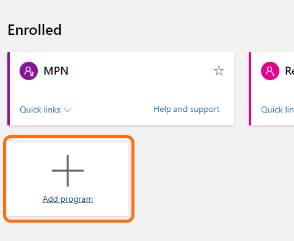
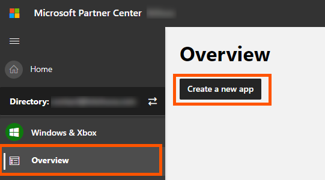
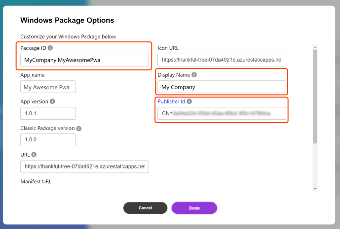
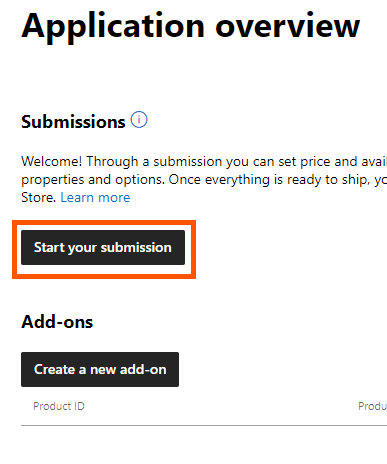

# Publish Your Progressive Web App to the Microsoft Store

Publishing your Progressive Web App (PWA) to the [Microsoft Store](https://developer.microsoft.com/store) brings a number of advantages:

- **Discoverability** - Users naturally look for apps in the app store. By publishing to the Microsoft Store, millions of Windows users can discover your PWA alongside other Windows apps. The Store showcases apps through categories, curated collections, and more. These app discovery portals provide an easy browsing and shopping experience for potential users of your app. You can even [enhance your Store listing](/windows/uwp/publish/app-screenshots-and-images) with screenshots, a hero image, and video trailers.

- **Trustworthiness** - Windows customers know they can trust their Microsoft Store purchases and downloads because they adhere to Microsoft's rigorous [quality and safety standards](/legal/windows/agreements/store-policies).

- **Easy install** - The Microsoft Store provides a consistent and user-friendly install experience across [all Windows 10 apps](https://www.microsoft.com/store/apps/windows?icid=CNavAppsWindowsApps).

- **App analytics** - The [Windows Partner Center dashboard](/windows/uwp/publish/using-the-windows-dev-center-dashboard) provides you with [detailed analytics](/windows/uwp/publish/analytics) about your app health, usage, and more.

To publish your PWA to the Microsoft Store, no code changes are required. Instead, you'll create an app reservation, package your PWA, and submit your package to the Store. These steps are explained below. 

## Create an app reservation

[Windows Partner Center](https://partner.microsoft.com/dashboard/windows/overview) is the hub for submitting apps to the Microsoft Store.

Sign in to Windows Partner Center with your Microsoft account, then go to the [Partner Center Dashboard](https://partner.microsoft.com/dashboard/home) to see your enrolled programs. If `Windows & Xbox` is listed, you're already enrolled. If not, choose `Add program`:

Then, under `Windows & Xbox`, choose `Get started` and follow the prompts to enroll in the developer program.

Now that you're enrolled in the app developer program, you'll create an app reservation. Under `Windows & Xbox`, choose `Overview`, then `Create a new app`:

Type your PWA name in the prompt, and choose `Reserve product name` to complete your app reservation.

Lastly, you'll need to grab your publisher details for use in the next step. Choose `Product management`, then `Product Identity`:

Here you'll see your Package ID, Publisher ID, and Publisher Display Name. Save or copy these values, we'll use them in the next step.

## Package your PWA

Next, you'll generate a Windows app package for your PWA. 

Your app package will be an *.msixbundle* file containing the metadata of your app: name, description, icons, and so on. It will use the [Hosted App Model](https://blogs.windows.com/windowsdeveloper/2020/03/19/hosted-app-model/), with Chromium-based Edge powering your PWA. In this model, your PWA can use modern web capabilities--like service worker, offline, push notifications, badging, and more--while functioning as a Windows app.

To generate an app package, go to [PWA Builder](https://www.pwabuilder.com) and enter your PWA's URL. Select `Start`, then `Build My PWA`. Choose `Windows`, then `Options`. Paste in the Package ID, Publisher ID, and Publisher Display Name you saved in the preview step:

Choose `Done`, then `Download` to download your Windows app package. Your download is a zip archive containing an *.msixbundle* file that can be submitted to the Store in the next step.

### Submit your app package to the Store

Now that you have your *.msixbundle* app package, we can submit it to the Store.

Go to [Windows Partner Center](https://partner.microsoft.com/dashboard/windows/overview) and select your app, then `Start your Submission`:

You'll be prompted for information about your app, like pricing, age rating, and more. Complete these prompts. 

When asked for `Packages`, choose the *.msixbundle* file generated in the previous step.

When your submission is complete, your app will be reviewed, typically within 24-48 hours. Upon approval, your PWA will be available in the Microsoft Store.