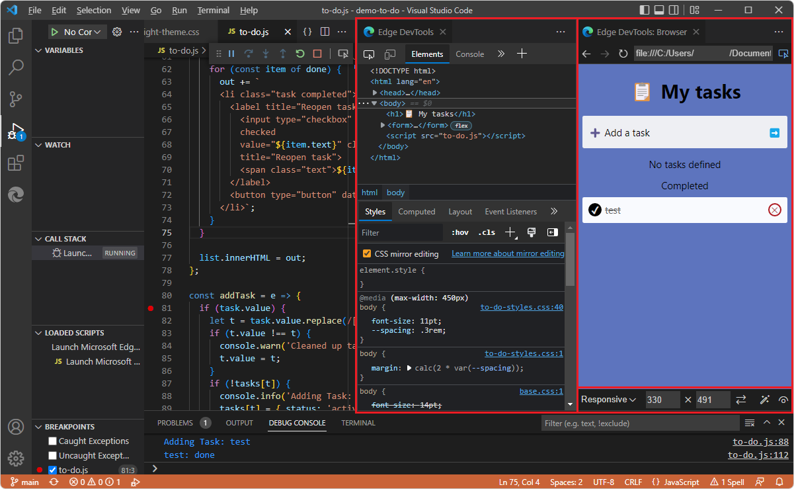
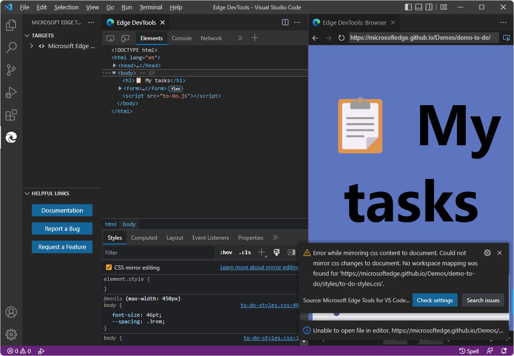

# Microsoft Edge DevTools extension for Visual Studio Code
<!-- this is the main landing (firstchild) page for the DevTools extension TOC bucket -->

<!-- heading convention in these files: skip h3's; tag subheadings as h4's instead -->

<!-- lexicon (except when quoting a UI string):
Microsoft Edge DevTools extension for Visual Studio Code
Microsoft Edge DevTools extension
CSS Mirroring
CSS mirror editing (lowercased in UI, initcapped at gh)

Move away from "screencast" and "headless" toward:
the embedded browser in Visual Studio Code
the Edge DevTools: Browser tab includes the device emulation toolbar (unlike the external browser window)
the DevTools embedded browser includes a device emulation toolbar
the DevTools browser
-->

The Microsoft Edge DevTools extension for Visual Studio Code lets you use the Microsoft Edge Browser and Developer Tools right from within Visual Studio Code.  Visual Studio Code includes built-in support for JavaScript, TypeScript, and Node.js, so it's a great tool for web developers.  Visual Studio Code is a lightweight but powerful source code editor that's available for Windows, Linux, and macOS.

This extension enables you to:
*  Develop webpages and use DevTools without leaving Visual Studio Code; without having to work within DevTools within the browser window.
*  Emulate devices, in terms of viewport size in which your webpage is displayed.
*  Test the accessibility of your webpages from within Visual Studio Code.
*  Live-edit CSS and SASS and see your changes reflected immediately in a browser instance while editing your actual source files (rather than a copy of the files returned from the server).

<!-- ====================================================================== -->
## Tasks supported by the developer tools

The extension allows you to:

| Task | Article |
|---|---|
| Get live analysis of problems in your source code. | [Inline and live issue analysis](./microsoft-edge-devtools-extension/inline-live-issue-analysis.md) |
| Start a new browser instance with DevTools for your project. | [Opening DevTools and the embedded browser](./microsoft-edge-devtools-extension/open-devtools-and-embedded-browser.md) |
| Emulate different devices and see your project in different display modes. | [Device and state emulation](./microsoft-edge-devtools-extension/device-state-emulation.md) |
| View the runtime DOM structure and layout of your page using the **Elements** tool. | [Opening source files from the Elements tool](./microsoft-edge-devtools-extension/opening-source-files-from-elements-tool.md) |
| Analyze and change CSS styles of your project with live preview and live changes to your project's source files. | [Update .css files from within the Styles tool (CSS mirror editing)](./microsoft-edge-devtools-extension/css-mirror-editing-styles-tab.md) |
| Analyze site traffic using the **Network** tool. | [Network tool integration](./microsoft-edge-devtools-extension/network-tool-integration.md) |
| Log information, try out JavaScript, and access the Window/DOM using the **Console** tool. | [Console integration](./microsoft-edge-devtools-extension/console-integration.md) |
| Inspect storage and Service Workers using the **Application** tool. | [Application tool integration](./microsoft-edge-devtools-extension/application-tool-integration.md) |
| Use the extension in the Visual Studio Code debugging workflow. | [Automatically opening the browser and DevTools when debugging in Visual Studio Code](./microsoft-edge-devtools-extension/debugging-a-webpage.md) |

<!-- ====================================================================== -->
## Supported scenarios

#### Local .html filepath or URL

If you create a launch.json or open a local file by right-clicking and you access either your file system or a `localhost` or a `127.0.0.1` URL address, you get two-way interaction and can change the CSS, including CSS mirror editing that updates the local source `.css` file or the downloaded copy of the `.css` file from the web server; your changes are mirrored in the `.css` file.

#### Remote URLs

If you click the **Launch Instance** button and paste a non-local URL, such as `https://microsoftedge.github.io/Demos/demo-to-do/`, you get browser functionality in the **Edge DevTools: Browser** tab, but not full DevTools functionality.  You can interact with the page and see it in different devices and rendering states from the lower bar.  You can also inspect the CSS and HTML, but you can't edit it without an error:

<!-- ====================================================================== -->
## Overview of the developer tools

The following tools are included in the DevTools extension.  These links are for the Microsoft Edge browser DevTools main article about each tool.

| Tool | Purpose | Article |
| --- | --- | --- |
| **Elements** tool | Inspect, edit, and debug your HTML and CSS.  You can edit in the tool while displaying the changes live in the browser.  Debug your HTML using the DOM tree, and inspect and work on the CSS for your webpage. | [Inspect, edit, and debug HTML and CSS with the Elements tool](../devtools-guide-chromium/elements-tool/elements-tool.md) |
| **Console** tool | An intelligent, rich command line within DevTools.  A great companion tool to use with others tools.  Provides a powerful way to script functionality, inspect the current webpage, and manipulate the current webpage using JavaScript. | [Console overview](../devtools-guide-chromium/console/index.md) |
| **Network** tool | Use the **Network** tool to make sure that resources are being downloaded or uploaded as expected.  Inspect the properties of an individual resource, such as the HTTP headers, content, or size. | [Inspect network activity](../devtools-guide-chromium/network/index.md) |
| **Application** tool | Use the **Application** tool to manage storage for web app pages, including manifest, service workers, local storage, cookies, cache storage, and background services. | [The Application tool, to manage storage](../devtools-guide-chromium/storage/application-tool.md) |
| **Issues** tool | The **Issues** tool automatically analyzes the current webpage, reports issues grouped by type, and provides documentation to help explain and resolve the issues. | [Find and fix problems using the Issues tool](../devtools-guide-chromium/issues/index.md) |
| **Network conditions** tool | Use the **Network conditions** tool to disable the browser cache, set network throttling, set the user agent string, and set Content-Encodings such as deflate, gzip, and br. | [Network conditions tool](../devtools-guide-chromium/network-conditions/network-conditions-tool.md) |
| **Network request blocking** tool | Use the **Network request blocking** tool to test blocking network requests to a specified URL pattern and see how a webpage behaves. | [Network request blocking tool](../devtools-guide-chromium/network-request-blocking/network-request-blocking-tool.md) |
| **Inspect** tool | Use the **Inspect** tool to see information about an item within a rendered webpage.  When the **Inspect** tool is active, you _hover_ over items in the webpage, and DevTools adds an information overlay and grid highlighting on the webpage. | [Analyze pages using the Inspect tool](../devtools-guide-chromium/css/inspect.md) |
| **Device Emulation** | Use the **Device Emulation** tool, also called _Device Simulation Mode_ or _Device Mode_, to approximate how your page looks and responds on a mobile device. | [Emulate mobile devices (Device Emulation)](../devtools-guide-chromium/device-mode/index.md) |

For the list of all tools that are in the Microsoft Edge browser version of DevTools, see [Overview of all tools](../devtools-guide-chromium/about-tools.md#overview-of-all-tools) in _About the list of tools_.

<!-- ====================================================================== -->
## See also

* [Get started with the DevTools extension for Visual Studio Code](./microsoft-edge-devtools-extension/get-started.md)
* [Supercharging VS Code Live Server](https://dev.to/codepo8/supercharging-vs-code-live-server-1bgi) - If you use the [Live Server](https://marketplace.visualstudio.com/items?itemName=ritwickdey.LiveServer) extension in Visual Studio Code to see the changes in your web products live, you can improve the experience even more by getting a browser and DevTools embedded in Visual Studio Code using the Microsoft Edge DevTools extension for Visual Studio Code.
* [Getting Started](https://code.visualstudio.com/Docs) - Documentation for Visual Studio Code.
* [vscode-edge-devtools repo](https://github.com/microsoft/vscode-edge-devtools) - source code for the Microsoft Edge Developer Tools extension for Visual Studio Code, at GitHub.
* [Download Visual Studio Code](https://code.visualstudio.com).
* [Microsoft Edge DevTools extension for Visual Studio Code](https://aka.ms/devtools-for-code) in the Visual Studio Marketplace.
