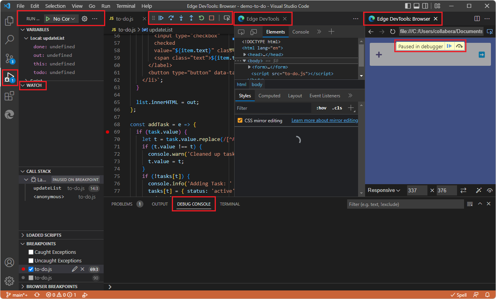
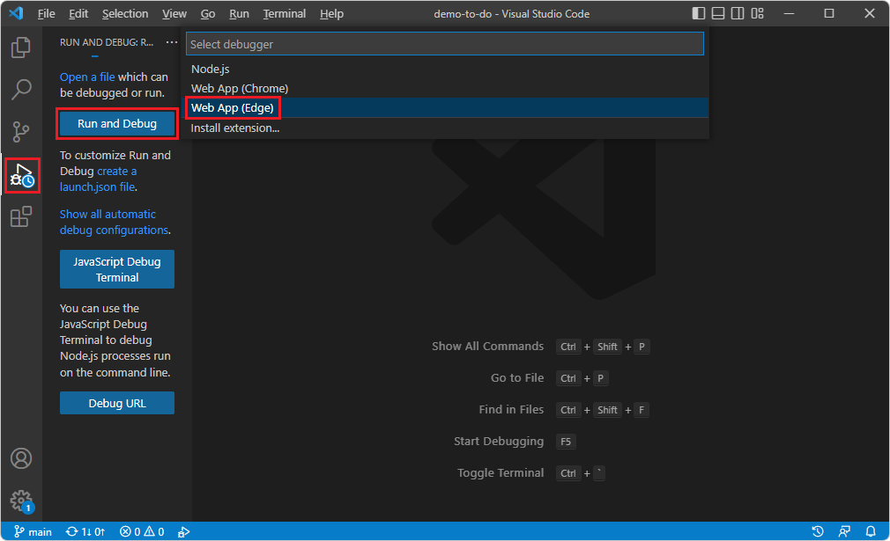
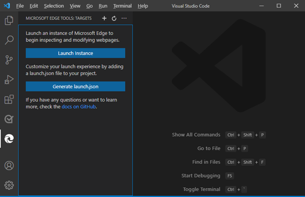

# Debugging a webpage

To open DevTools in Visual Studio Code in Debug mode, right-click an `.html` file or click the **Launch Project** button, as described in [Opening DevTools and the embedded DevTools browser](./open-devtools-and-embedded-browser.md).

When you open DevTools in Visual Studio Code in Debug mode, the following UI components are opened:
*  The **Edge DevTools** tab.
*  The **Edge DevTools: Browser** tab.
*  The Debug toolbar.
*  The **Run** (Debugger) Side Bar, including the **Watch** pane.
*  The **Debug Console** at bottom of window.

<!-- ====================================================================== -->
## Opening the browser as part of a debugging session

You can open the **Edge DevTools: Browser** tab (the embedded DevTools browser) as part of a debugging session.  The DevTools extension opens a new browser as an embedded browser in Visual Studio Code.  This **Devtools: Browser** tab can be moved anywhere within the editor.  You can use this tab side by side with your source code, or split the panes and have the browser preview below your code:

You can use the DevTools extension with the Visual Studio Code debugging workflow, as follows.

JavaScript debugging is built in to Visual Studio Code.  You can debug in Chrome, Microsoft Edge, or Node.js without installing any other extensions.  If you debug using Microsoft Edge, you can start Microsoft Edge DevTools from the JavaScript debugger.

1. To start debugging, do either of the following:
   *  Press **F5**.
   *  On the Activity Bar, click the **Run and Debug** icon (), and then in the **Run and Debug** Side Bar, click the **Run and Debug** button, as shown below.
   *  Open the Visual Studio Code command palette, start typing the word **debug**, and then select **Debug: Open Link**.<!--todo: mention **Select environment** text box" as shown in capture-->
    
   <!--todo: make capture match the above text-->

1. Select **Edge**.<!--todo: clarify; **Edge: Launch**?  describe specific UI/controls: link or button or command/list item-->  On the debug toolbar, notice the **Inspect** button:

   

1. Select **Inspect** to open Microsoft Edge DevTools inside Visual Studio Code.

   The first time you select **Inspect**, the editor prompts you to install the extension, [Microsoft Edge Developer Tools for Visual Studio Code](https://marketplace.visualstudio.com/items?itemName=ms-edgedevtools.vscode-edge-devtools).

   After the Microsoft Edge DevTools extension is installed, when you select **Inspect**, Microsoft Edge DevTools opens inside of Visual Studio Code:

   

<!-- ====================================================================== -->
## Automatically opening the browser and DevTools when debugging in Visual Studio Code

To debug your project, you might want to change the default page that opens in Microsoft Edge in Visual Studio Code.  To change the default page to your project's website:

1. In Visual Studio Code, select **File** > **New Window**.  Notice that no folder is open.

1. On the **Activity Bar**, select **Microsoft Edge Tools**.

1. In the **Microsoft Edge Tools: Targets** panel, click the **open a folder** link.

1. Select your project folder with the new default page to display when you begin debugging in Visual Studio Code.

   The first time you open a folder, you must confirm that you trust the authors of files in this folder.  You can also select the checkbox **Trust the authors of all files in the parent folder**:

   

   The first time you complete this process, you must also select **Microsoft Edge Tools** again.

   The **Microsoft Edge Tools: Targets** panel now displays two buttons: **Launch Instance** and **Generate launch.json**:

   

1. Select **Generate launch.json** to create a `launch.json` in your project.

1. In `launch.json`, add the URL of your project. If you leave URL empty, the default page is displayed.

1. Save `launch.json`.

When you choose to debug your project in Visual Studio Code it will automatically launch the browser and open the Developer Tools showing the URL you specified in your `launch.json`. 

<!-- ====================================================================== -->
## See also

* [Launch configurations](https://code.visualstudio.com/Docs/editor/debugging#_launch-configurations) in the _Debugging_ article for Visual Studio Code.
* [Microsoft Edge DevTools extension for Visual Studio Code](../microsoft-edge-devtools-extension.md)
