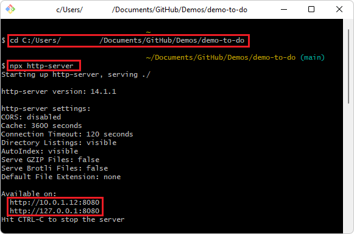
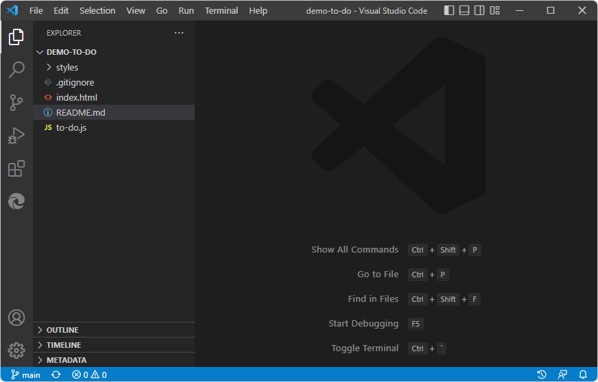
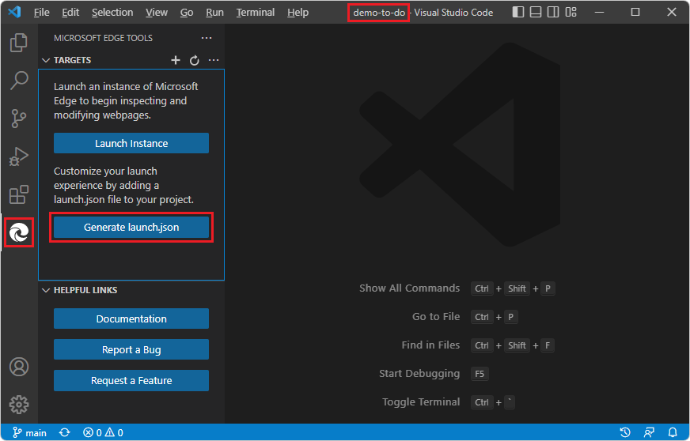

# Get started by clicking the Launch Project button

Use this tutorial to learn how to open and close DevTools by clicking the **Launch Project** button, to run **Demo To Do** on a localhost web server and store the URL for the webpage in `launch.json`.

We'll use the **demo-to-do** app to demonstrate the **Launch Project** button after pointing that button to a localhost URL such as [http://localhost:8080](http://localhost:8080).  The **Launch Project** button starts DevTools in debug mode.  This is the main way to open DevTools when your webpage requires running on a web server.  As a preliminary step, we'll creating a `launch.json` file and edit the URL in it to point to localhost serving out the **demo-to-do** example app.

You don't always need to use this approach, because in many cases, right-clicking an HTML file works.  However, many webpages use APIs which require the webpage to be running on a web server, so here are specific steps you can follow.

<!-- outline:
* Step 1: Install DevTools and prerequisites
* Step 2: Start the web server
* Step 3: Set up launch.json
* Step 4: Click the Launch Project button
* Step 5: Close DevTools
-->


<!-- ====================================================================== -->
## Step 1: Install DevTools and prerequisites

1. If you haven't already, do the steps in [Installing the DevTools extension for Visual Studio Code](./install.md), and then continue below.


<!-- ====================================================================== -->
## Step 2: Start the web server

<!--
install.md explains how to start the server for the first time.
get-started.md explains how to start the server not for the first time. -->

This section is in support of clicking the **Launch Project** button.

These steps explain how to start http-server by using the cross-platform git bash shell, which is part of git.  Although you could use Visual Studio Code > **View** > **Terminal** to start the server, it's better to start the server from a command prompt that's outside of Visual Studio Code, so that the server remains running even if you close and reopen Visual Studio Code or the folder.

1. If you haven't already, set up and start a web server for the first time, serving out the **demo-to-do** app from the Demos repo.  To do this, see [Step 6: Set up a localhost server](./install.md#step-6-set-up-a-localhost-server) in _Installing the DevTools extension for Visual Studio Code_.

1. Open git bash.  For example, on Windows, press `Start` and then enter **git bash**.

1. `cd` into the the specific folder you want to serve via http, `Demos\demo-to-do\`:

   In git bash, use forward slashes for file paths.  For example:

   ```
   cd C:/Users/username/Documents/GitHub/Demos/demo-to-do
   ```

1. Enter the command `npx http-server`.  A local webserver starts on port 8080.

   ```
   npx http-server
   ```
   
   

   Information about the server and localhost URL is displayed, such as:

   ```
   Starting up http-server, serving ./
   
   Available on:
   http://10.0.1.8:8080
   http://127.0.0.1:8080
   Hit CTRL-C to stop the server
   ```

   The displayed URLs are usually equivalent to the common standard URL, [http://localhost:8080](http://localhost:8080).


<!-- ====================================================================== -->
## Step 3: Set up launch.json

This section is in support of clicking the **Launch Project** button.

1. In Visual Studio Code, select **File** > **Open Folder**.  Select your project directory that contains `index.html` for the cloned **demo-to-do** sample in the Demos repo, such as `C:\Users\username\Documents\GitHub\Demos\demo-to-do\`.
   
   

   Just like in the repo's [demo-to-do](https://github.com/MicrosoftEdge/Demos/tree/main/demo-to-do) folder, initially there's no `.vscode` folder, and no `launch.json` file in that folder.

1. In the Activity Bar, click **Microsoft Edge Tools** ().  The **Microsoft Edge Tools** pane opens.

1. Click the **Generate launch.json** button:

   

   The new `launch.json` file opens.

1. In several places in the `launch.json` file, on each of the `"url"` lines, scroll to the right , and note the comment, "Provide your project's url":

   ```js
   "url": "c:\\Users\\username\\.vscode\\extensions\\ms-edgedevtools.vscode-edge-devtools-2.1.1\\out\\startpage\\index.html", 
   // Provide your project's url to finish configuring
   ```

1. In a web browser, go to the `http://localhost/` URL where the **demo-to-do** `.html` file is on the server, such as the common standard URL, [http://localhost:8080](http://localhost:8080).

1. Copy the URL from the address bar.

1. In `launch.json`, in each URL string, paste the URL for your cloned copy of the **demo-to-do** app, such as: `http://localhost:8080`.  Paste the path inside the quoted path string in one of the `"url"` strings.  For example:

   ```js
   "url": "http://localhost:8080", // Provide your project's url to finish configuring
   ```

1. Copy and paste the modified URL line to the other places in the `launch.json` file.

   Tip: To modify all instances at the same time, you can copy an updated URL string, then select an instance of the initial URL string, press `Ctrl`+`Shift`+`L` to select all instances, and then paste the updated string.

1. Save the `launch.json` file.


<!-- ====================================================================== -->
## Step 4: Click the Launch Project button

1. In Visual Studio Code, in the Activity Bar, click the **Microsoft Edge Tools** () button.  The **Microsoft Edge Tools** pane opens, now containing a **Launch Project** button but not a **Generate launch.json file** button:

   

1. Click the **Launch Project** button.

   The **Edge DevTools** tab and the **Edge DevTools: Browser** tab open in separate panes, showing the **demo-to-do** web app:

   

At this point, you could work with CSS edits or step through code in the debugger.  See these sections of the tutorial _Get started by right-clicking an HTML file_:
* [Step 4: Edit CSS in DevTools, updating the .css file automatically](./get-started-right-click-html.md#step-4-edit-css-in-devtools-updating-the-css-file-automatically)
* [Step 5: Step through JavaScript code in the Debugger](./get-started-right-click-html.md#step-5-step-through-javascript-code-in-the-debugger)


<!-- ====================================================================== -->
## Step 5: Close DevTools

To end debugging and close the **Edge DevTools** tabs:

1. In the Debug toolbar, click the **Stop** (`Shift`+**F5**) button:

   

   Or, on the **Run** menu, select **Stop Debugging**.  Or, close the two DevTools tabs.  The Debug toolbar closes.

See also:
* [Closing DevTools](./open-devtools-and-embedded-browser.md#closing-devtools) in _Opening DevTools and the DevTools browser_.


You've finished the tutorial "Get started by clicking the Launch Project button".  It's recommended that you also do the other tutorials; see [Get started using the DevTools extension for Visual Studio Code](./get-started.md).


<!-- ====================================================================== -->
## See also

* [Opening DevTools and the DevTools browser](./open-devtools-and-embedded-browser.md)
* [Microsoft Edge DevTools extension for Visual Studio Code](../microsoft-edge-devtools-extension.md)

**GitHub:**

* [demo-to-do](https://microsoftedge.github.io/Demos/demo-to-do/) - the demo web app running on the `github.io` server.
* [Source code for demo-to-do](https://github.com/MicrosoftEdge/Demos/tree/main/demo-to-do)
* [MicrosoftEdge/Demos repo](https://github.com/MicrosoftEdge/Demos)
