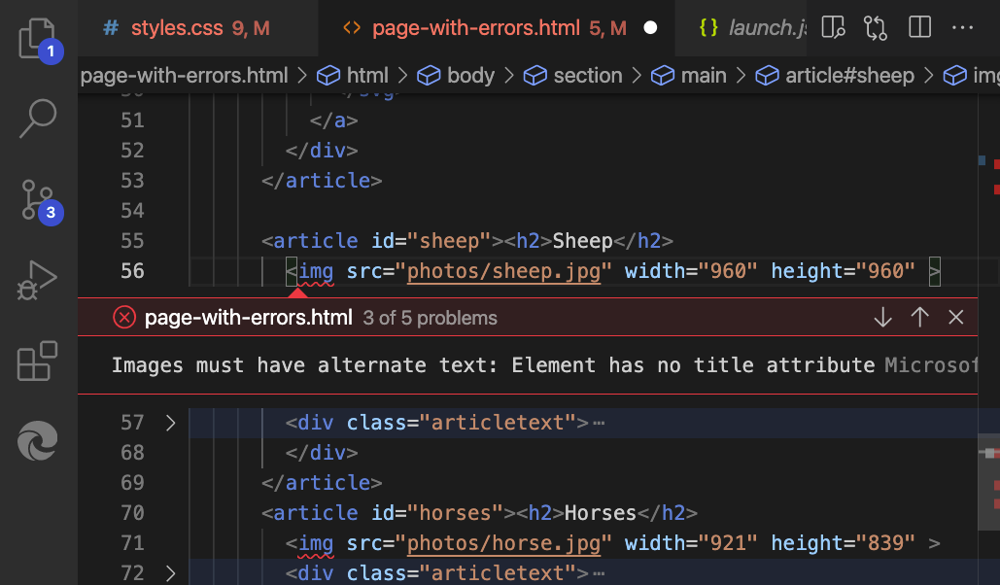
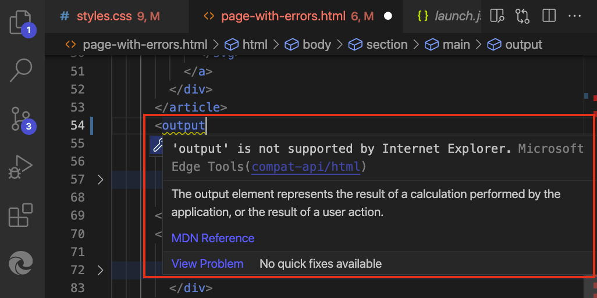

# Inline and live issue analysis

Issues in your source code are highlighted with wavy underlines. You can inspect the issue and get detailed information about what the problem is, how to fix it, and where to find more information.  To inspect the issue, select the code that has the wavy underline:

To see all the issues in the file, select **View Problem**:

The **Problems** tab in the lower panel lists all the issues in the currently open files:

<!-- ====================================================================== -->
## Live updating of issues reporting

Issues are evaluated live while you edit your code.  As you type, you get feedback about any issues that are found, and how to fix them:

<!-- ====================================================================== -->
## Automated Quick Fixes and issue filtering

<!--
bold "Quick Fix" when focusing on the UI
the UI label string is "Quick Fix", not "Quick Fixes"
-->

The Microsoft Edge DevTools extension for Visual Studio Code includes a **Quick Fix** feature.  By using Quick Fixes, you can customize the error reporting of the extension to meet the needs of the current project.

When you hover over an element that has an issue, you get a lightbulb icon indicating that there are Quick Fixes available:

Clicking the lightbulb icon shows a list of options. For example, if you added a link that has a protocol-relative URL, you get the following **Quick Fix** list to choose from:

You can select whichever **Quick Fix** you want to use to resolve the issue or to stop reporting it as an issue:

* **Fix "no-protocol-relative-urls" issue** - Adds the missing URL prefix `https://` to the link.

* **Disable "no-protocol-relative-urls" hints in this project** - Creates a `.hintrc` configuration file in the project folder, and tells the extension never to report this issue again.

* **Edit .hintrc for this project** - Opens the `.hintrc` configuration file so you can edit it to customize the extension's error reporting.

<!-- ====================================================================== -->
## See also

* [Microsoft Edge DevTools extension for Visual Studio Code](../microsoft-edge-devtools-extension.md)
