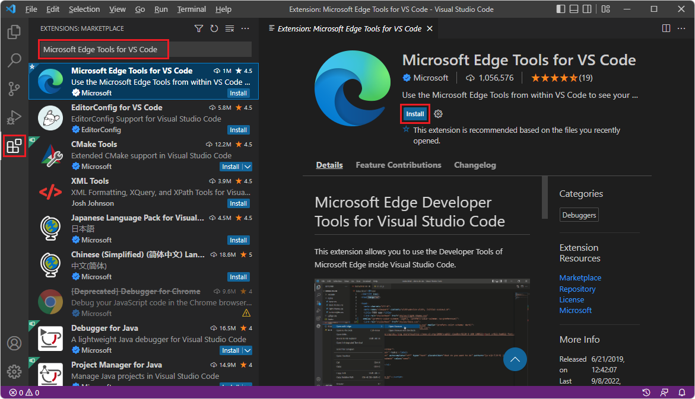
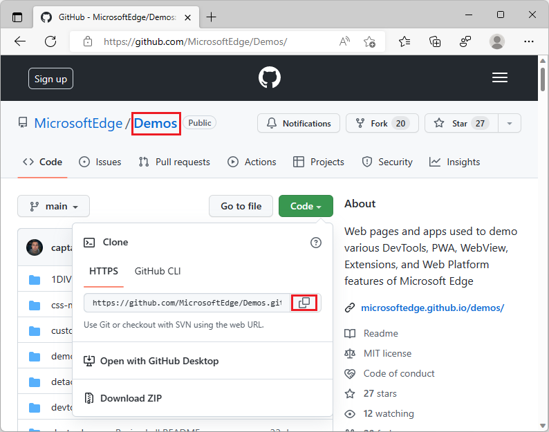
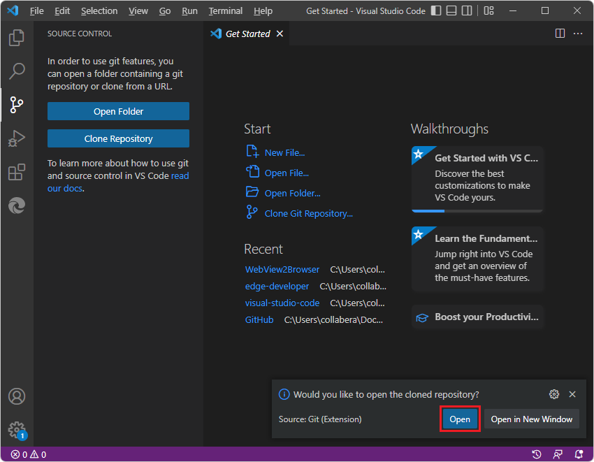
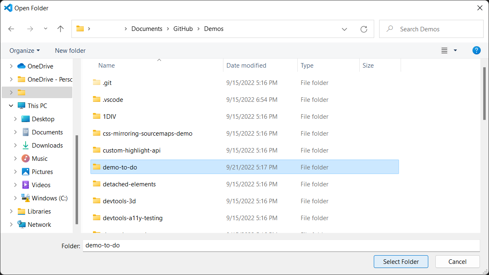
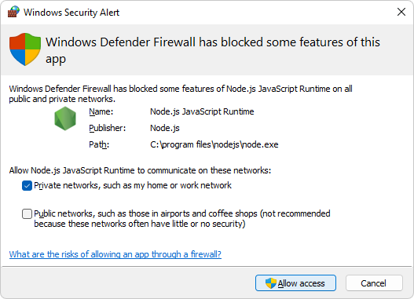

# Installing the DevTools extension for Visual Studio Code

The DevTools extension for VS Code provides many of the same tools that are in the DevTools that's in the Microsoft Edge browser, from within Visual Studio Code.  Either approach provides the **Elements** tool, CSS mirror editing, and debugging of `.js`, but VS Code has some advantages:
*  VS Code is a full IDE.
*  Its CSS mirror editing allows you to control whether to save changes to your `.css` file.

This article walks you through initial setup of the extension by cloning, loading, and modifying the **Demo To Do** sample web app from the **MicrosoftEdge/Demos** GitHub repo.

This article helps you:

* Install the DevTools extension.

* Decide when to use this extension in Visual Studio Code and when to use DevTools in the Microsoft Edge browser.

* Clone the Demos repo, which includes the demo-to-do web app.

* Use the DevTools extension for Visual Studio Code to set a breakpoint and step through the JavaScript code of the demo-to-do app.

* From within Visual Studio Code, open the Microsoft Edge browser several different ways.

* Compare using DevTools in the Microsoft Edge browser window versus in the Visual Studio Code IDE environment, by using the existing Demo Todo web app in the Demos repo for Microsoft Edge Developer documentation.


<!-- ====================================================================== -->
## Step 1: Install Visual Studio Code

1. If not done already, in a separate window or tab, go to [Download Visual Studio Code](https://code.visualstudio.com/Download) and download and install Visual Studio Code.


<!-- ====================================================================== -->
## Step 2: Install Microsoft Edge

Microsoft Edge is required, for the DevTools extension for VS Code.

On Windows, Microsoft Edge is installed.  On macOS or Linux, install Microsoft Edge as follows:

1. Go to the [Edge](https://www.microsoft.com/edge) page at Microsoft.com.


<!-- ====================================================================== -->
## Step 3: Install the Microsoft Edge DevTools extension

Install the Microsoft Edge DevTools extension for Visual Studio Code, as follows:

1. Open Visual Studio Code.

1. In the Activity Bar on the left, click the **Extensions** () button.  Or, press `Ctrl`+`Shift`+`X` on Windows/Linux or `Command`+`Shift`+`X` on macOS.  The **Extensions** Marketplace pane opens.

1. In the **Search Extensions in Marketplace** text box, enter **Microsoft Edge Tools for VS Code**.

1. Select the **Microsoft Edge Tools for VS Code**, and then click the **Install** button:

   

As an alternative approach, you can use the browser to download the Microsoft Edge DevTools extension from the Visual Studio Marketplace website.  Go to [Microsoft Edge Developer Tools for Visual Studio Code](https://marketplace.visualstudio.com/items?itemName=ms-edgedevtools.vscode-edge-devtools).


<!-- ====================================================================== -->
## Step 4: Install Node.js and Node Package Manager (npm)

To get live (realtime) analysis of your code to indicate issues, such as with wavy underlines, and to offer Quick Fixes, you must install Node.js and Node Package Manager (npm).

The DevTools extension shows a popup suggestion to install Node.js and npm.  The suggestion text is similar to: "Install Node.js & npm? (suggested because you installed this extension)".

1. Click the link in the popup, if it opens.

1. Install Node.js and npm from [Node.js](https://nodejs.org) > Downloads > LTS (long-term stable) (or, Current).

   On Windows, the .msi file is downloaded, such as `node-v16.17.1-x64.msi`.

1. In the browser's Downloads pane, Click **Show in folder**.  Run the downloaded file.  The Node.js Setup Wizard opens.  Click the **Next** button.  Follow the prompts.  

   Confirm that Node.js and npm are installed:

1. In Visual Studio Code, select **View** > **Terminal**.  At the command prompt, enter `npm version`.  A version number is displayed for `npm` and for `node`, indicating that Node Package Manager and Node.js are installed, to support inline and live issue analysis:

   ```
   $ npm version
   {
   npm: '8.15.0',
   node: '16.17.1',
   ...
   }
   ```

See also:
* [Inline and live issue analysis](./inline-live-issue-analysis.md)


<!-- ====================================================================== -->
## Step 5: Clone the Demos repo

Cloning the Demos repo is optional.  This repo is useful for following the DevTools documentation.  If you want, instead of cloning the repo, you can open an existing project directory if you have one.
<!-- todo: link to steps instead of placing them below: -->

To clone the **Demos** repo to use the **demo-to-do** sample for this tutorial:

1. Go to [MicrosoftEdge/Demos repo](https://github.com/MicrosoftEdge/Demos/).

1. If the green **Code** button isn't shown, click **Demos** in the path **Microsoft Edge** / **Demos** in the upper left to go to the main page of the repo.

1. Click the green **Code** button, and then select the **Copy** button.  This article assumes you're using the **Source Control** features within Visual Studio Code.  Or, you can use one of the other methods that are provided, if you know that you want to use that approach instead:
   *  **Open with GitHub Desktop**
   *  **Open with Visual Studio**
   *  **Download ZIP**

   

1. In Visual Studio Code, in the Activity Bar, click the **Source Control** () button, and then click the **Clone Repository** button.

1. In the **Provide repository URL** text box, paste the copied URL: **https://github.com/MicrosoftEdge/Demos.git** and then press `Enter`.  A folder selection dialog opens.

   

1. Navigate to your desired path, such as `C:\Users\myusername\Documents\GitHub` or `Users/myusername/GitHub`, and then click the **Select Repository Location** button.

1. The message **Cloning git repository** appears, then you're prompted to open the cloned repository.  Click the **Open** button:

   

1. If prompted **Do you trust...**, click the **Yes** button.  Or, click the **No** button and continue with most parts of this walkthrough.

   The **Explorer** tree lists many demos, including **demo-to-do**.

1. In Visual Studio, select **File** > **Close Folder**.

1. In Visual Studio Code, in the Activity Bar, click the **Microsoft Edge Tools** () button.  The **Microsoft Edge Tools** pane opens.

1. In the **Microsoft Edge Tools** > **Targets** pane, click the **Open Folder** button.  The **Open Folder** dialog box opens.  Navigate to the `demo-to-do` folder in the Demo repo that you cloned, select the folder or go into it, and then click the **Select Folder** button:

   

   An example of a repo location where the **Demos** repo has been cloned is shown above.  The `demo-to-do` folder of the cloned **Demos** repo opens in the Explorer of Visual Studio Code, and no `launch.json` file exists yet:

   


<!-- ====================================================================== -->
## Step 6: Set up a localhost server by using npx http-server

In many cases, you don't need a URL or a localhost server.  See [Step 3: Start DevTools in debug mode by right-clicking an HTML file](./get-started.md#step-3-start-devtools-in-debug-mode-by-right-clicking-an-html-file) in _Get started using the DevTools extension for Visual Studio Code_.

If your webpage uses certain APIs that require the webpage to be running on a web server, to use DevTools, you must start a local web server for testing.  If you don't serve out your project on a webserver, but only instead, you use local files, you can still use DevTools, with debugging ability, by right-clicking a local `.html` file.  Functionality of your app which specifically requires your app to be on a server won't work, and DevTools will have limited utility.

If you installed Node.js and npm, as described above, `npx http-server` is a simple way to start a local web server.  For information, see [http-server: a simple static HTTP server](https://www.npmjs.com/package/http-server).


1. In Visual Studio Code, select **File** > **Open Folder** > open the directory that contains the `.html`, `.css`, and `.js` files for a webpage, such as `C:\Users\myusername\Documents\GitHub\Demos\demo-to-do\`.

   In the above example path:
   *  `\Documents\GitHub\` is where the `Demos` repo was cloned to.
   *  `\Demos\` is the GitHub repo that's used for examples in the Microsoft Edge Developer documentation.
   *  `\demo-to-do\` is one of the sample directories in the repo.

1. In Visual Studio Code, select **View** > **Terminal**.  Or, to keep the web server running regardless of Visual Studio's state, open a command prompt outside of Visual Studio Code, such as `git bash`.

1. `cd` into the the folder you want to serve via http.

   For example, on Windows:

   ```
   cd C:\Users\myusername\Documents\GitHub\Demos\demo-to-do\
   ```

<!-- if you cd to 
C:\Users\myusername\Documents\GitHub\Demos\
you would then specify
http://localhost:8080/demo-to-do/
but it's fine usually to serve out a single sample dir
but serving out the entire \Demos\ dir gives a useful dir listing at:
   http://10.0.1.8:8080
   http://127.0.0.1:8080
-->

   **Start the server (npx http-server):**<!-- make prominent/findable -->

1. Enter the command `npx http-server`:

   ```
   npx http-server
   ```

   A local webserver starts on port 8080.

   You might receive a message like:

   ```
   Need to install the following packages:
     http-server@14.1.1
   Ok to proceed? (y)
   ```

1. Enter **y**.

   Windows prompts whether to allow Node to communicate on the network:

   

1. Select the **Private networks** checkbox, and then click the **Allow access** button.

   Information about the server and localhost URL is displayed, such as:

   ```
   Starting up http-server, serving ./
   
   Available on:
   http://10.0.1.8:8080
   http://127.0.0.1:8080
   Hit CTRL-C to stop the server
   ```
   
   The displayed URLs are equivalent to [http://localhost:8080/](http://localhost:8080/).

Next, see [Get started using the DevTools extension for Visual Studio Code](./get-started.md) for a step-by-step walkthrough.


<!-- ====================================================================== -->
## Step 7: Set up a localhost server by using IIS on Windows

If you use `npx http-server` as described above, you can skip this section.

These detailed steps are specific to IIS, which is not cross-platform, and involves multiple steps to set up.  These instructions are for IIS on Windows; use equivalent steps for your environment.

1. In Windows, select **Start** > **Control Panel**:

   

1. Click **Turn Windows features on or off**:

   

1. Select the **Internet Information Services** (IIS) checkbox, and then click the **OK** button:

   

   Windows applies the changes.

1. Click the **Close** button to close the **Windows Features** dialog.

1. In a web browser, go to [http://localhost](http://localhost).

1. Optionally, click in the page to go to [Microsoft IIS.net](https://www.iis.net) for information about using IIS.  For example, see:

   * [Getting Started with the IIS Manager in IIS](/iis/get-started/getting-started-with-iis/getting-started-with-the-iis-manager-in-iis-7-and-iis-8).
   * [Add a Web Site](/iis/get-started/getting-started-with-iis/create-a-web-site#add-a-web-site) in _Create a Web Site_ in the IIS docs.

1. Select **Start** > type **iis** > select **Internet Information Services (IIS) Manager** > **Open**:

   

1. Click the **Explore** link in the upper right:

   

   File Explorer opens, to a location such as `C:\inetpub\wwwroot`.

1. Copy the demo-to-dir directory from the Demos repo into that directory:

   

1. In a web browser, go to [http://localhost:8080/](http://localhost:8080/), [http://localhost/demos/demo-to-do/](http://localhost/demos/demo-to-do/), or the equivalent location matching where you placed the `.html` file that you want to load later in the DevTools extension:

   

Next, see [Get started using the DevTools extension for Visual Studio Code](./get-started.md) for a step-by-step walkthrough.


<!-- ====================================================================== -->
## See also

* [Get started using the DevTools extension for Visual Studio Code](./get-started.md)
