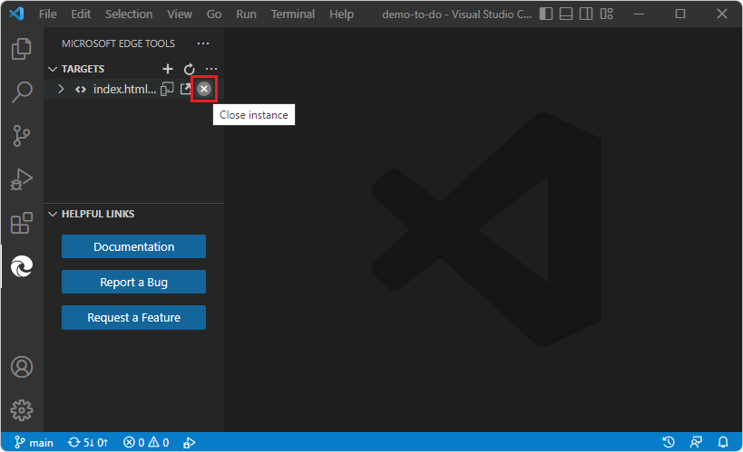
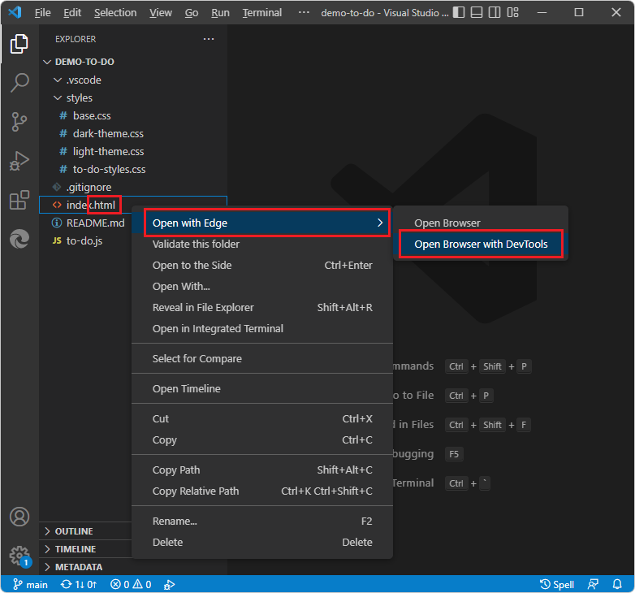
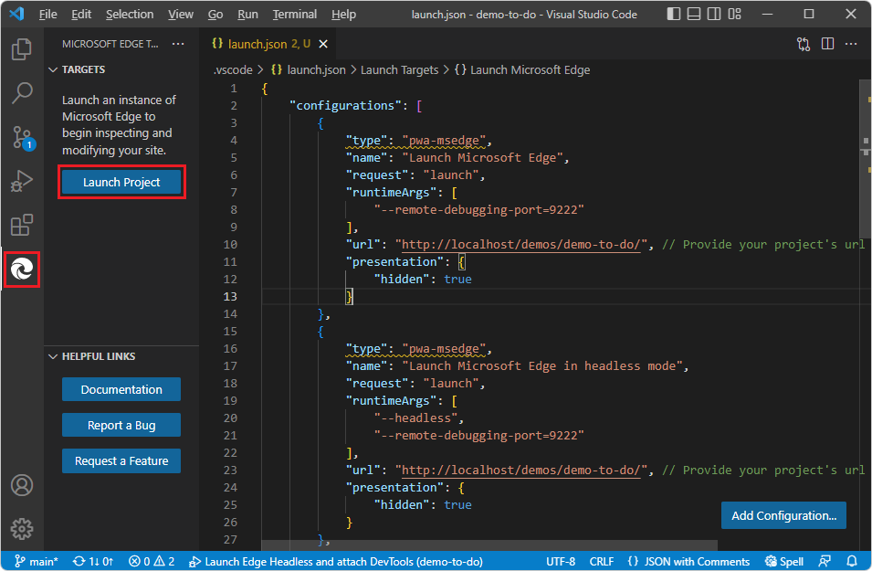

# Opening DevTools and the embedded DevTools browser

<!-- shortest possible names of the approaches -->
There are several ways to open the **DevTools** tab and the **Edge DevTools: Browser** tab:
*  Click the **Launch Instance** button.
*  Right-click an `.html` file.
*  Click the **Launch Project** button.

These approaches are described below.


<!-- ====================================================================== -->
## Opening DevTools by clicking the Launch Instance button

This approach opens the DevTools tabs in non-debug mode and is useful when you don't want the Debug toolbar.

These steps assume no folder is open in Visual Studio Code, and the folder you are opening doesn't have a `launch.json` file.

1. Open Visual Studio Code.

1. **File** > **Open Folder** > select a folder.  For example, `C:\Users\myusername\Documents\GitHub\Demos\demo-to-do\`

1. In the Activity Bar, click the **Microsoft Edge Tools** () button, and then click the **Launch Instance** button.

   

   If there's a **Launch Project** button rather than a **Launch Instance** button, that indicates that the folder contains a `launch.json` file.  Inspect what URL is specified in the `launch.json` file and consider clicking **Launch Project**, as described in [Opening DevTools by clicking the Launch Project button](#opening-devtools-by-clicking-the-launch-project-button).

   

   *  The **Edge DevTools** tab opens, initially containing information about the Success page.
   *  The **Edge DevTools: Browser tab** (the embedded browser) opens, initially showing the Success page.
   *  The Debug toolbar and debug UI of Visual Studio Code doesn't open.
   *  In the **Microsoft Edge Tools** pane, the **Targets** section opens, listing a target, and the **Launch** button is removed.

1. In the **Edge DevTools: Browser** tab, in the address bar, paste a file path or a localhost URL, that matches the folder that's open in Visual Studio Code.

   If you want to obtain a file path: in Visual Studio Code > Activity Bar > **Explorer** () > right-click an `.html` file > **Copy Path**.

   If you want to paste a URL, typical examples are:
   * [http://localhost:8080](http://localhost:8080)
   * [http://127.0.0.1:8080](http://127.0.0.1:8080)
   * [http://10.0.1.8:8080](http://10.0.1.8:8080)
   * [http://localhost/demos/demo-to-do/](http://localhost/demos/demo-to-do/) if you started the server from the root directory of the Demos repo.

   Similar URLs are shown on the command line when you enter `npx http-server`.

   The webpage you specified is displayed in the **Edge DevTools: Browser tab** (the embedded browser).  The **Edge DevTools** tab displays information about the webpage.


#### Closing DevTools

To close DevTools after opening it by clicking the **Launch Instance** button:

1. In the Activity Bar, click the **Microsoft Edge Tools** () button.

1. In the **Targets**, hover to the right of the target instance, and then click **Close instance** (**x**):

   

   The **Launch Instance** button appears, indicating that the DevTools instances are closed.


<!-- ====================================================================== -->
## Opening DevTools by right-clicking an HTML file

This approach opens the DevTools tabs in debug mode and is recommended, unless the webpage requires running on a web server, as with certain APIs.

To open DevTools and the embedded browser, along with the Debug toolbar for an HTML file on your hard drive:

1. In Visual Studio Code, select **Activity Bar** > **Explorer** () > **Open Folder**.  Or, select **File** > **Open Recent**.

1. Open a folder that contains web app source files.

1. In Visual Studio Code, in **Explorer**, right-click an `.html` file, select **Open with Edge**, and then select **Open Browser with DevTools**:

   

   DevTools opens:

   

   The following components open in Visual Studio Code:
   *  The **Edge DevTools** tab, including the **Elements** tab and other tool tabs.
   *  The **Edge DevTools: Browser** tab.
   *  The Debug toolbar.
   *  The Debug Console.
   *  The **View** > **Run** (**Run and Debug**) pane.
   *  In this approach, an instance is not listed in **Activity Bar** > **Microsoft Edge Tools** > **Targets**.

   

Use the **Explorer** Side Bar, from the Activity Bar, to open a `.js` file during debugging a webpage.

The **Edge DevTools: Browser** tab includes a Device Emulation toolbar.  This tab contains an embedded web browser with DevTools features.  This browser is sometimes called a _screencast_ or a _headless browser_ for DevTools.


#### Closing DevTools

To close DevTools after opening it by right-clicking an `.html` file, in the Debug toolbar, click the **Stop** (`Shift`+`F5`) button:

   

   Or, on the **Run** menu, select **Stop Debugging**.  Or, close the two DevTools tabs.  The Debug toolbar closes.


<!-- ====================================================================== -->
## Opening DevTools by clicking the Launch Project button

This approach opens the DevTools tabs in debug mode, and is recommended if the webpage requires running on a web server as with certain APIs.

Summary:
1. Open a local folder containing web app source files.
1. Click the **Generate launch.json** button.
1. Add a localhost URL in the `.json` file.
1. Click the **Launch Project** button.

These steps assume you are running a localhost web server, as described in [Step 6: Set up a localhost server by using npx http-server](./install.md#step-6-set-up-a-localhost-server-by-using-npx-http-server) in _Installing the DevTools extension for Visual Studio Code_.

To open DevTools by clicking the **Launch Project** button:


   **Open a local folder containing web app source files:**

1. In Visual Studio, select **File** > **Open Folder**.  Select your project directory that contains a `.html` file, such as `C:\Users\myusername\Documents\GitHub\Demos\demo-to-do\`.
   
1. In the Activity Bar, click **Microsoft Edge Tools** ().  The **Microsoft Edge Tools** pane opens.

   *  If the folder doesn't already contain a `.vscode` directory that contains a `launch.json file`, the **Microsoft Edge Tools** Side Bar contains a **Launch Instance** button and a **Generate launch.json** button.

   *  If the **Microsoft Edge Tools** Side Bar contains a **Launch Project** button, the opened folder's `.vscode` directory contains a `launch.json` file and you may want to inspect or change the `url` string in that file, described below.

1. Click the **Generate launch.json** button:

   

   The new `launch.json` file opens.

1. In several places in the `launch.json` file, on each of the `"url"` lines, scroll to the right, and note the comment, "Provide your project's url to finish configuring":

   ```js
   "url": "c:\\Users\\username\\.vscode\\extensions\\ms-edgedevtools.vscode-edge-devtools-2.1.1\\out\\startpage\\index.html", 
   // Provide your project's url to finish configuring
   ```

   Typical examples:
   * [http://localhost:8080](http://localhost:8080)
   * [http://127.0.0.1:8080](http://127.0.0.1:8080)
   * [http://10.0.1.8:8080](http://10.0.1.8:8080)
   * [http://localhost/demos/demo-to-do/](http://localhost/demos/demo-to-do/) if you started the server from the root directory of the Demos repo.

   Similar URLs are shown on the command line when you enter `npx http-server`.

1. Paste the path inside the quoted path string in one of the `"url"` strings.  For example:

   ```js
   "url": "http://localhost/demo-to-do/", // Provide your project's url to finish configuring
   ```

1. Copy and paste the modified URL line to the other places in the `launch.json` file.  To modify all instances at the same time, you can copy an updated URL string, then select an instance of the initial URL string, press `Ctrl`+`Shift`+`L` to select all instances, and then paste the updated string.

1. Save the `launch.json` file.


   **Click the Launch Project button:**

1. In Visual Studio Code, in the Activity Bar, click the **Microsoft Edge Tools** () button.  The **Microsoft Edge Tools** pane opens, now containing a **Launch Project** button (instead of a **Launch Instance** button), and no longer contains a **Generate launch.json file** button:

   

1. Click the **Launch Project** button.

   The **Edge DevTools** tab and the **Edge DevTools: Browser** tab open in separate panes, showing the web app URL that's specified in `launch.json`:

   


#### Closing DevTools

To close DevTools after opening it by clicking the **Launch Project** button, in the Debug toolbar, click the **Stop** (`Shift`+`F5`) button:

   

   Or, on the **Run** menu, select **Stop Debugging**.  Or, close the two DevTools tabs.  The Debug toolbar closes.


<!-- ====================================================================== -->
## Local vs. remote URLs

In the address bar of the **Edge DevTools: Browser** tab, you can paste a local URL and get read/write DevTools functionality, or paste a remote URL and get read-only functionality.

If you paste a non-local URL, such as `https://microsoftedge.github.io/Demos/demo-to-do/`, you get browser functionality in the **Edge DevTools: Browser** tab, but not full DevTools functionality.  You can interact with the page and see it in different devices and rendering states from the lower bar.  You can also inspect the CSS and HTML, but if you try to change the page, you get an error, such as **Error while mirroring**:


<!-- ====================================================================== -->
## See also

* [Get started using the DevTools extension for Visual Studio Code](./get-started.md)
