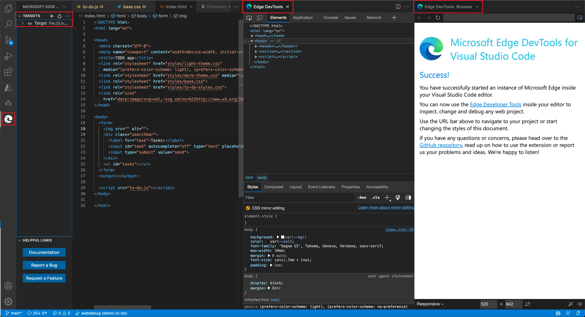
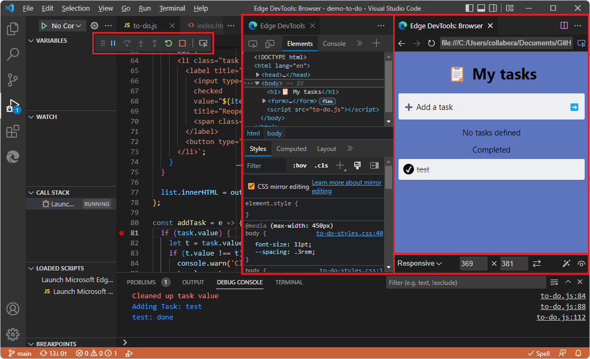
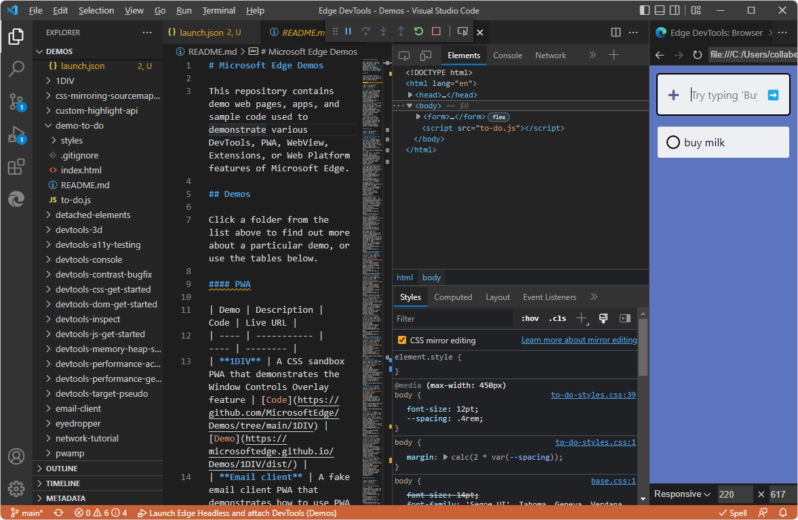
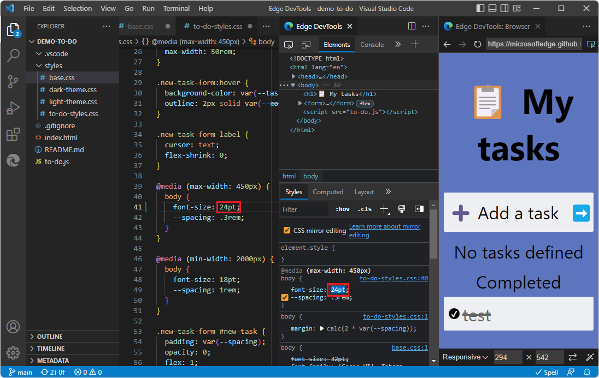

# Opening DevTools and the DevTools browser

There are several ways to open the **DevTools** tab and the **Edge DevTools: Browser** tab:

| Approach | Description |
|---|---|
| Click the **Launch Instance** button. | No `launch.json` file is used.  Opens DevTools in non-debug mode.  Use this approach if you don't want to debug. |
| Right-click an `.html` file. | No `launch.json` file is used.  Opens DevTools in Debug mode.  Use this approach if you want to debug, and your web app can run from the file system instead of a web server. |
| Click the **Launch Project** button. | A `launch.json` file is used.  Opens DevTools in Debug mode.  Use this approach if you want to debug, and your web app uses APIs that require running it on a web server. |

These approaches are described below.  For detailed steps using the Demos repo, see [Get started using the DevTools extension for Visual Studio Code](./get-started.md).


<!-- ====================================================================== -->
## Opening DevTools by clicking the Launch Instance button

This approach opens the DevTools tabs in non-debug mode and is useful when you don't want the Debug toolbar.

These steps assume that initially, no folder is open in Visual Studio Code, and the folder you are opening doesn't have a `launch.json` file.

1. In Visual Studio Code, do any of the following:

   *  Select **Activity Bar** > **Explorer** () > click the **Open Folder** button.
   *  Select **File** > **Open Folder**.
   *  Select **File** > **Open Recent**.

   To use all the DevTools features, including CSS mirror editing of your local source file when you edit CSS in DevTools, open a folder that contains source files that match the webpage that you want to display in DevTools.

1. In the Activity Bar, click the **Microsoft Edge Tools** () button, and then click the **Launch Instance** button.

   

   If there's a **Launch Project** button rather than a **Launch Instance** button, that indicates that the folder contains a `launch.json` file.  Inspect what URL is specified in the `launch.json` file and consider clicking **Launch Project**, as described in [Opening DevTools by clicking the Launch Project button](#opening-devtools-by-clicking-the-launch-project-button).  Or, if you want to explore how the **Launch Instance** button works, you can delete the `launch.json` file and generate a new `launch.json` file later.

   

   *  The **Edge DevTools** tab opens, initially containing information about the Success page, such as `C:\Users\myusername\.vscode\extensions\ms-edgedevtools.vscode-edge-devtools-2.1.1\out\startpage\index.html`.
   *  The **Edge DevTools: Browser tab** (the embedded browser) opens, initially showing the Success page.
   *  The Debug toolbar and debug UI of Visual Studio Code doesn't open.
   *  In the **Microsoft Edge Tools** pane, the **Targets** section opens, listing a target, and the **Launch Instance** button is removed.

1. In the **Edge DevTools: Browser** tab, in the address bar, paste a file path or a URL, that matches the folder that's open in Visual Studio Code.

   If you want to obtain a file path: in Visual Studio Code > Activity Bar > **Explorer** () > right-click an `.html` file > **Copy Path**.

   If you want to paste a URL, typical examples are:
   * [http://localhost:8080](http://localhost:8080)
   * [http://127.0.0.1:8080](http://127.0.0.1:8080)
   * [http://10.0.1.8:8080](http://10.0.1.8:8080)
   * [http://localhost/demos/demo-to-do/](http://localhost/demos/demo-to-do/) if you started the server from the root directory of the Demos repo.

   Similar URLs are shown on the command line when you enter (for example) `npx http-server` to run a web server locally.

   The webpage you specified is displayed in the **Edge DevTools: Browser tab** (the embedded browser).  The **Edge DevTools** tab displays information about the webpage.


See also:
* [Step 2: Start DevTools by clicking the Launch Instance button for the default page](./get-started.md#step-2-start-devtools-by-clicking-the-launch-instance-button-for-the-default-page) in _Get started using the DevTools extension for Visual Studio Code_.


<!-- ====================================================================== -->
## Opening DevTools by right-clicking an HTML file

This approach opens the DevTools tabs in debug mode and is recommended, unless the webpage requires running on a web server, as with certain APIs.

To open DevTools and the embedded browser, along with the Debug toolbar for an HTML file on your hard drive:

1. In Visual Studio Code, do any of the following:

   *  Select **Activity Bar** > **Explorer** () > click the **Open Folder** button.
   *  Select **File** > **Open Folder**.
   *  Select **File** > **Open Recent**.

1. Open a folder that contains web app source files.

1. In Visual Studio Code, in **Explorer**, right-click an `.html` file, select **Open with Edge**, and then select **Open Browser with DevTools**:

   

   DevTools opens:

   

   The following components open in Visual Studio Code:
   *  The **Edge DevTools** tab, including the **Elements** tab and other tool tabs.
   *  The **Edge DevTools: Browser** tab.
   *  The Debug toolbar.
   *  The Debug Console.
   *  The **View** > **Run** (**Run and Debug**) pane.
   *  In this approach, an instance is not listed in **Activity Bar** > **Microsoft Edge Tools** > **Targets**.

   

Use the **Explorer** Side Bar, from the Activity Bar, to open a `.js` file during debugging a webpage.

The **Edge DevTools: Browser** tab includes a Device Emulation toolbar.  This tab contains an embedded web browser with DevTools features.  This browser is sometimes called a _screencast_ or a _headless browser_ for DevTools.


See also [Step 4: Start DevTools by right-clicking an HTML file](./get-started.md#step-4-start-devtools-by-right-clicking-an-html-file) in _Get started using the DevTools extension for Visual Studio Code_.


<!-- ====================================================================== -->
## Opening DevTools by clicking the Launch Project button

This approach opens the DevTools tabs in debug mode, and is recommended if the webpage requires running on a web server as with certain APIs.

Summary:
1. Open a local folder containing web app source files.
1. Click the **Generate launch.json** button.
1. Add a localhost URL in the `.json` file.
1. Click the **Launch Project** button.

These steps assume you are running a localhost web server, as described in [Step 6: Set up a localhost server by using npx http-server](./install.md#step-6-set-up-a-localhost-server-by-using-npx-http-server) in _Installing the DevTools extension for Visual Studio Code_.

To open DevTools by clicking the **Launch Project** button:


   **Open a local folder containing web app source files:**

1. In Visual Studio Code, do any of the following:

   *  Select **Activity Bar** > **Explorer** () > click the **Open Folder** button.
   *  Select **File** > **Open Folder**.
   *  Select **File** > **Open Recent**.

   Select a directory that contains webpage source files.
   
1. In the Activity Bar, click **Microsoft Edge Tools** ().  The **Microsoft Edge Tools** pane opens.

   *  If the folder doesn't already contain a `.vscode` directory that contains a `launch.json file`, the **Microsoft Edge Tools** Side Bar contains a **Launch Instance** button and a **Generate launch.json** button.

   *  If the **Microsoft Edge Tools** Side Bar contains a **Launch Project** button, the opened folder's `.vscode` directory contains a `launch.json` file and you may want to inspect or change the `url` string in that file, described below.

1. Click the **Generate launch.json** button:

   

   The new `launch.json` file opens.

1. In several places in the `launch.json` file, on each of the `"url"` lines, scroll to the right, and note the comment, "Provide your project's url to finish configuring":

   ```js
   "url": "c:\\Users\\username\\.vscode\\extensions\\ms-edgedevtools.vscode-edge-devtools-2.1.1\\out\\startpage\\index.html", 
   // Provide your project's url to finish configuring
   ```

   Typical examples:
   * [http://localhost:8080](http://localhost:8080)
   * [http://127.0.0.1:8080](http://127.0.0.1:8080)
   * [http://10.0.1.8:8080](http://10.0.1.8:8080)
   * [http://localhost/demos/demo-to-do/](http://localhost/demos/demo-to-do/) if you started the server from the root directory of the Demos repo.

   Similar URLs are shown on the command line when you enter `npx http-server`.

1. Paste the path inside the quoted path string in one of the `"url"` strings.  For example:

   ```js
   "url": "http://localhost/demo-to-do/", // Provide your project's url to finish configuring
   ```

   The URL string can be a local file path, though in that case, you don't need a `launch.json` file; you can right-click an `.html` file instead.

   If you keep the URL as-is, the default, **Success** page is displayed, and you can paste a localhost URL or a file path into the address bar of the **Edge DevTools: Browser** tab.

1. Copy and paste the modified URL line to the other places in the `launch.json` file.  To modify all instances at the same time, you can copy an updated URL string, then select an instance of the initial URL string, press `Ctrl`+`Shift`+`L` to select all instances, and then paste the updated string.

1. Save the `launch.json` file.


   **Click the Launch Project button:**

1. In Visual Studio Code, in the Activity Bar, click the **Microsoft Edge Tools** () button.  The **Microsoft Edge Tools** pane opens, now containing a **Launch Project** button (instead of a **Launch Instance** button), and no longer contains a **Generate launch.json file** button:

   

1. Click the **Launch Project** button.

   The **Edge DevTools** tab and the **Edge DevTools: Browser** tab open in separate panes, showing the web app URL that's specified in `launch.json`:

   


See also:
* [Step 7: Start DevTools by clicking the Launch Project button](./get-started.md#step-7-start-devtools-by-clicking-the-launch-project-button) in _Get started using the DevTools extension for Visual Studio Code_.


<!-- ====================================================================== -->
## Mapping URL files to the opened folder

If DevTools is able to correlate and establish the workspace mapping between the files downloaded from the server and the files in the folder that you opened, DevTools provides its full functionality, including CSS mirror editing of your local source files when you change CSS in DevTools.

If DevTools can't map the files in the **Edge DevTools: Browser** tab to the files in the folder that you opened in Visual Studio Code's Explorer, you can inspect webpages, and you can change them, such as changing CSS values in the **Sources** tab of the **Elements** tool in the **Edge DevTools** tab.  In this case, though, you can't use CSS mirror editing though, to have DevTools automatically edit your source files.  Options include: 
*  Clear the **CSS mirror editing** checkbox in **Styles** tab and continue experimenting with CSS changes.
*  Open a folder that contains source files that match the web page.
*  Grant trust to a folder by opening it in Visual Studio Code.

For example:

1. Open a folder that's in your local copy of the Demos repo, such as `C:\Users\myusername\Documents\GitHub\Demos\demo-to-do\`, as described in [Get started using the DevTools extension for Visual Studio Code](./get-started.md).

1. Open DevTools, as described above.

1. In the **Edge DevTools: Browser** tab, in the address bar, paste a remote `github.io` URL, such as [https://microsoftedge.github.io/Demos/demo-to-do/](https://microsoftedge.github.io/Demos/demo-to-do/).

   The files at that address actually reside as source files at GitHub at [https://github.com/MicrosoftEdge/Demos/tree/main/demo-to-do](https://github.com/MicrosoftEdge/Demos/tree/main/demo-to-do), not on your drive.

   You are now able to change CSS values in the **Elements** tool, because in Visual Studio Code's **Explorer**, a folder is open that contains source files that DevTools is able to map to the downloaded resource files constituting the webpage:

   

   Next, try changing CSS without a folder opened:

1. Select **File** > **Close Folder**.

1. Start DevTools by clicking the **Launch Instance** button, as described above.

1. In the **Edge DevTools: Browser** tab, in the address bar, paste a remote `github.io` URL, such as [https://microsoftedge.github.io/Demos/demo-to-do/](https://microsoftedge.github.io/Demos/demo-to-do/).

   Now that the folder containing source files is closed, if you try to change CSS values in the **Elements** tool, you get a DevTools error message.  You can inspect webpages, but not edit them.  You can interact with the page and see it in different devices and rendering states by using the Device Emulation toolbar at the bottom of the **Edge DevTools: Browser** tab.  You can also inspect the CSS and HTML.  But if you try to change the page, you get an error, such as **Error while mirroring**:

   

   As another perspective on that scenario, here is the **Microsoft Edge Tools** Side Bar when the **Launch Instance** button was clicked, when viewing a URL and a folder isn't open that contains source files that match the URL's webpage resources:

   

Options in this case include: 

*  Clear the **CSS mirror editing** checkbox in **Styles** tab and continue experimenting with CSS changes (without automatic editing of CSS in source files).  This prevents further error messages about mapping to source files for CSS mirror editing.

*  Open a folder that contains source files that match the web page, to have automatic editing of CSS in source files.

*  Grant trust to a folder by opening it in Visual Studio Code, in case DevTools is attempting to edit a source file but Visual Studio Code hasn't granted trust to the containing folder.

See also:
* [Troubleshooting the DevTools extension](./troubleshooting.md)


#### URLs, file paths, and opening a matching folder

In some cases, behavior of DevTools is different for file paths than for URLs.

*  If you enter a file path in the address bar of the DevTools browser, and you edit the CSS in DevTools, the browser knows where to find the source files.  You might need to open that folder to grant trust to it, to be able to use CSS mirror editing.  Or, clear the **CSS mirror editing** checkbox.

*  If you enter a URL in the address bar of the DevTools browser, the browser knows where to find the downloaded copy of the source files, if you are only inspecting webpages and experimenting with CSS.  If you want to use CSS mirror editing (to have DevTools edit CSS in source files), the **CSS mirror editing** checkbox must be selected and you must open a folder in Visual Studio Code containing source files that match the webpage.


<!-- ====================================================================== -->
## Closing DevTools

Close instances of DevTools by using any of the following approaches:

*  If Visual Studio Code is in Debug mode, click the **Stop** button in the Debug toolbar, or select **Run** > **Stop Debugging**:

   

   The **Edge DevTools** and **Edge DevTools: Browser** tabs close.

*  If the **Edge DevTools** tab is open, click **Close** (**x**) on the tab.

*  If the **Edge DevTools: Browser** tab is open, click **Close** (**x**) on the tab.

*  Select Activity Bar > **Microsoft Edge Tools**.  If the **Targets** section lists any targets, hover on the right side of the target instance and then click **Close instance** (**x**):

   

   The **Launch Instance** or **Launch Project** button is then displayed.

*  Select **File** > **Close Folder**.

*  Close the Visual Studio Code window.

*  If an external, automation-controlled browser was opened by the DevTools extension, close the external browser window.


<!-- ====================================================================== -->
## See also

* [Get started using the DevTools extension for Visual Studio Code](./get-started.md)
* [Microsoft Edge DevTools extension for Visual Studio Code](../microsoft-edge-devtools-extension.md)
