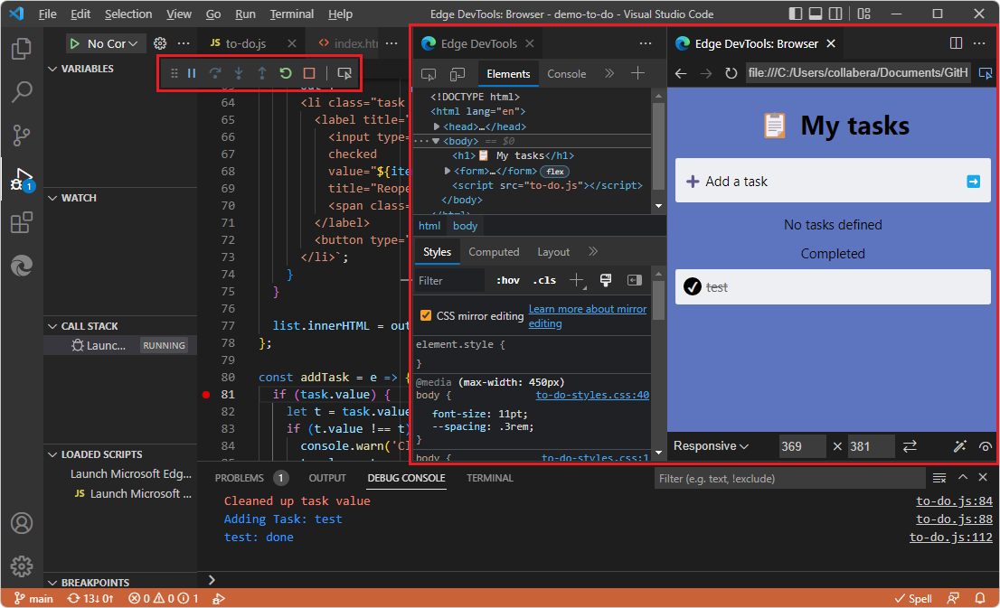

# Opening DevTools and the embedded browser

To view your rendered webpage while developing it, there are multiple ways to open and view your webpage in an instance of the Microsoft Edge browser, along with opening the **Edge DevTools** tab in Visual Studio Code.

*  To open DevTools for an `.html` file on your hard drive, right-click the `.html` file in Visual Studio Code's **Explorer**.

*  To open DevTools for a URL, click the **Launch Instance** button, and then enter the URL in the address bar of the embedded or external browser.

These approaches are described below.

<!-- ====================================================================== -->
## Headless browser in Visual Studio Code with Device Emulation features

In the _headless browser_ approach, you open a new instance of Microsoft Edge as an embedded browser tab inside Visual Studio Code.  This is the default.

This starts a new browser instance in the **Edge DevTools: Browser** tab and pane inside Visual Studio Code, displaying your rendered webpage that's specified in `launch.json`.

This approach also opens the **Edge DevTools** tab (pane) within Visual Studio Code, showing information for your specified file, such as `C:\Users\myusername\Documents\GitHub\Demos\demo-to-do\index.html`.  See [Opening DevTools and the embedded browser](./open-devtools-and-embedded-browser.md).

If you open DevTools by right-clicking a `.html` file in Explorer in Visual Studio Code, you always get the headless browser, even if you clear the **Activity Bar** > **Microsoft Edge Tools** > **Settings** > **Headless** checkbox.

There are two ways to open the headless browser for DevTools, regardless of the **Settings** > **Headless** checkbox setting:
*  **Activity Bar** > **Explorer** > open a folder > right-click a `.html` file.
*  **Activity Bar** > **Microsoft Edge Tools** > **Launch Instance** button.

#### By right-clicking an HTML file in the Explorer

To open DevTools and the embedded browser, along with the Debug toolbar for an HTML file on your hard drive:

1. In Visual Studio Code, select **Activity Bar** > **Open Folder** (if no folder is open yet) > **Explorer**.

1. Right-click an HTML file, select **Open with Edge**, and then select **Open Browser** or **Open Browser with DevTools**:

   

   The following components open in Visual Studio Code:
   *  The **Edge DevTools** tab, including the **Elements** tab and other tool tabs.
   *  The **Edge DevTools: Browser** tab (the headless, embedded web browser), including UI features for Device Emulation.
   *  The Debug toolbar.
   *  The Debug Console.
   *  You can select **View** > **Run**, to open the **Run and Debug** pane, which opens via some approaches, and which appears when you hit a breakpoint.
   *  In this approach, an instance is not listed in **Activity Bar** > **Microsoft Edge Tools** > **Targets**.

   

#### Opening the embedded browser with Device Emulation, without the DevTools tab

1. Select Activity Bar > **Explorer** > **Open Folder** (if not already opened) > right-click an HTML file, select **Open with Edge**, and then select **Open Browser**.
    

<!-- ====================================================================== -->
## By clicking the Launch Instance button

To open DevTools and the embedded or external browser, for a URL:

1. Click the **Microsoft Edge Tools** icon in the **Activity Bar**.  This launches an instance of Microsoft Edge.

1. Click the **Launch Instance** button:

   

1. Enter a URL or file path into the address bar.

   Or, instead of manually entering a URL or file path into the address bar, you can generate a `launch.json` file to automate the debugging workflow.

   The following tabs and UI components open in Visual Studio Code:

   *  The **Edge DevTools** tab, which contains DevTools tools such as the **Elements** tool.  You can right-click this tab, click **Split Left** or **Split Right**, and then drag this tab to another pane.

   *  A browser preview window (headless browser; the **Edge DevTools: Browser** tab/pane).  You can right-click this tab, click **Split Left** or **Split Right**, and then drag this tab to another pane.

   *  In some scenarios, the Debug toolbar also opens.  You can drag it to move it.

   *  In the Microsoft Edge Tools pane, the **Targets** section opens, listing a target, and the blue **Launch** buttons are removed.  During debugging, the **Watch** pane opens instead of the **Microsoft Edge Tools** pane.

Note that the Debug toolbar isn't open.  You can select **View** > **Run**, or **Run** > **Start Debugging**.
<!-- todo: how?  To open the Debug toolbar, -->

Typically you use the **Explorer** pane, from the Activity Bar, to open a `.js` file during debugging a webpage, as shown in the above layout.

The **Launch Instance** button opens the headless browser with Device Emulation features in Visual Studio Code (this is the default setting), or launches an external browser window that's automation-controlled, depending on the **Settings** > **Headless** checkbox.  See [Using an external browser window](./external-browser-window.md).

<!-- ====================================================================== -->
## See also

* [Microsoft Edge DevTools extension for Visual Studio Code](../microsoft-edge-devtools-extension.md)
