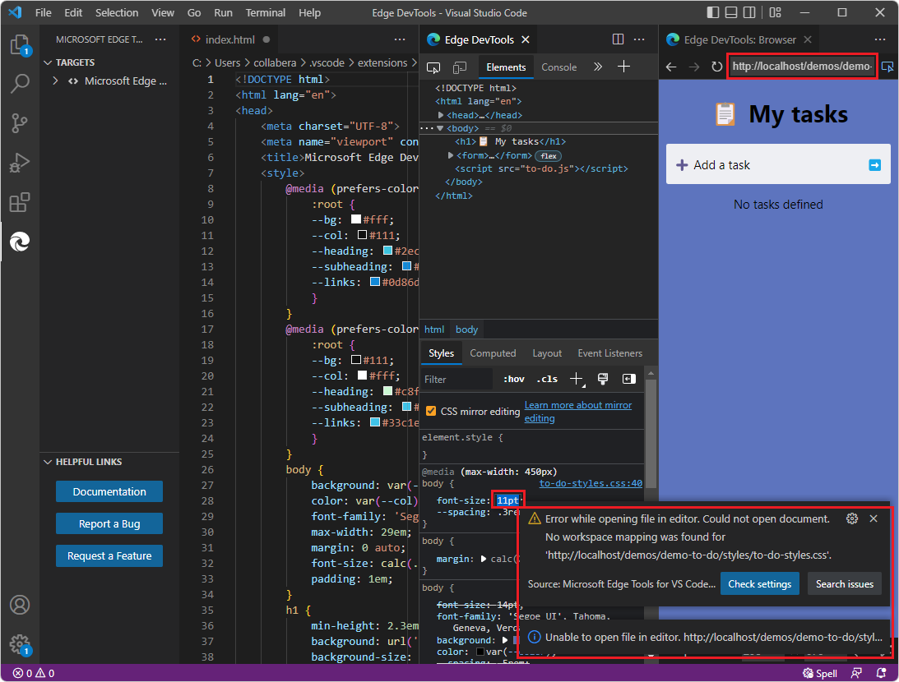
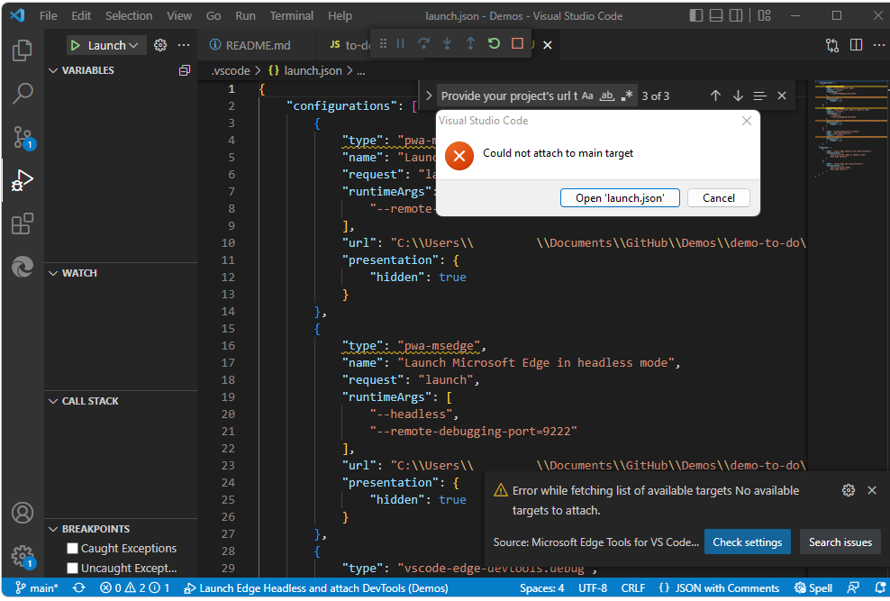

# Troubleshooting the DevTools extension

Make sure to open DevTools in one of the supported ways or scenarios.  See [Get started using the DevTools extension for Visual Studio Code](./get-started.md).

<!-- ====================================================================== -->
## Restarting DevTools

One powerful way of restarting DevTools is to close and reopen the folder:

1. In Visual Studio Code, select **File** > **Close Folder**.

1. If you started a web server by using Terminal in Visual Studio Code, restart the web server, such as by running `npx http-server`.  For more information, see [Step 6: Set up a localhost server by using npx http-server](./install.md#step-6-set-up-a-localhost-server-by-using-npx-http-server) in _Installing the DevTools extension for Visual Studio Code_.  Or instead, you can start the web server from a command prompt outside of Visual Studio Code, so it keeps running.

1. In Visual Studio Code, select **File** > **Open Recent**.

Start DevTools

<!-- ====================================================================== -->
## Error messages

The solution for most error messages is to open DevTools in one of the recommended ways, and use DevTools to access local files.

Suppose you click the **Launch Instance** button, then paste a localhost URL into the address bar, such as [http://localhost:8080/](http://localhost:8080/) or [http://localhost/demos/demo-to-do/](http://localhost/demos/demo-to-do/), and then in the Styles tab of the Elements tool, try to change a CSS value.  This way of opening and using DevTools is not fully supported and produces error messages such as:

*  **Error while mirroring css content to document.  Could not mirror css changes to document.  No workspace mapping was found.**

*  **Unable to open file in editor.**

*  **Error while opening file in editor.**

*  **Error while fetching.**

*  **Could not attach to main target.**

*  **Error while fetching list of available targets.  No available targets to attach.**

If you get errors while trying to point to a file path, instead of using a `launch.json` file, try right-clicking the .html file instead:

#### Solution
 
Start DevTools in one of the two main ways, so that the Debug toolbar appears.  See:
* [Step 3: Start DevTools in debug mode by right-clicking an HTML file](./get-started.md#step-3-start-devtools-in-debug-mode-by-right-clicking-an-html-file) in _Get started using the DevTools extension for Visual Studio Code_.
* [Step 8: Set up launch.json](./get-started.md#step-8-set-up-launchjson) in _Get started using the DevTools extension for Visual Studio Code_.

<!-- ====================================================================== -->
## See also

* [Get started using the DevTools extension for Visual Studio Code](./get-started.md)
