# Get started with WebView2 in HoloLens 2 Unity apps (Preview)

This tutorial is for developers using WebView2 in immersive HoloLens 2 Unity applications.

WebView2 on HoloLens 2 and the WebView plugin for Unity are both in Preview and are subject to change before general availability.  The WebView2 Preview is available in the Insider Preview for Microsoft HoloLens.  To access this preview, you must be enrolled in the Windows Insider Program; see [Start receiving Insider builds](/hololens/hololens-insider#start-receiving-insider-builds) in _Insider preview for Microsoft HoloLens_.

WebView2 is only supported on HoloLens 2 devices running the Windows 11 update. For more information, see [Update HoloLens 2](/hololens/hololens-update-hololens).

For WebView2-enabled 2D applications on HoloLens 2, see [Get started with WebView2 in WinUI 2 (UWP) apps](./winui2.md).


In this tutorial, you:

* Set up your development tools for creating HoloLens 2 Unity apps that use WebView2 to display web content.
* Install the Mixed Reality Toolkit (MRTK), by using the Mixed Reality Feature Tool.
* Create an initial Unity project for HoloLens 2 development.
* Add the Microsoft Mixed Reality WebView plugin for Unity, by using the Mixed Reality Feature Tool.
* Configure a WebView2 prefab that displays webpage content in your HoloLens 2 app.
* Learn about WebView2 concepts and interactions in Unity.


<!-- ------------------------------ -->
#### Completed project

A completed version of this Getting Started project is available in the **WebView2Samples** repo. You can use the completed project (from the repo or from following the steps below) as a baseline to add more WebView2 functionality and other features to your HoloLens 2 Unity app.

A completed version of this tutorial project is available in the **WebView2Samples** repo:

* Sample name: **HoloLens2_GettingStarted**
* Repo directory: [HoloLens2_GettingStarted](https://github.com/MicrosoftEdge/WebView2Samples/tree/main/GettingStartedGuides/HoloLens2_GettingStarted)
* Unity project folder: **HoloLens2GetStartedApp**

Follow the major Step sections in sequence, below.


<!-- ------------------------------ -->
#### About HoloLens 2, Unity, Mixed Reality Feature Tool, Mixed Reality Toolkit, and the WebView plugin

By combining HoloLens 2, Unity, the Mixed Reality Toolkit, and the WebView plugin for Unity, you can create immersive mixed-reality experiences that seamlessly integrate web content.


<!-- ------------------------------ -->
###### HoloLens 2

**HoloLens 2** is a groundbreaking, untethered holographic device, offering a hands-free and immersive mixed reality experience. HoloLens 2 seamlessly overlays digital information onto the real world, rendering high-definition holograms that stay in place and respond naturally to interaction.

You can use the Unity game engine and Visual Studio to create your HoloLens 2 project.


<!-- ------------------------------ -->
###### Unity

**Unity**, a versatile game engine, is a popular choice for creating 3D applications, including mixed reality experiences for HoloLens 2 devices, due to its extensive features and robust capabilities for augmented reality (AR), virtual reality (VR), and mixed reality (MR).


<!-- ------------------------------ -->
###### Mixed Reality Feature Tool (MRFT)

The **Mixed Reality Feature Tool (MRTK)** is a new way for developers to discover, update, and add Mixed Reality feature packages into Unity projects. You can search packages by name or category, see their dependencies, and even view proposed changes to your projects manifest file before importing. A manifest file is a JSON file defining all of your project's packages. Once you've validated the packages to be included, the Mixed Reality Feature tool will automatically download them into your selected Unity project.


<!-- ------------------------------ -->
###### Mixed Reality Toolkit (MRTK)

The **Mixed Reality Toolkit (MRTK)** is a Microsoft-driven open-source project that accelerates the development of mixed reality applications in Unity by providing essential components and features for developing mixed reality experiences.  The Mixed Reality Toolkit (MRTK) provides a collection of scripts, components, and prefabs specifically designed to help you create performant and intuitive mixed reality experiences on HoloLens 2 devices.


<!-- ------------------------------ -->
###### The Microsoft Mixed Reality WebView plugin for Unity

The **Microsoft Mixed Reality WebView plugin for Unity** enables the integration of WebView2 functionality into your HoloLens 2 app.  This WebView plugin for Unity simplifies the integration of WebView2 functionality into your HoloLens 2 app by wrapping the WebView2 control, automatically handling rendering, and automatically directing input to the WebView2 control.

This plugin also manages interop between Unity and WebView2, enabling communication between JavaScript and Unity via messages and events.

In Unity, the Microsoft Mixed Reality WebView plugin for Unity can be installed by using the **Mixed Reality Feature Tool**.


<!-- ====================================================================== -->
## Step 1 - Install Visual Studio

This tutorial assumes you have Unity 2020.3 LTS or later and Visual Studio 2019 version 16.9 or later installed. Visual Studio 2017 isn't supported. To set up your Unity and Visual Studio environment for HoloLens 2 development, follow the [Mixed Reality tools installation guide](/windows/mixed-reality/develop/install-the-tools?tabs=unity). That article guides you through installing and configuring the necessary tools, including Visual Studio and the Universal Windows Platform development workload.

Also set up your development environment for WebView2, by following the steps in [Set up your Dev environment for WebView2](../how-to/machine-setup.md).

Once you have completed the setup, return to this page and continue with the next steps.


<!-- ====================================================================== -->
## Step 2 - Set up Unity for HoloLens 2 development

Before you can start developing a HoloLens 2 app with WebView2, you will need to install Unity.  Follow the steps in [Choosing a Unity version and XR plugin](/windows/mixed-reality/develop/unity/choosing-unity-version) to complete installation of the toolset needed to build Mixed Reality applications.


<!-- ====================================================================== -->
## Step 3 - Configure the Unity project for Mixed Reality development

Once you have your tools installed, you are ready to create and configure your project.   The easiest way to get started with HoloLens 2 development is to utilize the the Mixed Reality Toolkit (MRTK) in your project.  

The Mixed Reality Feature Tool simplifies the process of discovering, installing, and managing Mixed Reality features, including the Mixed Reality Toolkit, and packages for your Unity project. For more guidance on installing the Mixed Reality Feature Tool, see [Welcome to the Mixed Reality Feature Tool](/windows/mixed-reality/develop/unity/welcome-to-mr-feature-tool).

1. First, [Download the Mixed Reality Feature Tool](https://www.microsoft.com/download/details.aspx?id=102778) from the Microsoft Download Center.   

1. Run the downloaded Mixed Reality Feature Tool executable, and follow the prompts to install the Mixed Reality Toolkit (MRTK) and any additional required packages for HoloLens 2 development.

   The Mixed Reality Feature Tool allows you to select and install the appropriate versions of the Mixed Reality Toolkit (MRTK), along with other Mixed Reality features, directly into your Unity project.

After you've used the Mixed Reality Feature Tool to install the Mixed Reality Toolkit (MRTK), the MRTK assets and prefabs will appear in your Unity project and the MRTK will guide you through configuring the Open XR plugin for your project.

For a detailed step-by-step walkthrough of configuring the Unity project, see [Set up a new OpenXR project with MRTK](/windows/mixed-reality/develop/unity/new-openxr-project-with-mrtk).


<!-- ====================================================================== -->
## Step 4 - Install the WebView plugin for Unity by using the Mixed Reality Feature Tool

In this step, as above, you'll use the Mixed Reality Feature Tool to install the Microsoft Mixed Reality WebView plugin for Unity.  This will install the specific version of the WebView2 NuGet package that's compatible with HoloLens 2.

1. Launch the Mixed Reality Feature Tool (which you installed above). The **Start** page of the Mixed Reality Feature Tool for Unity opens, containing options to configure settings and to view documentation:

   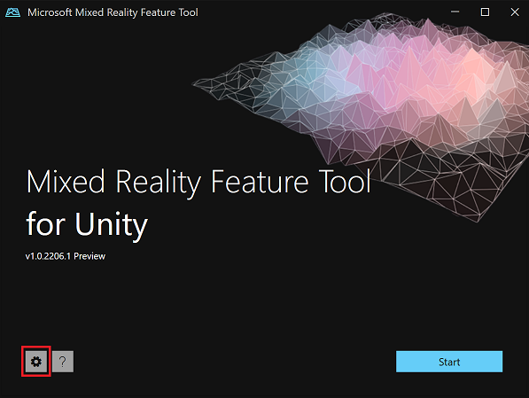

1. Click the gear button.  The **Settings** pane opens.

1. Click the **Feature** tab, and then make sure the **Show preview releases** checkbox is selected:

   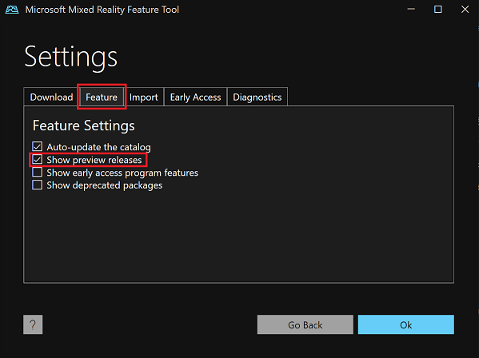

1. Click the **Ok** button to return to the starting page.

1. Click the **Start** button to begin discovering feature packages.

1. Point the Mixed Reality Feature Tool to your Unity project.  To do this, click the **Browse for the project folder** (**...**) button to the right of the **Project Path** field:

   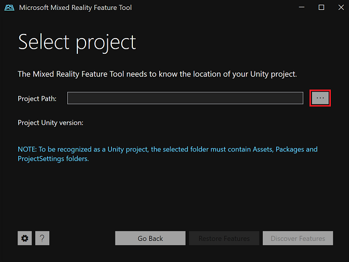

1. In the file selection dialog, select your Unity project folder, and then click the **Open** button.

1. In the **Select project** dialog, click the **Discover Features** button.

1. In the **Discover Features** page, expand the **Other features** section, and then select the **Microsoft Mixed Reality WebView** checkbox:

   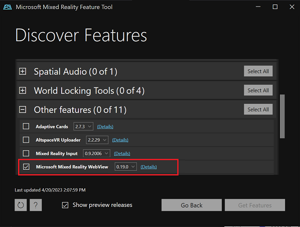

   This marks the WebView plugin for Unity for installation. In the version dropdown, by default, the latest version of the plugin is selected.

1. Click the **Get Features** button.  This downloads the required packages.

1. Once the packages are downloaded, click the **Import** button:

   

1. On the **Review and Approve** page, inspect the modifications that will be made to your project `manifest.json` file, and inspect the list of files (such as `.tgz` packages) that will be copied into your project:

   

1. Click the **Approve** button to finalize the changes.

1. In your Unity project, in your project's **Assets** folder, inspect the WebView2 prefab.

The Microsoft Mixed Reality WebView plugin for Unity is now installed and imported.  Continue with the next Step below.

For more information, see [Welcome to the Mixed Reality Feature Tool](/windows/mixed-reality/develop/unity/welcome-to-mr-feature-tool).


<!-- ====================================================================== -->
## Step 5 - Set up the WebView2 prefab in Unity scene

Now that the WebView plugin for Unity is installed and imported, set up the WebView2 prefab in your Unity scene, as follows:

1. In the Unity Editor, navigate to the **Project** window, and then find the WebView2 prefab by going to **Packages** > **Microsoft Mixed Reality WebView (Preview)** > **Runtime** > **Prefab**.

1. Drag the WebView2 prefab into your scene.

1. With the WebView2 prefab selected in the **Hierarchy** window, move it to a suitable starting location within the scene (such as under the `MixedRealitySceneContent` node), making sure it's in view of the default camera.

1. In the **Inspector** window, you can change the initial URL that's loaded by the WebView2 prefab. To do this, locate the **Current URL** text box, and then enter the desired URL. By default, the prefab loads `https://www.microsoft.com`:

   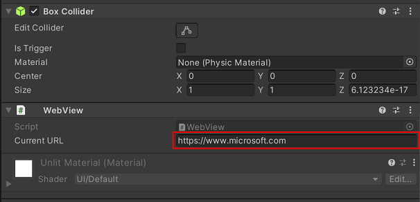


<!-- ====================================================================== -->
## Step 6 - Test the project

Now that you have added the WebView plugin to the scene, it would be a good time to test your project.   You can test the project directly in the editor, or you can follow these steps to [Build and deploy to the HoloLens](/windows/mixed-reality/develop/unity/build-and-deploy-to-hololens)

<!-- ====================================================================== -->
## Step 7 - Extending WebView2 functionality

While the prefab exposes just a single property, there is more functionality exposed on the `WebView` script. Let's take a look at exposing some of this functionality in our project.  First, we recommend reviewing the `WebView` script to get an idea of what's available.  

> [!TIP]
> To view the contents of a script in your default code editor, double click the name of the script in the **Inspector** window.

Now that you've reviewed the `WebView` code, let's extend the functionality of our sample. In the remainder of this step, we will add some basic functionality so that the user will have a back button, a go button, and a text field to navigate to a custom URL.  

1. Modify the scene hierarchy as follows:
   1. Under `MixedRealitySceneContent`, add a new input component (right-click > **UI** > **Input Field - TextMeshPro**). This automatically adds a parent `Canvas` for the component.
   1. Under the new `Canvas`, add **two** new `Button` components (right-click > **UI** > **Button - TextMeshPro**).
   1. Reorder the `WebView` component to make it a child of the `Canvas` component:

   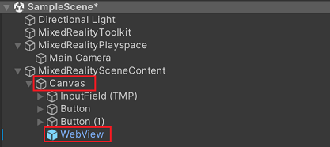

1. Update the Canvas properties by selecting the Canvas in the **Hierarchy** pane, then making the following changes in the **Inspector** pane:
   1. Change **Width** and **Height** to 600, 400 respectively.
   1. Change **Scale** for **X**, **Y**, and **Z** to 0.001, 0.001, 0.001:

   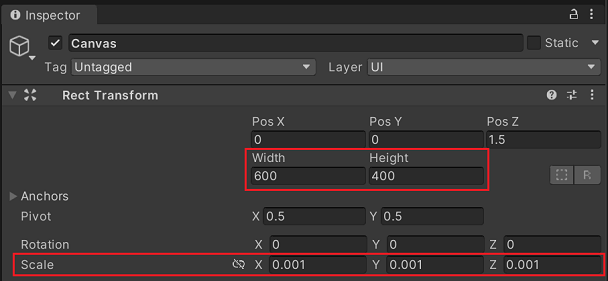

1. Update the input field's properties by selecting it in the **Hierarchy** pane, then making the following changes in the **Inspector** pane:
   1. Change **Name** to "AddressField (TMP)"
   1. Change **Pos X**, **Pos Y**, **Pos Z** to -2, 178, -5, respectively.
   1. Change **Width** and **Height** to 390, 30 respectively:

   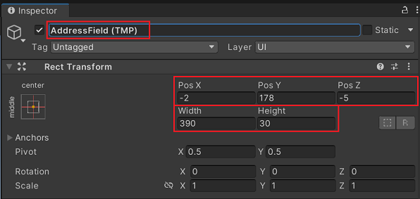

1. Update the first button's properties by selecting it in the **Hierarchy** pane, then making the following changes in the **Inspector** pane:
   1. Change **Name** to "Back Button"
   1. Change **Pos X**, **Pos Y**, **Pos Z** to -248, 178, -5, respectively.
   1. Change **Width** and **Height** to 75, 30 respectively:

   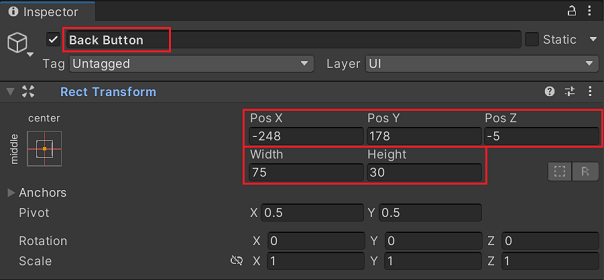

1. Update the second button's properties by selecting it in the **Hierarchy** pane, then making the following changes in the **Inspector** pane:
   1. Change **Name** to "Go Button"
   1. Change **Pos X**, **Pos Y**, **Pos Z** to 242, 178, -5, respectively.
   1. Change **Width** and **Height** to 75, 30 respectively:

   

1. Update the WebView's properties by selecting it in the **Hierarchy** pane, then making the following changes in the **Inspector** pane:
   1. Change **Position** > **X**, **Y**, **Z** to 0, -16, -5, respectively.
   1. Change **Scale** > **X**, **Y**, **Z** to 570, 340, 1 respectively:

   

1. Add a background image to the **Canvas**:
   1. Select the Canvas in the **Hierarchy** pane.
   1. Click the **Add Component** button at the bottom of the **Inspector** pane.
   1. Type **Image** and then select the top result in the list.
   1. Click the **Color** well for the image and then choose a background color. In our example, we chose a gray color. (This is simply to show some contrast between the different controls in the canvas.)

   

1. In the **Hierarchy** pane, under **Back Button**, select **Text (TMP)**.  Then in the **Inspector** pane, change the **Text Input** to **Back**:

   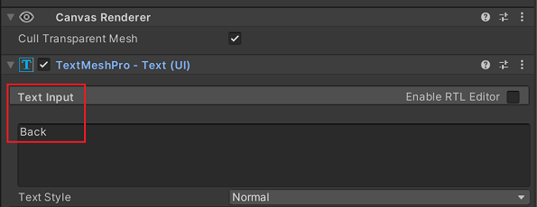

1. Repeat the above process for the **Go Button**, substituting **Go** as the text.

   You should now have a scene which looks similar to the following:

   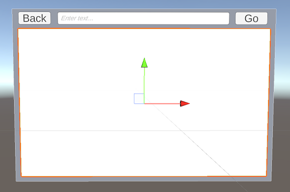

Now that we have our UI designed, we will now create the code to hook up the buttons.  To do that, we'll create a new script that derives from `WebView`.

1. In the **Inspector** window for WebView, click **Add Component**, select **New script**, type **WebViewBrowser**, and then click **Create and add**. Your new component is added to the **Inspector** window.

1. In the **Inspector** window, double-click the `WebViewBrowser` script, to edit the script.

1. Replace the contents of that file with the following code:

   ```C#
   using Microsoft.MixedReality.WebView;
   using UnityEngine.UI;
   using UnityEngine;
   using TMPro;
   using System;

   public class WebViewBrowser: MonoBehaviour
   {
      // Declare UI elements: Back button, Go button, and URL input field
      public Button BackButton;
      public Button GoButton;
      public TMP_InputField URLField;

      private void Start()
      {
         // Get the WebView component attached to the game object
         var webViewComponent = gameObject.GetComponent<WebView>();
         webViewComponent.GetWebViewWhenReady((IWebView webView) =>
         {
               // If the WebView supports browser history, enable the Back button
               if (webView is IWithBrowserHistory history)
               {
                  // Add an event listener for the Back button to navigate back in history
                  BackButton.onClick.AddListener(() => history.GoBack());

                  // Update the Back button's enabled state based on whether there's any history to go back to
                  history.CanGoBackUpdated += CanGoBack;
               }

               // Add an event listener for the Go button to load the URL that was entered in the input field
               GoButton.onClick.AddListener(() => webView.Load(new Uri(URLField.text)));

               // Subscribe to the Navigated event to update the URL input field whenever a navigation occurs
               webView.Navigated += OnNavigated;

               // Set the initial value of the URL input field to the current URL of the WebView
               if (webView.Page != null)
               {
                  URLField.text = webView.Page.AbsoluteUri;
               }
         });
      }

      // Update the URL input field with the new path after navigation
      private void OnNavigated(string path)
      {
         URLField.text = path;
      }

      // Enable or disable the Back button based on whether there's any history to go back to
      private void CanGoBack(bool value)
      {
         BackButton.enabled = value;
      }
   }
   ```


1. Connect the UI GameObjects to the WebViewBrowser code that we just wrote:
   1. Select the WebViewBrowser.
   1. Drag **Back Button** from the Hierarchy pane into the **Back Button** variable field for the WebView Browser in the Inspector.
   1. Drag **Go Button** from the Hierarchy pane into the **Go Button** variable field for the WebView Browser in the Inspector:

   

1. You can now test the scene in the Unity Editor. With everything wired up in your scene, you should be able to verify that everything is working as expected. Try testing out the scene by entering a new URL into the `AddressField` text box (must be a full URL including the protocol), then pressing the **Go** button. Make sure the **Back** button works as well.
    
    It can sometimes be helpful to debug your application running on your HoloLens, and the steps to do so are slightly different than standard debugging within Visual Studio.   Look at the [Managed debugging with Unity](/windows/mixed-reality/develop/unity/managed-debugging-with-unity-il2cpp) article for more information on how to setup and connect to your application running on the HoloLens or inside of the Unity editor.


<!-- ====================================================================== -->
## STEP 8 - Learn about WebView2 events and interactions in Unity

The Microsoft Mixed Reality WebView plugin for Unity provides events for working with the webview. 

One important event is `IWithPostMessage.MessageReceived`, which is raised when a message is sent from the webview to the Unity app. The `MessageReceived` event is defined in the `Microsoft.MixedReality.WebView.IWithPostMessage` interface. 

`IWithPostMessage` also defines the `PostMessage()` method, which can be used to send a message from the Unity app to the webview.

Here is an example of how to use these events and methods for working with the webview:

```C#
using Microsoft.MixedReality.WebView;

public class WebViewExample : MonoBehaviour, IWithPostMessage
{
    private void Start()
    {
        var webViewComponent = gameObject.GetComponent<WebView>();

        if (Url != string.Empty)
        {
            Debug.Log("Loading URL: " + Url);
            webViewComponent.Load(new Uri(Url));
        }

        webViewComponent.GetWebViewWhenReady((IWebView webView) =>
        {
            // Add event listeners for WebView2 events
            ((IWithPostMessage)webView).MessageReceived += OnMessageReceived;
        });
    }

    // Handler for WebView2 OnPostMessage event
    void OnMessageReceived(string message)
    {
        Debug.Log("WebView2 message received: " + message);
    }
}
```


<!-- ====================================================================== -->
## Additional considerations for WebView2 on HoloLens 2


<!-- ------------------------------ -->
#### Limitations and known issues

When developing a HoloLens 2 Unity app with WebView2, be aware of some limitations and known issues:

* **Pop-ups**: Pop-ups don't work well within WebView2 inside Unity apps on HoloLens 2, but they work fine in 2D XAML apps on the device. Avoid pop-ups and use alternative techniques or UI designs, such as custom pop-up-like elements within the WebView using HTML, CSS, and JavaScript.

* **New windows**: WebView2 instances on HoloLens 2 navigate within the same window by default, unlike on Desktop. Follow this default behavior for a better user experience. Additionally, the DevTools window cannot be launched.

* **Enterprise authentication**: Automatic Single Sign-On (SSO) leveraging OS-level tokens is currently not supported in WebView2 on HoloLens 2. Users can still sign in by providing credentials, except for cases requiring device-level authentication. Cookie storage works as expected.

* **User interactions**: Unlike native HoloLens 2 slates, WebView2 is best interacted with using far-interaction hand rays. Touch-to-swipe and scroll interactions might not be supported.

* **Performance**: Complex websites with heavy use of JavaScript or advanced rendering may impact system performance or the host application's framerate. For general performance-related limitations and recommendations, see [Understanding performance for mixed reality](/windows/mixed-reality/develop/advanced-concepts/understanding-performance-for-mixed-reality) in the Mixed Reality documentation. Also see [Performance optimization](#performance-optimization), below.


<!-- ------------------------------ -->
#### Performance optimization

Optimizing the performance of WebView2 in your HoloLens 2 Unity app is crucial for a smooth user experience. Here are some recommendations:

* **Limit the number of WebView2 instances**: We suggest using only one instance of WebView2 within a Unity app. Reuse the same instance or tear down and create a new one as needed. Keep in mind that removing the WebView prefab from the scene might not destroy the underlying WebView2 instance. You must call the `Destroy()` method on the game object to destroy it properly.

* **Apply general Unity optimization techniques**: Utilize standard Unity optimization methods, such as occlusion culling or limiting the update rate, to improve WebView2 performance. For more information, see [Performance recommendations for Unity](/windows/mixed-reality/develop/unity/performance-recommendations-for-unity?tabs=openxr) in the Mixed Reality documentation.

* **Profile and monitor WebView2 performance**: There are several ways to profile the performance of a HoloLens 2 Unity application:

  * **Unity Profiler**: A built-in tool in Unity that allows you to measure and optimize the performance of your application on various platforms, including HoloLens 2.

  * **Visual Profiler**: A feature of the Mixed Reality Toolkit (MRTK) that provides an in-application view of your application's performance.

  * **PIX**: A performance tuning and debugging tool for Windows that can also be used to profile Unity applications on HoloLens 2.


<!-- ------------------------------ -->
#### Navigation

In Step 7, we touched on some navigation methods. In this section, we'll expand on what we learned.


<!-- ---------- -->
###### IWebView interface

<!-- [IWebView::Load method]()-->

The `IWebView` interface exposes a few methods, events, and properties related to page navigation. The main functionality exposed here is the ability to navigate to a given URL, by using `Load(Uri url)`:

```C#
public interface IWebView
{
    // Non-navigation methods are removed for clarity.

    event WebView_OnNavigated Navigated;

    Uri Page { get; }

    void Load(Uri url);

    void Reload(bool ignoreCache);
}
```


<!-- ---------- -->
###### IWithBrowserHistory interface

The `IWithBrowserHistory` interface exposes a few methods and events related to page navigation. This mainly allows developers to navigate forward and backward, as you would expect with a typical web-browsing experience:

```C#
public interface IWithBrowserHistory : IWebView
{
    // Non-navigation methods are removed for clarity.

    event WebView_OnCanGoForwardUpdated CanGoForwardUpdated;

    event WebView_OnCanGoBackUpdated CanGoBackUpdated;

    void GoBack();

    void GoForward();
}
```


<!-- ---------- -->
###### SetVirtualHostNameToFolderMapping and SetVirtualHostMapping

The [CoreWebView2.SetVirtualHostNameToFolderMapping Method](/dotnet/api/microsoft.web.webview2.core.corewebview2.setvirtualhostnametofoldermapping) enables mapping between a virtual host name and a folder path, making it accessible to websites using that host name. This method maps a local domain name to a local folder, so that the WebView2 control loads content from the specified local folder when attempting to access a resource for that domain.

The WebView plugin for Unity exposes this functionality through the `IWithVirtualHost` interface, which has a single method, `SetVirtualHostMapping(string hostName, string folderPath)`:

```C#
public interface IWithVirtualHost : IWebView
{
    void SetVirtualHostMapping(string hostName, string folderPath);
}
```

To use the `SetVirtualHostMapping` method, set `hostName` to any valid URL conforming string, such as `webview2.sample`. `folderPath` can be an absolute path or a path relative to the application's working directory, such as `Assets\Html`.

Assuming we have an HTML file called `demo.html` under `Assets\Html`, the following code snippet demonstrates loading `demo.html` by using the WebView plugin for Unity:

```C#
using Microsoft.MixedReality.WebView;

public class WebViewExample : MonoBehaviour
{
    private void Start()
    {
        var webViewComponent = gameObject.GetComponent<WebView>();

        webViewComponent.GetWebViewWhenReady((IWebView webView) =>
        {
            ((IWithVirtualHost)webView).SetVirtualHostMapping("webview2.sample", "Assets\\Html");

            // Navigate to our local content.
            webViewComponent.Load(new Uri("http://webview2.sample/demo.html"));
        });
    }
}
```


<!-- ------------------------------ -->
#### Input

There are various ways to handle input in Unity for Mixed Reality applications.

* [Input overview — MRTK2](/windows/mixed-reality/mrtk-unity/mrtk2/features/input/overview) - recommended for Mixed Reality Toolkit 2.8 applications.
* [Input — MRTK3](/windows/mixed-reality/mrtk-unity/mrtk3-input/packages/input/overview) - recommended for Mixed Reality Toolkit 3 applications.
* [Unity Input System](https://docs.unity3d.com/Packages/com.unity.inputsystem@1.5/manual/index.html)

Regardless of the input system used within your Unity application, interop code between the various application input events and the WebView plugin for Unity is required. This means translating those events (such as Pointer events) into a `WebViewMouseEventData` object and then forwarding those events to the plugin via the `IWithMouseEvent` interface:

```C#
public interface IWithMouseEvents : IWithInputEvents
{
    void MouseEvent(WebViewMouseEventData mouseEvent);
}
```

WebView2 is unaware of Unity's input system and likely has a different coordinate system than your Unity scene. As a result, when there is a pointer-down event, its coordinates must be translated into the coordinate system of the WebView2 control. Additionally, the pointer-down event needs to be converted into an appropriate `WebViewMouseEventData` event type.

Simple example:

```C#
using Microsoft.MixedReality.WebView;

public class WebViewExample : MonoBehaviour, IPointerDownHandler
{
    // WebView setup steps skipped for brevity

    public void OnPointerDown(PointerEventData eventData)
    {
        IWithMouseEvents mouseEventsWebView = webView as IWithMouseEvents;

        // Call hypothetical function which converts the event's x, y into the WebView2's coordinate space.
        var hitCoord = ConvertToWebViewSpace(eventData.position.x, eventData.position.y);

        WebViewMouseEventData mouseEvent = new WebViewMouseEventData
        {
            X = hitCoord.x,
            Y = hitCoord.y,
            Type = PointerEvent.PointerDown,
            Button = PointerButton.Left,
            TertiaryAxisDeviceType = WebViewMouseEventData.TertiaryAxisDevice.PointingDevice
        };

        // Propagate the event to the WebView plugin.
        mouseEventsWebView.MouseEvent(mouseEvent);
    }
}
```

In the above example, pointer-down events are converted into `WebViewMouseEventData` objects and forwarded to the WebView plugin for Unity. It is essentially converted into a mouse-down event. In order to effect mouse click events, pointer-up events would need to be handled in a similar fashion.

In the example above, `ConvertToWebViewSpace` is intentionally not implemented.


<!-- ====================================================================== -->
## See also

* [Get started with WebView2 in WinUI 2 (UWP) apps](./winui2.md)
