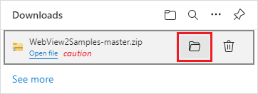
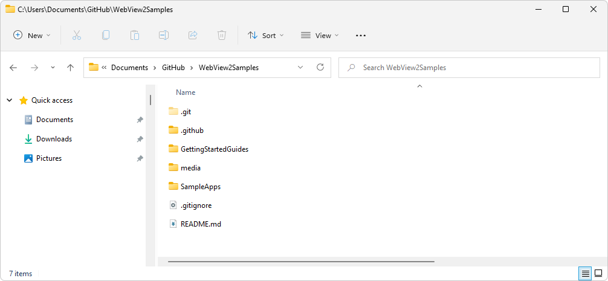
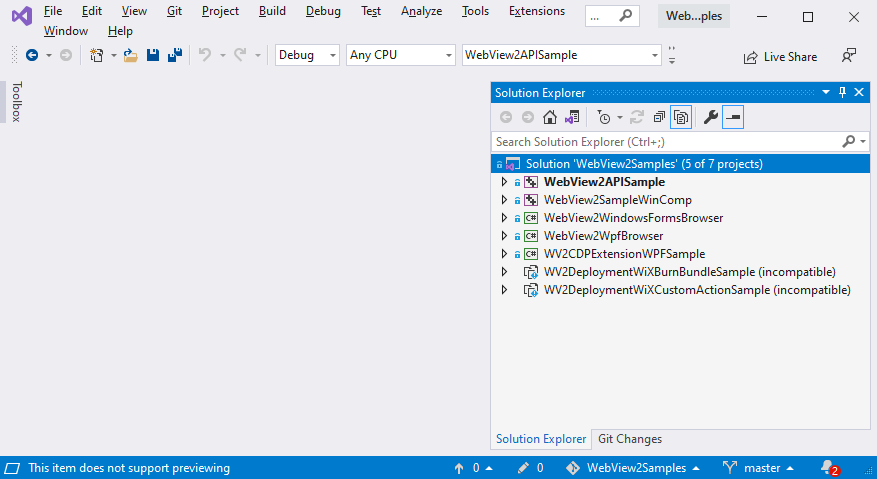
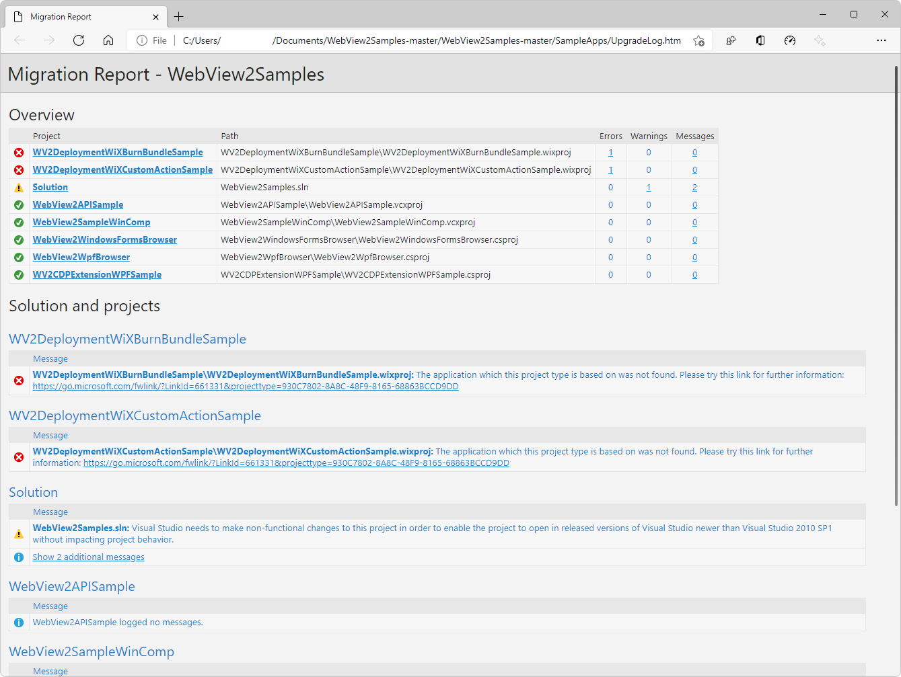
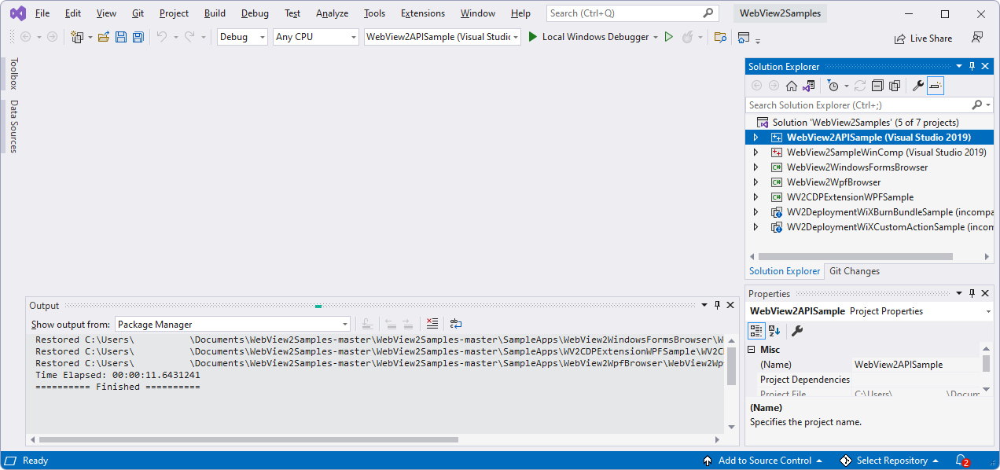

# Set up your Dev environment for WebView2

This article covers general-purpose setup of your development environment for WebView2 development.  Some Get Started tutorials point here for preliminary setup steps, and then add platform-specific or project-specific setup steps.


<!-- ====================================================================== -->
## Install Visual Studio

1. Install [Visual Studio](https://visualstudio.microsoft.com) 2015 or later, such as Visual Studio Professional 2022.

   The WebView2 samples are designed for Microsoft **Visual Studio**, not Microsoft **Visual Studio Code**.

   If you are installing Visual Studio 2022, you can accept the defaults for now; you can click **Install**, and decline installing the Workloads at this time.  Visual Studio will prompt you later, when you open a particular `.sln` file, to install the platform-appropriate workloads.


<!-- ====================================================================== -->
## Install a preview channel of Microsoft Edge

1. Install any [Microsoft Edge Insider (preview) Channel](https://www.microsoftedgeinsider.com/download) (Beta, Dev, or Canary) on a supported operating system (OS):
   *  Windows 7
   *  Windows 8.1
   *  Windows 10
   *  Windows 11

We recommend using the Canary channel.  The minimum required version is 82.0.488.0.


<!-- ====================================================================== -->
## Install the WebView2 Runtime

1. Optionally, install the [WebView2 Runtime](https://developer.microsoft.com/microsoft-edge/webview2).

If unsure, skip this step; you can use the Microsoft Edge preview channel from the previous step instead.

If you want more information about this decision now, see [Understand the different WebView2 SDK versions](../concepts/versioning.md).


<!-- The h3 section [Clone or download the WebView2Samples repo](get-started/win32.md#clone-or-download-the-webview2samples-repo) in _Get started with WebView2 in Win32 apps_ links to here -->
<!-- ====================================================================== -->
## Clone or download the WebView2Samples repo

You can download the repo as a `.zip` file, or clone the repo.

*  If you download the repo (as a `.zip` file), you get a snapshot copy of the repo.  You can then download another, updated copy of the repo later.

*  If you clone the repo, you can update your local copy using git commands or features of various Dev apps.


<!-- ====================================================================== -->
## Download the WebView2Samples repo

You can either download or clone the `WebView2Samples` repo.

To download the repo (as a `.zip` file):

1. Open the [WebView2Samples repo](https://github.com/MicrosoftEdge/WebView2Samples) in a new window or tab.

1. Click the green **Code** button in the upper right of the GitHub repo, and then click **Download ZIP**.

   

   The **Download** pop-up appears in Microsoft Edge:

   

   In Microsoft Edge, if the **Download** pop-up isn't visible, click **Settings and more** (...) and then click **Downloads**.

1. In the **Downloads** pop-up window, hover to the right of `WebView2Samples-master.zip` and then click the **Show in folder** (folder) icon.

   It is recommended that you don't click the **Open file** link, because that immediately unzips the file in your Downloads area, which could make it harder (and slower) to move to your desired location.

1. Copy or cut the `WebView2Samples-master.zip` file from your Downloads directory to a regular directory, such as `Documents`.

1. Unzip the .`WebView2Samples-master.zip` file and note the location of the unzipped files.

   

1. Study the breakout of main directories.  `-master` is the name of the repo branch that this downloaded directory snapshot represents.


<!-- ====================================================================== -->
## Clone the WebView2Samples repo

You can either clone or download the `WebView2Samples` repo.

To clone the `WebView2Samples` repo, you must first install git.  You can download the repo, as described above, or clone it.

### Install git

1. If you want to clone the `WebView2Samples` repo (instead of downloading it), and if git isn't not already installed, [download git](https://git-scm.com/downloads) and install it.


### Obtain the URL for cloning the WebView2Samples repo

1. Open the [WebView2Samples repo](https://github.com/MicrosoftEdge/WebView2Samples) in a new window or tab.

1. Click the green **Code** button in the upper right of the GitHub repo, select **Clone**, and then click the **Copy** icon (or, select the HTTPS URL string in the text box and copy it).

   

1. Decide which tool you want to use to locally clone the repo:
   *  Visual Studio
   *  GitHub Desktop
   *  Git Bash shell or command prompt

Next, clone the GitHub repo to your local drive.  To do that, follow the appropriate steps below, for the tool you want to use.


### Cloning the repo by using Visual Studio

If you want to use Visual Studio to clone the GitHub repo to your local drive:

1. In Visual Studio, select **File** > **Clone repository**.

1. Enter the URL that you copied from the GitHub repo.

1. From within the same dialog box, or in a file explorer utility, you can create a general-purpose root `git` or `GitHub` folder in a writeable location, then select that directory, so that the repo will be cloned there, as a new directory.

   For example, you could create the repo in the parent folder: `C:\Users\myUserName\Documents\GitHub\`, so that the cloning operation will create the new directory `C:\Users\myUserName\Documents\GitHub\WebView2Samples`.

You've cloned the repo to your local drive.  Skip to the next major section below.


### Cloning the repo by using GitHub Desktop

If you want to use GitHub Desktop to clone the GitHub repo to your local drive:

1. Install [GitHub Desktop](https://desktop.github.com).

1. In GitHub Desktop, select **File** > **Clone repository**.

1. In Visual Studio or GitHub Desktop, enter the URL that you copied from the GitHub repo.

1. From within the same dialog box, or in a file explorer utility, you can create a general-purpose root `git` or `GitHub` folder in a writeable location, then select that directory, so that the repo will be cloned there, as a new directory.

   For example, you could create the repo in the parent folder: `C:\Users\myUserName\Documents\GitHub\`, so that the cloning operation will create the new directory `C:\Users\myUserName\Documents\GitHub\WebView2Samples`.

You've cloned the repo to your local drive.  Skip to the next major section below.


### Cloning the repo by using Git Bash shell or a command prompt

If you instead want to clone the repo by using a Git Bash shell or command prompt:

1. Clone the repo to your local drive, entering the URL string that you copied from the GitHub repo:

   ```Shell
   # example location where the repo directory will be added:
   cd c:/users/myusername/documents/github/
   git clone https://github.com/MicrosoftEdge/WebView2Samples.git
   ```

   

   The directory is created on your local drive, in the path you specified, such as in the following figure:

   

   You've cloned the repo to your local drive.


<!-- ====================================================================== -->
## Open a WebView2Samples .sln file in Visual Studio

After you download or clone the `WebView2Samples` repo, open a `.sln` file in Visual Studio.

1. In your local copy of the repo directory structure, locate a `.sln` file.  See [Local paths for all .sln and README.md files](../code-samples-links.md#local-paths-for-all-sln-and-readmemd-files) in _Sample Code for WebView2_.

1. Open a `.sln` file in Visual Studio.  For example, open your local copy of [WebView2Samples.sln](https://github.com/MicrosoftEdge/WebView2Samples/blob/master/SampleApps/WebView2Samples.sln).  This repo's solution files require Visual Studio, not Visual Studio Code.

1. Open one of the `.sln` files.  For example, open your local copy of the multi-platform solution file [WebView2Samples/SampleApps/WebView2Samples.sln](https://github.com/MicrosoftEdge/WebView2Samples/blob/master/SampleApps/WebView2Samples.sln) (downloaded as path `WebView2Samples-master/SampleApps/WebView2Samples.sln`) in Microsoft Visual Studio.  When you open that solution file in Visual Studio, **Solution Explorer** contains the following WebView2 samples, as projects:

   

This particular `.sln` file doesn't include the Get Started projects, which are separate `.sln` files, one per platform.

Currently, the screenshots below show the Win32 Get Started `.sln` file:


<!-- ====================================================================== -->
## Directory path patterns

For general, initial Dev environment setup, you can open any type of `.sln` file from the `WebView2Samples` repo:

*  The multi-platform solution in the `SampleApps` directory.
*  A platform-specific solution in the `SampleApps` directory.
*  A platform-specific solution in the `GettingStartedGuides` directory.

This is described in the [top-level README file in the WebView2Samples repo](https://github.com/MicrosoftEdge/WebView2Samples#readme).


If you download the repo (as a `.zip` file), the root directory name has `-master` appended.


The multi-platform solution in the `SampleApps` directory has the path:

*  If you downloaded the repo: `WebView2Samples-master/SampleApps/WebView2Samples.sln`

*  If you cloned the repo: `WebView2Samples/SampleApps/WebView2Samples.sln`


The Win32 platform-specific solution in the `SampleApps` directory has the path:

*  If you downloaded the repo: `WebView2Samples-master/SampleApps/WebView2Samples.sln`~~

*  If you cloned the repo: `WebView2Samples/SampleApps/WebView2Samples.sln`~~


The Win32-specific solution in the `GettingStartedGuides` directory has the path:

*  If you downloaded the repo: `WebView2Samples-master/GettingStartedGuides/Win32_GettingStarted/WebView2GettingStarted.sln`

*  If you cloned the repo: `WebView2Samples/GettingStartedGuides/Win32_GettingStarted/WebView2GettingStarted.sln`


<!-- ====================================================================== -->
## Install Visual Studio workloads if prompted

<!-- For example, the Win32 tutorial tells how to install a particular workload if prompted to, upon opening a particular sample.  For example, see [Install the "Desktop development with C++" workload](../get-started/win32.md#install-workloads) in _Get started with WebView2 in Win32 apps_. -->

When you open a `.sln` file from the cloned or downloaded `WebView2Samples` repo in Microsoft Visual Studio 2019 or 2022, you might see a "cannot open" dialog box.

1. Click the **OK** button.  Then you might see a workload installer such as:

   .

1. Select the checkbox and then click the **Install** button.

   The Visual Studio installer runs, for the platform's workload:

   .

   A Migration Report log file page might open, such as at `file:///C:/Users/username/Documents/WebView2Samples-master/WebView2Samples-master/SampleApps/UpgradeLog.htm`:

   

   _To zoom, right-click > **Show image in new tab**._

   Above, the `-master` directory suffix is present for the downloaded `.zip` file of the repo, not if you cloned the repo.

   Visual Studio opens the selected `.sln` file in Solution Explorer:

   


<!-- ====================================================================== -->
## Install the WebView2 SDK

The WebView2 SDK includes the WebView2 control, which is powered by Microsoft Edge, and enables you to embed web technologies (HTML, CSS, and JavaScript) in your native applications.

You install the WebView2 SDK once per project node of each `.sln` file.  The WebView2 SDK installation applies only to the project that it's installed on.

Instead of downloading the `Microsoft.Web.WebView2` SDK NuGet package from nuget.org, you install the WebView2 SDK NuGet package through the **NuGet Package Manager** panel in Visual Studio.  After you clone or download the WebView2Samples repo, you then open one of the repo's `.sln` files in Visual Studio, and right-click a project node within the solution.  You use the **NuGet Package Manager** panel to install the `Microsoft.Web.WebView2` SDK as a NuGet package.

The `Microsoft.Web.WebView2` SDK is available in Release and Prerelease versions.  To get started, a Release version is recommended.


Install the WebView2 SDK, as follows:

1. Open a `.sln` file in Visual Studio.  For example, open your local copy of [WebView2Samples.sln](https://github.com/MicrosoftEdge/WebView2Samples/blob/master/SampleApps/WebView2Samples.sln).  This repo's solution files require Visual Studio, not Visual Studio Code.

1. In **Solution Explorer**, right-click the solution's project nodes, such as the **WebView2GettingStarted** project node (not the solution node) and then select **Manage NuGet Packages**.

   The following image shows a particular .sln file and project; use whichever project you want to install the SDK to:

   

   The **NuGet Package Manager** tab opens.

1. In the **NuGet** window, click the **Browse** tab.

1. On the right of the search bar, clear the **Include prerelease** checkbox (unless you know that you want a prerelease version of the SDK).

1. In the search bar in the upper left, type `Microsoft.Web.WebView2`.  Or, copy and paste the single-line code block below.  Then select **Microsoft.Web.WebView2**.

   ```
   Microsoft.Web.WebView2
   ```

1. In the right-hand side window, click **Install** (or **Update**).  NuGet downloads the WebView2 SDK to your machine.

   

   _To zoom, right-click > **Show image in new tab**._

1. Close the **NuGet Package Manager** tab.

The WebView2 SDK is now installed, so your development environment is now set up to add WebView2 features to WebView2 apps.

See also [NuGet.org > Microsoft.Web.WebView2 SDK](https://www.nuget.org/packages/Microsoft.Web.WebView2).
