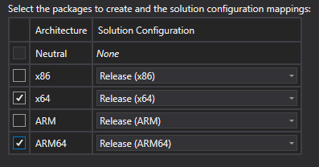
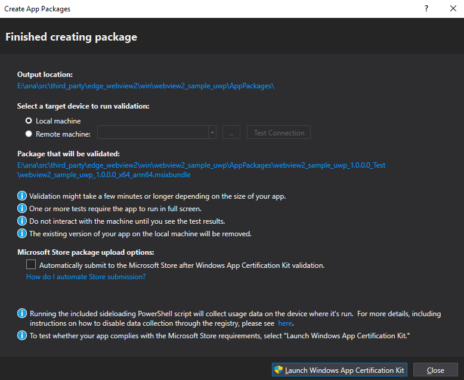

---
title: Publish a UWP WebView2 app to the Microsof Store
description: How to publish a UWP WebView2 app to the Microsoft Store.
author: MSEdgeTeam
ms.author: msedgedevrel
ms.topic: conceptual
ms.prod: microsoft-edge
ms.technology: webview
ms.date: 04/18/2022
---
# Publish a UWP WebView2 app to the Microsoft Store

A UWP app can host the WebView2 control.  Here's how to publish a UWP WebView2 app to the Microsoft Store.

You'll need to use some of the following sites:

| Resource | Link |
|---|---|
| Partner Center | [partner.microsoft.com](https://partner.microsoft.com) |
| Packaging | [Validate your app package](/windows/msix/package/packaging-uwp-apps#validate-your-app-package), in _Package a desktop or UWP app in Visual Studio_. |
| Developer account | [Get registered](https://developer.microsoft.com/microsoft-store/register/), about developer accounts for the Microsoft Store. |
| Store publishing | [Publish Windows apps and games](/windows/uwp/publish/), at Windows App Development documentation > UWP. |

1. Make sure you have a Microsoft Store account configured in Microsoft Visual Studio.  See [Get registered](https://developer.microsoft.com/microsoft-store/register/), about developer accounts for the Microsoft Store.

1. Make sure your application runs correctly on startup, and works correctly during shutdown sleep.

1. Update the `package.appxmanifest` with all needed content, such as Visual Assets, Packaging name, and Application information.  If you don't do this, the Microsoft Store validation step will fail.

1. At Partner Center, select **Project** > **Publish** and then reserve an application name.

1. Associate the application with the reserved name, as follows: **Project** > **Publish** > **Associate App with the Store**.

1. Create the application package: **Project** > **Publish** > **Create App Packages**.  Select the target configurations.  Only 64-bit versions of the WebView2 Runtime will work in UWP:

   

1. Once the application package has been created for your configurations, you'll be presented with a dialog of information and have the option to run Windows App Certification Kit (WACK):

   

1. Note where the bundle was placed (also in the build window) and **Cancel** this dialog box.  You'll run Windows App Certification Kit (WACK) after validating the package.

1. Use the generated application package to install the app on your machine.  Look for any oddities regarding required packages and functionality.

1. If possible, install your app on other machines also.  Look for any oddities regarding required packages and functionality.

   Once you're satisfied that your packaged app works, it is time to go through Windows App Certification Kit (WACK).

1. Generate the app package again, because that is the easiest way to get to the Windows App Certification Kit (WACK) process.

1. Once the package creation is complete, select **Launch Windows App Certification Kit**.

1. You must approve the User Access Control (UAC) dialog, for the Windows App Certification Kit (WACK) to run correctly.

1. Select **All** for the test suite, and then click **Next**.  The validation will take a few minutes.

1. Once complete, the Windows App Certification Kit (WACK) will show a results page.  If the application failed, click the link to review the results.

   *  If your app failed the **restricted name-space** check, edit your `package.appxmanifest` file and remove the `restrictedcapabilities` line and any capabilities that use `rescap`.

      WebView2 shouldn't require any restricted capabilities, to operate.  NOTE: If your application needs restricted capabilities, you'll need to either ask for a store exception through Partner Center, or only distribute the app through non-Store avenues.

   *  If your app failed **branding** checks, you need to update all the Visual Assets in the manifest as mentioned above.

   *  If your app failed **App Capabilities** tests, turn off any unneeded capabilities.  If you need a special use capability you will need to get Microsoft Store approval or use non-Store distribution methods.

   *  If your app failed **General meta data correctness** with an error in `IPopup4`, you need to update your **microsoft.UI.xaml** nuget package to a downloaded **Microsoft.UI.Xaml.2.8.0-prerelease.220118001** or higher.  There was a bug in the manifests, prior to that version.

   *  If your app failed the **Supported API** test, you need to update your SDK to 22000 or higher to get the latest version of the allowed-APIs list.  There should be no blocking APIs for WebView2 in the current SDK.

1. Once all Windows App Certification Kit (WACK) tests have passed, upload your app package, by using either of the following approaches:

   *  Approach 1: Use **Project** > **Publish** > **Upload App Packages**.

   *  Approach 2: Go to [Partner Center](https://partner.microsoft.com/) and upload your app package through Partner Center. 
