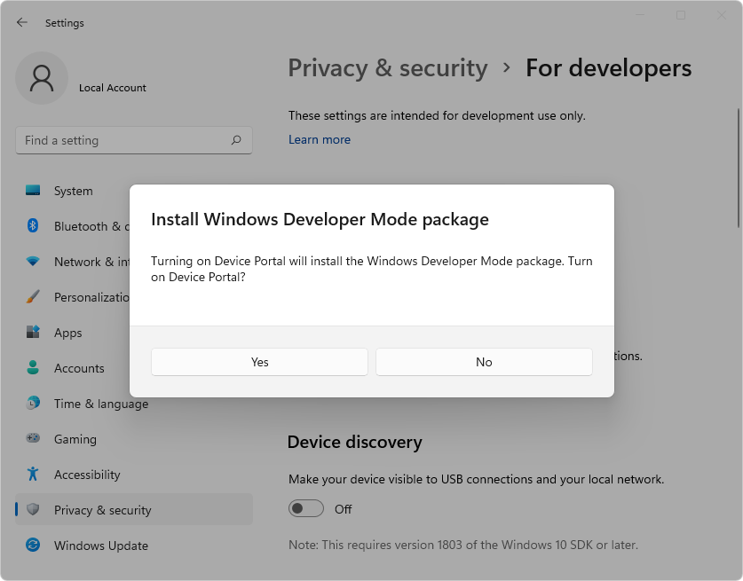
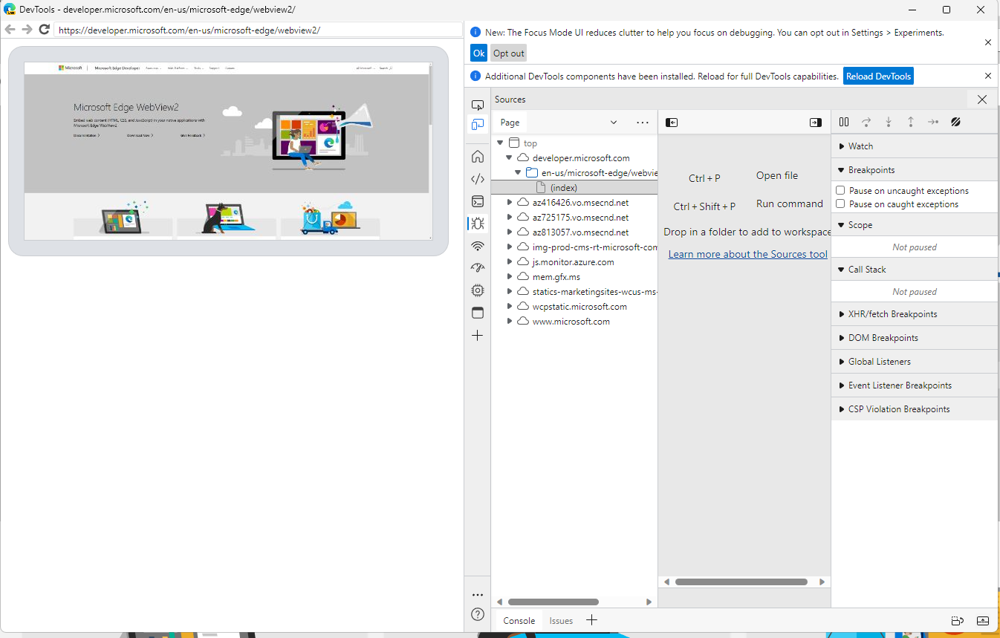

# Remote debugging WebView2 WinUI 2 (UWP) apps with Remote Tools for Microsoft Edge

Use `Remote Tools for Microsoft Edge` to enable [Microsoft Edge DevTools](/microsoft-edge/devtools-guide-chromium/landing/) debugging.


<!-- ====================================================================== -->
## Debugging desktop WebView2 WinUI 2 (UWP) apps

To use Microsoft Edge DevTools to debug a desktop WebView2 WinUI 2 (UWP) app, use remote debugging.  Remote debugging is necessary because currently, the built-in DevTools in Microsoft Edge cannot be launched inside a store-signed WebView2 WinUI 2 (UWP) app.

Attach `Microsoft Edge DevTools` remotely to a WebView2 WinUI 2 (UWP) app as follows:

1.  Install [Microsoft Edge Canary Channel](https://www.microsoftedgeinsider.com/download/canary).

1.  In Microsoft Edge Canary, go to to `edge://inspect` and verify that the **Inspect with Developer Tools** page exists in your version of the browser:

    

1.  Enable Developer Mode: Open Windows **Settings**, select **Privacy & security** > **For developers**, and then turn on the **Developer Mode** toggle:

    

1.  Enable Device Portal: Open Windows **Settings**, select **Privacy & security** > For developers**, and then turn on the **Device Portal** toggle. If you are not able to enable Device Portal, you can update your system OS to the latest version and then try to enable Device Portal.

    When prompted to **Install Windows Developer Mode package**, click **Yes**:

    

    After the installation is complete, note the URL that will be used for the remote debugging connection. To find this URL, expand the **Device Portal** dropdown.  In this case, the Device Portal URL that will be used is `http://localhost:50080`:

    

1.  Install [Remote Tools for Microsoft Edge](https://www.microsoft.com/store/productId/9P6CMFV44ZLT) from the Microsoft Store.

1.  In Microsoft Edge Canary, go to the Device Portal URL that you previously noted.  Verify that the ***Confirm security settings** page is loaded (in the **Windows Device Portal** tab):

    

1.  If you are only debugging apps that are running locally, you can select **Continue with an unsecured connection**.

    Or, if you aren't running the app locally, or if you need to connect over `HTTPS`, select **Configure a secure connection**, and then follow the steps in the page that you're redirected to.

1.  Verify that the page you're redirected to is as follows:

    

1.  Go to `http://<Device Portal URL>/msedge` and verify Remote Tools for Microsoft Edge are functioning. The page should load an empty list: `[]`.

1.  Configure your WebView2 WinUI 2 (UWP) app for remote debugging:

    To enable remote debugging, two environment variables must be set in your project.  These variables must be set before creating the `CoreWebView2` instance, and before either setting the `WebView2.Source` property or calling the `WebView2.EnsureCoreWebView2Async` method.

    Set the following variables:

    ```
    "WEBVIEW2_ADDITIONAL_BROWSER_ARGUMENTS", "--enable-features=msEdgeDevToolsWdpRemoteDebugging"
    "WEBVIEW2_ADDITIONAL_BROWSER_ARGUMENTS", "WEBVIEW2_RELEASE_CHANNEL_PREFERENCE=1"
    ```
    
    For example, if you're using the [WebView2 Sample UWP app](https://github.com/MicrosoftEdge/WebView2Samples/tree/main/SampleApps/webview2_sample_uwp), you can set those environment variables by adding the following lines in the `Browser.xaml.cs` file:
    
    ```csharp
    Environment.SetEnvironmentVariable("WEBVIEW2_ADDITIONAL_BROWSER_ARGUMENTS", "--enable-features=msEdgeDevToolsWdpRemoteDebugging");
    Environment.SetEnvironmentVariable("WEBVIEW2_ADDITIONAL_BROWSER_ARGUMENTS", "WEBVIEW2_RELEASE_CHANNEL_PREFERENCE=1");
    ```

    Those are lines 33 and 34 in this screenshot:

    

1.  Launch your app.

1.  Go to `http://<Device Portal URL>/msedge` and make sure your WebView2 instance appears in the list:

    

1.  Go to `edge://inspect`.  In the **Connect to a remote Windows device** text box, enter `http://<Device Portal URL>`, and then click **Connect to Device**.

1.  Verify that you can successfully connect, so that your debuggable WebView2 control is displayed:

    

1.  Click **inspect**.  Microsoft Edge DevTools opens for the WebView2 control.

1.  Verify Microsoft Edge DevTools opens:

    

1.  Debug WebView2 in the **Microsoft Edge DevTools** tab.


<!-- ====================================================================== -->
## See also

* [Overview of DevTools](../index.md)
* [Get started with WebView2](../get-started/get-started.md)
* [WebView2Samples repo](https://github.com/MicrosoftEdge/WebView2Samples) - a comprehensive example of WebView2 capabilities.
* [WebView2 API reference](../webview2-api-reference.md)
* [See also](../index.md#see-also) in _Introduction to Microsoft Edge WebView2_.
