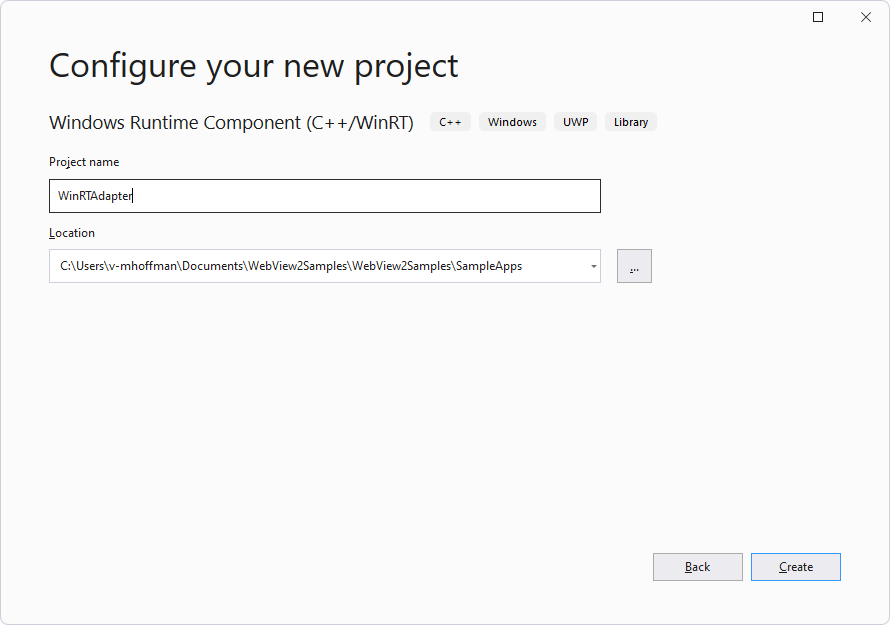
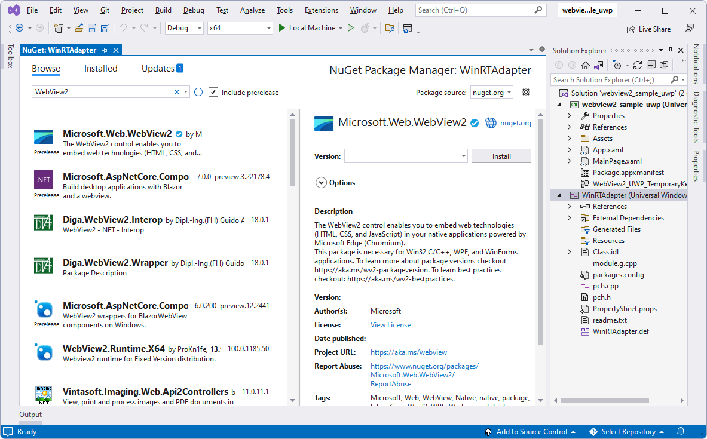

# Call native-side WinRT code from web-side code

This article is for WebView2 developers who want to use WinRT host objects from JavaScript.  For more information on why you'd want to do this, see [Call native-side code from web-side code](hostobject.md).

<!-- **Why is this tool needed?** -->
This article is for the WinRT WebView2 APIs, not for the .NET WebView2 APIs. The C# code in this article will build, but not run, for the .NET WebView2 APIs; when you call `AddHostObjectToScript`, it will produce an error message.

The WebView2 WinRT tool generates C++/WinRT source code that your project can then consume.  This article provides an example of running the WebView2 WinRT tool.  We will start with our UWP WinUI2 WebView2 Sample App, and call `AddHostObjectToScript` from the sample app, to pass a native WinRT object to JavaScript. 

The WebView2 WinRT tool is needed when projecting WinRT objects, because WinRT by default doesn't support iDispatch, which WebView2's Win32, .NET platforms support.  The steps in this article won't work with .NET. 
<!-- 
Implementation detail: Why is WinRT handled specially?  First, made COM, to work w/ iDispatch.  .NET supports iDispatch (we had to do work to make it support iDispatch to provide COM support and sort of .NET), WinRT doesn't.  .NET was nice in that it had already support for iDispatch.

If you write in C# ...
Note:  you can't just make a C# class and pass it to AddHOTS.  .NET supports creating a runtime class.
This doc doesn't apply to .net, bc there are other issues. workaround: specifically, won't work w/ the .NET API.
-->


<!-- ====================================================================== -->
## Setup: Installing WIL


<!-- ====================================================================== -->
## Adding the project 


<!-- ====================================================================== -->
## Using the project


### Adding the wrapped object dispatch


### Adding the injected script


<!-- ====================================================================== -->
## Calling WinRT methods from JavaScript


<!-- ====================================================================== -->
## Filtering classes and namespaces before generating code

Filtering filters the classes or namespaces to selectively generate the needed classes or namespaces (include, exclude list - see wiki page).   We generate source files that need to be compiled, so not just doing # include of entire files.


<!-- ====================================================================== -->
## Let's get started!

First let's find a native object/class we are interested in.  For this example, we'll use the WinRT `Language` class, which is in the `Windows.Globalization` namespace, for Windows UWP applications.  See [Language Class](/uwp/api/windows.globalization.language?view=winrt-22000).

The `Language` class API allows getting information from the client's native OS.  Your WebView2 host app can call methods and access properties of the `Language` object from the host app's web-side JavaScript code.

<!-- ====================================================================== -->
## Step 1:

Start by opening up the UWP Sample App: [MicrosoftEdge > WebView2Samples > webview2_sample_uwp](https://github.com/MicrosoftEdge/WebView2Samples/tree/master/SampleApps/webview2_sample_uwp).

First, add the WinRT tool:

1. Right-click the solution > click **Add** > **New project**.

   

   On this page is a project template for C++/WinRT. If you don't you will need to install the workload by following the steps here.  [UWP applications > Introduction to C++/WinRT](/windows/uwp/cpp-and-winrt-apis/intro-to-using-cpp-with-winrt#visual-studio-support-for-cwinrt-xaml-the-vsix-extension-and-the-nuget-package).

   That page reads: "From within the Visual Studio Installer, install the Universal Windows Platform development workload. In Installation Details > Universal Windows Platform development, check the C++ (v14x) Universal Windows Platform tools option(s), if you haven't already done so. And, in Windows Settings > Update & Security > For developers, choose the Developer mode option rather than the Sideload apps option."

1. Select the C++/WinRT Windows Runtime Component Option:

   

1. Name the Project, specifically, **WinRTAdapter**.  **Note:** For now, you must use this specific project name.
 
   

1. Click **OK** on the next popup that appears.


Now let's manage NuGet packages for the WinRT Adapter class, by right-clicking the project and selecting **Manage nuget packages**.  You will need to first download and install the Windows Implementation Library (WIL), and then after that, download and install a prerelease version of the WebView2 SDK. 
 
   

   

   

Let's configure the WinRT tool now to take into account the WinRT class/object that you want to use. 

   


1. Set **use wv2winrt tool** to **YES**, and set **JavaScript Case** to **YES**. Now we can include filters: this will be the full name of the namespaces or runtime classes that you want to include.

   For our project, we'll include the following two namespaces.  Enter them as follows if you are in the Edit view / editor:

   **Windows.System.UserProfile**

1. Add a reference for the tool itself, such as params.

   **Windows.Globalization.Language**

   

1. Click **OK**.

1. Make sure that the **webview2_uwp_sample** has a reference to the WinRT adapter project.

   

   

1. Make sure the box is checked to add the project as a reference.

   Build the **WinRTAdapter** project independently.

   Next, update the sample apps webview2's dependency to match the one as the tool.

1. In File Explorer, navigate to **MainPage.xaml.cs**. 

1. Add the following code, to pass the WinRT object to the host app's web side:

```csharp
    InitializeWebView2Async();
    StatusUpdate("Ready");
}


private async void InitializeWebView2Async()
{
    await WebView2.EnsureCoreWebView2Async();
    var dispatchAdapter = new WinRTAdapter.DispatchAdapter();
    WebView2.CoreWebView2.AddHostObjectToScript("Windows", dispatchAdapter.WrapNamedObject("Windows", dispatchAdapter));
}
```

1. Run the sample app. The code should now have your host object on the web side. You can check this by calling:

   `new chrome.webview.hostObjects.sync.Windows.Globalization.Language("en-US")).displayName`


<!-- ====================================================================== -->
## Properties


| WebView2 property | Description |
|---|---|
| Use WebView2 WinRT APIs |  |
| Loader preference |  |
| Use the wv2winrt tool |  |
| Output directory | Sets the path in which generated files will be written. |
| Output namespace | Sets the namespace to use for the generated WinRT class. |
| Use JavaScript case | Changes the generated code to produce methods names, property names, and so on that use the same casing style as Chakra JavaScript WinRT projection. The default is to produce names that match the winrt. |
| Verbosity | List some content to standard out including which files have been created and information about the include and exclude rules. |
| Explicit includes only |  |
| Disallow empty adapter |  |
| Wrap WebView2 types |  |
| Wrap system types |  |
| Platform references level |  |
| Additional WinMD references |  |
| Include filters |  |
| Exclude filters |  |

From command line:

| WebView2 property | Description |
|---|---|
| verbose | List some content to standard out including which files have been created and information about the include and exclude rules. |
| include | List as above will exclude namespaces and runtimeclasses by default except those listed. The include declarations may be either namespaces which include everything in that namespace, or runtimeclass names to include just that runtimeclass. (There's currently a bug that if you include a type that depends on an excluded type, you may end up with generated code that cannot compile.) |
| use-javascript-case | Changes the generated code to produce methods names, property names, and so on that use the same casing style as Chakra JavaScript WinRT projection. The default is to produce names that match the winrt. |
| output-path | Sets the path in which generated files will be written. |
| output-namespace | Sets the namespace to use for the generated WinRT class (see the next section). |
| winmd-paths | A space-delimited list of all the winmd files that should be examined for code generation. |

